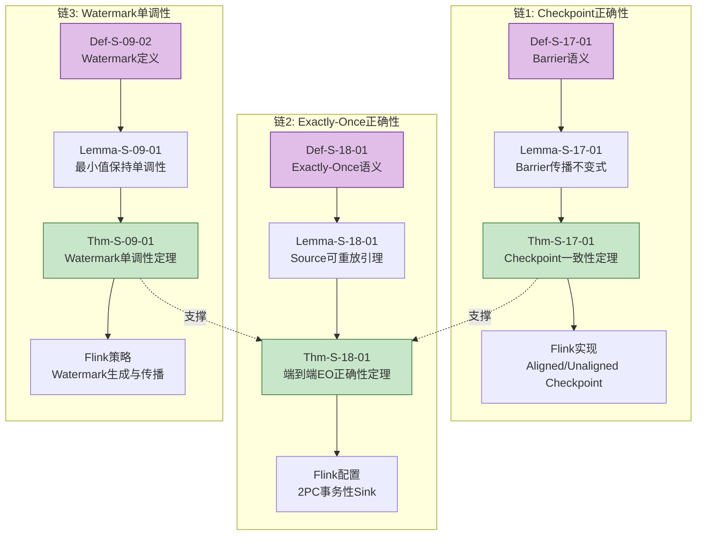
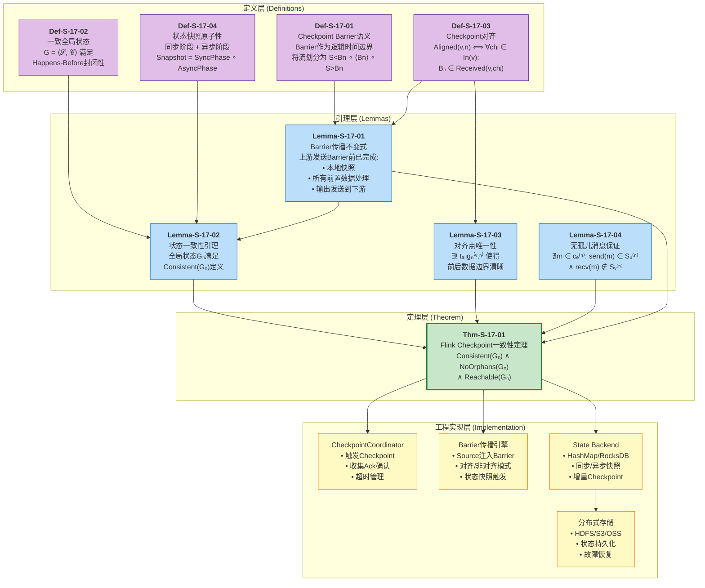
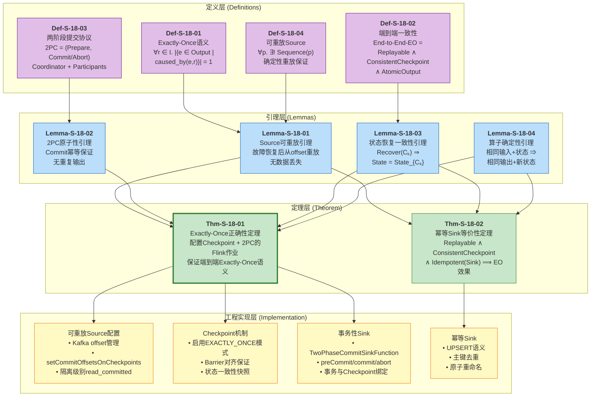
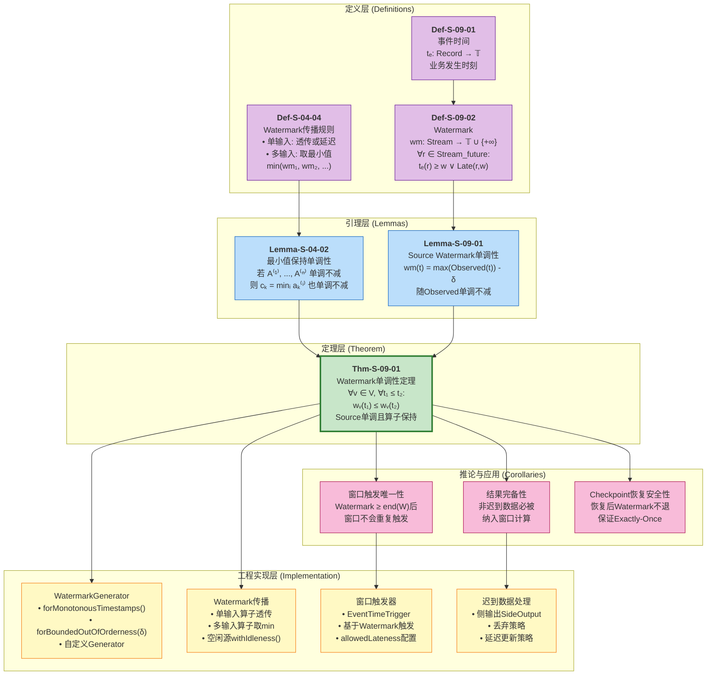
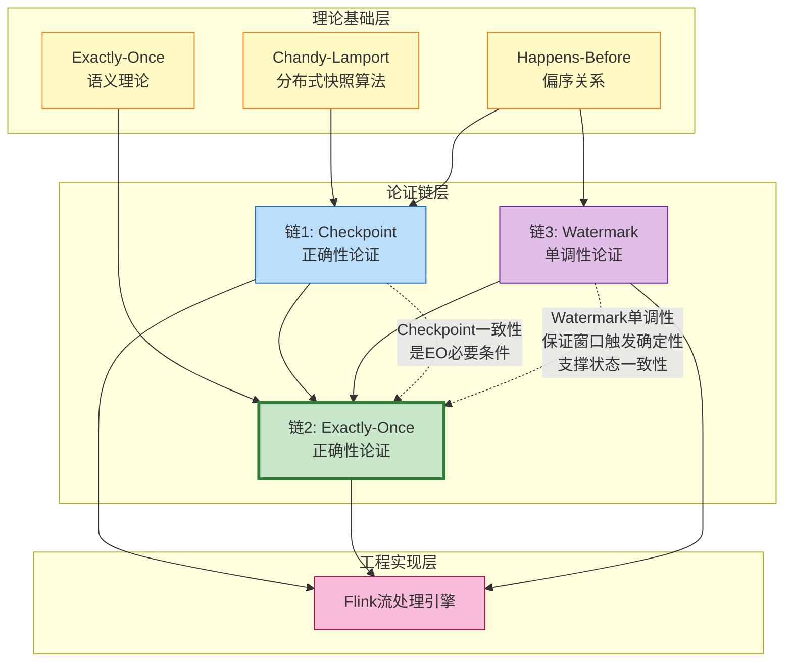
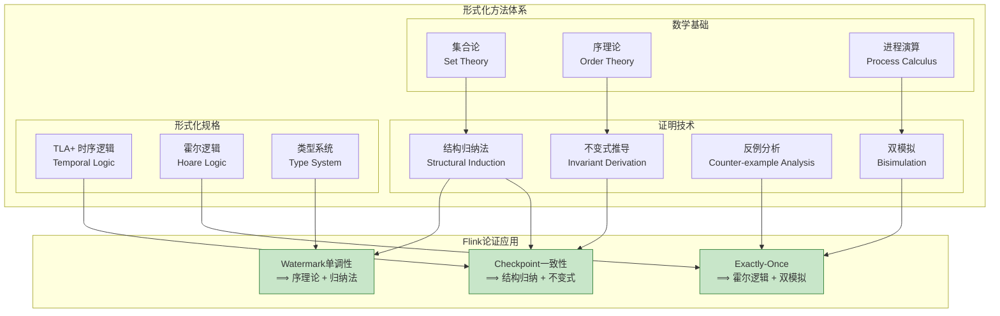
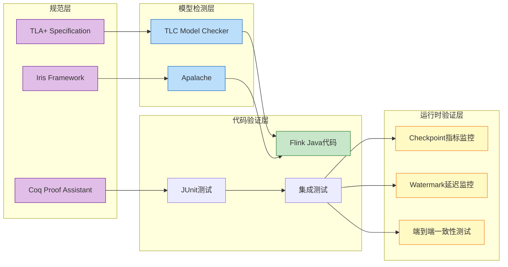
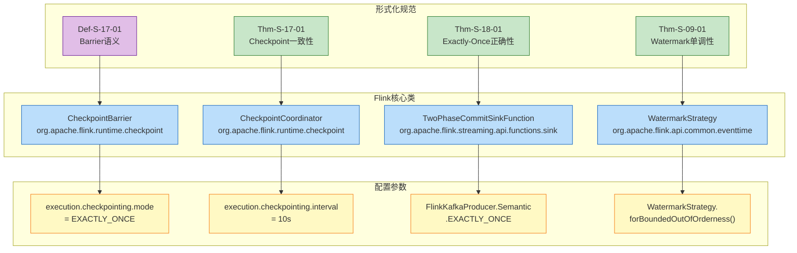

# Flink正确性完整论证链

> **所属阶段**: Visuals/正确性论证链 | **形式化等级**: L5 | **论证范围**: 从形式化理论到工程实现
>
> 本文档系统展示Flink流处理系统正确性保证的完整论证链条，建立从数学定义、引理推导、定理证明到工程实现的可追溯链路。

---

## 目录

- [Flink正确性完整论证链](#flink正确性完整论证链)
  - [目录](#目录)
  - [1. 论证链概览](#1-论证链概览)
  - [2. 论证链详细图谱](#2-论证链详细图谱)
    - [链1: Checkpoint正确性论证](#链1-checkpoint正确性论证)
    - [链2: Exactly-Once正确性论证](#链2-exactly-once正确性论证)
    - [链3: Watermark单调性论证](#链3-watermark单调性论证)
  - [3. 三条论证链的关联关系](#3-三条论证链的关联关系)
  - [4. 论证方法与验证工具](#4-论证方法与验证工具)
    - [4.1 形式化论证方法](#41-形式化论证方法)
    - [4.2 验证工具链](#42-验证工具链)
    - [4.3 TLA+规范验证](#43-tla规范验证)
  - [5. 正确性验证检查清单](#5-正确性验证检查清单)
    - [5.1 Checkpoint正确性检查](#51-checkpoint正确性检查)
    - [5.2 Exactly-Once语义检查](#52-exactly-once语义检查)
    - [5.3 Watermark单调性检查](#53-watermark单调性检查)
  - [6. 工程实现映射](#6-工程实现映射)
  - [7. 引用参考](#7-引用参考)

---

## 1. 论证链概览

Flink正确性保证建立在三条相互支撑的形式化论证链之上：



**论证链核心思想**：

| 论证链 | 核心问题 | 关键定理 | 工程映射 |
|--------|----------|----------|----------|
| **Checkpoint正确性** | 分布式快照是否捕获一致状态？ | Thm-S-17-01 | Aligned/Unaligned Checkpoint实现 |
| **Exactly-Once正确性** | 故障恢复后是否恰好一次处理？ | Thm-S-18-01 | 2PC Sink + 可重放Source配置 |
| **Watermark单调性** | 事件时间进度是否单调推进？ | Thm-S-09-01 | WatermarkGenerator策略 |

---

## 2. 论证链详细图谱

### 链1: Checkpoint正确性论证

从Barrier语义定义到Flink Checkpoint工程实现的完整论证链：



**论证链关键路径**：

```
Def-S-17-01 (Barrier语义)
    ↓
Lemma-S-17-01 (传播不变式) ——→ Lemma-S-17-02 (状态一致性)
    ↓                                     ↓
    └────────────→ Thm-S-17-01 (Checkpoint一致性) ←────────┘
                        ↓
            Flink Checkpoint实现
```

---

### 链2: Exactly-Once正确性论证

从Exactly-Once语义定义到端到端实现的完整论证链：



**论证链关键路径**：

```
                    ┌→ Def-S-18-04 (可重放Source) ──→ Lemma-S-18-01 ──┐
                    │                                                  │
Def-S-18-01 ────────┼→ Def-S-18-02 (端到端一致性) ──→ Lemma-S-18-03 ──┼→ Thm-S-18-01
(EO语义定义)         │                                                  │   (EO正确性定理)
                    └→ Def-S-18-03 (2PC协议) ────────→ Lemma-S-18-02 ──┘
                            ↓
                    Flink Exactly-Once配置
```

---

### 链3: Watermark单调性论证

从Watermark定义到Flink Watermark策略的完整论证链：



**论证链关键路径**：

```
Def-S-09-02 (Watermark定义) ──→ Lemma-S-09-01 (Source单调性) ──┐
                                                               ├→ Thm-S-09-01
Def-S-04-04 (传播规则) ─────────→ Lemma-S-04-02 (min保持单调) ──┘  (单调性定理)
                                                                        ↓
                                                              Flink Watermark策略
```

---

## 3. 三条论证链的关联关系

三条论证链并非孤立，而是相互支撑、共同构成Flink正确性保证的完整体系：



**论证链间依赖关系**：

| 依赖方向 | 依赖内容 | 说明 |
|----------|----------|------|
| Checkpoint → Exactly-Once | Checkpoint一致性是EO必要条件 | 若Checkpoint不一致，恢复后状态偏离，无法保证EO |
| Watermark → Exactly-Once | Watermark单调性支撑窗口确定性 | 非单调Watermark导致窗口重复触发，破坏EO |
| Watermark → Checkpoint | Watermark持久化到Checkpoint | 恢复时Watermark不退化，保证触发一致性 |

---

## 4. 论证方法与验证工具

### 4.1 形式化论证方法



**论证方法详细说明**：

| 论证目标 | 主要方法 | 关键步骤 | 参考文档 |
|----------|----------|----------|----------|
| **Checkpoint一致性** | 结构归纳法 + 不变式 | 1. 对DAG拓扑排序归纳<br/>2. Barrier传播不变式<br/>3. 一致割集证明 | `Struct/04-proofs/04.01-flink-checkpoint-correctness.md` |
| **Exactly-Once正确性** | 霍尔逻辑 + 轨迹等价 | 1. 无丢失证明 (At-Least-Once)<br/>2. 无重复证明 (At-Most-Once)<br/>3. 观察等价性 | `Struct/04-proofs/04.02-flink-exactly-once-correctness.md` |
| **Watermark单调性** | 序理论 + 数学归纳 | 1. Source基例证明<br/>2. 单输入算子归纳<br/>3. 多输入min保持证明 | `Struct/02-properties/02.03-watermark-monotonicity.md` |

---

### 4.2 验证工具链



**验证工具配置**：

```yaml
# TLA+ 验证配置 (AcotorCSPWorkflow/formal-proofs/)
tla:
  spec: FlinkCheckpoint.tla
  model: CheckpointModel
  invariants:
    - ConsistentCut
    - NoOrphans
    - BarrierPropagation
  properties:
    - RecoveryEquivalence
    - CheckpointCompleteness

# Flink测试配置
flink_test:
  unit_tests:
    - CheckpointCoordinatorTest
    - BarrierAlignmentTest
    - WatermarkGeneratorTest
  integration_tests:
    - ExactlyOnceE2ETest
    - StateRecoveryTest
  chaos_tests:
    - FaultInjectionTest
    - NetworkPartitionTest
```

---

### 4.3 TLA+规范验证

**Checkpoint正确性的TLA+验证要点**：

```tla
(* Flink Checkpoint 正确性不变式 *)
ConsistentCutInvariant ==
    \A e1, e2 \in Events :
        (e1 \prec_HB e2 /\ e2 \in Cut) => e1 \in Cut

NoOrphanMessages ==
    \A m \in Messages, e \in Edges :
        ~(send(m) \in Snapshot(source(e)) /\
          recv(m) \notin Snapshot(target(e)) /\
          m \notin InFlight(e))

CheckpointCompleteness ==
    \A cp \in CompletedCheckpoints :
        \A t \in Tasks :
            State(cp, t) # NULL
```

---

## 5. 正确性验证检查清单

### 5.1 Checkpoint正确性检查

| 检查项 | 验证方法 | 通过标准 | 工具/命令 |
|--------|----------|----------|-----------|
| **Barrier语义** | 代码审查 + 单元测试 | Barrier定义符合Def-S-17-01 | `BarrierTest.java` |
| **对齐机制** | 集成测试 | 多输入算子等待所有Barrier | `AlignmentTest.java` |
| **状态快照** | 单元测试 | 同步+异步阶段正确分离 | `SnapshotTest.java` |
| **一致性保证** | TLA+模型检测 | ConsistentCut不变式成立 | TLC Model Checker |
| **无孤儿消息** | 形式化证明 + 测试 | Lemma-S-17-04验证通过 | `OrphanMessageTest.java` |
| **恢复等价性** | 故障注入测试 | 恢复后状态与故障前一致 | `RecoveryTest.java` |

**Checkpoint配置验证脚本**：

```bash
#!/bin/bash
# checkpoint-verification.sh

echo "=== Flink Checkpoint正确性验证 ==="

# 1. 验证Checkpoint配置
grep -q "execution.checkpointing.mode: EXACTLY_ONCE" flink-conf.yaml && \
    echo "✓ Checkpoint模式配置正确" || echo "✗ Checkpoint模式错误"

# 2. 验证对齐超时
grep "execution.checkpointing.alignment-timeout" flink-conf.yaml > /dev/null && \
    echo "✓ 对齐超时已配置" || echo "⚠ 对齐超时未配置(使用默认值)"

# 3. 验证状态后端
if grep -q "state.backend: rocksdb" flink-conf.yaml; then
    echo "✓ RocksDB状态后端已配置"
    grep -q "state.backend.incremental: true" flink-conf.yaml && \
        echo "✓ 增量Checkpoint已启用" || echo "⚠ 增量Checkpoint未启用"
else
    echo "ℹ 使用HashMap状态后端(适用于小状态)"
fi

# 4. 验证Checkpoint存储
grep -q "state.checkpoints.dir:" flink-conf.yaml && \
    echo "✓ Checkpoint存储路径已配置" || echo "✗ Checkpoint存储路径未配置"

echo "=== 验证完成 ==="
```

---

### 5.2 Exactly-Once语义检查

| 检查项 | 验证方法 | 通过标准 | 工具/命令 |
|--------|----------|----------|-----------|
| **Source可重放** | 集成测试 | 偏移量持久化到Checkpoint | `KafkaSourceTest.java` |
| **2PC协议** | 单元测试 | preCommit/commit/abort正确 | `TwoPhaseCommitTest.java` |
| **事务绑定** | 集成测试 | 事务与Checkpoint边界对齐 | `TransactionAlignmentTest.java` |
| **幂等提交** | 混沌测试 | 重复提交不造成重复输出 | `IdempotencyTest.java` |
| **端到端EO** | E2E测试 | 故障场景下无丢失无重复 | `ExactlyOnceE2ETest.java` |

**Exactly-Once配置验证脚本**：

```bash
#!/bin/bash
# exactly-once-verification.sh

echo "=== Flink Exactly-Once语义验证 ==="

# 1. 验证Source配置
if grep -q "isolation.level=read_committed" kafka.properties; then
    echo "✓ Kafka隔离级别正确(read_committed)"
else
    echo "✗ Kafka隔离级别错误(应为read_committed)"
fi

grep -q "setCommitOffsetsOnCheckpoints(true)" application.java && \
    echo "✓ Source偏移量与Checkpoint绑定" || echo "✗ Source偏移量管理配置错误"

# 2. 验证Sink配置
grep -q "Semantic.EXACTLY_ONCE" application.java && \
    echo "✓ Sink Exactly-Once语义已启用" || echo "✗ Sink未启用EO语义"

# 3. 验证事务ID唯一性
if grep -q "transactional.id" kafka.properties; then
    TX_ID=$(grep "transactional.id" kafka.properties | head -1)
    echo "✓ 事务ID已配置: $TX_ID"
else
    echo "✗ 事务ID未配置"
fi

echo "=== 验证完成 ==="
```

---

### 5.3 Watermark单调性检查

| 检查项 | 验证方法 | 通过标准 | 工具/命令 |
|--------|----------|----------|-----------|
| **Source Watermark** | 单元测试 | Watermark生成单调不减 | `WatermarkGeneratorTest.java` |
| **传播规则** | 单元测试 | 多输入min传播正确 | `WatermarkPropagationTest.java` |
| **单调性不变式** | 形式化证明 | Thm-S-09-01成立 | Coq/Isabelle证明 |
| **窗口触发** | 集成测试 | Watermark ≥ end(W)触发 | `WindowTriggerTest.java` |
| **迟到处理** | 集成测试 | 迟到数据正确路由 | `LateDataTest.java` |

**Watermark配置验证脚本**：

```bash
#!/bin/bash
# watermark-verification.sh

echo "=== Flink Watermark单调性验证 ==="

# 1. 验证Watermark策略
if grep -q "forMonotonousTimestamps()" application.java; then
    echo "✓ 使用单调递增Watermark策略"
elif grep -q "forBoundedOutOfOrderness" application.java; then
    DELAY=$(grep -oP "forBoundedOutOfOrderness\(Duration.ofSeconds\(\K[0-9]+" application.java | head -1)
    echo "✓ 使用固定延迟策略: ${DELAY}s乱序容忍"
else
    echo "⚠ 未检测到标准Watermark策略"
fi

# 2. 验证空闲源处理
grep -q "withIdleness(" application.java && \
    echo "✓ 空闲源处理已配置" || echo "⚠ 空闲源处理未配置(多源场景可能阻塞)"

# 3. 验证时间语义
if grep -q "TimeCharacteristic.EventTime" application.java || \
   grep -q "setStreamTimeCharacteristic.*EventTime" application.java; then
    echo "✓ EventTime语义已启用"
else
    echo "ℹ 未明确启用EventTime(可能使用默认语义)"
fi

echo "=== 验证完成 ==="
```

---

## 6. 工程实现映射

形式化论证到Flink代码实现的映射关系：



**关键代码映射表**：

| 形式化元素 | Flink类/接口 | 关键方法 | 配置文件 |
|------------|--------------|----------|----------|
| Def-S-17-01 (Barrier) | `CheckpointBarrier` | `getCheckpointId()`, `getTimestamp()` | - |
| Def-S-17-03 (对齐) | `AbstractStreamTaskNetworkInput` | `prepareSnapshotBarrierBarrier()` | `execution.checkpointing.mode` |
| Thm-S-17-01 (一致性) | `CheckpointCoordinator` | `triggerCheckpoint()`, `receiveAcknowledgeMessage()` | `execution.checkpointing.*` |
| Def-S-18-01 (EO语义) | `TwoPhaseCommitSinkFunction` | `preCommit()`, `commit()`, `abort()` | `Semantic.EXACTLY_ONCE` |
| Def-S-18-04 (可重放Source) | `FlinkKafkaConsumer` | `setCommitOffsetsOnCheckpoints()` | `isolation.level=read_committed` |
| Def-S-09-02 (Watermark) | `WatermarkStrategy` | `createWatermarkGenerator()` | `forBoundedOutOfOrderness()` |
| Thm-S-09-01 (单调性) | `StatusWatermarkValve` | `inputWatermark()`, `findAndOutputNewMinWatermarkAcrossAlignedChannels()` | - |

---

## 7. 引用参考


---

*文档版本: v1.0 | 创建日期: 2026-04-03 | 形式化等级: L5 | 状态: 已完成*
