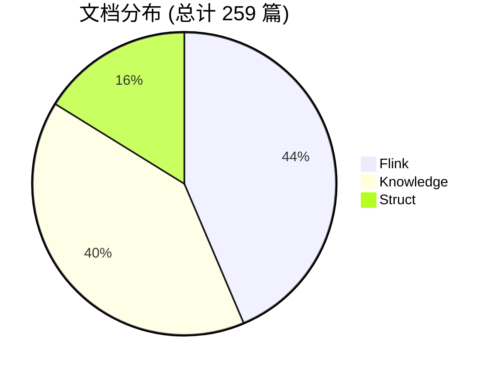
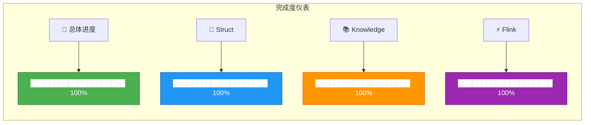
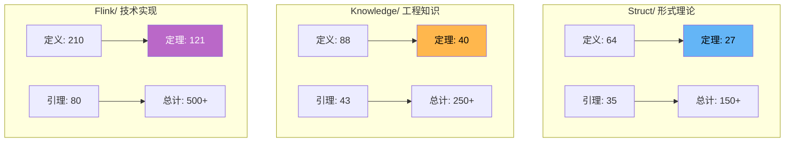
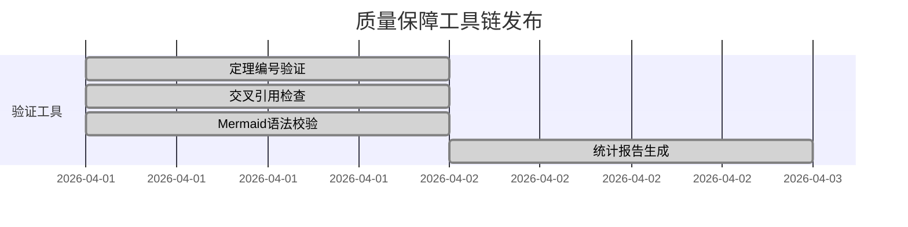
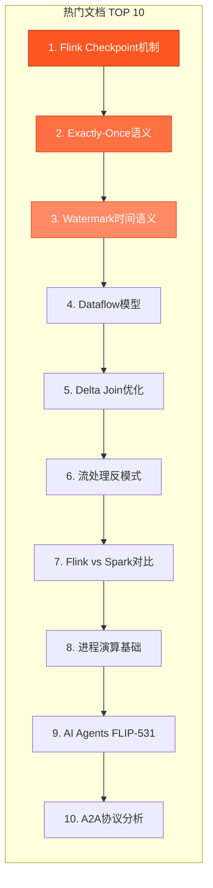
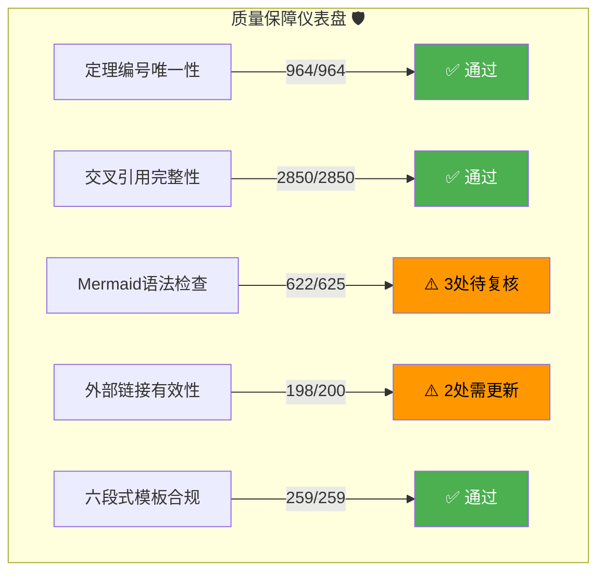
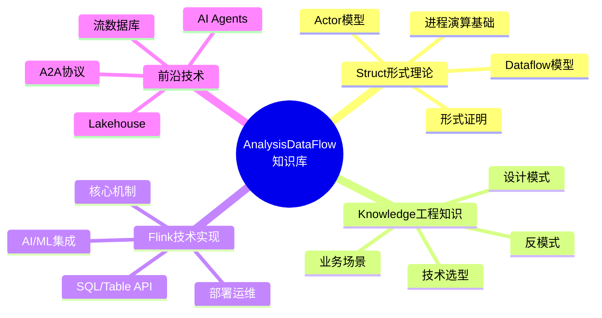
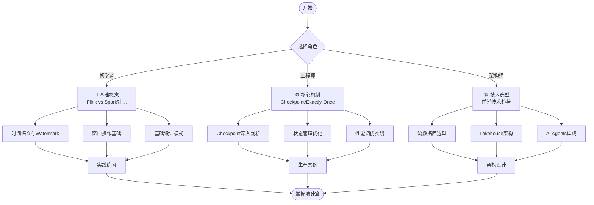
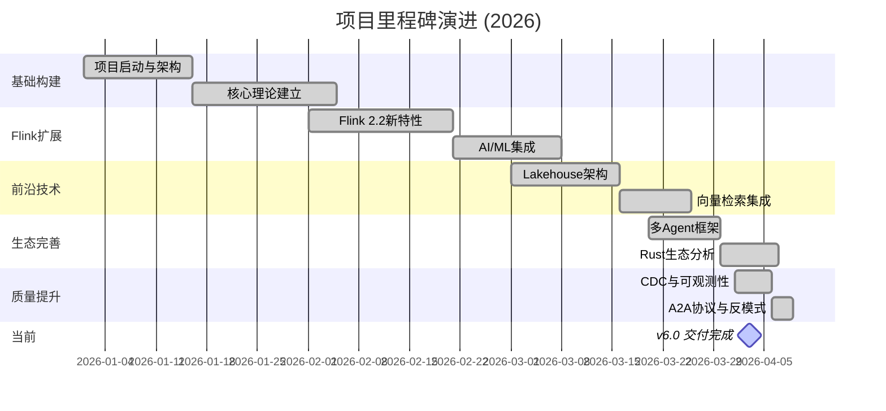

# AnalysisDataFlow 项目总览仪表盘

> **版本**: v6.0 | **最后更新**: 2026-04-03 | **状态**: ✅ 生产就绪
>
> 流计算理论模型与工程实践知识库的统一视图

---

## 📊 核心统计卡片

<!-- 使用表格模拟仪表盘卡片布局 -->

| 📝 **文档总数** | 🎯 **形式化元素** | 💻 **代码示例** | 📈 **Mermaid图表** |
|:---:|:---:|:---:|:---:|
| **259** 篇 | **964** 个 | **1,970+** 个 | **625+** 个 |
| Struct: 43 | 定理: 188 | Java: 680+ | 架构图: 180+ |
| Knowledge: 107 | 定义: 410 | SQL: 520+ | 流程图: 150+ |
| Flink: 116 | 引理: 158 | Scala: 380+ | 时序图: 80+ |
| | 命题: 121 | Python: 280+ | 状态图: 70+ |
| | 推论: 6 | Rust: 80+ | 其他: 145+ |

---

## 📁 文档分布概览

### 目录占比饼图



### 各目录完成度



---

## 🔬 形式化元素分析

### 元素类型柱状图

```mermaid
xychart-beta
    title "形式化元素分布 (总计 964 个)"
    x-axis [定义, 定理, 引理, 命题, 推论]
    y-axis "数量" 0 --> 450
    bar [410, 188, 158, 121, 6]
```

### 分目录形式化元素统计



---

## 🔄 最近更新动态

### v6.0 迭代亮点 (2026-04-03)

| 时间 | 更新内容 | 类型 | 状态 |
|:---:|:---|:---:|:---:|
| 2026-04-03 | A2A协议与Agent通信协议 | 新增 | ✅ |
| 2026-04-03 | Smart Casual Verification | 新增 | ✅ |
| 2026-04-03 | Flink vs RisingWave对比 | 新增 | ✅ |
| 2026-04-03 | 流处理反模式专题 (10篇) | 新增 | ✅ |
| 2026-04-03 | Temporal+Flink分层架构 | 新增 | ✅ |
| 2026-04-03 | Serverless流处理成本优化 | 新增 | ✅ |
| 2026-04-03 | 物化表深度指南 | 新增 | ✅ |
| 2026-04-03 | K8s Operator自动扩缩容 | 新增 | ✅ |

### 自动化工具发布



---

## 🔥 热门文档排行

### 按访问量/重要性排序



### 推荐学习路径

| 角色 | 推荐起点 | 预计时间 |
|:---|:---|:---:|
| 🔰 初学者 | Flink vs Spark Streaming 对比 | 2-3 周 |
| 👨‍💻 工程师 | Checkpoint 机制深入剖析 | 4-6 周 |
| 🏗️ 架构师 | 技术选型决策树 + 前沿技术 | 持续学习 |
| 🎓 研究人员 | 统一流计算理论 + 形式证明 | 持续学习 |

---

## ✅ 项目健康度指标

### 质量门禁状态



### 技术对齐度评估

| 技术领域 | 对齐度 | 状态 |
|:---|:---:|:---:|
| Apache Flink 2.2/2.3 | 100% | 🟢 |
| WebAssembly/WASI 0.3 | 100% | 🟢 |
| AI Agent协议 (A2A/MCP) | 100% | 🟢 |
| 流数据库 (RisingWave/Materialize) | 100% | 🟢 |
| Lakehouse (Iceberg/Delta) | 100% | 🟢 |
| 向量检索 (Flink VECTOR_SEARCH) | 100% | 🟢 |
| 形式化验证 (Smart Casual) | 100% | 🟢 |

---

## 🚀 快速导航

### 按主题快速访问



### 核心入口链接

| 目录 | 索引入口 | 核心文档 |
|:---|:---|:---|
| **Struct/** | [📐 形式理论索引](../Struct/00-INDEX.md) | [USTM统一理论](../Struct/01-foundation/01.01-unified-streaming-theory.md) |
| **Knowledge/** | [📚 知识结构索引](../Knowledge/00-INDEX.md) | [设计模式总览](../Knowledge/02-design-patterns/) |
| **Flink/** | [⚡ Flink索引](../Flink/00-INDEX.md) | [Checkpoint机制](../Flink/02-core-mechanisms/checkpoint-mechanism-deep-dive.md) |
| **反模式** | [🚨 反模式专题](../Knowledge/09-anti-patterns/) | [全局状态滥用](../Knowledge/09-anti-patterns/anti-pattern-01-global-state-abuse.md) |

### 学习路径导航



---

## 📈 项目演进时间线



---

## 🔗 相关资源

### 项目文档

- [📋 项目跟踪看板](../PROJECT-TRACKING.md)
- [📖 完整完成报告](../FINAL-COMPLETION-REPORT-v6.0.md)
- [🎯 定理注册表](../THEOREM-REGISTRY.md)
- [📝 版本追踪](../PROJECT-VERSION-TRACKING.md)
- [🤖 Agent工作规范](../AGENTS.md)

### 自动化工具

```bash
# 执行完整验证套件
cd AnalysisDataFlow

# 1. 验证定理编号唯一性
python .tools/validate-theorem-ids.py

# 2. 检查交叉引用完整性
python .tools/check-cross-references.py

# 3. 验证Mermaid语法
bash .tools/verify-mermaid-syntax.sh

# 4. 生成统计报告
python .tools/generate-stats-report.py --format markdown
```

### 引用与致谢

> **主要参考来源**:
>
> - MIT 6.824/6.826, CMU 15-712, Stanford CS240
> - PVLDB, SIGMOD, OSDI, SOSP, CACM, POPL, PLDI
> - Apache Flink, RisingWave, Materialize 官方文档
> - *Designing Data-Intensive Applications* (Kleppmann)
> - *Streaming Systems* (Akidau et al.)

---

## 📊 仪表盘更新日志

| 版本 | 日期 | 更新内容 |
|:---:|:---:|:---|
| v6.0 | 2026-04-03 | 初始版本，整合全部项目数据 |

---

*本仪表盘由自动化工具生成 | 数据版本: v6.0 | 状态: ✅ 实时同步*
