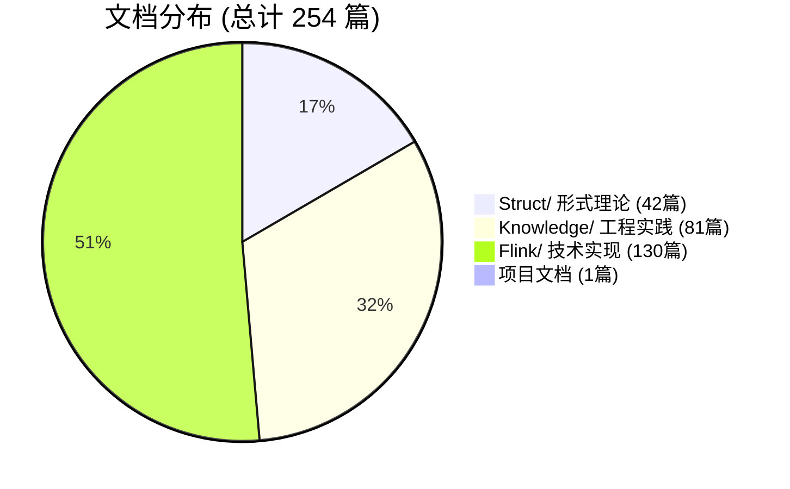
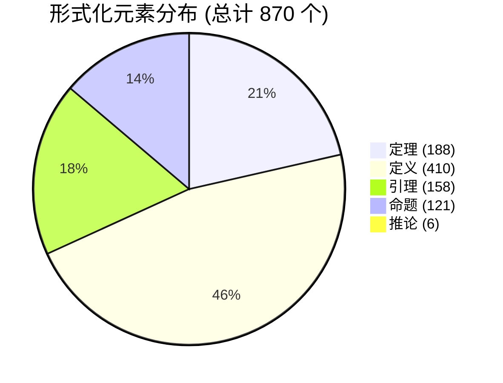
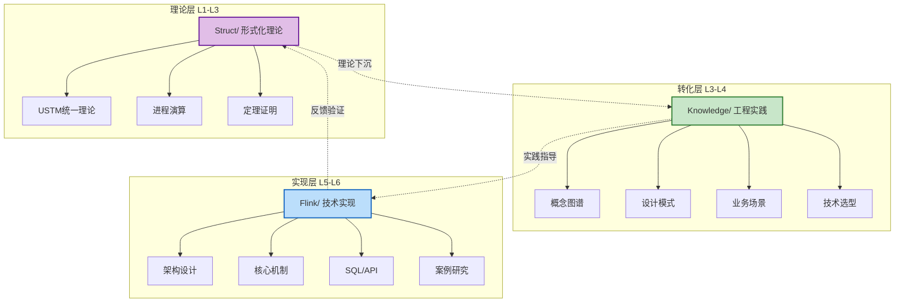
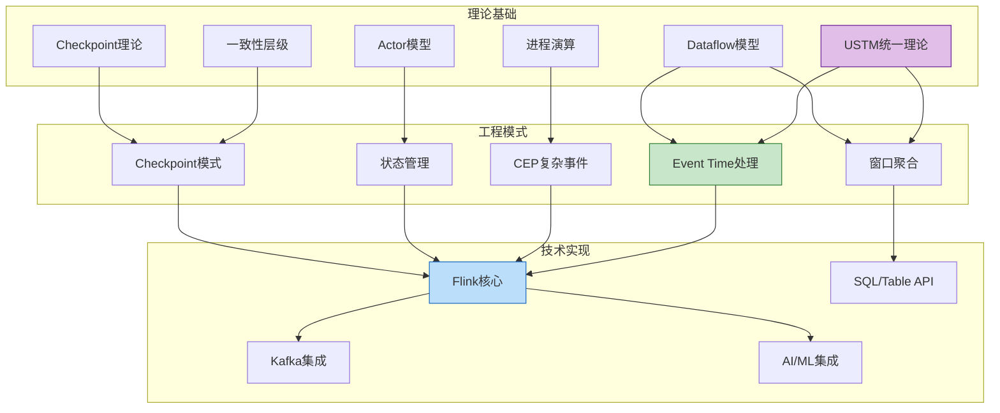
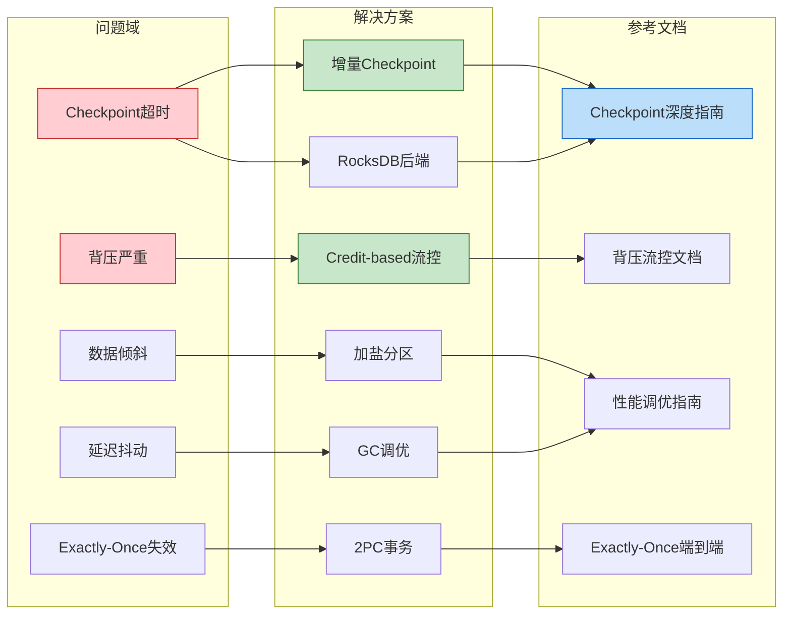
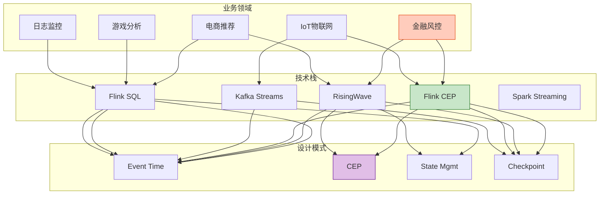
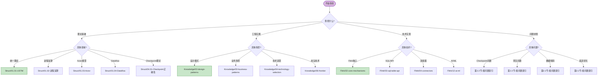
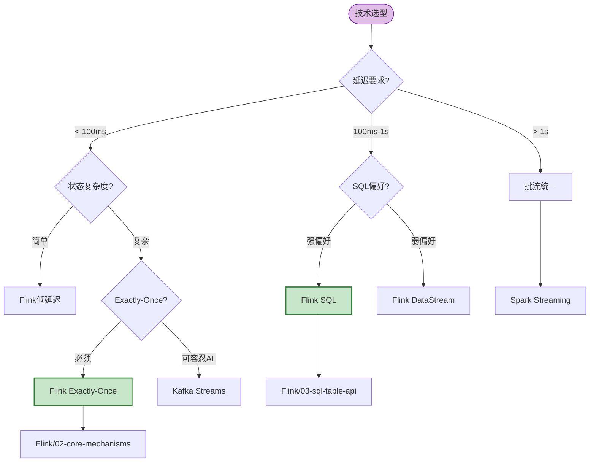
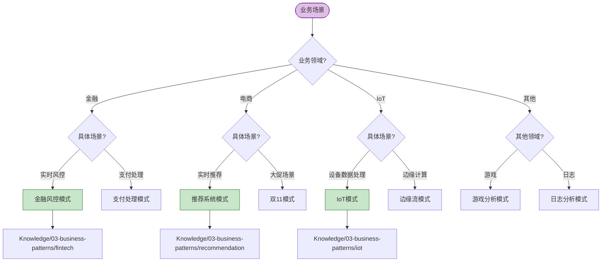
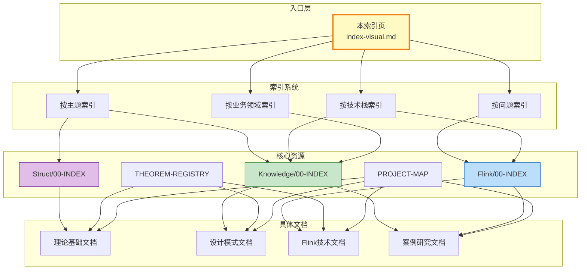

# AnalysisDataFlow 综合索引可视化

> **版本**: v1.0 | **更新日期**: 2026-04-03 | **文档总数**: 254 篇 | **形式化元素**: 870 个
>
> 本文档是 AnalysisDataFlow 项目的统一索引入口，提供多维索引系统、索引网络图、决策树和搜索指南，帮助用户快速定位所需内容。

---

## 目录

- [1. 索引总览](#1-索引总览)
- [2. 多维索引系统](#2-多维索引系统)
  - [2.1 按主题索引](#21-按主题索引)
  - [2.2 按问题索引](#22-按问题索引)
  - [2.3 按技术栈索引](#23-按技术栈索引)
  - [2.4 按业务领域索引](#24-按业务领域索引)
- [3. 索引网络图](#3-索引网络图)
- [4. 快速查找决策树](#4-快速查找决策树)
- [5. 全文搜索指南](#5-全文搜索指南)
- [6. 角色化导航](#6-角色化导航)
- [7. 核心索引入口](#7-核心索引入口)

---

## 1. 索引总览

### 1.1 项目统计





### 1.2 三层知识架构



---

## 2. 多维索引系统

### 2.1 按主题索引

#### 理论基础 (Struct/)

| 主题分类 | 核心概念 | 关键定理 | 入口文档 |
|----------|----------|----------|----------|
| **统一流计算理论** | USTM元模型、六层表达能力层次 | Thm-S-01-01, Thm-S-14-01 | [Struct/01-foundation/01.01-unified-streaming-theory.md](../Struct/01-foundation/01.01-unified-streaming-theory.md) |
| **进程演算** | CCS, CSP, π-演算 | Thm-S-02-01 | [Struct/01-foundation/01.02-process-calculus-primer.md](../Struct/01-foundation/01.02-process-calculus-primer.md) |
| **Actor模型** | 经典Actor四元组、监督树 | Thm-S-03-01, Thm-S-03-02 | [Struct/01-foundation/01.03-actor-model-formalization.md](../Struct/01-foundation/01.03-actor-model-formalization.md) |
| **Dataflow模型** | DAG形式化、Watermark语义 | Thm-S-04-01, Thm-S-09-01 | [Struct/01-foundation/01.04-dataflow-model-formalization.md](../Struct/01-foundation/01.04-dataflow-model-formalization.md) |
| **一致性层级** | AM/AL/EO语义 | Thm-S-08-01~03 | [Struct/02-properties/02.02-consistency-hierarchy.md](../Struct/02-properties/02.02-consistency-hierarchy.md) |
| **Checkpoint理论** | Barrier语义、一致割集 | Thm-S-17-01 | [Struct/04-proofs/04.01-flink-checkpoint-correctness.md](../Struct/04-proofs/04.01-flink-checkpoint-correctness.md) |
| **Exactly-Once** | 端到端一致性 | Thm-S-18-01 | [Struct/04-proofs/04.02-flink-exactly-once-correctness.md](../Struct/04-proofs/04.02-flink-exactly-once-correctness.md) |

#### 工程实践 (Knowledge/)

| 主题分类 | 核心模式 | 关键定义 | 入口文档 |
|----------|----------|----------|----------|
| **设计模式** | 7大核心模式 (P01-P07) | Def-K-02-01~07 | [Knowledge/02-design-patterns/](../Knowledge/02-design-patterns/) |
| **并发范式** | Actor/CSP/Dataflow对比 | Def-K-01-01 | [Knowledge/01-concept-atlas/concurrency-paradigms-matrix.md](../Knowledge/01-concept-atlas/concurrency-paradigms-matrix.md) |
| **技术选型** | 引擎/存储/范式选型 | - | [Knowledge/04-technology-selection/](../Knowledge/04-technology-selection/) |
| **流数据库** | RisingWave/Materialize | - | [Knowledge/06-frontier/streaming-databases.md](../Knowledge/06-frontier/streaming-databases.md) |
| **Rust流生态** | Arroyo, Timeplus | - | [Knowledge/06-frontier/rust-streaming-ecosystem.md](../Knowledge/06-frontier/rust-streaming-ecosystem.md) |

#### 前沿技术

| 主题分类 | 技术方向 | 关键文档 |
|----------|----------|----------|
| **AI-Native流计算** | Flink AI Agents, 向量搜索融合 | [Flink/12-ai-ml/](../Flink/12-ai-ml/) |
| **流数据库** | RisingWave, Materialize, Timeplus | [Knowledge/06-frontier/streaming-databases.md](../Knowledge/06-frontier/streaming-databases.md) |
| **实时RAG** | LLM+流处理架构 | [Knowledge/06-frontier/real-time-rag-architecture.md](../Knowledge/06-frontier/real-time-rag-architecture.md) |
| **图流处理** | TGN实时图神经网络 | [Knowledge/06-frontier/streaming-graph-tgn.md](../Knowledge/06-frontier/streaming-graph-tgn.md) |
| **边缘流处理** | 云边协同、断网续传 | [Knowledge/06-frontier/edge-streaming-patterns.md](../Knowledge/06-frontier/edge-streaming-patterns.md) |
| **Serverless流** | FaaS数据流、有状态无服务器 | [Knowledge/06-frontier/serverless-streaming-architecture.md](../Knowledge/06-frontier/serverless-streaming-architecture.md) |

---

### 2.2 按问题索引

#### Checkpoint相关问题

| 问题症状 | 解决方案 | 参考文档 |
|----------|----------|----------|
| Checkpoint频繁超时 | 启用增量Checkpoint、使用RocksDB | [Flink/02-core-mechanisms/checkpoint-mechanism-deep-dive.md](../Flink/02-core-mechanisms/checkpoint-mechanism-deep-dive.md) |
| 对齐时间过长 | 启用Unaligned Checkpoint、调整Debloating | [Flink/02-core-mechanisms/checkpoint-mechanism-deep-dive.md](../Flink/02-core-mechanisms/checkpoint-mechanism-deep-dive.md) |
| 恢复缓慢 | 本地恢复、增量恢复 | [Flink/02-core-mechanisms/checkpoint-mechanism-deep-dive.md](../Flink/02-core-mechanisms/checkpoint-mechanism-deep-dive.md) |
| 状态过大 | 增量Checkpoint、状态TTL | [Flink/02-core-mechanisms/flink-state-ttl-best-practices.md](../Flink/02-core-mechanisms/flink-state-ttl-best-practices.md) |
| Checkpoint间隔设置 | 根据延迟容忍和状态大小计算 | [Knowledge/02-design-patterns/pattern-checkpoint-recovery.md](../Knowledge/02-design-patterns/pattern-checkpoint-recovery.md) |

#### 背压与流控问题

| 问题症状 | 解决方案 | 参考文档 |
|----------|----------|----------|
| 背压严重 | Credit-based流控调优、增加并行度 | [Flink/02-core-mechanisms/backpressure-and-flow-control.md](../Flink/02-core-mechanisms/backpressure-and-flow-control.md) |
| Source背压 | 下游处理慢，需加并行度或优化 | [Flink/06-engineering/performance-tuning-guide.md](../Flink/06-engineering/performance-tuning-guide.md) |
| Sink背压 | 批量优化、异步写入 | [Flink/06-engineering/performance-tuning-guide.md](../Flink/06-engineering/performance-tuning-guide.md) |

#### 数据倾斜问题

| 问题症状 | 解决方案 | 参考文档 |
|----------|----------|----------|
| 热点Key | 加盐、两阶段聚合、自定义分区器 | [Flink/06-engineering/performance-tuning-guide.md](../Flink/06-engineering/performance-tuning-guide.md) |
| 窗口倾斜 | 自定义窗口分配器、允许延迟 | [Knowledge/02-design-patterns/pattern-windowed-aggregation.md](../Knowledge/02-design-patterns/pattern-windowed-aggregation.md) |

#### 延迟优化问题

| 问题症状 | 解决方案 | 参考文档 |
|----------|----------|----------|
| 延迟抖动 | GC调优、Debloating、异步执行 | [Flink/02-core-mechanisms/async-execution-model.md](../Flink/02-core-mechanisms/async-execution-model.md) |
| Watermark延迟 | 调整Watermark生成策略 | [Flink/02-core-mechanisms/time-semantics-and-watermark.md](../Flink/02-core-mechanisms/time-semantics-and-watermark.md) |
| 模型推理延迟高 | 异步推理、模型缓存 | [Flink/12-ai-ml/model-serving-streaming.md](../Flink/12-ai-ml/model-serving-streaming.md) |

#### Exactly-Once问题

| 问题症状 | 解决方案 | 参考文档 |
|----------|----------|----------|
| 数据重复 | 检查Sink幂等性、2PC配置 | [Flink/02-core-mechanisms/exactly-once-end-to-end.md](../Flink/02-core-mechanisms/exactly-once-end-to-end.md) |
| 数据丢失 | 检查Source可重放性、Checkpoint间隔 | [Flink/02-core-mechanisms/exactly-once-end-to-end.md](../Flink/02-core-mechanisms/exactly-once-end-to-end.md) |

---

### 2.3 按技术栈索引

#### Apache Flink

| 技术模块 | 核心功能 | 关键文档 |
|----------|----------|----------|
| **核心机制** | Checkpoint, Watermark, Exactly-Once | [Flink/02-core-mechanisms/](../Flink/02-core-mechanisms/) |
| **SQL/Table API** | 查询优化、窗口函数、物化表 | [Flink/03-sql-table-api/](../Flink/03-sql-table-api/) |
| **连接器** | Kafka, CDC, Iceberg, Paimon | [Flink/04-connectors/](../Flink/04-connectors/) |
| **部署运维** | Kubernetes, 自动扩缩容 | [Flink/10-deployment/](../Flink/10-deployment/) |
| **AI/ML** | 在线学习、向量搜索、RAG | [Flink/12-ai-ml/](../Flink/12-ai-ml/) |
| **湖仓集成** | Paimon, Iceberg, Delta Lake | [Flink/14-lakehouse/](../Flink/14-lakehouse/) |

#### Kafka 生态

| 技术组件 | 用途 | 关键文档 |
|----------|------|----------|
| **Kafka Integration** | Source/Sink连接器 | [Flink/04-connectors/kafka-integration-patterns.md](../Flink/04-connectors/kafka-integration-patterns.md) |
| **Kafka Streams** | 轻量级流处理 | [Flink/05-vs-competitors/flink-vs-kafka-streams.md](../Flink/05-vs-competitors/flink-vs-kafka-streams.md) |
| **CDC/Debezium** | 变更数据捕获 | [Flink/04-connectors/04.04-cdc-debezium-integration.md](../Flink/04-connectors/04.04-cdc-debezium-integration.md) |

#### Spark 生态

| 技术组件 | 用途 | 关键文档 |
|----------|------|----------|
| **Spark Streaming** | 批流统一处理 | [Flink/05-vs-competitors/flink-vs-spark-streaming.md](../Flink/05-vs-competitors/flink-vs-spark-streaming.md) |
| **Structured Streaming** | 结构化流处理 | [Flink/05-vs-competitors/flink-vs-spark-streaming.md](../Flink/05-vs-competitors/flink-vs-spark-streaming.md) |

#### 流数据库

| 技术组件 | 特点 | 关键文档 |
|----------|------|----------|
| **RisingWave** | PostgreSQL兼容、高吞吐 | [Knowledge/06-frontier/risingwave-deep-dive.md](../Knowledge/06-frontier/risingwave-deep-dive.md) |
| **Materialize** | 强一致性、物化视图 | [Knowledge/06-frontier/streaming-databases.md](../Knowledge/06-frontier/streaming-databases.md) |
| **Timeplus** | 轻量级、边缘友好 | [Knowledge/06-frontier/streaming-databases.md](../Knowledge/06-frontier/streaming-databases.md) |

#### Rust 流生态

| 技术组件 | 特点 | 关键文档 |
|----------|------|----------|
| **Arroyo** | <10ms延迟、边缘部署 | [Knowledge/06-frontier/rust-streaming-ecosystem.md](../Knowledge/06-frontier/rust-streaming-ecosystem.md) |
| **Materialize** | SQL优先、强一致性 | [Knowledge/06-frontier/rust-streaming-ecosystem.md](../Knowledge/06-frontier/rust-streaming-ecosystem.md) |
| **RisingWave** | 云原生、高可用 | [Knowledge/06-frontier/rust-streaming-ecosystem.md](../Knowledge/06-frontier/rust-streaming-ecosystem.md) |

#### 存储系统

| 技术组件 | 用途 | 关键文档 |
|----------|------|----------|
| **RocksDB** | 状态后端 | [Flink/06-engineering/state-backend-selection.md](../Flink/06-engineering/state-backend-selection.md) |
| **Paimon** | 流批统一存储 | [Flink/14-lakehouse/flink-paimon-integration.md](../Flink/14-lakehouse/flink-paimon-integration.md) |
| **Iceberg** | 数据湖表格式 | [Flink/14-lakehouse/flink-iceberg-integration.md](../Flink/14-lakehouse/flink-iceberg-integration.md) |
| **Delta Lake** | ACID数据湖 | [Flink/04-connectors/flink-delta-lake-integration.md](../Flink/04-connectors/flink-delta-lake-integration.md) |

---

### 2.4 按业务领域索引

#### 金融风控

| 场景需求 | 推荐模式 | 技术栈 | 关键文档 |
|----------|----------|--------|----------|
| 实时风控 | P01 Event Time + P03 CEP + P07 Checkpoint | Flink CEP + Kafka | [Knowledge/03-business-patterns/fintech-realtime-risk-control.md](../Knowledge/03-business-patterns/fintech-realtime-risk-control.md) |
| 支付处理 | Exactly-Once + 事务Sink | RisingWave/Flink | [Knowledge/03-business-patterns/stripe-payment-processing.md](../Knowledge/03-business-patterns/stripe-payment-processing.md) |

#### 电商零售

| 场景需求 | 推荐模式 | 技术栈 | 关键文档 |
|----------|----------|--------|----------|
| 实时推荐 | P02 Windowed Aggregation + P04 Async I/O | Flink + Redis | [Knowledge/03-business-patterns/real-time-recommendation.md](../Knowledge/03-business-patterns/real-time-recommendation.md) |
| 双11大促 | 全模式组合 | Flink + Kafka | [Knowledge/03-business-patterns/alibaba-double11-flink.md](../Knowledge/03-business-patterns/alibaba-double11-flink.md) |
| 市场动态 | 实时分析 + 物化视图 | Flink SQL | [Knowledge/03-business-patterns/airbnb-marketplace-dynamics.md](../Knowledge/03-business-patterns/airbnb-marketplace-dynamics.md) |

#### IoT物联网

| 场景需求 | 推荐模式 | 技术栈 | 关键文档 |
|----------|----------|--------|----------|
| 设备数据处理 | P01 Event Time + P05 State + P07 Checkpoint | Flink + Kafka | [Knowledge/03-business-patterns/iot-stream-processing.md](../Knowledge/03-business-patterns/iot-stream-processing.md) |
| 智能制造 | 边缘预处理 + 云端聚合 | Flink + 边缘网关 | [Flink/07-case-studies/case-smart-manufacturing-iot.md](../Flink/07-case-studies/case-smart-manufacturing-iot.md) |
| 智能电网 | 时序数据处理 + 实时告警 | Flink + 时序数据库 | [Flink/07-case-studies/case-smart-grid-energy-management.md](../Flink/07-case-studies/case-smart-grid-energy-management.md) |

#### 游戏

| 场景需求 | 推荐模式 | 技术栈 | 关键文档 |
|----------|----------|--------|----------|
| 实时分析 | P01 Event Time + P02 Windowed Aggregation | Flink + Pulsar | [Knowledge/03-business-patterns/gaming-analytics.md](../Knowledge/03-business-patterns/gaming-analytics.md) |

#### 日志监控

| 场景需求 | 推荐模式 | 技术栈 | 关键文档 |
|----------|----------|--------|----------|
| 日志分析 | P02 Windowed Aggregation + P06 Side Output | Flink + ES | [Knowledge/03-business-patterns/log-monitoring.md](../Knowledge/03-business-patterns/log-monitoring.md) |
| 用户行为分析 | Clickstream处理 + 会话窗口 | Flink + Kafka | [Flink/07-case-studies/case-clickstream-user-behavior-analytics.md](../Flink/07-case-studies/case-clickstream-user-behavior-analytics.md) |

---

## 3. 索引网络图

### 3.1 主题关联网络



### 3.2 问题-解决方案映射网络



### 3.3 业务领域-技术栈映射网络



---

## 4. 快速查找决策树

### 4.1 主题查找决策树



### 4.2 技术选型决策树



### 4.3 业务场景决策树



---

## 5. 全文搜索指南

### 5.1 搜索工具使用

```bash
# 构建搜索索引
python .vscode/build-search-index.py

# 基本关键词搜索
python .vscode/search.py "checkpoint"

# 定理编号搜索
python .vscode/search.py "Thm-S-17-01"

# 分类过滤搜索
python .vscode/search.py "watermark" --category Struct
python .vscode/search.py "design pattern" --category Knowledge
python .vscode/search.py "checkpoint" --category Flink

# 形式化元素类型过滤
python .vscode/search.py "checkpoint" --type theorem
python .vscode/search.py "watermark" --type definition

# 组合条件搜索
python .vscode/search.py "checkpoint exactly-once" --category Struct --operator AND
```

### 5.2 搜索策略建议

| 查找目标 | 搜索策略 | 示例 |
|----------|----------|------|
| **特定定理** | 使用定理编号精确搜索 | `Thm-S-17-01` |
| **相关概念** | 关键词 + 分类过滤 | `consistency --category Struct` |
| **技术实现** | 技术名 + 分类过滤 | `checkpoint --category Flink` |
| **业务场景** | 场景关键词 | `fintech risk control` |
| **问题排查** | 问题症状关键词 | `backpressure timeout` |

### 5.3 编号体系速查

| 编号格式 | 含义 | 示例 |
|----------|------|------|
| `Thm-S-XX-XX` | Struct阶段定理 | `Thm-S-17-01` Checkpoint一致性定理 |
| `Def-S-XX-XX` | Struct阶段定义 | `Def-S-04-04` Watermark语义 |
| `Lemma-S-XX-XX` | Struct阶段引理 | `Lemma-S-17-01` Barrier传播不变式 |
| `Def-K-XX-XX` | Knowledge阶段定义 | `Def-K-02-01` Event Time Processing |
| `Thm-F-XX-XX` | Flink阶段定理 | `Thm-F-12-01` 在线学习参数收敛性 |

**编号解析**：`{类型}-{阶段}-{文档序号}-{顺序号}`

- 类型: Thm(定理)/Def(定义)/Lemma(引理)/Prop(命题)/Cor(推论)
- 阶段: S(Struct)/K(Knowledge)/F(Flink)
- 文档序号: 文档在目录中的编号
- 顺序号: 元素在文档中的顺序

---

## 6. 角色化导航

### 6.1 架构师导航

```
快速路径 (3-5天):
├── Day 1-2: 概念筑基
│   ├── Struct/01.01 - USTM统一理论 (六层表达能力层次)
│   ├── Knowledge/01-concept-atlas - 并发范式对比矩阵
│   └── Knowledge/01-concept-atlas - 流计算模型心智图
│
├── Day 3-4: 模式与选型
│   ├── Knowledge/02-design-patterns - 7大核心模式
│   ├── Knowledge/04-technology-selection - 引擎选型
│   └── Knowledge/04-technology-selection - 流数据库选型
│
└── Day 5: 架构决策
    ├── Flink/01-architecture - Flink 1.x vs 2.0
    └── Struct/03.03 - 表达能力层次与工程约束
```

### 6.2 开发工程师导航

```
快速上手 (1-2周):
├── Week 1: 快速入门
│   ├── Flink/05-vs-competitors - Flink vs Spark
│   ├── Flink/02-core-mechanisms - 时间语义与Watermark
│   ├── Knowledge/02-design-patterns - Event Time处理模式
│   └── Flink/04-connectors - Kafka集成最佳实践
│
└── Week 2: 核心机制深入
    ├── Flink/02-core-mechanisms - Checkpoint机制
    ├── Flink/02-core-mechanisms - Exactly-Once端到端
    ├── Flink/02-core-mechanisms - 背压与流控
    └── Flink/06-engineering - 性能调优指南
```

### 6.3 研究员导航

```
深度研究 (2-4周):
├── Week 1-2: 理论基础
│   ├── Struct/01.02 - 进程演算基础
│   ├── Struct/01.04 - Dataflow形式化
│   ├── Struct/01.03 - Actor模型形式语义
│   └── Struct/02.03 - Watermark单调性定理
│
├── Week 3: 模型关系与编码
│   ├── Struct/03.01 - Actor→CSP编码
│   ├── Struct/03.02 - Flink→进程演算编码
│   └── Struct/03.03 - 六层表达能力层次定理
│
└── Week 4: 形式证明与前沿
    ├── Struct/04.01 - Checkpoint一致性证明
    ├── Struct/04.02 - Exactly-Once正确性证明
    └── Struct/06-frontier - Choreographic编程前沿
```

### 6.4 学生导航

```
系统学习 (1-2月):
├── Month 1: 基础构建
│   ├── Week 1: 并发计算模型 (Struct/01-foundation)
│   ├── Week 2: 流计算基础 (Struct/01.04 + Knowledge/01)
│   ├── Week 3: 核心性质 (Struct/02-properties)
│   └── Week 4: 模式实践 (Knowledge/02-design-patterns)
│
└── Month 2: 深入与拓展
    ├── Week 5-6: Flink工程实践 (Flink/02-core-mechanisms)
    ├── Week 7: 形式化证明入门 (Struct/04-proofs)
    └── Week 8: 前沿探索 (Knowledge/06-frontier)
```

---

## 7. 核心索引入口

### 7.1 主索引文件

| 索引文件 | 用途 | 路径 |
|----------|------|------|
| **项目总览** | 整体了解项目结构 | [README.md](../README.md) |
| **Struct索引** | 形式化理论导航 | [Struct/00-INDEX.md](../Struct/00-INDEX.md) |
| **Knowledge索引** | 工程实践知识导航 | [Knowledge/00-INDEX.md](../Knowledge/00-INDEX.md) |
| **Flink索引** | Flink专项技术导航 | [Flink/00-INDEX.md](../Flink/00-INDEX.md) |
| **定理注册表** | 形式化元素全局索引 | [THEOREM-REGISTRY.md](../THEOREM-REGISTRY.md) |
| **知识地图** | 可视化知识架构 | [PROJECT-MAP.md](../PROJECT-MAP.md) |
| **快速上手** | 5分钟快速入门 | [QUICK-START.md](../QUICK-START.md) |
| **搜索指南** | 全文搜索使用指南 | [SEARCH-GUIDE.md](../SEARCH-GUIDE.md) |

### 7.2 快速决策参考

| 决策类型 | 参考文档 |
|----------|----------|
| **流处理引擎选型** | [Knowledge/04-technology-selection/engine-selection-guide.md](../Knowledge/04-technology-selection/engine-selection-guide.md) |
| **Flink vs Spark选型** | [Flink/05-vs-competitors/flink-vs-spark-streaming.md](../Flink/05-vs-competitors/flink-vs-spark-streaming.md) |
| **SQL vs DataStream API** | [Flink/03-sql-table-api/sql-vs-datastream-comparison.md](../Flink/03-sql-table-api/sql-vs-datastream-comparison.md) |
| **状态后端选型** | [Flink/06-engineering/state-backend-selection.md](../Flink/06-engineering/state-backend-selection.md) |
| **流数据库选型** | [Knowledge/04-technology-selection/streaming-database-guide.md](../Knowledge/04-technology-selection/streaming-database-guide.md) |
| **并发范式选型** | [Knowledge/01-concept-atlas/concurrency-paradigms-matrix.md](../Knowledge/01-concept-atlas/concurrency-paradigms-matrix.md) |

### 7.3 故障排查速查

| 故障类型 | 排查文档 |
|----------|----------|
| **Checkpoint问题** | [Flink/02-core-mechanisms/checkpoint-mechanism-deep-dive.md](../Flink/02-core-mechanisms/checkpoint-mechanism-deep-dive.md) |
| **背压问题** | [Flink/02-core-mechanisms/backpressure-and-flow-control.md](../Flink/02-core-mechanisms/backpressure-and-flow-control.md) |
| **性能调优** | [Flink/06-engineering/performance-tuning-guide.md](../Flink/06-engineering/performance-tuning-guide.md) |
| **内存溢出** | [Flink/06-engineering/performance-tuning-guide.md](../Flink/06-engineering/performance-tuning-guide.md) |
| **Exactly-Once失效** | [Flink/02-core-mechanisms/exactly-once-end-to-end.md](../Flink/02-core-mechanisms/exactly-once-end-to-end.md) |

---

## 附录: 索引网络图全景



---

## 引用参考


---

*索引创建时间: 2026-04-03*
*版本: v1.0*
*适用项目: AnalysisDataFlow*
*维护说明: 新增文档后需更新本索引的对应章节*
