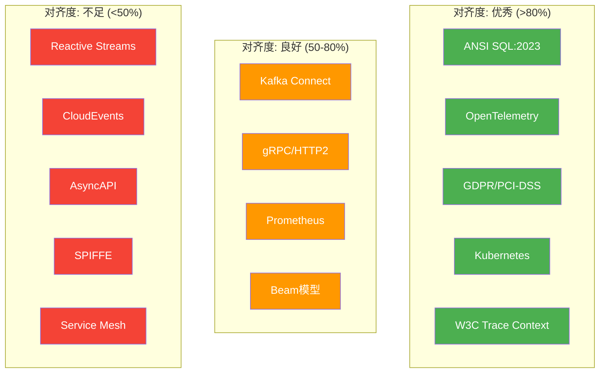
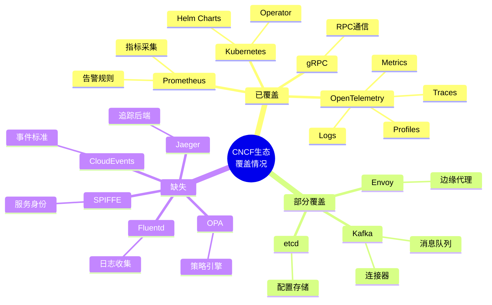
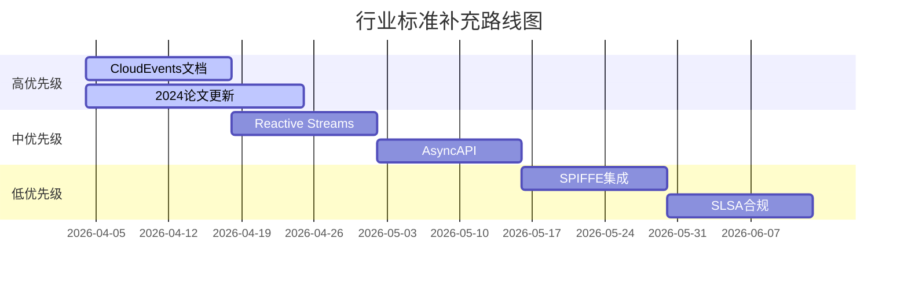
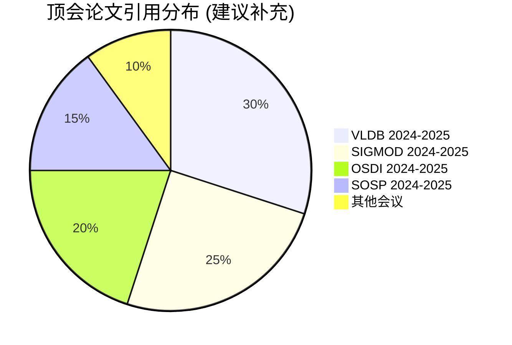

# 流处理行业标准对标雷达图

> 可视化展示项目与各行业标准对齐情况

```mermaid
radar
    title 行业标准对齐度雷达图 (满分100%)

    axis SQL标准 "OpenTelemetry" "安全合规" "云原生" "流处理API" "事件标准" "协议标准"

    scale 0 25 50 75 100

    line Current "当前项目" 95 85 95 90 40 10 35
    line Target "行业标准" 100 100 100 100 100 100 100
    line Gap "差距" 5 15 5 10 60 90 65
```

---

## 标准对齐热力图



---

## CNCF生态覆盖图



---

## 标准实施路线图



---

## 学术引用增强计划



---

*本图表与 INDUSTRY-STANDARD-GAP-ANALYSIS.md 配套使用*
