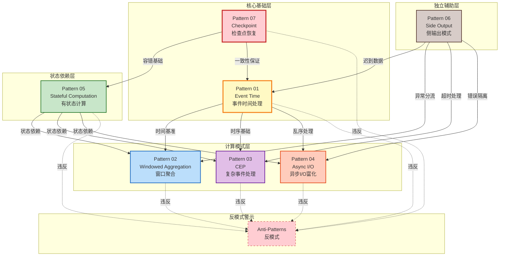
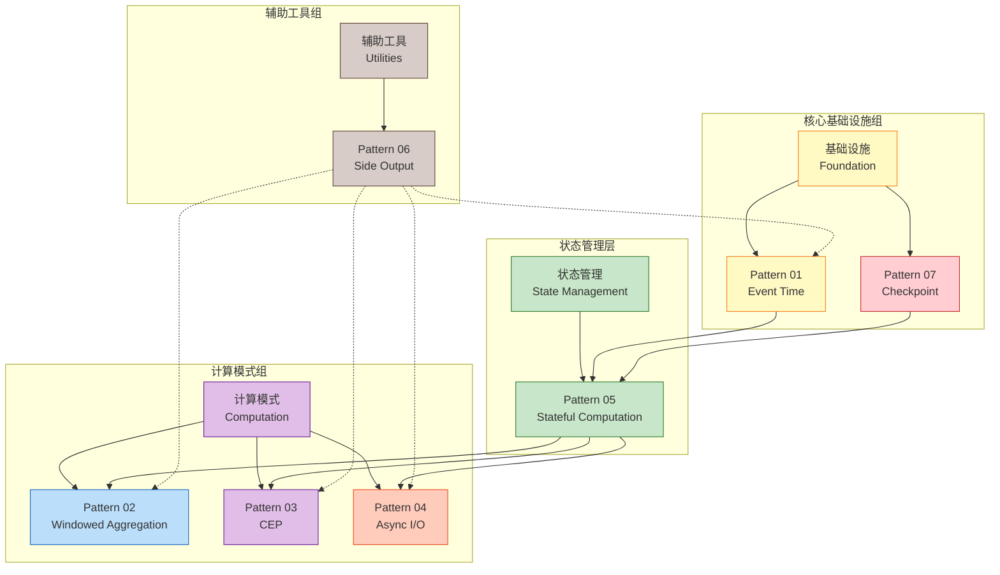
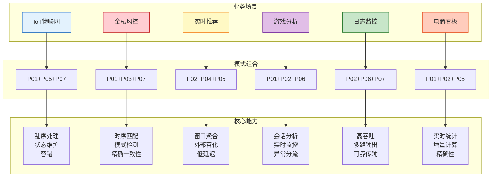
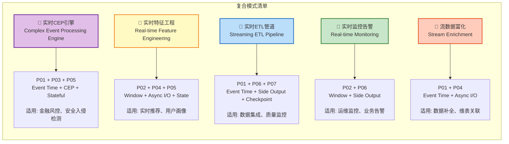
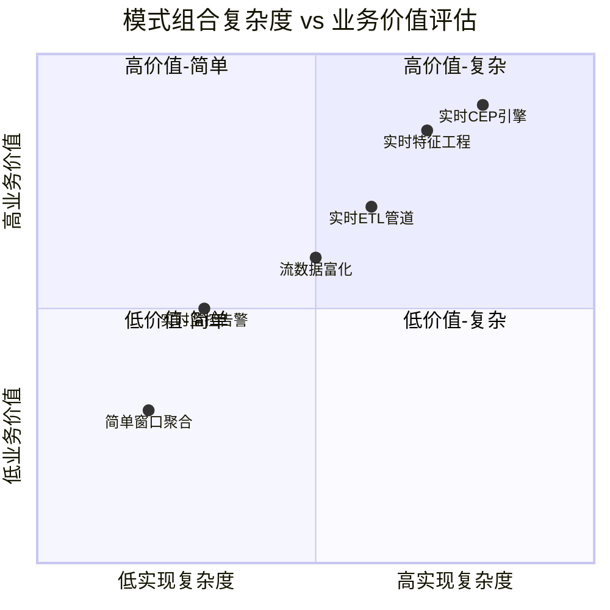
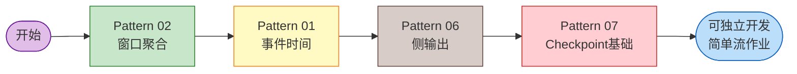
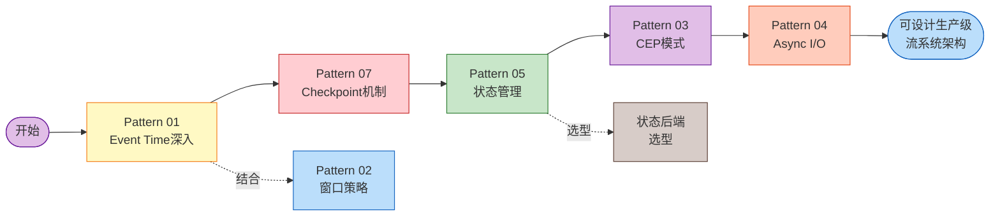
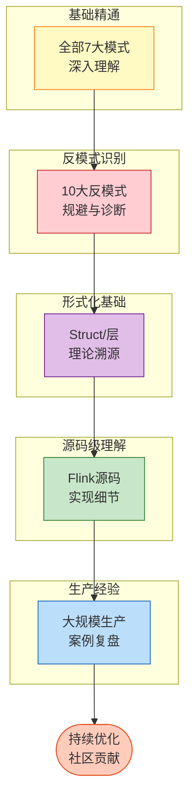
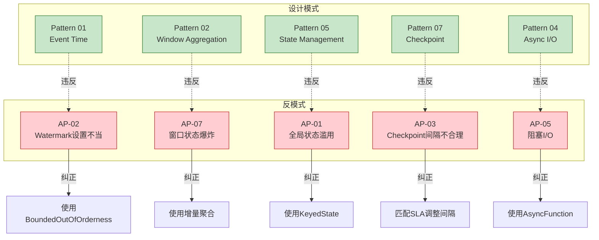

# Knowledge设计模式关系图谱

> **所属阶段**: Knowledge/02-design-patterns | **前置依赖**: [00-INDEX.md](../Knowledge/00-INDEX.md) | **形式化等级**: L4
>
> 本文档提供Knowledge层7大设计模式的完整关系图谱，包括模式依赖、业务场景映射、组合建议与学习路径。

---

## 目录

- [Knowledge设计模式关系图谱](#knowledge设计模式关系图谱)
  - [目录](#目录)
  - [1. 模式总览 (Pattern Overview)](#1-模式总览-pattern-overview)
  - [2. 模式关系图 (Pattern Relations)](#2-模式关系图-pattern-relations)
    - [2.1 核心依赖关系图](#21-核心依赖关系图)
    - [2.2 模式分组架构](#22-模式分组架构)
  - [3. 模式与业务场景映射](#3-模式与业务场景映射)
    - [3.1 领域 × 模式矩阵](#31-领域--模式矩阵)
    - [3.2 场景架构图](#32-场景架构图)
  - [4. 模式组合建议](#4-模式组合建议)
    - [4.1 常见组合模式](#41-常见组合模式)
    - [4.2 组合复杂度评估](#42-组合复杂度评估)
  - [5. 模式学习路径](#5-模式学习路径)
    - [5.1 初学者路径](#51-初学者路径)
    - [5.2 架构师路径](#52-架构师路径)
    - [5.3 专家路径](#53-专家路径)
  - [6. 反模式关联](#6-反模式关联)
  - [7. 引用参考](#7-引用参考)
    - [核心文档引用](#核心文档引用)
    - [业务场景引用](#业务场景引用)
    - [反模式引用](#反模式引用)

---

## 1. 模式总览 (Pattern Overview)

Knowledge层定义了**7大核心设计模式**，覆盖流处理系统从时间语义到容错恢复的完整生命周期：

| 编号 | 模式名称 | 核心问题 | 复杂度 | 形式化基础 |
|:----:|----------|----------|:------:|------------|
| **P01** | [Event Time Processing](../Knowledge/02-design-patterns/pattern-event-time-processing.md) | 乱序数据处理、结果确定性 | ★★★☆☆ | `Def-S-04-04` Watermark语义 |
| **P02** | [Windowed Aggregation](../Knowledge/02-design-patterns/pattern-windowed-aggregation.md) | 无界流的有界计算 | ★★☆☆☆ | `Def-S-04-05` 窗口算子 |
| **P03** | [CEP](../Knowledge/02-design-patterns/pattern-cep-complex-event.md) | 复杂事件模式匹配 | ★★★★☆ | `Thm-S-07-01` 确定性定理 |
| **P04** | [Async I/O](../Knowledge/02-design-patterns/pattern-async-io-enrichment.md) | 外部数据查询不阻塞流 | ★★★☆☆ | `Lemma-S-04-02` 单调性 |
| **P05** | [Stateful Computation](../Knowledge/02-design-patterns/pattern-stateful-computation.md) | 分布式有状态计算 | ★★★★☆ | `Thm-S-17-01` Checkpoint一致性 |
| **P06** | [Side Output](../Knowledge/02-design-patterns/pattern-side-output.md) | 多路输出、异常分流 | ★★☆☆☆ | `Def-S-08-01` AM语义 |
| **P07** | [Checkpoint & Recovery](../Knowledge/02-design-patterns/pattern-checkpoint-recovery.md) | 故障恢复与Exactly-Once | ★★★★★ | `Thm-S-18-01` Exactly-Once |

---

## 2. 模式关系图 (Pattern Relations)

### 2.1 核心依赖关系图

以下图表展示了7大设计模式之间的依赖关系，箭头表示"依赖"或"前置要求"：

**依赖关系说明**：

| 依赖类型 | 模式对 | 说明 |
|----------|--------|------|
| **时间基准** | P01 → P02 | 窗口聚合依赖Event Time确定窗口边界 |
| **时序基础** | P01 → P03 | CEP模式匹配依赖Event Time定义序列顺序 |
| **乱序处理** | P01 → P04 | 异步I/O响应可能乱序，需Watermark保证 |
| **容错基础** | P07 → P05 | 有状态计算依赖Checkpoint实现容错 |
| **一致性保证** | P07 → P01 | Checkpoint持久化Watermark状态 |
| **状态依赖** | P05 → P02/P03/P04 | 窗口、CEP、异步I/O都需要状态存储 |

---

### 2.2 模式分组架构

根据职责和依赖关系，7大模式可分为4个逻辑组：

**分组说明**：

| 分组 | 包含模式 | 核心职责 | 学习优先级 |
|------|----------|----------|:----------:|
| **核心基础设施** | P01, P07 | 时间语义与容错基础 | ⭐⭐⭐⭐⭐ |
| **状态管理** | P05 | 分布式状态存储与访问 | ⭐⭐⭐⭐ |
| **计算模式** | P02, P03, P04 | 具体计算抽象与实现 | ⭐⭐⭐ |
| **辅助工具** | P06 | 分流、异常处理等增强 | ⭐⭐ |

---

## 3. 模式与业务场景映射

### 3.1 领域 × 模式矩阵

下表展示了6大业务领域与7大设计模式的映射关系：

| 业务领域 | 核心模式组合 | 一致性要求 | 技术栈推荐 |
|----------|-------------|:----------:|------------|
| **IoT 物联网** | P01 + P05 + P07 | AL/EO | Flink + Kafka + MQTT |
| **金融风控** | P01 + P03 + P07 | EO | Flink CEP + Kafka |
| **实时推荐** | P02 + P04 + P05 | AL | Flink + Redis + ML Serving |
| **游戏实时分析** | P01 + P02 + P06 | AL | Flink + Pulsar |
| **日志/监控** | P02 + P06 + P07 | AM/AL | Flink + Elasticsearch |
| **电商实时看板** | P01 + P02 + P05 | AL | Flink + ClickHouse |

**图例说明**：

- **AL**: At-Least-Once (至少一次)
- **EO**: Exactly-Once (精确一次)
- **AM**: At-Most-Once (最多一次)

---

### 3.2 场景架构图

---

## 4. 模式组合建议

### 4.1 常见组合模式

以下是流处理系统中常见的**复合模式**（由多个基础模式组合而成）：

**复合模式详解**：

| 复合模式 | 组成 | 复杂度 | 适用场景 | 关键挑战 |
|----------|------|:------:|----------|----------|
| **实时CEP引擎** | P01 + P03 + P05 | ★★★★☆ | 金融风控、入侵检测 | NFA状态爆炸、时间窗口边界 |
| **实时特征工程** | P02 + P04 + P05 | ★★★★☆ | 推荐系统、实时ML | 特征一致性、外部服务延迟 |
| **实时ETL管道** | P01 + P06 + P07 | ★★★☆☆ | 数据湖集成、CDC同步 | Schema演进、Exactly-Once |
| **实时监控告警** | P02 + P06 | ★★☆☆☆ | 运维监控、业务大盘 | 阈值调优、告警风暴 |
| **流数据富化** | P01 + P04 | ★★★☆☆ | 维表关联、数据补全 | 外部服务容错、缓存策略 |

---

### 4.2 组合复杂度评估

---

## 5. 模式学习路径

### 5.1 初学者路径

适合刚接触流处理的工程师，建议学习周期：**2-3周**

**初学者路径目标**：

- 理解窗口类型（滚动、滑动、会话）
- 掌握Watermark基础配置
- 能够处理迟到数据
- 理解Checkpoint的作用和基础配置

---

### 5.2 架构师路径

适合需要设计复杂流系统的架构师，建议学习周期：**4-6周**

**架构师路径目标**：

- 深入理解Watermark传播机制
- 掌握Checkpoint一致性原理
- 能够进行状态后端选型
- 理解CEP的NFA状态机实现
- 掌握异步I/O的并发控制

---

### 5.3 专家路径

适合需要优化和排障的高级工程师，建议学习周期：**持续深入**

---

## 6. 反模式关联

设计模式与反模式的对应关系（违反模式原则导致的问题）：

**反模式清单速查**：

| 反模式编号 | 名称 | 违反的模式 | 后果 | 检测难度 |
|:----------:|------|------------|------|:--------:|
| AP-01 | 全局状态滥用 | P05 | 并发冲突、状态不一致 | 易 |
| AP-02 | Watermark设置不当 | P01 | 数据丢失或延迟过高 | 极难 |
| AP-03 | Checkpoint间隔不合理 | P07 | 恢复时间过长或性能下降 | 中 |
| AP-04 | 热点Key未处理 | P05 | 数据倾斜、单点瓶颈 | 难 |
| AP-05 | ProcessFunction阻塞I/O | P04 | 吞吐量骤降、背压 | 易 |
| AP-06 | 序列化开销忽视 | P05 | CPU飙升、延迟增加 | 中 |
| AP-07 | 窗口状态爆炸 | P02/P05 | OOM、Checkpoint超时 | 难 |
| AP-08 | 忽略背压信号 | P07 | 级联故障、数据丢失 | 极难 |
| AP-09 | 多流Join时间未对齐 | P01 | 结果不正确 | 难 |
| AP-10 | 资源估算不足导致OOM | P05/P07 | 作业崩溃 | 难 |

---

## 7. 引用参考

### 核心文档引用

| 模式 | 文档路径 | 关键定义 |
|------|----------|----------|
| P01 | [pattern-event-time-processing.md](../Knowledge/02-design-patterns/pattern-event-time-processing.md) | `Def-K-02-01` Event Time Processing |
| P02 | [pattern-windowed-aggregation.md](../Knowledge/02-design-patterns/pattern-windowed-aggregation.md) | `Def-K-02-02` 窗口分配器 |
| P03 | [pattern-cep-complex-event.md](../Knowledge/02-design-patterns/pattern-cep-complex-event.md) | `Def-K-03-01` 复杂事件 |
| P04 | [pattern-async-io-enrichment.md](../Knowledge/02-design-patterns/pattern-async-io-enrichment.md) | `Def-K-02-05` 异步I/O富化 |
| P05 | [pattern-stateful-computation.md](../Knowledge/02-design-patterns/pattern-stateful-computation.md) | Keyed State / Operator State |
| P06 | [pattern-side-output.md](../Knowledge/02-design-patterns/pattern-side-output.md) | `Def-K-02-06` 侧输出流 |
| P07 | [pattern-checkpoint-recovery.md](../Knowledge/02-design-patterns/pattern-checkpoint-recovery.md) | `Def-K-02-07-01` Checkpoint机制 |

### 业务场景引用

| 场景 | 文档路径 | 核心模式组合 |
|------|----------|--------------|
| IoT | [iot-stream-processing.md](../Knowledge/03-business-patterns/iot-stream-processing.md) | P01 + P05 + P07 |
| 金融风控 | [fintech-realtime-risk-control.md](../Knowledge/03-business-patterns/fintech-realtime-risk-control.md) | P01 + P03 + P07 |
| 实时推荐 | [real-time-recommendation.md](../Knowledge/03-business-patterns/real-time-recommendation.md) | P02 + P04 + P05 |

### 反模式引用

详见 [Knowledge/09-anti-patterns/README.md](../Knowledge/09-anti-patterns/README.md)

---

*文档版本: v1.0 | 更新日期: 2026-04-03 | 状态: 已完成*
