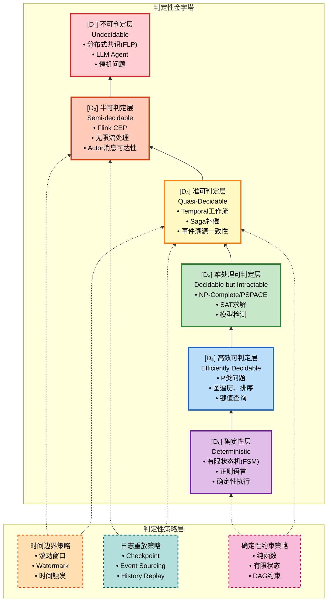
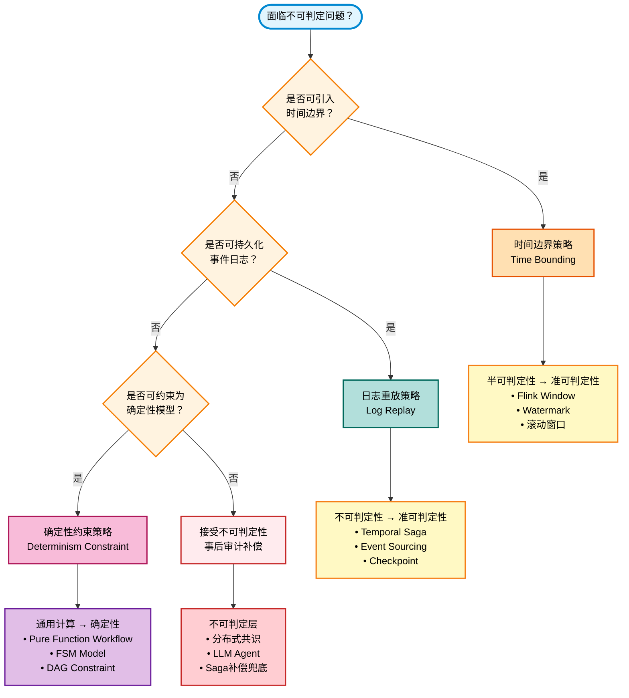

# 可判定性谱系与层次架构映射

> 所属阶段: Visuals | 前置依赖: [00.md](../00.md), [Struct/03-relationships/03.03-expressiveness-hierarchy.md](../Struct/03-relationships/03.03-expressiveness-hierarchy.md), [Knowledge/06-frontier/stateful-serverless.md](../Knowledge/06-frontier/stateful-serverless.md) | 形式化等级: L2-L4

---

## 目录

- [可判定性谱系与层次架构映射](#可判定性谱系与层次架构映射)
  - [目录](#目录)
  - [1. 判定性金字塔全景图](#1-判定性金字塔全景图)
    - [Def-V-01-01. 可判定性谱系 (Decidability Spectrum)](#def-v-01-01-可判定性谱系-decidability-spectrum)
  - [2. 判定性层级与三层架构映射](#2-判定性层级与三层架构映射)
    - [2.1 Struct/ 层映射](#21-struct-层映射)
    - [2.2 Knowledge/ 层映射](#22-knowledge-层映射)
    - [2.3 Flink/ 层映射](#23-flink-层映射)
  - [3. 各层判定性策略详解](#3-各层判定性策略详解)
    - [Def-V-01-02. 时间边界策略 (Time Bounding Strategy)](#def-v-01-02-时间边界策略-time-bounding-strategy)
    - [Def-V-01-03. 日志重放策略 (Log Replay Strategy)](#def-v-01-03-日志重放策略-log-replay-strategy)
    - [Def-V-01-04. 确定性约束策略 (Determinism Constraint Strategy)](#def-v-01-04-确定性约束策略-determinism-constraint-strategy)
  - [4. 判定性转化路径](#4-判定性转化路径)
  - [5. 可视化图表](#5-可视化图表)
    - [图 5.1: 判定性金字塔 (Decidability Pyramid)](#图-51-判定性金字塔-decidability-pyramid)
    - [图 5.2: 三层架构与判定性谱系映射](#图-52-三层架构与判定性谱系映射)
    - [图 5.3: 判定性策略决策树](#图-53-判定性策略决策树)
    - [图 5.4: 工程实践的判定性妥协矩阵](#图-54-工程实践的判定性妥协矩阵)
  - [6. 引用参考 (References)](#6-引用参考-references)

---

## 1. 判定性金字塔全景图

### Def-V-01-01. 可判定性谱系 (Decidability Spectrum)

**形式化定义**: 可判定性谱系是计算模型按理论可判定性强度的严格层级结构：

$$
\mathcal{D} = (D_1, D_2, D_3, D_4, D_5, D_6), \quad D_i \prec D_{i+1}
$$

其中 $\prec$ 表示"判定性强于"关系，即 $D_i$ 的可判定问题集合是 $D_{i+1}$ 的超集。

| 层级 | 名称 | 英文 | 判定性特征 | 典型问题 |
|------|------|------|-----------|----------|
| $D_1$ | 不可判定层 | Undecidable | 不存在通用算法可判定 | 停机问题、分布式共识(FLP) |
| $D_2$ | 半可判定层 | Semi-decidable | 可验证"是"，无法判定"否" | CEP模式检测、无限流处理 |
| $D_3$ | 准可判定层 | Quasi-decidable | 工程层面可判定，理论上近似 | Saga补偿、工作流执行 |
| $D_4$ | 难处理可判定层 | Decidable but Intractable | PSPACE/NP-Complete | SAT求解、模型检测 |
| $D_5$ | 高效可判定层 | Efficiently Decidable | P类问题 | 图遍历、排序、哈希 |
| $D_6$ | 确定性层 | Deterministic | 有限状态空间 | 有限状态机、正则语言 |

**判定性递减定律**: 表达能力与可判定性呈负相关，即：

$$
\text{Expressiveness}(M_1) > \text{Expressiveness}(M_2) \Rightarrow \text{Decidable}(M_1) \subseteq \text{Decidable}(M_2)
$$

---

## 2. 判定性层级与三层架构映射

本项目采用**三层架构**（Struct/Knowledge/Flink），每层对应不同的判定性定位：

### 2.1 Struct/ 层映射

| 判定性层级 | 对应文档/内容 | 判定性策略 |
|-----------|--------------|-----------|
| $D_6$ 确定性层 | [01.02-process-calculus-primer.md](../Struct/01-foundation/01.02-process-calculus-primer.md) - 有限状态机、正则表达式 | 形式化验证、自动机分析 |
| $D_5$ 高效可判定层 | [01.01-unified-streaming-theory.md](../Struct/01-foundation/01.01-unified-streaming-theory.md) - 图遍历、排序 | 多项式时间算法 |
| $D_4$ 难处理可判定层 | [03.03-expressiveness-hierarchy.md](../Struct/03-relationships/03.03-expressiveness-hierarchy.md) - SAT求解、模型检测 | 约束求解、符号执行 |
| $D_3$ 准可判定层 | [03.02-flink-to-process-calculus.md](../Struct/03-relationships/03.02-flink-to-process-calculus.md) - 工作流形式化 | 确定性约束、历史重放 |

**Struct/ 判定性定位**: 形式理论层，追求**严格可判定性**（$D_4$-$D_6$），通过数学证明建立理论边界。

### 2.2 Knowledge/ 层映射

| 判定性层级 | 对应文档/内容 | 判定性策略 |
|-----------|--------------|-----------|
| $D_3$ 准可判定层 | [06-frontier/stateful-serverless.md](../Knowledge/06-frontier/stateful-serverless.md) - Saga补偿、Durable Execution | 事件溯源、补偿事务 |
| $D_3$ 准可判定层 | [05-patterns/saga-pattern.md](../Knowledge/02-design-patterns/pattern-async-io-enrichment.md) - Saga模式 | 有限补偿步骤、确定性编排 |
| $D_2$ 半可判定层 | [04-engineering/streaming-systems-design.md](../Knowledge/04-technology-selection/engine-selection-guide.md) - 流系统设计 | 水印机制、窗口边界 |
| $D_1$ 不可判定层 | [06-frontier/llm-agent-architecture.md](../Knowledge/06-frontier/ai-agent-streaming-architecture.md) - Agent涌现行为 | 接受不可判定、事后审计 |

**Knowledge/ 判定性定位**: 工程实践层，在**准可判定性**（$D_3$）区域构建确定性幻觉，通过工程手段驯服不确定性。

### 2.3 Flink/ 层映射

| 判定性层级 | 对应文档/内容 | 判定性策略 |
|-----------|--------------|-----------|
| $D_2$ 半可判定层 | [01-core/checkpoint-mechanism.md](../Flink/02-core/checkpoint-mechanism-deep-dive.md) - Checkpoint机制 | Barrier对齐、快照一致性 |
| $D_2$ 半可判定层 | [01-core/watermark-mechanism.md](../Flink/02-core/time-semantics-and-watermark.md) - Watermark机制 | 时间假设、窗口触发 |
| $D_2$ 半可判定层 | [02-features/cep-complex-event-processing.md](../Flink/03-sql-table-api/flink-sql-window-functions-deep-dive.md) - CEP | 模式匹配、流识别 |
| $D_3$ 准可判定层 | [03-integrations/stateful-functions.md](../Flink/04-connectors/flink-connectors-ecosystem-complete-guide.md) - Stateful Functions | 状态持久化、恰好一次语义 |

**Flink/ 判定性定位**: 流计算实现层，在**半可判定性**（$D_2$）与**准可判定性**（$D_3$）边界上通过时间边界和检查点创造局部可判定性。

---

## 3. 各层判定性策略详解

### Def-V-01-02. 时间边界策略 (Time Bounding Strategy)

**形式化定义**: 时间边界策略通过引入有限时间窗口，将无限流问题转化为有限状态问题：

$$
\text{TimeBound}(Stream, T) = \{ e \in Stream \mid t_e \leq T \}
$$

**应用场景**:

| 技术 | 判定性转化 | 实现机制 |
|------|-----------|----------|
| **滚动窗口** (Tumbling Window) | $D_2 \to D_3$ | 将无限流切分为有限块 |
| **滑动窗口** (Sliding Window) | $D_2 \to D_3$ | 重叠边界保证连续性 |
| **会话窗口** (Session Window) | $D_2 \to D_3$ | 活动间隙触发边界 |
| **水印** (Watermark) | $D_2 \to D_3$ | 时间假设创造可判定触发点 |

**Flink实现**:

```java
// 时间边界策略：将无限流转化为有限窗口（可判定）
stream.keyBy(Event::getUserId)
      .window(TumblingEventTimeWindows.of(Time.minutes(5)))
      .aggregate(new CountAggregate());
```

### Def-V-01-03. 日志重放策略 (Log Replay Strategy)

**形式化定义**: 日志重放策略通过持久化事件历史，实现确定性重放：

$$
\text{Replay}(History, t) = \text{fold}(apply, InitialState, History[0..t])
$$

**应用场景**:

| 技术 | 判定性转化 | 实现机制 |
|------|-----------|----------|
| **Checkpoint** | $D_2 \to D_3$ | 周期性状态快照 |
| **Event Sourcing** | $D_1 \to D_3$ | 不可变事件日志作为真相源 |
| **History Replay** | $D_1 \to D_3$ | 确定性状态机重放 |
| **Durable Execution** | $D_1 \to D_3$ | Temporal持久化执行 |

**Temporal实现**:

```typescript
// 日志重放策略：确定性Workflow执行
const compensations = []; // 确定性记录

try {
  const reservation = await reserveCyberware();
  compensations.push(async () => await releaseReservation());

  const payment = await processPayment();
  compensations.push(async () => await refundPayment());
} catch (error) {
  // 确定性逆向补偿
  for (let i = compensations.length - 1; i >= 0; i--) {
    await compensations[i](); // 故障后从日志重放
  }
}
```

### Def-V-01-04. 确定性约束策略 (Determinism Constraint Strategy)

**形式化定义**: 确定性约束通过限制计算模型的表达能力，换取可判定性保证：

$$
\text{Deterministic}(P) \iff \forall s_1, s_2. s_1 = s_2 \Rightarrow P(s_1) = P(s_2)
$$

**应用场景**:

| 约束类型 | 判定性转化 | 实现机制 |
|----------|-----------|----------|
| **纯函数约束** | $D_1 \to D_3$ | Workflow代码无随机、无系统时间 |
| **有限状态约束** | $D_2 \to D_6$ | 状态机模型、正则协议 |
| **静态拓扑约束** | $D_1 \to D_4$ | CSP静态通道、编译期验证 |
| **DAG约束** | $D_1 \to D_5$ | 无环依赖图、拓扑排序 |

**SFaaS实现**:

```python
# 确定性约束：纯函数状态管理
class DeterministicFunction:
    """满足确定性约束的SFaaS函数"""

    def process(self, event, state):
        # 约束1: 无随机数生成
        # 约束2: 无系统时间访问（使用event time）
        # 约束3: 无副作用（状态仅通过返回值更新）
        new_state = self.pure_transform(state, event)
        output = self.pure_compute(new_state)
        return output, new_state  # 确定性输出
```

---

## 4. 判定性转化路径

工程实践中，判定性层级的转化遵循以下路径：

```
不可判定层 (D₁) ──────────────────────────────────────┐
    │                                                  │
    │  接受不可判定性                                  │
    │  • 分布式共识                                    │
    │  • LLM Agent涌现行为                             │
    ▼                                                  │
半可判定层 (D₂) ──时间边界策略──► 准可判定层 (D₃)      │
    │                              │                   │
    │  水印、窗口                   │  确定性约束       │
    │  • Flink Window               │  • 纯函数Workflow │
    │  • CEP模式检测                │  • Saga补偿       │
    ▼                              ▼                   │
难处理可判定层 (D₄) ◄──日志重放策略────────────────────┘
    │
    │  模型检测、SAT求解
    ▼
高效可判定层 (D₅)
    │
    │  图遍历、哈希查找
    ▼
确定性层 (D₆)

    FSM、正则表达式
```

**判定性工程的核心洞察**: 通过**时间边界**、**日志重放**、**确定性约束**三大策略，将底层不可判定问题转化为上层可判定近似，构建工程可用的确定性幻觉。

---

## 5. 可视化图表

### 图 5.1: 判定性金字塔 (Decidability Pyramid)



**图说明**:

- **金字塔结构**: 越往上判定性越强，表达能力越弱；越往下判定性越弱，表达能力越强
- **颜色编码**: 从顶部紫色（确定性）到底部红色（不可判定），反映判定性递减
- **策略层**: 三种核心策略（时间边界、日志重放、确定性约束）用于在不同层级间进行判定性转化

---

### 图 5.2: 三层架构与判定性谱系映射

```mermaid
flowchart TB
    subgraph "判定性谱系 (Decidability Spectrum)"
        direction TB
        DS1["不可判定性<br/>Undecidable"]:::undecidable
        DS2["半可判定性<br/>Semi-decidable"]:::semidecidable
        DS3["准可判定性<br/>Quasi-decidable"]:::quasidecidable
        DS4["难处理可判定<br/>Intractable"]:::intractable
        DS5["高效可判定<br/>Efficient"]:::efficient
        DS6["确定性<br/>Deterministic"]:::deterministic

        DS1 --> DS2
        DS2 --> DS3
        DS3 --> DS4
        DS4 --> DS5
        DS5 --> DS6
    end

    subgraph "Struct/ 形式理论层"
        direction TB
        S_DOC1["01.02-process-calculus"]:::struct
        S_DOC2["03.03-expressiveness-hierarchy"]:::struct
        S_DOC3["01.01-unified-streaming-theory"]:::struct

        S_L6["[L₆] λ演算<br/>完全不可判定"]:::l6
        S_L4["[L₄] π演算<br/>部分不可判定"]:::l4
        S_L3["[L₃] CSP<br/>EXPTIME"]:::l3
        S_L1["[L₁] FSM<br/>P-Complete"]:::l1
    end

    subgraph "Knowledge/ 工程实践层"
        direction TB
        K_DOC1["06-frontier/stateful-serverless"]:::knowledge
        K_DOC2["05-patterns/saga-pattern"]:::knowledge
        K_DOC3["04-engineering/streaming-systems"]:::knowledge

        K_D3["[D₃] Saga补偿<br/>准可判定"]:::d3
        K_D2["[D₂] 流系统设计<br/>半可判定"]:::d2
        K_D1["[D₁] LLM Agent<br/>不可判定"]:::d1
    end

    subgraph "Flink/ 流计算实现层"
        direction TB
        F_DOC1["01-core/checkpoint"]:::flink
        F_DOC2["01-core/watermark"]:::flink
        F_DOC3["02-features/cep"]:::flink
        F_DOC4["03-integrations/stateful-functions"]:::flink

        F_D3["[D₃] Stateful Functions<br/>恰好一次语义"]:::fd3
        F_D2["[D₂] Checkpoint+Watermark<br/>半可判定近似"]:::fd2
        F_D2_CEP["[D₂] CEP模式匹配<br/>无限流识别"]:::fd2
    end

    %% 映射关系
    DS1 -.-> K_D1
    DS2 -.-> F_D2
    DS2 -.-> F_D2_CEP
    DS2 -.-> K_D2
    DS3 -.-> K_D3
    DS3 -.-> F_D3
    DS5 -.-> S_L3
    DS6 -.-> S_L1

    %% 文档关联
    S_L6 -.-> S_DOC1
    S_L4 -.-> S_DOC1
    S_L3 -.-> S_DOC2
    S_L1 -.-> S_DOC3

    K_D1 -.-> K_DOC1
    K_D3 -.-> K_DOC2
    K_D2 -.-> K_DOC3

    F_D3 -.-> F_DOC4
    F_D2 -.-> F_DOC1
    F_D2 -.-> F_DOC2
    F_D2_CEP -.-> F_DOC3

    style DS1 fill:#ffcdd2,stroke:#c62828,stroke-width:3px,color:#000
    style DS2 fill:#ffccbc,stroke:#d84315,stroke-width:3px,color:#000
    style DS3 fill:#fff9c4,stroke:#f57f17,stroke-width:3px,color:#000
    style DS4 fill:#c8e6c9,stroke:#2e7d32,stroke-width:3px,color:#000
    style DS5 fill:#bbdefb,stroke:#1565c0,stroke-width:3px,color:#000
    style DS6 fill:#e1bee7,stroke:#6a1b9a,stroke-width:3px,color:#000

    style S_L6 fill:#ffcdd2,stroke:#c62828,color:#000
    style S_L4 fill:#ffccbc,stroke:#d84315,color:#000
    style S_L3 fill:#c8e6c9,stroke:#2e7d32,color:#000
    style S_L1 fill:#e1bee7,stroke:#6a1b9a,color:#000

    style K_D1 fill:#ffcdd2,stroke:#c62828,color:#000
    style K_D2 fill:#ffccbc,stroke:#d84315,color:#000
    style K_D3 fill:#fff9c4,stroke:#f57f17,color:#000

    style F_D3 fill:#fff9c4,stroke:#f57f17,color:#000
    style F_D2 fill:#ffccbc,stroke:#d84315,color:#000
    style F_D2_CEP fill:#ffccbc,stroke:#d84315,color:#000

    classDef undecidable fill:#ffcdd2,stroke:#c62828,color:#000
    classDef semidecidable fill:#ffccbc,stroke:#d84315,color:#000
    classDef quasidecidable fill:#fff9c4,stroke:#f57f17,color:#000
    classDef intractable fill:#c8e6c9,stroke:#2e7d32,color:#000
    classDef efficient fill:#bbdefb,stroke:#1565c0,color:#000
    classDef deterministic fill:#e1bee7,stroke:#6a1b9a,color:#000
    classDef struct fill:#e3f2fd,stroke:#1976d2,stroke-width:2px,color:#000
    classDef knowledge fill:#f3e5f5,stroke:#7b1fa2,stroke-width:2px,color:#000
    classDef flink fill:#e8f5e9,stroke:#388e3c,stroke-width:2px,color:#000
    classDef l6 fill:#ffcdd2,stroke:#c62828,color:#000
    classDef l4 fill:#ffccbc,stroke:#d84315,color:#000
    classDef l3 fill:#c8e6c9,stroke:#2e7d32,color:#000
    classDef l1 fill:#e1bee7,stroke:#6a1b9a,color:#000
    classDef d1 fill:#ffcdd2,stroke:#c62828,color:#000
    classDef d2 fill:#ffccbc,stroke:#d84315,color:#000
    classDef d3 fill:#fff9c4,stroke:#f57f17,color:#000
    classDef fd3 fill:#fff9c4,stroke:#f57f17,color:#000
    classDef fd2 fill:#ffccbc,stroke:#d84315,color:#000
```



**图说明**:

- **左侧判定性谱系**: 从不可判定（红色）到确定性（紫色）的连续谱系
- **右侧三层架构**: Struct/（蓝色）、Knowledge/（紫色）、Flink/（绿色）分别对应不同的判定性层级
- **映射关系**: 虚线表示文档/技术对应的判定性定位

---

### 图 5.3: 判定性策略决策树



**图说明**:

- **决策树结构**: 从问题诊断到策略选择的完整决策路径
- **三种核心策略**: 时间边界（橙色）、日志重放（青色）、确定性约束（粉色）
- **最终判定性结果**: 通过不同策略将问题转化到不同判定性层级

---

### 图 5.4: 工程实践的判定性妥协矩阵

```mermaid
quadrantChart
    title 判定性 vs 表达能力 工程权衡矩阵
    x-axis 低判定性 (不可判定) --> 高判定性 (确定性)
    y-axis 低表达能力 --> 高表达能力

    "分布式共识": [0.1, 0.95]
    "LLM Agent": [0.05, 0.9]
    "通用流处理": [0.2, 0.85]
    "Flink CEP": [0.25, 0.75]
    "Temporal工作流": [0.6, 0.7]
    "Saga模式": [0.65, 0.65]
    "有限状态机": [0.95, 0.3]
    "正则表达式": [0.98, 0.2]
    "SAT求解器": [0.7, 0.5]
    "P类算法": [0.9, 0.4]
```

**图说明**:

- **X轴**: 判定性强度（左=不可判定，右=确定性）
- **Y轴**: 表达能力（下=受限，上=通用）
- **权衡曲线**: 实际系统分布在左上到右下的对角线附近，反映判定性与表达能力的负相关
- **工程选型**: 根据需求在曲线上选择合适位置（如风控系统倾向于右下，AI系统倾向于左上）

---

## 6. 引用参考 (References)


---

*文档版本: 2026.04 | 形式化等级: L2-L4 | 状态: 完整*

