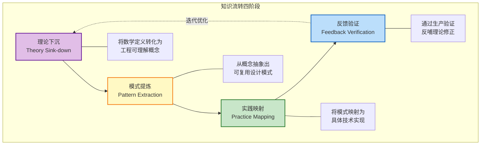
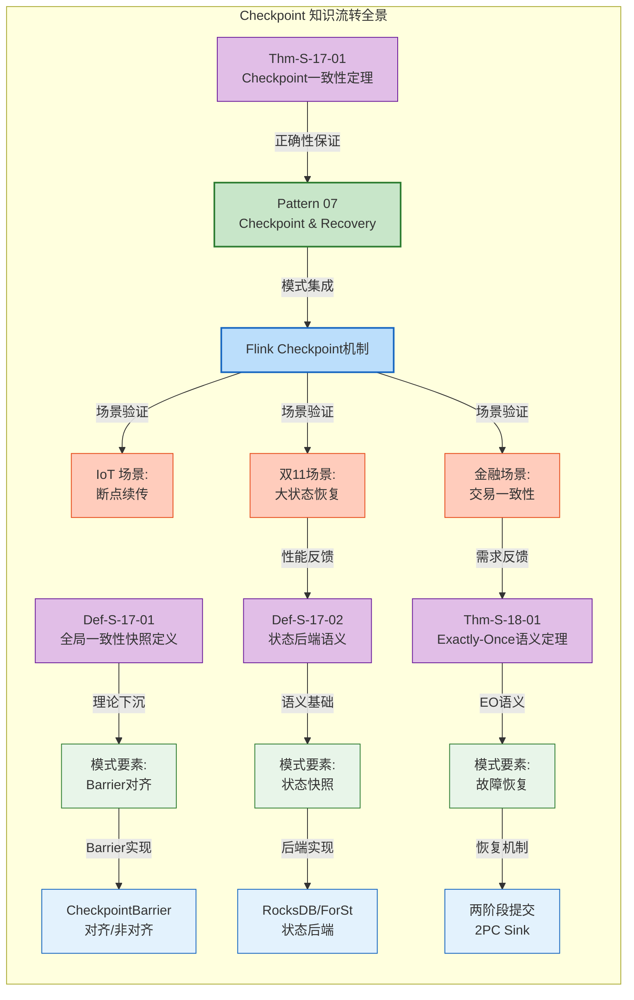
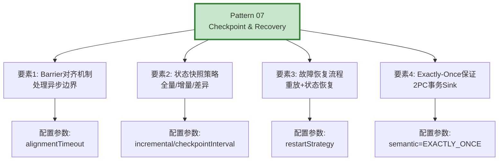
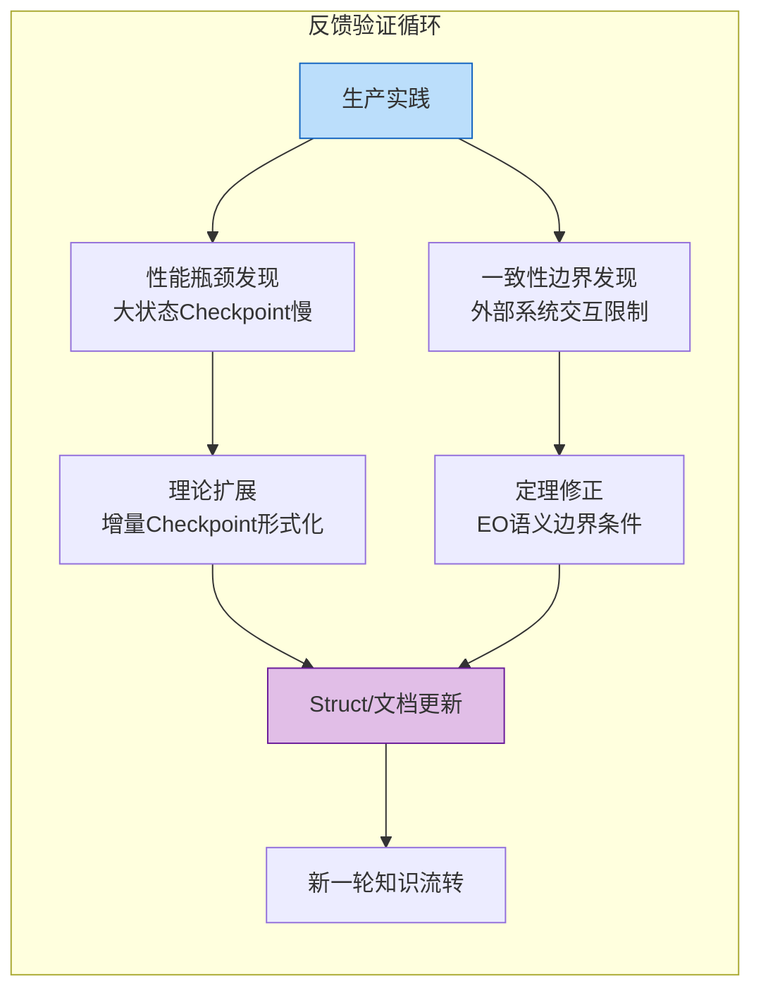
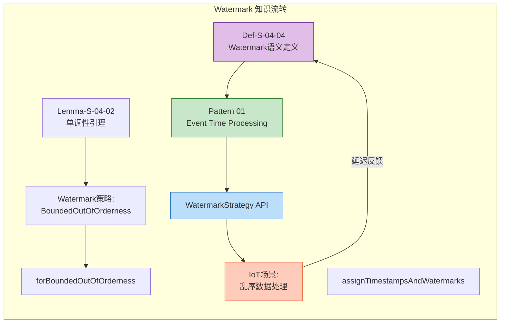
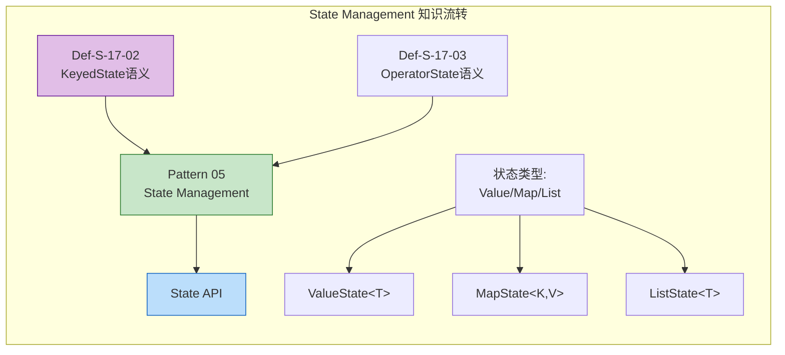
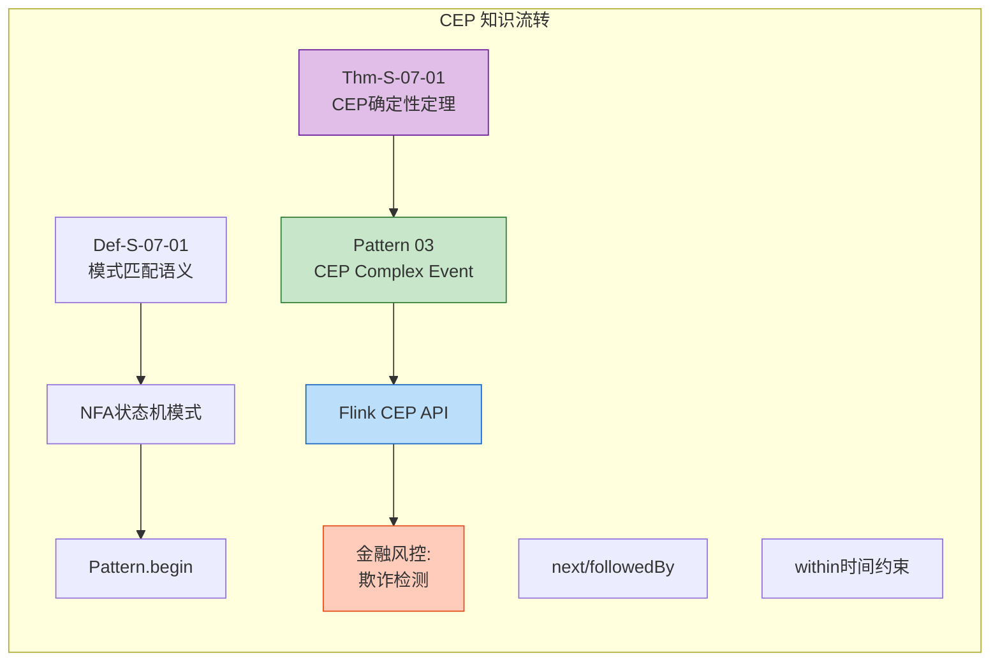
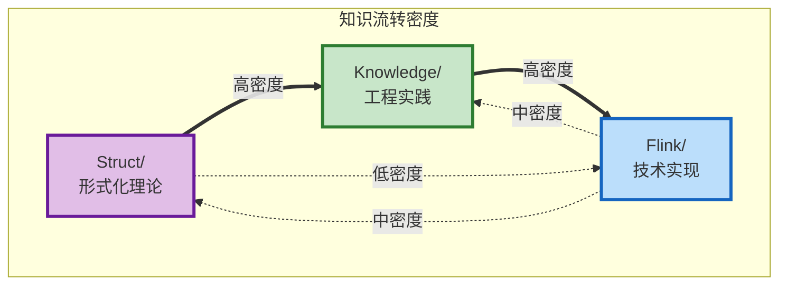

# Struct-Knowledge-Flink 知识流转图

> **所属阶段**: 可视化文档 | **前置依赖**: [Knowledge/00-INDEX.md](../Knowledge/00-INDEX.md) | **形式化等级**: L3
>
> **文档定位**: 展示 AnalysisDataFlow 项目三层知识体系（Struct/理论 → Knowledge/实践 → Flink/实现）的流转关系与映射路径

---

## 1. 概念定义 (Definitions)

### Def-V-01-01: 知识流转 (Knowledge Flow)

知识从形式化理论层向工程实践层再向技术实现层的转化过程，包含四个关键环节：**理论下沉**、**模式提炼**、**实践映射**、**反馈验证**。

### Def-V-01-02: 三层架构 (Three-Layer Architecture)

| 层级 | 目录 | 核心定位 | 抽象等级 | 表达形式 |
|------|------|----------|----------|----------|
| **Layer 1** | Struct/ | 形式化理论层 | L1-L6 | 数学定义/定理证明 |
| **Layer 2** | Knowledge/ | 工程实践层 | L3-L4 | 设计模式/决策树 |
| **Layer 3** | Flink/ | 技术实现层 | L5-L6 | 代码/配置/案例 |

### Def-V-01-03: 流转示例 (Flow Example)

特定概念从理论定义到工程模式再到技术实现的完整映射路径，如 Checkpoint 理论 → Checkpoint 模式 → Flink Checkpoint 实现。

---

## 2. 三层架构全景图

```mermaid
graph TB
    subgraph "🔬 Layer 1: Struct/ 形式化理论层"
        direction TB
        L1_ROOT[Struct/ 形式化理论]

        L1_S1[基础理论<br/>Foundation]
        L1_S2[性质推导<br/>Properties]
        L1_S3[关系建立<br/>Relations]
        L1_S4[形式证明<br/>Proofs]

        L1_ROOT --> L1_S1 & L1_S2 & L1_S3 & L1_S4

        L1_S1 --> L1_S1_1[USTM统一理论<br/>Def-S-01-01]
        L1_S1 --> L1_S1_2[进程演算<br/>CCS/CSP/π]
        L1_S1 --> L1_S1_3[Dataflow模型<br/>Def-S-04-01]
        L1_S1 --> L1_S1_4[Actor模型<br/>Def-S-03-01]

        L1_S2 --> L1_S2_1[Watermark单调性<br/>Lemma-S-04-02]
        L1_S2 --> L1_S2_2[状态一致性<br/>Lemma-S-17-01]
        L1_S2 --> L1_S2_3[Exactly-Once语义<br/>Thm-S-18-01]

        L1_S3 --> L1_S3_1[Flink↔进程演算<br/>映射定理]
        L1_S3 --> L1_S3_2[表达能力层次<br/>Thm-S-03-02]

        L1_S4 --> L1_S4_1[Checkpoint正确性<br/>Thm-S-17-01]
        L1_S4 --> L1_S4_2[Chandy-Lamport<br/>快照算法证明]
    end

    subgraph "📚 Layer 2: Knowledge/ 工程实践层"
        direction TB
        L2_ROOT[Knowledge/ 工程实践]

        L2_K1[概念图谱<br/>Concept Atlas]
        L2_K2[设计模式<br/>Design Patterns]
        L2_K3[业务场景<br/>Business Patterns]
        L2_K4[技术选型<br/>Technology Selection]

        L2_ROOT --> L2_K1 & L2_K2 & L2_K3 & L2_K4

        L2_K1 --> L2_K1_1[并发范式矩阵<br/>Def-K-01-01]
        L2_K1 --> L2_K1_2[流计算模型谱系<br/>Def-K-01-02]

        L2_K2 --> L2_K2_1[P01: Event Time<br/>Def-K-02-01]
        L2_K2 --> L2_K2_2[P02: Windowed Agg<br/>Def-K-02-02]
        L2_K2 --> L2_K2_3[P03: CEP<br/>Def-K-02-03]
        L2_K2 --> L2_K2_4[P04: Async I/O<br/>Def-K-02-04]
        L2_K2 --> L2_K2_5[P05: State Mgmt<br/>Def-K-02-05]
        L2_K2 --> L2_K2_6[P06: Side Output<br/>Def-K-02-06]
        L2_K2 --> L2_K2_7[P07: Checkpoint<br/>Def-K-02-07]

        L2_K3 --> L2_K3_1[IoT 物联网]
        L2_K3 --> L2_K3_2[金融风控]
        L2_K3 --> L2_K3_3[实时推荐]
        L2_K3 --> L2_K3_4[双11大促]

        L2_K4 --> L2_K4_1[引擎选型决策树]
        L2_K4 --> L2_K4_2[范式选型指南]
        L2_K4 --> L2_K4_3[存储选型矩阵]
    end

    subgraph "⚙️ Layer 3: Flink/ 技术实现层"
        direction TB
        L3_ROOT[Flink/ 技术实现]

        L3_F1[架构设计<br/>Architecture]
        L3_F2[核心机制<br/>Core Mechanisms]
        L3_F3[SQL/Table API]
        L3_F4[AI/ML集成<br/>AI Integration]
        L3_F5[Lakehouse<br/>Storage]

        L3_ROOT --> L3_F1 & L3_F2 & L3_F3 & L3_F4 & L3_F5

        L3_F1 --> L3_F1_1[DataStream API]
        L3_F1 --> L3_F1_2[部署架构]
        L3_F1 --> L3_F1_3[状态后端]

        L3_F2 --> L3_F2_1[Checkpoint机制]
        L3_F2 --> L3_F2_2[Watermark生成]
        L3_F2 --> L3_F2_3[背压控制]
        L3_F2 --> L3_F2_4[Exactly-Once]

        L3_F3 --> L3_F3_1[SQL优化器]
        L3_F3 --> L3_F3_2[窗口函数]
        L3_F3 --> L3_F3_3[物化表]

        L3_F4 --> L3_F4_1[FLIP-531 Agents]
        L3_F4 --> L3_F4_2[实时ML推理]
        L3_F4 --> L3_F4_3[向量搜索]

        L3_F5 --> L3_F5_1[Iceberg集成]
        L3_F5 --> L3_F5_2[Paimon集成]
        L3_F5 --> L3_F5_3[流式湖仓]
    end

    %% 层间流转
    L1_S1 -.->|理论下沉| L2_K1
    L1_S2 -.->|性质保证| L2_K2
    L1_S3 -.->|关系映射| L2_K4
    L1_S4 -.->|正确性基础| L2_K2

    L2_K1 -.->|概念具象化| L3_F1
    L2_K2 -.->|模式实现| L3_F2
    L2_K3 -.->|场景驱动| L3_F4
    L2_K4 -.->|选型落地| L3_F5

    L3_F2 -.->|反馈验证| L1_S4
    L3_F4 -.->|需求牵引| L2_K3

    style L1_ROOT fill:#e1bee7,stroke:#6a1b9a,stroke-width:3px
    style L2_ROOT fill:#c8e6c9,stroke:#2e7d32,stroke-width:3px
    style L3_ROOT fill:#bbdefb,stroke:#1565c0,stroke-width:3px

    style L1_S1 fill:#f3e5f5,stroke:#6a1b9a
    style L1_S2 fill:#f3e5f5,stroke:#6a1b9a
    style L1_S3 fill:#f3e5f5,stroke:#6a1b9a
    style L1_S4 fill:#f3e5f5,stroke:#6a1b9a

    style L2_K1 fill:#e8f5e9,stroke:#2e7d32
    style L2_K2 fill:#e8f5e9,stroke:#2e7d32
    style L2_K3 fill:#e8f5e9,stroke:#2e7d32
    style L2_K4 fill:#e8f5e9,stroke:#2e7d32

    style L3_F1 fill:#e3f2fd,stroke:#1565c0
    style L3_F2 fill:#e3f2fd,stroke:#1565c0
    style L3_F3 fill:#e3f2fd,stroke:#1565c0
    style L3_F4 fill:#e3f2fd,stroke:#1565c0
    style L3_F5 fill:#e3f2fd,stroke:#1565c0
```



---

## 3. 知识流转四阶段

### 3.1 流转阶段定义



### 3.2 流转阶段详解

| 阶段 | 方向 | 核心动作 | 输入 | 输出 | 典型示例 |
|------|------|----------|------|------|----------|
| **理论下沉** | Struct → Knowledge | 数学定义 → 工程概念 | `Def-S-04-04` Watermark语义 | Pattern 01: Event Time | 形式化定义转化为设计模式 |
| **模式提炼** | Knowledge 内部 | 概念 → 可复用模式 | 并发范式对比 | 7大设计模式 | 从理论对比提炼通用解决方案 |
| **实践映射** | Knowledge → Flink | 模式 → 技术实现 | P07 Checkpoint模式 | Flink Checkpoint机制 | 设计模式映射到API实现 |
| **反馈验证** | Flink → Struct | 生产验证 → 理论修正 | Checkpoint生产问题 | 定理修正/扩展 | 实践反馈完善形式化理论 |

---

## 4. 流转示例：Checkpoint 知识体系

### 4.1 完整流转路径



### 4.2 流转详细说明

**Step 1: 理论下沉 (Struct → Knowledge)**

| 形式化定义 | 工程模式转化 | 关键映射点 |
|------------|--------------|------------|
| `Def-S-17-01` 全局一致性快照 | Pattern 07 核心概念 | 快照 = Checkpoint; 一致性 = Barrier对齐 |
| `Thm-S-17-01` Checkpoint一致性 | 模式正确性保证 | 定理证明 → 模式可信度 |
| `Def-S-17-02` 状态后端语义 | 状态存储模式 | 语义定义 → 后端选型依据 |
| `Thm-S-18-01` Exactly-Once | EO语义保障 | 形式化语义 → 业务承诺 |

**Step 2: 模式提炼 (Knowledge 内部)**



**Step 3: 实践映射 (Knowledge → Flink)**

| 模式要素 | Flink 实现 | 关键API/配置 | 实现细节 |
|----------|------------|--------------|----------|
| Barrier对齐 | CheckpointBarrier对齐算法 | `CheckpointOptions` | 对齐/非对齐Checkpoint |
| 状态快照 | RocksDB/HashMap/ForSt后端 | `StateBackend` | 增量快照、异步快照 |
| 故障恢复 | Checkpoint恢复机制 | `RestartStrategies` | 固定延迟/指数退避 |
| Exactly-Once | 两阶段提交Sink | `TwoPhaseCommitSinkFunction` | Kafka事务、预提交 |

**Step 4: 反馈验证 (Flink → Struct)**



---

## 5. 其他流转示例

### 5.1 Watermark 知识体系流转



### 5.2 State Management 知识体系流转



### 5.3 CEP 知识体系流转



---

## 6. 层间关系矩阵

### 6.1 跨层映射矩阵

| Struct 形式化定义 | Knowledge 设计模式 | Flink 技术实现 | 典型应用场景 |
|-------------------|-------------------|----------------|--------------|
| `Def-S-04-04` Watermark | P01: Event Time | `WatermarkStrategy` | IoT乱序处理 |
| `Def-S-04-05` 窗口算子 | P02: Windowed Agg | `WindowAssigner` | 实时统计 |
| `Thm-S-07-01` CEP确定性 | P03: CEP | `Pattern API` | 金融风控 |
| `Lemma-S-04-02` 单调性 | P04: Async I/O | `AsyncFunction` | 特征关联 |
| `Def-S-17-02` KeyedState | P05: State Mgmt | `ValueState` | 会话维护 |
| `Def-S-08-01` AM语义 | P06: Side Output | `OutputTag` | 异常分流 |
| `Thm-S-17-01` Checkpoint | P07: Checkpoint | `CheckpointConfig` | Exactly-Once |

### 6.2 知识流转密度热力图



---

## 7. 使用说明

### 7.1 如何使用本流转图

**场景1: 架构师技术选型**

```
起点: Knowledge/04-technology-selection/
↓
阅读决策树 → 确定技术方向
↓
查阅对应 Flink/ 实现文档
↓
理解 Struct/ 形式化基础
```

**场景2: 开发工程师实现功能**

```
起点: Flink/ 具体API文档
↓
查阅对应 Knowledge/02-design-patterns/ 模式
↓
理解模式背后的 Struct/ 理论保证
↓
正确实现并调优
```

**场景3: 研究员理论验证**

```
起点: Struct/ 形式化定义
↓
查看 Knowledge/ 中的工程转化
↓
验证 Flink/ 实现是否符合理论
↓
发现偏差 → 完善理论或修正实现
```

### 7.2 阅读路径推荐

| 角色 | 推荐路径 | 关键节点 |
|------|----------|----------|
| **架构师** | Struct/ → Knowledge/ → Flink/ | 概念图谱 → 技术选型 → 架构设计 |
| **开发工程师** | Knowledge/ → Flink/ → Struct/ | 设计模式 → API实现 → 理论理解 |
| **研究员** | Struct/ → Knowledge/ → Flink/ | 形式化定义 → 模式验证 → 实现检验 |
| **技术负责人** | Knowledge/00-INDEX.md → 全图谱 | 整体把握 → 逐层深入 |

### 7.3 颜色说明

| 颜色 | 含义 | 使用层级 |
|------|------|----------|
| 🟣 紫色 (`#e1bee7`) | 形式化理论层 | Struct/ |
| 🟢 绿色 (`#c8e6c9`) | 工程实践层 | Knowledge/ |
| 🔵 蓝色 (`#bbdefb`) | 技术实现层 | Flink/ |
| 🟡 黄色 (`#fff9c4`) | 关键枢纽/模式 | 跨层连接 |
| 🟠 橙色 (`#ffccbc`) | 业务场景 | 验证落地 |

---

## 8. 可视化图表索引

| 图表编号 | 图表名称 | 位置 | 描述 |
|----------|----------|------|------|
| FIG-V-01 | 三层架构全景图 | 第2节 | 完整展示Struct/Knowledge/Flink三层架构 |
| FIG-V-02 | 知识流转四阶段 | 第3.1节 | 理论下沉→模式提炼→实践映射→反馈验证 |
| FIG-V-03 | Checkpoint流转全景 | 第4.1节 | Checkpoint知识体系完整流转示例 |
| FIG-V-04 | 模式提炼结构 | 第4.2节 | Pattern 07要素分解 |
| FIG-V-05 | 反馈验证循环 | 第4.2节 | 生产反馈到理论修正的循环 |
| FIG-V-06 | Watermark流转 | 第5.1节 | Watermark知识体系流转示例 |
| FIG-V-07 | State流转 | 第5.2节 | State Management流转示例 |
| FIG-V-08 | CEP流转 | 第5.3节 | CEP知识体系流转示例 |
| FIG-V-09 | 流转密度热力图 | 第6.2节 | 层间流转关系密度 |

---

## 9. 引用参考


---

*本文档由 AnalysisDataFlow 项目自动生成，用于展示三层知识体系之间的流转关系。更新时请同步检查各层文档的一致性。*
