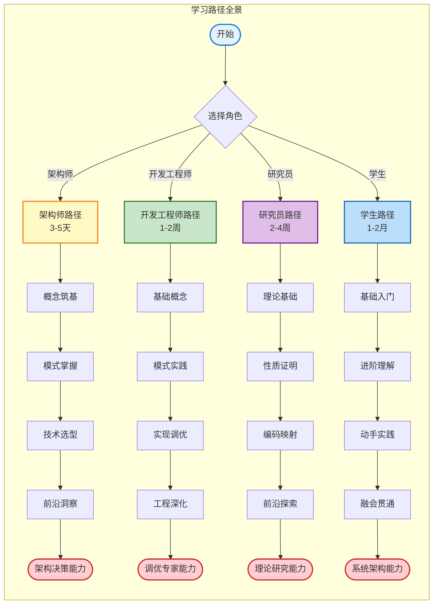
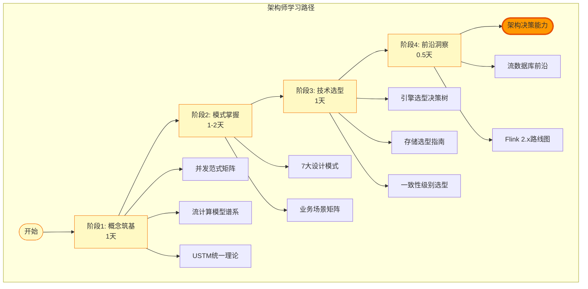
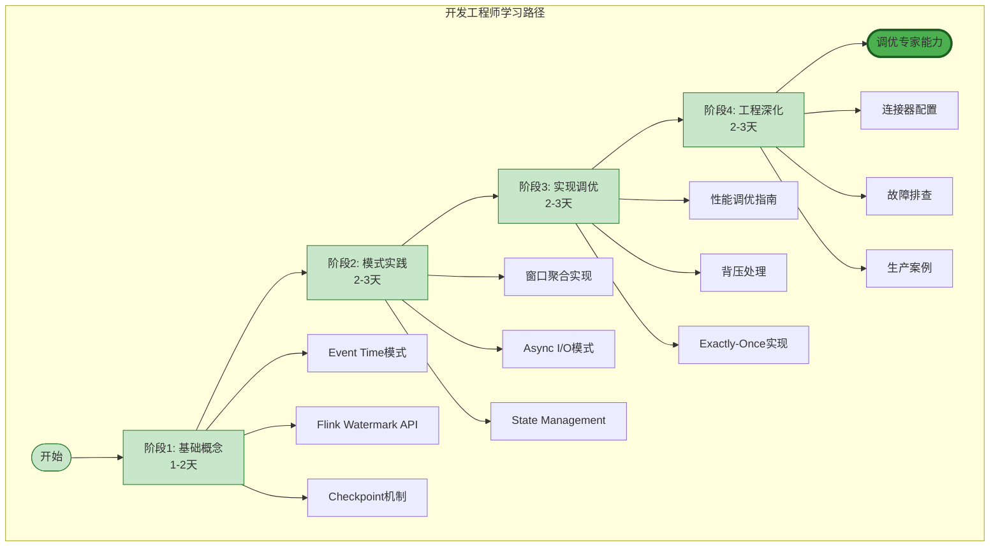
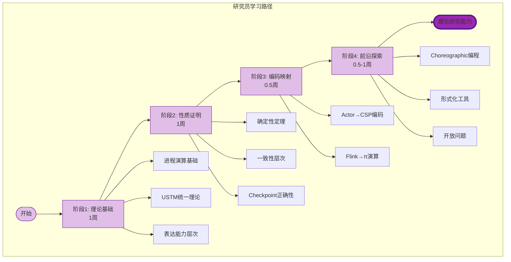
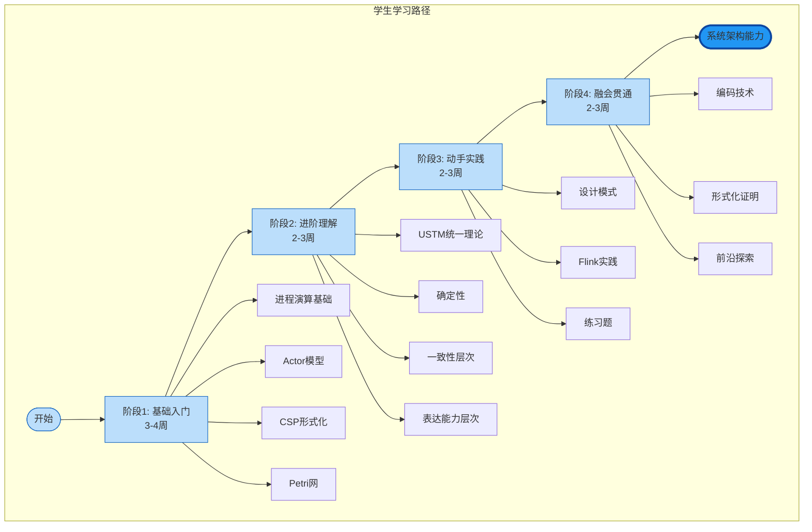
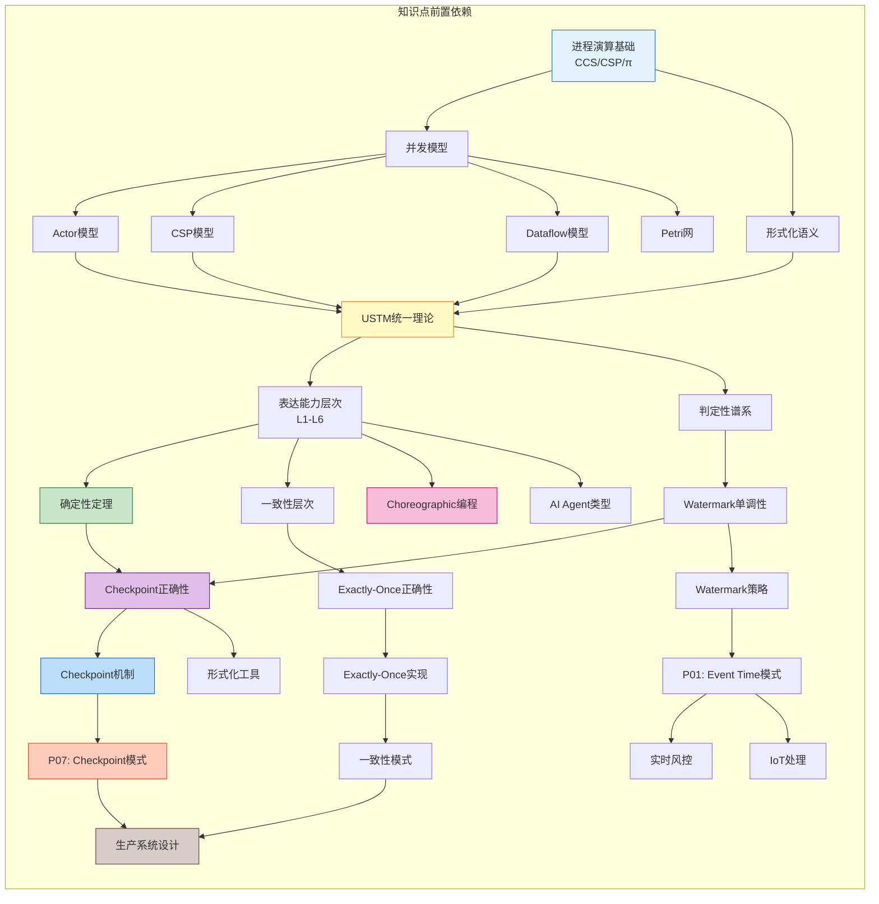
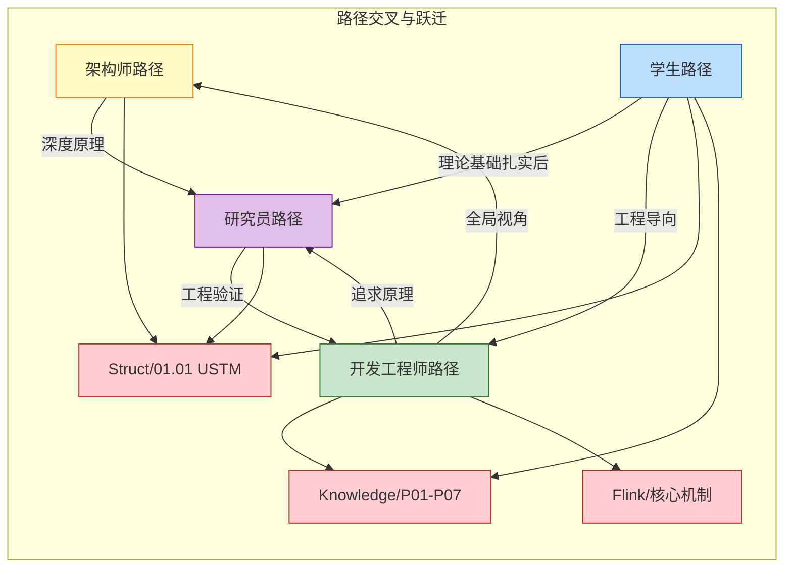

# 角色化学习路径引导图

> **所属阶段**: Knowledge/ | 形式化等级: L3-L5 | 版本: 2026.04
>
> **文档定位**: 为不同角色（架构师、开发工程师、研究员、学生）提供定制化的学习路径导航

---

## 1. 学习路径总览

### 1.1 角色与路径对应

| 角色 | 目标 | 预计时间 | 核心产出 | 起始等级 |
|------|------|----------|----------|----------|
| **架构师** | 技术选型与架构设计能力 | 3-5天 | 架构决策文档 | L4 |
| **开发工程师** | 模式实现与调优能力 | 1-2周 | 可生产代码 | L3-L4 |
| **研究员** | 理论扩展与证明能力 | 2-4周 | 形式化成果 | L5-L6 |
| **学生** | 知识体系建立 | 1-2月 | 完整知识框架 | L1-L4 |

### 1.2 四路径全景图

---

## 2. 架构师路径 (3-5天)

### 2.1 路径图

### 2.2 详细阅读清单

#### 阶段1: 概念筑基 (第1天)

| 序号 | 文档路径 | 阅读重点 | 预计时间 | 产出 |
|------|----------|----------|----------|------|
| 1.1 | `Knowledge/01-concept-atlas/concurrency-paradigms-matrix.md` | 并发范式对比矩阵、选型决策树 | 2h | 范式选型能力 |
| 1.2 | `Knowledge/01-concept-atlas/streaming-models-mindmap.md` | 流计算模型谱系、六维对比 | 2h | 模型理解框架 |
| 1.3 | `Struct/01-foundation/01.01-unified-streaming-theory.md` | 六层表达能力层次 (浏览) | 1h | 理论层次认知 |
| 1.4 | `00.md` | 计算谱系与判定性层级 | 1.5h | 技术选型理论依据 |

**阶段1关键产出**: 理解不同并发范式的适用场景，能够进行初步技术选型。

#### 阶段2: 模式掌握 (第2-3天)

| 序号 | 文档路径 | 阅读重点 | 预计时间 | 产出 |
|------|----------|----------|----------|------|
| 2.1 | `Knowledge/02-design-patterns/pattern-event-time-processing.md` | Watermark机制、迟到数据处理 | 2h | 时间语义理解 |
| 2.2 | `Knowledge/02-design-patterns/pattern-windowed-aggregation.md` | 窗口算子、触发器、驱逐器 | 1.5h | 窗口策略设计 |
| 2.3 | `Knowledge/02-design-patterns/pattern-cep-complex-event.md` | 复杂事件模式匹配 | 1.5h | CEP场景判断 |
| 2.4 | `Knowledge/02-design-patterns/pattern-checkpoint-recovery.md` | 容错机制、一致性保障 | 2h | 可靠性设计能力 |
| 2.5 | `Knowledge/03-business-patterns/` (按领域选读) | 本领域场景的模式组合 | 2h | 领域架构能力 |

**阶段2关键产出**: 掌握7大核心设计模式，能够针对业务场景选择合适模式组合。

#### 阶段3: 技术选型 (第4天)

| 序号 | 文档路径 | 阅读重点 | 预计时间 | 产出 |
|------|----------|----------|----------|------|
| 3.1 | `Knowledge/04-technology-selection/engine-selection-guide.md` | 引擎选型决策树 | 2h | 引擎选型能力 |
| 3.2 | `Knowledge/04-technology-selection/storage-selection-guide.md` | 存储系统选型 | 1.5h | 存储选型能力 |
| 3.3 | `Knowledge/04-technology-selection/paradigm-selection-guide.md` | 并发范式选型 | 1h | 范式决策能力 |
| 3.4 | `Flink/01-architecture/flink-1.x-vs-2.0-comparison.md` | 架构版本对比 | 1h | 版本选型能力 |
| 3.5 | `Struct/03-relationships/03.03-expressiveness-hierarchy.md` | 表达能力层次与工程约束 | 1h | 理论选型依据 |

**阶段3关键产出**: 能够独立完成技术栈选型，产出技术选型报告。

#### 阶段4: 前沿洞察 (第5天)

| 序号 | 文档路径 | 阅读重点 | 预计时间 | 产出 |
|------|----------|----------|----------|------|
| 4.1 | `Knowledge/06-frontier/streaming-database-guide.md` | 流数据库选型、RisingWave/Materialize对比 | 2h | 前沿技术认知 |
| 4.2 | `Knowledge/06-frontier/rust-streaming-ecosystem.md` | Rust流生态、Arroyo框架 | 1h | 新技术敏感度 |
| 4.3 | `Flink/08-roadmap/flink-2.1-frontier-tracking.md` | Flink 2.x路线图 | 1h | 技术演进预判 |
| 4.4 | `Struct/06-frontier/06.01-open-problems-streaming-verification.md` | 流计算验证开放问题 | 0.5h | 研究方向感知 |

**阶段4关键产出**: 了解前沿技术趋势，能够预判技术演进方向。

---

## 3. 开发工程师路径 (1-2周)

### 3.1 路径图

### 3.2 详细阅读清单

#### 阶段1: 基础概念 (第1-2天)

| 序号 | 文档路径 | 阅读重点 | 预计时间 | 产出 |
|------|----------|----------|----------|------|
| 1.1 | `Knowledge/02-design-patterns/pattern-event-time-processing.md` | 代码示例、配置参数 | 3h | Watermark配置能力 |
| 1.2 | `Flink/02-core-mechanisms/time-semantics-and-watermark.md` | Flink API实现细节 | 3h | 时间语义实现 |
| 1.3 | `Knowledge/02-design-patterns/pattern-checkpoint-recovery.md` | Checkpoint配置、故障恢复 | 2h | 容错配置能力 |
| 1.4 | `Flink/02-core-mechanisms/checkpoint-mechanism-deep-dive.md` | Barrier机制、状态快照 | 3h | 故障诊断基础 |

**阶段1关键产出**: 掌握基础概念和配置，能够编写简单流处理应用。

#### 阶段2: 模式实践 (第3-5天)

| 序号 | 文档路径 | 阅读重点 | 预计时间 | 产出 |
|------|----------|----------|----------|------|
| 2.1 | `Knowledge/02-design-patterns/pattern-windowed-aggregation.md` | 窗口类型选择、触发器配置 | 2h | 窗口实现能力 |
| 2.2 | `Flink/03-sql-table-api/flink-sql-window-functions-deep-dive.md` | SQL窗口函数实现 | 2h | SQL窗口能力 |
| 2.3 | `Knowledge/02-design-patterns/pattern-async-io-enrichment.md` | 异步查询、结果缓冲、超时控制 | 2h | 外部数据关联能力 |
| 2.4 | `Flink/02-core-mechanisms/` (Async I/O实现) | AsyncFunction实现细节 | 2h | Async I/O代码能力 |
| 2.5 | `Knowledge/02-design-patterns/pattern-stateful-computation.md` | Keyed State、Operator State、TTL | 3h | 状态管理能力 |
| 2.6 | `Flink/02-core-mechanisms/flink-state-ttl-best-practices.md` | State TTL最佳实践 | 1h | 状态优化能力 |

**阶段2关键产出**: 能够独立实现7大核心模式，编写中等复杂度流处理应用。

#### 阶段3: 实现调优 (第6-8天)

| 序号 | 文档路径 | 阅读重点 | 预计时间 | 产出 |
|------|----------|----------|----------|------|
| 3.1 | `Flink/06-engineering/performance-tuning-guide.md` | 完整调优指南、参数配置 | 4h | 性能调优能力 |
| 3.2 | `Flink/02-core-mechanisms/backpressure-and-flow-control.md` | Credit-based流控、背压处理 | 3h | 背压诊断与解决 |
| 3.3 | `Flink/02-core-mechanisms/exactly-once-end-to-end.md` | Exactly-Once实现机制 | 3h | EO实现能力 |
| 3.4 | `Flink/06-engineering/state-backend-selection.md` | 状态后端选择、RocksDB调优 | 2h | 状态后端优化 |
| 3.5 | `Flink/03-sql-table-api/query-optimization-analysis.md` | SQL查询优化 | 2h | SQL优化能力 |

**阶段3关键产出**: 能够诊断性能问题并进行调优，保障生产环境稳定性。

#### 阶段4: 工程深化 (第9-11天)

| 序号 | 文档路径 | 阅读重点 | 预计时间 | 产出 |
|------|----------|----------|----------|------|
| 4.1 | `Flink/04-connectors/kafka-integration-patterns.md` | Kafka集成最佳实践、Exactly-Once Sink | 3h | Kafka集成能力 |
| 4.2 | `Flink/04-connectors/` (其他连接器) | 使用的连接器配置 | 2h | 连接器配置能力 |
| 4.3 | `Flink/06-engineering/stream-processing-testing-strategies.md` | 流处理测试策略 | 2h | 测试能力 |
| 4.4 | `Flink/07-case-studies/` (相关案例) | 生产案例复盘 | 2h | 案例学习 |
| 4.5 | `Struct/03-relationships/03.02-flink-to-process-calculus.md` | Flink形式化语义理解 | 2h | 原理理解深化 |

**阶段4关键产出**: 具备完整工程能力，能够独立负责生产级流处理项目。

---

## 4. 研究员路径 (2-4周)

### 4.1 路径图

### 4.2 详细阅读清单

#### 阶段1: 理论基础 (第1周)

| 序号 | 文档路径 | 阅读重点 | 预计时间 | 产出 |
|------|----------|----------|----------|------|
| 1.1 | `Struct/01-foundation/01.02-process-calculus-primer.md` | CCS/CSP/π-演算基础 | 8h | 进程演算基础 |
| 1.2 | `Struct/01-foundation/01.01-unified-streaming-theory.md` | USTM元模型、六层表达能力 | 6h | 统一理论框架 |
| 1.3 | `Struct/03-relationships/03.03-expressiveness-hierarchy.md` | L1-L6表达能力层次定理 | 6h | 表达能力理解 |
| 1.4 | `Struct/01-foundation/01.03-actor-model-formalization.md` | Actor模型形式化 | 4h | Actor理论基础 |
| 1.5 | `Struct/01-foundation/01.04-dataflow-model-formalization.md` | Dataflow严格形式化 | 4h | Dataflow理论 |

**阶段1关键产出**: 建立完整的理论基础，理解各计算模型的形式化定义。

#### 阶段2: 性质证明 (第2周)

| 序号 | 文档路径 | 阅读重点 | 预计时间 | 产出 |
|------|----------|----------|----------|------|
| 2.1 | `Struct/02-properties/02.01-determinism-in-streaming.md` | 流计算确定性定理证明 | 6h | 确定性证明能力 |
| 2.2 | `Struct/02-properties/02.02-consistency-hierarchy.md` | 一致性层次、Exactly-Once证明 | 6h | 一致性证明能力 |
| 2.3 | `Struct/02-properties/02.03-watermark-monotonicity.md` | Watermark单调性定理 | 4h | 单调性证明能力 |
| 2.4 | `Struct/02-properties/02.04-liveness-and-safety.md` | 活性/安全性证明 | 4h | 时序性质证明 |
| 2.5 | `Struct/04-proofs/04.01-flink-checkpoint-correctness.md` | Checkpoint一致性证明 | 8h | 分布式证明技术 |
| 2.6 | `Struct/04-proofs/04.02-flink-exactly-once-correctness.md` | Exactly-Once正确性证明 | 6h | 端到端一致性证明 |

**阶段2关键产出**: 掌握形式化证明技术，能够证明流计算系统关键性质。

#### 阶段3: 编码映射 (第3周前半)

| 序号 | 文档路径 | 阅读重点 | 预计时间 | 产出 |
|------|----------|----------|----------|------|
| 3.1 | `Struct/03-relationships/03.01-actor-to-csp-encoding.md` | Actor→CSP编码、迹语义保持 | 8h | 编码技术掌握 |
| 3.2 | `Struct/03-relationships/03.02-flink-to-process-calculus.md` | Flink→π演算编码 | 8h | Flink形式化理解 |
| 3.3 | `Struct/04-proofs/04.03-chandy-lamport-consistency.md` | Chandy-Lamport一致性证明 | 4h | 分布式快照理论 |

**阶段3关键产出**: 理解模型间编码关系，能够将工程系统映射到形式化模型。

#### 阶段4: 前沿探索 (第3-4周)

| 序号 | 文档路径 | 阅读重点 | 预计时间 | 产出 |
|------|----------|----------|----------|------|
| 4.1 | `Struct/06-frontier/06.02-choreographic-streaming-programming.md` | Choreographic流编程、全局类型 | 8h | 前沿方向1 |
| 4.2 | `Struct/06-frontier/06.03-ai-agent-session-types.md` | AI Agent会话类型 | 6h | 前沿方向2 |
| 4.3 | `Struct/06-frontier/06.04-pdot-path-dependent-types.md` | pDOT路径依赖类型 | 6h | 类型系统前沿 |
| 4.4 | `Struct/07-tools/coq-mechanization.md` | Coq机械化证明实践 | 6h | 工具能力 |
| 4.5 | `Struct/07-tools/tla-for-flink.md` | TLA+验证Flink | 4h | 验证工具 |
| 4.6 | `Struct/06-frontier/06.01-open-problems-streaming-verification.md` | 开放问题、研究切入点 | 4h | 研究方向确定 |

**阶段4关键产出**: 了解前沿研究方向，确定个人研究切入点。

---

## 5. 学生路径 (1-2月)

### 5.1 路径图

### 5.2 详细阅读清单

#### 阶段1: 基础入门 (第1-4周)

| 序号 | 文档路径 | 阅读重点 | 预计时间 | 产出 |
|------|----------|----------|----------|------|
| 1.1 | `Struct/01-foundation/01.02-process-calculus-primer.md` | CCS语法、CSP语法、π-演算 | 10h | 进程演算基础 |
| 1.2 | `Struct/01-foundation/01.03-actor-model-formalization.md` | Actor模型、监督树 | 6h | Actor基础 |
| 1.3 | `Struct/01-foundation/01.05-csp-formalization.md` | CSP形式化、迹语义 | 6h | CSP基础 |
| 1.4 | `Struct/01-foundation/01.06-petri-net-formalization.md` | P/T网、着色Petri网 | 4h | Petri网基础 |
| 1.5 | `Knowledge/01-concept-atlas/concurrency-paradigms-matrix.md` | 并发范式对比 | 4h | 范式对比框架 |

**阶段1关键产出**: 建立并发计算模型的完整基础，理解各模型的特点和关系。

#### 阶段2: 进阶理解 (第5-7周)

| 序号 | 文档路径 | 阅读重点 | 预计时间 | 产出 |
|------|----------|----------|----------|------|
| 2.1 | `Struct/01-foundation/01.01-unified-streaming-theory.md` | USTM统一理论 | 6h | 统一理论框架 |
| 2.2 | `Struct/01-foundation/01.04-dataflow-model-formalization.md` | Dataflow形式化 | 6h | 流计算模型 |
| 2.3 | `Struct/02-properties/02.01-determinism-in-streaming.md` | 流计算确定性 | 4h | 确定性理解 |
| 2.4 | `Struct/02-properties/02.02-consistency-hierarchy.md` | 一致性层次 | 4h | 一致性理解 |
| 2.5 | `Struct/03-relationships/03.03-expressiveness-hierarchy.md` | 表达能力层次 | 6h | 层次理论理解 |
| 2.6 | `00.md` | 计算谱系与判定性 | 6h | 计算理论视野 |

**阶段2关键产出**: 理解流计算的核心性质和理论基础，建立理论体系。

#### 阶段3: 动手实践 (第8-10周)

| 序号 | 文档路径 | 阅读重点 | 预计时间 | 产出 |
|------|----------|----------|----------|------|
| 3.1 | `Knowledge/02-design-patterns/` (全部7个模式) | 设计模式实现 | 12h | 模式实现能力 |
| 3.2 | `Flink/02-core-mechanisms/time-semantics-and-watermark.md` | 时间语义实践 | 4h | 时间语义实现 |
| 3.3 | `Flink/02-core-mechanisms/checkpoint-mechanism-deep-dive.md` | Checkpoint实践 | 4h | 容错实现 |
| 3.4 | `Knowledge/98-exercises/` (配套练习) | 动手练习 | 12h | 实践能力 |

**阶段3关键产出**: 具备流处理系统的实现能力，能够完成练习和实验。

#### 阶段4: 融会贯通 (第11-13周)

| 序号 | 文档路径 | 阅读重点 | 预计时间 | 产出 |
|------|----------|----------|----------|------|
| 4.1 | `Struct/03-relationships/03.01-actor-to-csp-encoding.md` | Actor→CSP编码 | 6h | 编码技术 |
| 4.2 | `Struct/03-relationships/03.02-flink-to-process-calculus.md` | Flink形式化映射 | 6h | 形式化理解 |
| 4.3 | `Struct/04-proofs/` (证明文档) | 形式化证明方法 | 10h | 证明能力 |
| 4.4 | `Struct/06-frontier/` (前沿文档) | 前沿研究方向 | 8h | 研究视野 |
| 4.5 | `Knowledge/06-frontier/` (前沿技术) | 前沿技术 | 6h | 技术视野 |

**阶段4关键产出**: 建立完整的知识体系，具备继续深入学习的能力。

---

## 6. 知识点前置依赖图

### 6.1 全局依赖关系

### 6.2 文档依赖矩阵

| 文档 | 前置依赖 | 后置扩展 | 角色 |
|------|----------|----------|------|
| **Struct/01.02** 进程演算 | 无 | 所有形式化文档 | 研究员/学生 |
| **Struct/01.01** USTM | 01.02, 01.03-06 | 02-properties, 03-relationships | 研究员/架构师 |
| **Struct/02.01** 确定性 | 01.01, 01.04 | 04.01, 04.02 | 研究员/工程师 |
| **Struct/02.02** 一致性 | 01.01 | 04.02, Flink/EO | 研究员/工程师 |
| **Struct/04.01** Checkpoint证明 | 02.01, 02.03 | 07-tools | 研究员 |
| **Knowledge/P01** Event Time | Struct/02.03 | Flink/time-semantics | 开发工程师 |
| **Knowledge/P07** Checkpoint模式 | Struct/04.01 (可选) | Flink/checkpoint | 开发工程师 |
| **Flink/checkpoint** | Knowledge/P07 | 生产实践 | 开发工程师 |
| **Knowledge/04** 技术选型 | 01-concept-atlas, 02-patterns | 生产决策 | 架构师 |

### 6.3 学习路径交叉点

---

## 7. 学习建议与资源

### 7.1 学习方法建议

| 角色 | 推荐学习方法 | 注意事项 |
|------|--------------|----------|
| **架构师** | 快速浏览 + 重点精读 + 案例复盘 | 不要陷入代码细节，关注决策依据 |
| **开发工程师** | 理论理解 + 代码实践 + 调优实验 | 必须动手实践，不能只读文档 |
| **研究员** | 严格证明 + 工具实践 + 论文阅读 | 注意形式化严谨性，多动手证明 |
| **学生** | 循序渐进 + 大量练习 + 交叉验证 | 不要急于求成，打好基础 |

### 7.2 推荐学习资源

#### 理论基础

#### 工程实践

#### 形式化方法

### 7.3 学习检查点

#### 架构师检查点

- [ ] 能够解释并发范式选型决策树
- [ ] 能够针对业务场景选择设计模式组合
- [ ] 能够独立完成技术选型报告
- [ ] 能够预判技术演进趋势

#### 开发工程师检查点

- [ ] 能够独立配置Watermark和Checkpoint
- [ ] 能够实现7大核心设计模式
- [ ] 能够诊断并解决背压问题
- [ ] 能够保障Exactly-Once语义

#### 研究员检查点

- [ ] 能够证明Watermark单调性定理
- [ ] 能够证明Checkpoint一致性
- [ ] 能够进行模型编码
- [ ] 能够使用形式化工具

#### 学生检查点

- [ ] 能够解释CCS/CSP/π-演算基本语法
- [ ] 能够对比不同并发模型
- [ ] 能够完成配套练习
- [ ] 能够阅读形式化证明

---

## 8. 可视化图表索引

| 图表编号 | 名称 | 类型 | 位置 | 描述 |
|----------|------|------|------|------|
| FIG-LP-01 | 四路径全景图 | 流程图 | 1.2节 | 四条学习路径总览 |
| FIG-LP-02 | 架构师路径图 | 流程图 | 2.1节 | 架构师四阶段路径 |
| FIG-LP-03 | 开发工程师路径图 | 流程图 | 3.1节 | 工程师四阶段路径 |
| FIG-LP-04 | 研究员路径图 | 流程图 | 4.1节 | 研究员四阶段路径 |
| FIG-LP-05 | 学生路径图 | 流程图 | 5.1节 | 学生四阶段路径 |
| FIG-LP-06 | 知识点全局依赖 | 层次图 | 6.1节 | 知识点前置依赖关系 |
| FIG-LP-07 | 路径交叉与跃迁 | 流程图 | 6.3节 | 路径间转换关系 |

---

## 9. 更新与维护

**创建时间**: 2026-04-03

**维护建议**:

- 新增文档后更新相关路径的阅读清单
- 定期检查文档链接有效性
- 根据用户反馈优化路径设计
- 跟踪项目进展更新前沿内容

**版本历史**:

- v1.0 (2026-04-03): 初始版本，包含四条完整学习路径

---
