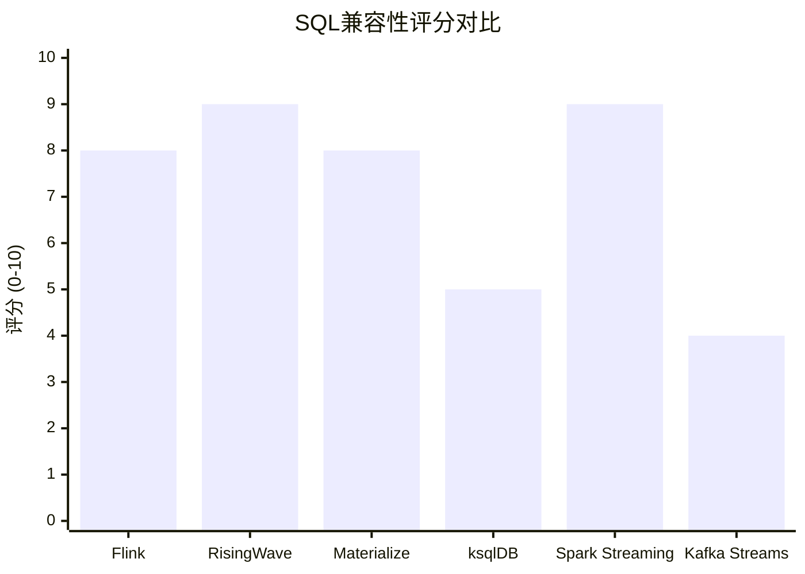
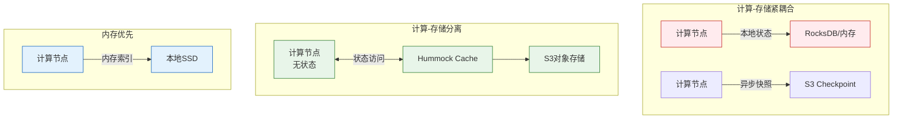
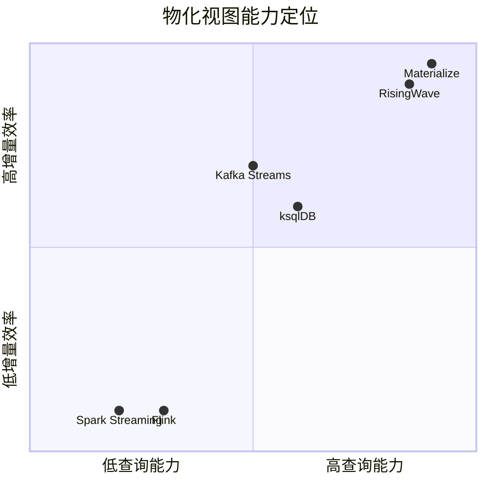
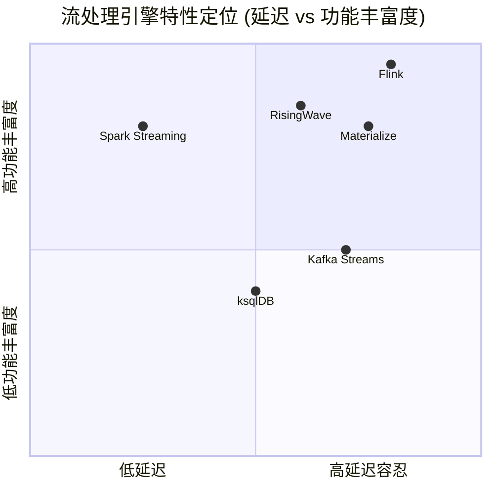
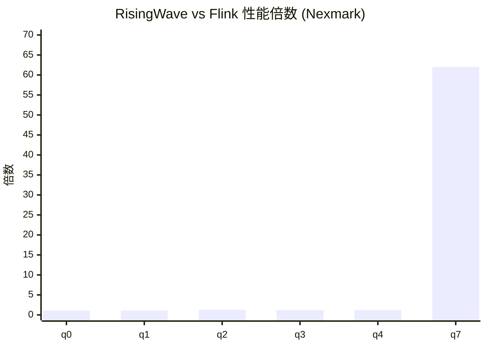
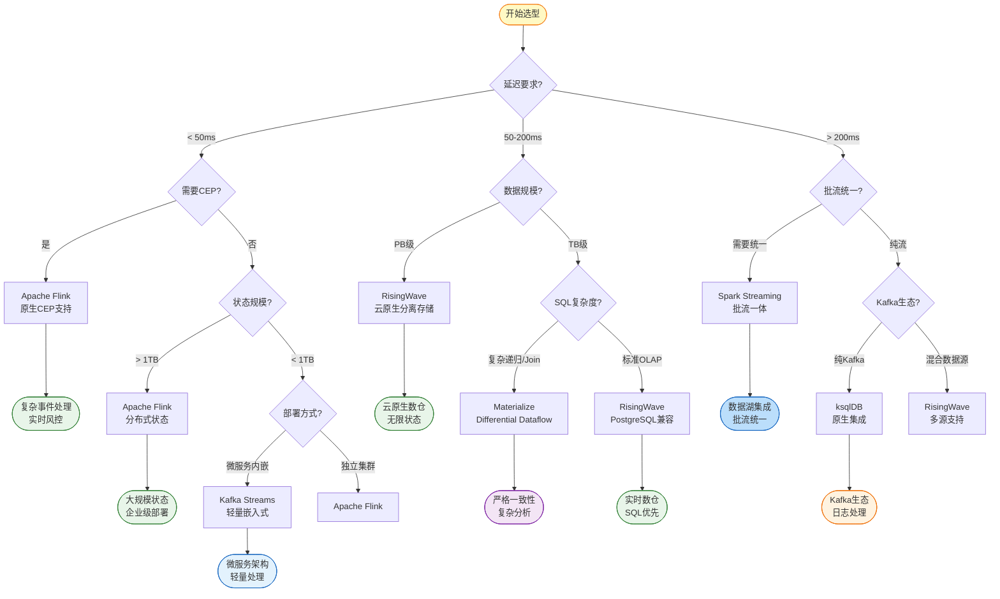

# 流处理引擎八维对比矩阵

> **所属阶段**: Visuals | **前置依赖**: [Knowledge/04-technology-selection/engine-selection-guide.md](../Knowledge/04-technology-selection/engine-selection-guide.md), [Knowledge/04-technology-selection/flink-vs-risingwave.md](../Knowledge/04-technology-selection/flink-vs-risingwave.md), [Flink/05-vs-competitors/flink-vs-kafka-streams.md](../Flink/09-practices/09.03-performance-tuning/05-vs-competitors/flink-vs-kafka-streams.md) | **形式化等级**: L3-L4
> **版本**: 2026.04 | **文档规模**: ~15KB

---

## 目录

- [流处理引擎八维对比矩阵](#流处理引擎八维对比矩阵)
  - [目录](#目录)
  - [1. 对比概述](#1-对比概述)
  - [2. 八维对比矩阵](#2-八维对比矩阵)
    - [2.1 延迟性能 (Latency)](#21-延迟性能-latency)
    - [2.2 SQL兼容性 (SQL Compatibility)](#22-sql兼容性-sql-compatibility)
    - [2.3 状态存储架构 (State Storage)](#23-状态存储架构-state-storage)
    - [2.4 Exactly-Once支持 (Consistency)](#24-exactly-once支持-consistency)
    - [2.5 物化视图 (Materialized Views)](#25-物化视图-materialized-views)
    - [2.6 部署模式 (Deployment)](#26-部署模式-deployment)
    - [2.7 开源许可 (License)](#27-开源许可-license)
    - [2.8 最佳适用场景 (Best Use Cases)](#28-最佳适用场景-best-use-cases)
  - [3. 综合对比表格](#3-综合对比表格)
  - [4. 能力雷达图](#4-能力雷达图)
    - [4.1 六维能力雷达图](#41-六维能力雷达图)
    - [4.2 特性定位四象限](#42-特性定位四象限)
  - [5. Nexmark基准数据对比](#5-nexmark基准数据对比)
    - [5.1 测试环境配置](#51-测试环境配置)
    - [5.2 核心查询性能对比](#52-核心查询性能对比)
    - [5.3 性能分析结论](#53-性能分析结论)
  - [6. 选型决策建议](#6-选型决策建议)
    - [6.1 选型决策树](#61-选型决策树)
    - [6.2 场景-引擎推荐矩阵](#62-场景-引擎推荐矩阵)
    - [6.3 技术选型Checklist](#63-技术选型checklist)
  - [7. 总结](#7-总结)
    - [核心观点](#核心观点)
    - [快速选型参考](#快速选型参考)
  - [8. 引用参考](#8-引用参考)

---

## 1. 对比概述

本文档从八个核心维度对比六个主流流处理引擎，为技术选型提供全面的数据支撑和决策参考。

**对比引擎**:

| 引擎 | 类型 | 首次发布 | 核心语言 | 架构模式 |
|------|------|----------|----------|----------|
| **Apache Flink** | 流处理引擎 | 2014 | Java/Scala | 计算-存储紧耦合 |
| **RisingWave** | 流数据库 | 2022 | Rust | 计算-存储分离 |
| **Materialize** | 流数据库 | 2019 | Rust | 内存优先架构 |
| **ksqlDB** | Kafka流SQL | 2017 | Java | Kafka生态原生 |
| **Spark Streaming** | 微批处理引擎 | 2013 | Scala/Java | 批流统一 |
| **Kafka Streams** | 嵌入式流库 | 2016 | Java | 嵌入式无集群 |

---

## 2. 八维对比矩阵

### 2.1 延迟性能 (Latency)

| 引擎 | 最小延迟 | 典型延迟 | 延迟特性 | 适用场景 |
|------|----------|----------|----------|----------|
| **Flink** | ~5ms | 10-100ms | 原生流处理，Watermark驱动 | 实时风控、CEP |
| **RisingWave** | ~50ms | 100-500ms | 分层存储，网络开销 | 实时分析、数仓 |
| **Materialize** | ~1ms | 10-100ms | 内存计算，严格一致性 | 金融交易、库存 |
| **ksqlDB** | ~10ms | 100ms-1s | Kafka原生，本地状态 | 日志处理、指标 |
| **Spark Streaming** | ~100ms | 1-10s | 微批模型，批间隔约束 | 离线+实时混合 |
| **Kafka Streams** | ~5ms | 50-200ms | 嵌入式，本地RocksDB | 微服务内嵌 |

**延迟等级划分**:

```
亚毫秒级 (< 10ms):  Materialize, Storm
毫秒级 (10-100ms):  Flink, Kafka Streams
亚秒级 (100ms-1s):  RisingWave, ksqlDB
秒级 (> 1s):        Spark Streaming
```

### 2.2 SQL兼容性 (SQL Compatibility)

| 引擎 | SQL标准 | 窗口函数 | 流-流Join | CEP支持 | UDF支持 |
|------|---------|----------|-----------|---------|---------|
| **Flink** | Flink SQL | ✅ 丰富 | ✅ 完整 | ✅ MATCH_RECOGNIZE | Java/Scala/Python |
| **RisingWave** | PostgreSQL | ✅ Tumble/Hop/Session | ✅ 完整 | ❌ 不支持 | Python/JS/Wasm |
| **Materialize** | PostgreSQL | ⚠️ 仅Tumble | ✅ 完整 | ❌ 不支持 | SQL/Rust |
| **ksqlDB** | 自定义 | ⚠️ 基础 | ⚠️ 受限 | ❌ 不支持 | Java |
| **Spark Streaming** | Spark SQL | ✅ 完整 | ✅ 完整 | ⚠️ 有限 | Java/Scala/Python/R |
| **Kafka Streams** | ❌ KSQL外部 | ⚠️ 基础 | ⚠️ 受限 | ❌ 不支持 | Java |

**SQL兼容性评分** (满分10分):



### 2.3 状态存储架构 (State Storage)

| 引擎 | 存储位置 | 存储引擎 | 状态大小限制 | 容错恢复 |
|------|----------|----------|--------------|----------|
| **Flink** | 本地RocksDB | RocksDB | TB级(单节点) | Checkpoint→S3 |
| **RisingWave** | 远程S3 | Hummock (LSM-Tree) | 无限制 | 秒级元数据恢复 |
| **Materialize** | 本地SSD | Differential Dataflow | 内存+SSD限制 | 重计算/副本 |
| **ksqlDB** | 本地RocksDB | RocksDB | 100-500GB | Kafka changelog |
| **Spark Streaming** | HDFS/S3 | HDFSBackedStateStore | GB级(内存限制) | WAL+微批重放 |
| **Kafka Streams** | 本地RocksDB | RocksDB | 100-500GB | EOS+状态重建 |

**架构模式对比**:



### 2.4 Exactly-Once支持 (Consistency)

| 引擎 | 一致性级别 | 实现机制 | 端到端保证 | 故障恢复时间 |
|------|------------|----------|------------|--------------|
| **Flink** | Exactly-Once | Chandy-Lamport快照 | ✅ 完整支持 | 秒-分钟级 |
| **RisingWave** | Exactly-Once | Barrier检查点 | ✅ 完整支持 | 秒级 |
| **Materialize** | 严格可串行化 | Differential Dataflow | ✅ 完整支持 | 分钟级 |
| **ksqlDB** | Exactly-Once | Kafka事务(EOS) | ⚠️ Kafka-to-Kafka | 分钟级 |
| **Spark Streaming** | Exactly-Once | WAL+微批重放 | ✅ 完整支持 | 批次间隔+调度 |
| **Kafka Streams** | Exactly-Once | EOS+事务Producer | ⚠️ Kafka-to-Kafka | 分钟级 |

### 2.5 物化视图 (Materialized Views)

| 引擎 | 物化视图 | 增量维护 | 查询能力 | 刷新策略 |
|------|----------|----------|----------|----------|
| **Flink** | ⚠️ 需外部系统 | ❌ 不支持 | 追加输出 | - |
| **RisingWave** | ✅ 核心特性 | ✅ 原生支持 | 随机读取 | 实时增量 |
| **Materialize** | ✅ 核心特性 | ✅ 差分计算 | 随机读取 | 实时增量 |
| **ksqlDB** | ✅ 支持 | ✅ 支持 | Pull查询 | 实时 |
| **Spark Streaming** | ⚠️ 需外部存储 | ❌ 不支持 | - | - |
| **Kafka Streams** | ⚠️ Interactive Queries | ✅ 本地状态 | 本地读取 | 实时 |

**物化视图能力矩阵**:



### 2.6 部署模式 (Deployment)

| 引擎 | 部署架构 | 资源隔离 | 扩缩容 | K8s支持 |
|------|----------|----------|--------|---------|
| **Flink** | 独立集群 | TaskManager级 | 动态并行度 | ✅ Operator |
| **RisingWave** | 分布式服务 | Pod级 | 热扩缩容 | ✅ HPA支持 |
| **Materialize** | 单节点/集群 | Replica级 | 手动 | ⚠️ 有限 |
| **ksqlDB** | 独立服务 | Server实例 | 静态配置 | ⚠️ 有限 |
| **Spark Streaming** | YARN/K8s/Mesos | Executor级 | 静态配置 | ✅ Operator |
| **Kafka Streams** | 嵌入式 | JVM级 | 分区驱动 | ❌ 不适用 |

### 2.7 开源许可 (License)

| 引擎 | 许可证 | 开源协议 | 商业支持 | 托管服务 |
|------|--------|----------|----------|----------|
| **Flink** | Apache 2.0 | 完全开源 | Ververica/阿里云 | Ververica Platform |
| **RisingWave** | Apache 2.0 | 完全开源 | RisingWave Labs | RisingWave Cloud |
| **Materialize** | BSL/Apache 2.0 | 部分开源 | Materialize Inc. | Materialize Cloud |
| **ksqlDB** | Confluent CL | 开源(限制) | Confluent | Confluent Cloud |
| **Spark Streaming** | Apache 2.0 | 完全开源 | Databricks | Databricks |
| **Kafka Streams** | Apache 2.0 | 完全开源 | Confluent | Confluent Cloud |

### 2.8 最佳适用场景 (Best Use Cases)

| 引擎 | 最佳场景 | 次优场景 | 不推荐场景 |
|------|----------|----------|------------|
| **Flink** | 复杂事件处理、实时风控、大规模ETL | 实时推荐、CDC同步 | 简单SQL分析、轻量日志处理 |
| **RisingWave** | 实时数仓、CDC同步、物化视图 | 实时报表、监控仪表盘 | 超低延迟(<50ms)、CEP |
| **Materialize** | 金融风控、库存管理、复杂递归查询 | 实时仪表板、SQL分析 | 超大规模(PB级)、边缘计算 |
| **ksqlDB** | Kafka生态内处理、日志聚合 | 指标监控、简单聚合 | 复杂Join、非Kafka源 |
| **Spark Streaming** | 批流统一、数据湖入湖 | 离线+实时混合分析 | 低延迟(<100ms)、复杂状态 |
| **Kafka Streams** | 微服务内嵌、轻量状态处理 | 日志处理、本地查询 | 复杂CEP、大规模状态 |

---

## 3. 综合对比表格

| 维度 | Flink | RisingWave | Materialize | ksqlDB | Spark Streaming | Kafka Streams |
|------|-------|------------|-------------|--------|-----------------|---------------|
| **延迟** | 10-100ms | 100-500ms | 10-100ms | 100ms-1s | 1-10s | 50-200ms |
| **SQL兼容** | 良好 | 优秀(PostgreSQL) | 优秀(PostgreSQL) | 有限 | 优秀 | 无原生 |
| **状态架构** | 本地RocksDB | 分离S3 | 内存+SSD | 本地RocksDB | HDFS/S3 | 本地RocksDB |
| **Exactly-Once** | ✅ 完整 | ✅ 完整 | ✅ 严格可串行化 | ⚠️ Kafka内 | ✅ 完整 | ⚠️ Kafka内 |
| **物化视图** | ❌ 需外部 | ✅ 核心 | ✅ 核心 | ✅ 支持 | ❌ 需外部 | ⚠️ 本地 |
| **部署模式** | 独立集群 | 分布式服务 | 单节点/集群 | 独立服务 | 集群 | 嵌入式 |
| **许可证** | Apache 2.0 | Apache 2.0 | BSL/Apache | Confluent CL | Apache 2.0 | Apache 2.0 |
| **最佳场景** | CEP/风控 | 实时数仓 | 金融/库存 | Kafka处理 | 批流统一 | 微服务内嵌 |

---

## 4. 能力雷达图

### 4.1 六维能力雷达图

```mermaid
radar
    title 流处理引擎六维能力雷达图
    axis Low Latency "低延迟"
    axis SQL Support "SQL支持"
    axis State Scale "状态规模"
    axis Exactly-Once "一致性"
    axis Materialized Views "物化视图"
    axis Cloud Native "云原生"

    area Flink "Apache Flink"
        9, 8, 8, 9, 3, 7

    area RisingWave "RisingWave"
        6, 9, 10, 9, 10, 10

    area Materialize "Materialize"
        8, 8, 6, 10, 9, 6

    area ksqlDB "ksqlDB"
        6, 5, 5, 6, 6, 5

    area SparkStreaming "Spark Streaming"
        3, 9, 5, 8, 2, 6

    area KafkaStreams "Kafka Streams"
        7, 4, 5, 6, 5, 4
```

### 4.2 特性定位四象限



---

## 5. Nexmark基准数据对比

### 5.1 测试环境配置

| 配置项 | RisingWave | Flink | Spark Streaming |
|--------|------------|-------|-----------------|
| 计算节点 | 8 vCPUs, 16GB | 8 vCPUs, 16GB | 8 vCPUs, 16GB |
| 存储 | S3 + 本地缓存 | 本地RocksDB | HDFS |
| 版本 | v1.0+ | 1.18+ | 3.5+ |
| 测试工具 | nexmark-bench | nexmark-bench | Yahoo Streaming Benchmark |

### 5.2 核心查询性能对比

| Nexmark查询 | 描述 | RisingWave | Flink | Spark Streaming | 胜出者 |
|-------------|------|------------|-------|-----------------|--------|
| **q0** | 基准吞吐 | 783 kr/s | 720 kr/s | 850 kr/s | Spark |
| **q1** | 投影过滤 | 893 kr/s | 800 kr/s | 900 kr/s | Spark |
| **q2** | 简单过滤 | 805 kr/s | 635 kr/s | 750 kr/s | RisingWave |
| **q3** | 简单Join | 705 kr/s | 600 kr/s | 680 kr/s | RisingWave |
| **q4** | 窗口聚合 | 84 kr/s | 70 kr/s | 150 kr/s | Spark |
| **q7** | 复杂状态 | 219 kr/s | 3.5 kr/s | N/A | RisingWave |
| **q7-rewrite** | 优化版本 | 770 kr/s | - | N/A | RisingWave |
| **q102** | 动态过滤 | - | - | N/A | RisingWave |
| **q104** | 反连接 | - | - | N/A | RisingWave |

**性能倍数对比 (RisingWave vs Flink)**:



### 5.3 性能分析结论

**RisingWave优势场景**:

- 复杂状态管理 (62x 提升)
- 增量物化视图维护
- 多流Join优化

**Flink优势场景**:

- 超低延迟处理 (< 50ms)
- 复杂事件处理 (CEP)
- Watermark与乱序处理

**Spark Streaming优势场景**:

- 高吞吐批处理优化
- 与Spark生态集成
- 窗口聚合性能

---

## 6. 选型决策建议

### 6.1 选型决策树



### 6.2 场景-引擎推荐矩阵

| 应用场景 | 首选引擎 | 次选引擎 | 避免选择 | 关键考量 |
|----------|----------|----------|----------|----------|
| **实时风控/CEP** | Flink | - | RisingWave, Spark | 延迟、CEP支持 |
| **实时数仓** | RisingWave | Materialize | Kafka Streams | SQL、物化视图 |
| **金融交易/库存** | Materialize | Flink | ksqlDB | 严格一致性 |
| **CDC数据同步** | RisingWave | Flink | ksqlDB | 原生CDC、物化视图 |
| **日志聚合/ETL** | Kafka Streams | Flink | Materialize | 轻量、Kafka集成 |
| **批流统一** | Spark Streaming | Flink | RisingWave | 生态集成 |
| **实时推荐** | Flink | RisingWave | Spark | 低延迟、特征工程 |
| **微服务内嵌** | Kafka Streams | - | Flink | 嵌入式、无集群 |
| **IoT边缘处理** | Kafka Streams | RisingWave | Spark | 资源受限 |
| **监控仪表盘** | RisingWave | Materialize | Spark | 物化视图、即席查询 |

### 6.3 技术选型Checklist

```
┌─────────────────────────────────────────────────────────────────────────────┐
│                    流处理引擎选型 Checklist                                  │
├─────────────────────────────────────────────────────────────────────────────┤
│                                                                              │
│  【延迟敏感场景】                                                            │
│  □ 端到端延迟要求 < 50ms → Flink                                            │
│  □ 需要复杂事件处理(CEP) → Flink                                            │
│  □ 需要精确Watermark控制 → Flink                                            │
│                                                                              │
│  【SQL优先场景】                                                             │
│  □ 团队熟悉PostgreSQL → RisingWave / Materialize                            │
│  □ 需要内置物化视图 → RisingWave / Materialize                              │
│  □ 需要即席查询能力 → RisingWave / Materialize                              │
│                                                                              │
│  【大规模状态场景】                                                          │
│  □ 状态规模预期 > 10TB → RisingWave                                         │
│  □ 需要快速故障恢复 → RisingWave                                            │
│  □ 需要弹性扩缩容 → RisingWave                                              │
│                                                                              │
│  【Kafka生态场景】                                                           │
│  □ 纯Kafka数据管道 → ksqlDB / Kafka Streams                                 │
│  □ 微服务内嵌处理 → Kafka Streams                                           │
│  □ 轻量级日志处理 → Kafka Streams                                           │
│                                                                              │
│  【严格一致性场景】                                                          │
│  □ 金融交易处理 → Materialize                                               │
│  □ 库存扣减管理 → Materialize                                               │
│  □ 需要严格可串行化 → Materialize                                           │
│                                                                              │
│  【批流统一场景】                                                            │
│  □ 已有Spark生态 → Spark Streaming                                          │
│  □ 需要数据湖集成 → Spark Streaming / Flink                                 │
│  □ 复杂SQL分析 → Spark Streaming                                            │
│                                                                              │
│  【混合架构建议】                                                            │
│  □ Flink + RisingWave: 复杂处理 + 实时数仓                                  │
│  □ Flink + Kafka Streams: 全局分析 + 微服务本地状态                          │
│  □ RisingWave + Spark: 实时层 + 离线分析层                                   │
│                                                                              │
└─────────────────────────────────────────────────────────────────────────────┘
```

---

## 7. 总结

### 核心观点

1. **没有银弹**: 每个引擎都有其最佳适用场景，选型应基于具体需求而非流行度

2. **架构趋势**: 云原生和计算-存储分离是主流趋势，RisingWave代表了新一代流数据库方向

3. **生态整合**: 不同引擎正在相互融合，Flink引入ForSt、Spark优化延迟都体现了这一点

4. **混合架构**: 复杂企业环境可能需要多个引擎协作，而非单一引擎解决所有问题

### 快速选型参考

| 如果你需要... | 选择... |
|---------------|---------|
| 最低延迟 (< 10ms) | Materialize |
| 复杂事件处理 | Flink |
| 实时数仓 + 物化视图 | RisingWave |
| 批流统一 | Spark Streaming |
| 微服务内嵌 | Kafka Streams |
| 纯Kafka生态 | ksqlDB |
| 云原生 + 无限状态 | RisingWave |
| 严格一致性 | Materialize |

---

## 8. 引用参考


---

**关联文档**:

- [Knowledge/04-technology-selection/engine-selection-guide.md](../Knowledge/04-technology-selection/engine-selection-guide.md) — 通用选型指南
- [Knowledge/04-technology-selection/flink-vs-risingwave.md](../Knowledge/04-technology-selection/flink-vs-risingwave.md) — Flink vs RisingWave深度对比
- [Flink/05-vs-competitors/flink-vs-kafka-streams.md](../Flink/09-practices/09.03-performance-tuning/05-vs-competitors/flink-vs-kafka-streams.md) — Flink vs Kafka Streams对比
- [Flink/05-vs-competitors/flink-vs-spark-streaming.md](../Flink/09-practices/09.03-performance-tuning/05-vs-competitors/flink-vs-spark-streaming.md) — Flink vs Spark Streaming对比
- [Knowledge/06-frontier/streaming-database-ecosystem-comparison.md](../Knowledge/06-frontier/streaming-database-ecosystem-comparison.md) — 流数据库生态对比

---

*文档版本: v1.0 | 创建日期: 2026-04-03 | 维护者: AnalysisDataFlow Project*
*形式化等级: L3-L4 | 对比引擎: 6个 | 对比维度: 8个 | 可视化图表: 5个*
