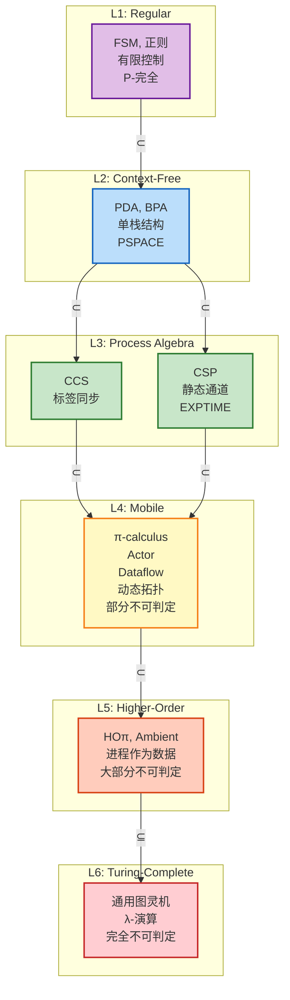
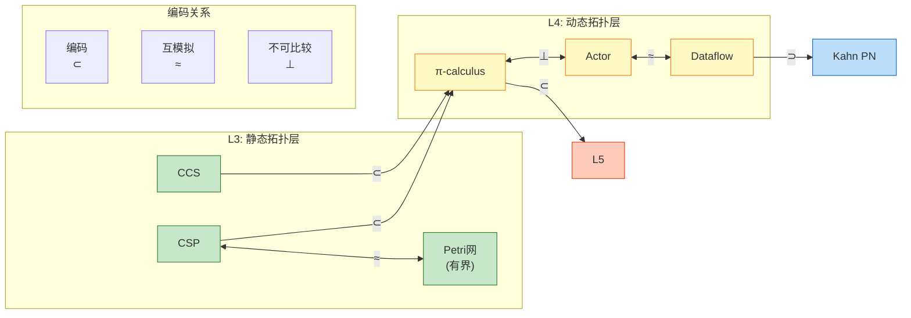
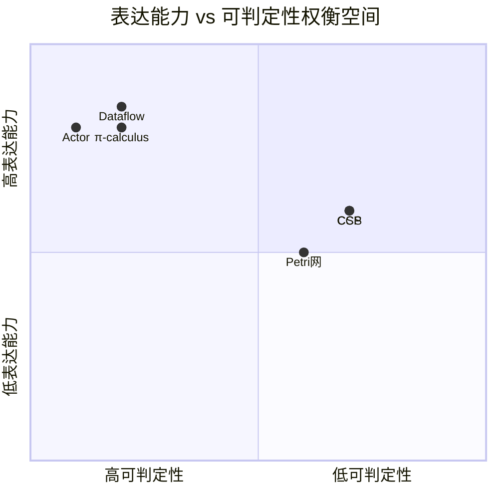
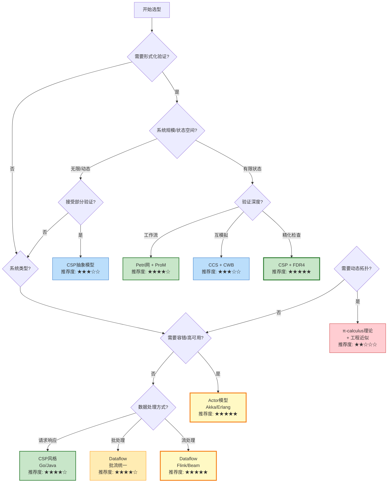

# 计算模型六维对比矩阵 (Computational Models 6-Dimensional Comparison Matrix)

> **所属阶段**: Struct/Visuals | **前置依赖**: [../Struct/01-foundation/](../Struct/01-foundation/), [../Struct/03-relationships/03.03-expressiveness-hierarchy.md](../Struct/03-relationships/03.03-expressiveness-hierarchy.md) | **形式化等级**: L2-L6
> **版本**: v1.0 | **更新日期**: 2026-04-03

---

## 目录

- [计算模型六维对比矩阵 (Computational Models 6-Dimensional Comparison Matrix)](#计算模型六维对比矩阵-computational-models-6-dimensional-comparison-matrix)
  - [目录](#目录)
  - [1. 概念定义 (Definitions)](#1-概念定义-definitions)
    - [Def-V-01-01. 六维对比框架](#def-v-01-01-六维对比框架)
    - [Def-V-01-02. 模型覆盖范围](#def-v-01-02-模型覆盖范围)
  - [2. 核心对比表格 (Core Comparison Matrix)](#2-核心对比表格-core-comparison-matrix)
    - [表 2.1: 通信方式对比](#表-21-通信方式对比)
    - [表 2.2: 表达能力层次对比](#表-22-表达能力层次对比)
    - [表 2.3: 可判定性对比](#表-23-可判定性对比)
    - [表 2.4: 适用场景对比](#表-24-适用场景对比)
    - [表 2.5: 工具支持对比](#表-25-工具支持对比)
    - [表 2.6: 学习曲线对比](#表-26-学习曲线对比)
  - [3. 综合对比矩阵 (Comprehensive Matrix)](#3-综合对比矩阵-comprehensive-matrix)
  - [4. 可视化分析 (Visualizations)](#4-可视化分析-visualizations)
    - [图 4.1: 模型特性雷达图](#图-41-模型特性雷达图)
    - [图 4.2: 表达能力层次层次图](#图-42-表达能力层次层次图)
    - [图 4.3: 编码关系图](#图-43-编码关系图)
    - [图 4.4: 可判定性与表达能力权衡图](#图-44-可判定性与表达能力权衡图)
  - [5. 模型选择建议 (Model Selection Guide)](#5-模型选择建议-model-selection-guide)
    - [5.1 决策树](#51-决策树)
    - [5.2 场景匹配建议](#52-场景匹配建议)
  - [6. 引用参考 (References)](#6-引用参考-references)
  - [关联文档](#关联文档)
    - [上游依赖](#上游依赖)
    - [同层关联](#同层关联)
    - [下游应用](#下游应用)

---

## 1. 概念定义 (Definitions)

### Def-V-01-01. 六维对比框架

本矩阵采用六个核心维度对并发计算模型进行系统性对比：

| 维度 | 符号 | 定义 | 取值范围 |
|------|------|------|----------|
| **通信方式** | $D_{comm}$ | 模型中并发单元之间的交互机制 | 同步/异步/数据流/令牌传递 |
| **表达能力层次** | $D_{expr}$ | 模型在六层表达能力层次中的位置 | L1-L6 |
| **可判定性** | $D_{deci}$ | 核心验证问题的计算复杂度 | P-完全/PSPACE/EXPTIME/不可判定 |
| **适用场景** | $D_{scen}$ | 模型最适合的应用领域 | 分布式系统/流处理/形式化验证等 |
| **工具支持** | $D_{tool}$ | 可用的形式化验证与开发工具 | FDR/CPN Tools/Flink/Akka等 |
| **学习曲线** | $D_{learn}$ | 掌握模型所需的学习投入 | 平缓/中等/陡峭/非常陡峭 |

**维度间关系**：

$$
D_{expr}  imes D_{deci} \to \text{Trade-off} \quad \text{(表达能力与可判定性负相关)}
$$

### Def-V-01-02. 模型覆盖范围

本矩阵覆盖六种核心并发计算模型：

| 模型 | 符号 | 核心特征 | 代表实现 |
|------|------|----------|----------|
| **CCS** | $\mathcal{M}_{CCS}$ | 标签化同步、静态通道 | Concurrency Workbench |
| **CSP** | $\mathcal{M}_{CSP}$ | 同步通信、失败/迹语义 | FDR4, Go Channels |
| **π-calculus** | $\mathcal{M}_{\pi}$ | 名字传递、动态拓扑 | Pict, Nomadic Pict |
| **Actor** | $\mathcal{M}_{Actor}$ | 异步消息、监督树 | Akka, Erlang/OTP |
| **Dataflow** | $\mathcal{M}_{DF}$ | 数据驱动、窗口语义 | Apache Flink, Beam |
| **Petri网** | $\mathcal{M}_{PN}$ | 令牌传递、资源建模 | CPN Tools, ProM |

---

## 2. 核心对比表格 (Core Comparison Matrix)

### 表 2.1: 通信方式对比

| 模型 | 同步/异步 | 通信介质 | 缓冲策略 | 通道动态性 | 通信原语 |
|------|-----------|----------|----------|------------|----------|
| **CCS** | 同步 | 标签化通道 | 无缓冲 | 静态 | $\alpha.P$ (前缀), $P \mid Q$ (并行) |
| **CSP** | 同步 | 命名事件 | 无缓冲(纯CSP) | 静态 | $a \to P$ (前缀), $\square$ (外部选择) |
| **π-calculus** | 同步 | 名字通道 | 无缓冲 | 动态 | $a(x).P$ (输入), $\bar{a}\langle b \rangle.P$ (输出) |
| **Actor** | 异步 | Mailbox | 有界/无界队列 | 动态 | $send(\alpha, v)$, $receive$ |
| **Dataflow** | 数据驱动 | 数据流边 | 网络缓冲区 | 静态拓扑 | Source, Map, Window, Sink |
| **Petri网** | 令牌驱动 | 库所/变迁 | 库所容量 | 静态结构 | $t$ (变迁触发), $M$ (标记) |

**关键差异**：

- **同步 vs 异步**：CSP/CCS/π 采用同步握手；Actor 采用异步解耦；Dataflow 采用数据可用性触发
- **通道动态性**：π 和 Actor 支持运行时创建新通道/地址；CSP 和 Petri 网结构静态

### 表 2.2: 表达能力层次对比

| 模型 | 表达能力层次 | 核心资源 | 分离特征 | 形式化等级 |
|------|-------------|----------|----------|------------|
| **CCS** | L3 | 静态命名 + 同步通信 | 并行交错语义 | L3 |
| **CSP** | L3 | 静态事件名 + 精化关系 | 失败/迹语义区分 | L3 |
| **π-calculus** | L4 | 动态名字创建 + 传递 | $(\nu a)$ 移动性 | L4 |
| **Actor** | L4-L5 | 动态地址 + 异步消息 | 监督树容错 | L4-L5 |
| **Dataflow** | L4-L5 | 数据流图 + 时间语义 | Watermark + 窗口 | L4-L5 |
| **Petri网** | L2-L4 | 令牌 + 变迁触发 | 真并发(非交错) | L2-L4 |

**层次关系**：

$$
\text{Petri}_{L2} \subset \text{CCS}_{L3} \perp \text{CSP}_{L3} \subset \text{\pi}_{L4} \perp \text{Actor}_{L4} \approx \text{Dataflow}_{L4}
$$

### 表 2.3: 可判定性对比

| 模型 | 强互模拟 | 可达性 | 活性 | 死锁检测 | 复杂度类 |
|------|----------|--------|------|----------|----------|
| **CCS** | PSPACE-完全 | 可判定 | 可判定 | 可判定 | PSPACE |
| **CSP** | 失败语义可判定 | 迹包含可判定 | 发散语义可判定 | FDR可检测 | PSPACE |
| **π-calculus** | 不可判定 | 不可判定 | 不可判定 | 不可判定 | 不可判定 |
| **Actor** | 不可判定 | 不可判定 | 不可判定 | 不可判定 | 不可判定 |
| **Dataflow** | 不可判定 | 不可判定 | 不可判定 | 部分可判定 | 不可判定 |
| **Petri网** | 可判定(有界) | Ackermann-完全 | 可判定(有界) | 可判定(有界) | Ackermann |

**可判定性递减律**：

$$
L_3 \supset \text{Decidable} \supset L_4 \supset \text{Undecidable}
$$

### 表 2.4: 适用场景对比

| 模型 | 主要场景 | 典型应用 | 不适用场景 |
|------|----------|----------|------------|
| **CCS** | 并发系统形式化建模 | 协议验证、并发算法分析 | 动态拓扑系统 |
| **CSP** | 形式化验证、系统编程 | 安全关键系统、Go并发 | 大规模分布式容错 |
| **π-calculus** | 移动计算理论研究 | 服务发现、P2P网络理论 | 工业级工程实现 |
| **Actor** | 高容错分布式系统 | 电信系统、微服务、IoT | 流处理时序语义 |
| **Dataflow** | 大规模流处理 | 实时ETL、流分析、CEP | 细粒度同步控制 |
| **Petri网** | 工作流、资源建模 | 业务流程、制造系统 | 动态结构系统 |

### 表 2.5: 工具支持对比

| 模型 | 形式化工具 | 工业实现 | 验证能力 | 模型检测 | 类型系统 |
|------|------------|----------|----------|----------|----------|
| **CCS** | Concurrency Workbench | 无原生实现 | 互模拟检测 | 有限 | 无 |
| **CSP** | FDR4, PAT | Go Channels | 死锁/精化检查 | 强大 | 无 |
| **π-calculus** | 类型检查器 | Pict, Nomadic Pict | 会话类型验证 | 有限 | 会话类型 |
| **Actor** | 类型系统(Akka Typed) | Akka, Erlang/OTP | 监督树分析 | 运行时 | Akka Typed |
| **Dataflow** | Flink验证框架 | Apache Flink, Beam | Checkpoint验证 | 有限 | 流类型签名 |
| **Petri网** | CPN Tools, ProM, Woflan | 工作流引擎 | 可达性/活性 | 状态空间分析 | 颜色类型 |

### 表 2.6: 学习曲线对比

| 模型 | 入门难度 | 精通难度 | 数学基础要求 | 工程实践门槛 | 学习资源 |
|------|----------|----------|--------------|--------------|----------|
| **CCS** | 高 | 非常高 | 进程代数、互模拟 | 低(理论为主) | 学术论文为主 |
| **CSP** | 高 | 高 | 形式语义、精化关系 | 中(FDR工具) | Hoare经典书籍 |
| **π-calculus** | 非常高 | 极高 | 高阶类型、移动性 | 低(理论为主) | Sangiorgi专著 |
| **Actor** | 中 | 高 | 并发理论基础 | 低(框架丰富) | Erlang/OTP文档 |
| **Dataflow** | 高 | 高 | 时间语义、窗口理论 | 中(Flink等) | Flink文档、Akidau论文 |
| **Petri网** | 中 | 中 | 图论、线性代数 | 低(工具友好) | Reisig教材 |

---

## 3. 综合对比矩阵 (Comprehensive Matrix)

```
┌─────────────────────────────────────────────────────────────────────────────────────────────────────┐
│                          计算模型六维综合对比矩阵                                                      │
├──────────────┬──────────┬──────────┬──────────────┬──────────────────┬──────────────┬──────────────┤
│     模型     │ 通信方式 │ 表达能力 │   可判定性   │    适用场景      │   工具支持   │  学习曲线    │
├──────────────┼──────────┼──────────┼──────────────┼──────────────────┼──────────────┼──────────────┤
│     CCS      │ 同步     │   L3     │ PSPACE-完全  │ 并发系统建模     │ CWB          │  陡峭        │
│              │ 标签匹配 │ 静态通道 │ 互模拟可判定 │ 协议验证         │ (有限)       │              │
├──────────────┼──────────┼──────────┼──────────────┼──────────────────┼──────────────┼──────────────┤
│     CSP      │ 同步     │   L3     │ PSPACE-完全  │ 形式化验证       │ FDR4         │  陡峭        │
│              │ 事件握手 │ 静态命名 │ 死锁可检测   │ 系统编程         │ Go           │              │
├──────────────┼──────────┼──────────┼──────────────┼──────────────────┼──────────────┼──────────────┤
│  π-calculus  │ 同步     │   L4     │  不可判定    │ 移动计算理论     │ Pict         │ 非常陡峭     │
│              │ 名字传递 │ 动态拓扑 │              │ 动态连接         │ (有限)       │              │
├──────────────┼──────────┼──────────┼──────────────┼──────────────────┼──────────────┼──────────────┤
│    Actor     │ 异步     │   L4     │  不可判定    │ 高容错分布式     │ Akka         │  中等        │
│              │ 消息传递 │ 动态地址 │              │ 电信/微服务      │ Erlang/OTP   │              │
├──────────────┼──────────┼──────────┼──────────────┼──────────────────┼──────────────┼──────────────┤
│   Dataflow   │ 数据驱动 │  L4-L5   │  不可判定    │ 大规模流处理     │ Flink        │  陡峭        │
│              │ 流依赖   │ 时间语义 │ 部分可判定   │ 实时分析         │ Beam         │              │
├──────────────┼──────────┼──────────┼──────────────┼──────────────────┼──────────────┼──────────────┤
│   Petri网    │ 令牌驱动 │  L2-L4   │Ackermann-完全│ 工作流建模       │ CPN Tools    │  中等        │
│              │ 资源竞争 │ 真并发   │ 可达性可判定 │ 业务流程         │ ProM         │              │
└──────────────┴──────────┴──────────┴──────────────┴──────────────────┴──────────────┴──────────────┘
```

---

## 4. 可视化分析 (Visualizations)

### 图 4.1: 模型特性雷达图

```mermaid
radarChart
    title 并发计算模型六维特性雷达图
    axis Formality "形式化程度"
    axis Decidability "可判定性"
    axis Scalability "可扩展性"
    axis FaultTolerance "容错能力"
    axis Expressiveness "表达能力"
    axis ToolSupport "工具支持"

    series CCS "CCS" [0.9, 0.7, 0.4, 0.3, 0.6, 0.4]
    series CSP "CSP" [0.9, 0.7, 0.5, 0.4, 0.6, 0.8]
    series Pi "π-calculus" [0.9, 0.2, 0.6, 0.5, 0.8, 0.3]
    series Actor "Actor" [0.6, 0.1, 0.9, 0.95, 0.8, 0.9]
    series Dataflow "Dataflow" [0.7, 0.2, 0.95, 0.7, 0.85, 0.8]
    series Petri "Petri网" [0.8, 0.6, 0.5, 0.4, 0.5, 0.7]
```

**图说明**：

- **形式化程度**：CSP/CCS/π 最高（完整进程代数语义）；Actor 相对较低（工程实现为主）
- **可判定性**：L3 模型(CCS/CSP/Petri)可判定性高；L4+ 模型可判定性显著下降
- **可扩展性**：Dataflow 和 Actor 支持水平扩展；Petri 网状态空间爆炸限制扩展
- **容错能力**：Actor 原生支持监督树；Dataflow 通过 Checkpoint 支持容错
- **表达能力**：Dataflow 和 π-calculus 表达能力最强；Petri 网受限于静态结构
- **工具支持**：Actor (Akka/Erlang) 和 Dataflow (Flink) 工业工具最成熟

### 图 4.2: 表达能力层次层次图



**图说明**：

- 六层严格包含链：$L_1 \subset L_2 \subset L_3 \subset L_4 \subset L_5 \subseteq L_6$
- CCS 与 CSP 同属 L3，但语义不可比较（$\perp$）
- Actor、π-calculus、Dataflow 同属 L4，但表达能力侧重不同
- 颜色从紫色（可判定）渐变到红色（不可判定）

### 图 4.3: 编码关系图



**编码关系详解**：

| 关系 | 源模型 | 目标模型 | 说明 |
|------|--------|----------|------|
| $\subset$ | CCS | π-calculus | CCS 是 π 的无动态名字子集 |
| $\subset$ | CSP | π-calculus | CSP 静态通道可编码为 π 的退化形式 |
| $\approx$ | CSP(有界) | Petri网(有界) | 迹语义等价，可互相编码 |
| $\perp$ | π-calculus | Actor | π 支持名字传递；Actor 支持动态 spawn，互不可编码 |
| $\approx$ | Actor | Dataflow | 图灵完备等价，可互相模拟 |
| $\supset$ | Dataflow | Kahn PN | Dataflow 扩展了 KPN 的时间语义和并行度 |

### 图 4.4: 可判定性与表达能力权衡图



**权衡分析**：

- **左上象限**（高可判定/低表达）：适合安全关键系统验证
- **右下象限**（低可判定/高表达）：适合通用分布式系统开发
- **工程甜蜜点**：CSP(L3) 与 Actor/Dataflow(L4) 边界处

---

## 5. 模型选择建议 (Model Selection Guide)

### 5.1 决策树



### 5.2 场景匹配建议

| 应用场景 | 首选模型 | 次选模型 | 选型理由 |
|----------|----------|----------|----------|
| **安全关键系统验证** | CSP + FDR4 | Petri网 | 完备的形式化验证工具链 |
| **电信级高可用服务** | Actor (Erlang) | Actor (Akka) | 原生容错、热更新、监督树 |
| **大规模实时流处理** | Dataflow (Flink) | Dataflow (Beam) | 时间语义、Exactly-Once、水平扩展 |
| **微服务架构** | Actor | CSP + 服务发现 | 位置透明、故障隔离 |
| **工作流/BPM** | Petri网 | Actor + Saga | soundness验证、资源建模 |
| **系统级并发编程** | CSP (Go) | Actor | 轻量级、同步语义清晰 |
| **移动计算理论研究** | π-calculus | Ambient | 动态拓扑形式化基础 |
| **协议设计验证** | CCS/CSP | 会话类型 | 互模拟等价验证 |

---

## 6. 引用参考 (References)


---

## 关联文档

### 上游依赖

- [../Struct/01-foundation/01.02-process-calculus-primer.md](../Struct/01-foundation/01.02-process-calculus-primer.md) —— 进程演算基础（CCS、CSP、π）
- [../Struct/01-foundation/01.03-actor-model-formalization.md](../Struct/01-foundation/01.03-actor-model-formalization.md) —— Actor 模型形式化
- [../Struct/01-foundation/01.04-dataflow-model-formalization.md](../Struct/01-foundation/01.04-dataflow-model-formalization.md) —— Dataflow 模型形式化
- [../Struct/01-foundation/01.05-csp-formalization.md](../Struct/01-foundation/01.05-csp-formalization.md) —— CSP 形式化
- [../Struct/01-foundation/01.06-petri-net-formalization.md](../Struct/01-foundation/01.06-petri-net-formalization.md) —— Petri 网形式化
- [../Struct/03-relationships/03.03-expressiveness-hierarchy.md](../Struct/03-relationships/03.03-expressiveness-hierarchy.md) —— 表达能力层次定理

### 同层关联

- [../Knowledge/01-concept-atlas/concurrency-paradigms-matrix.md](../Knowledge/01-concept-atlas/concurrency-paradigms-matrix.md) —— 并发范式多维对比矩阵
- [../Struct/03-relationships/03.01-actor-to-csp-encoding.md](../Struct/03-relationships/03.01-actor-to-csp-encoding.md) —— Actor 到 CSP 编码
- [../Struct/03-relationships/03.02-flink-to-process-calculus.md](../Struct/03-relationships/03.02-flink-to-process-calculus.md) —— Flink 到进程演算映射

### 下游应用

- [Flink索引](../Flink/00-INDEX.md) —— Flink 专项文档
- [Knowledge索引](../Knowledge/00-INDEX.md) —— 知识结构文档

---

*文档版本: v1.0 | 形式化等级: L2-L6 | 状态: 完整 | 六维对比矩阵 | 包含4个Mermaid可视化图表*
