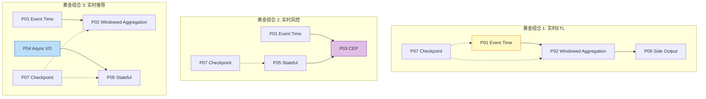
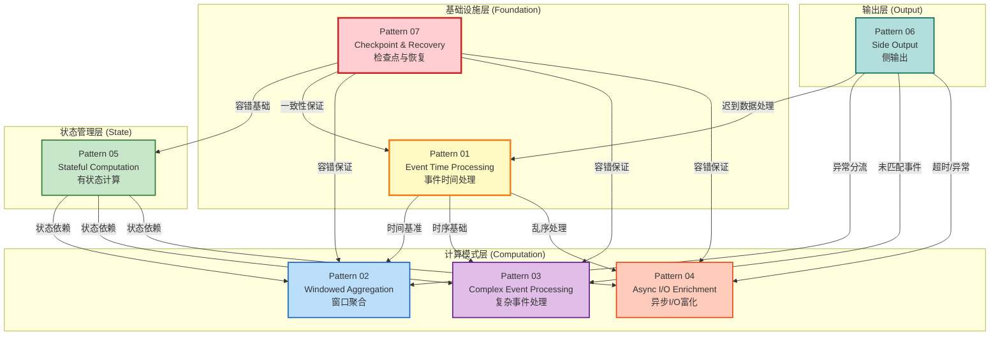
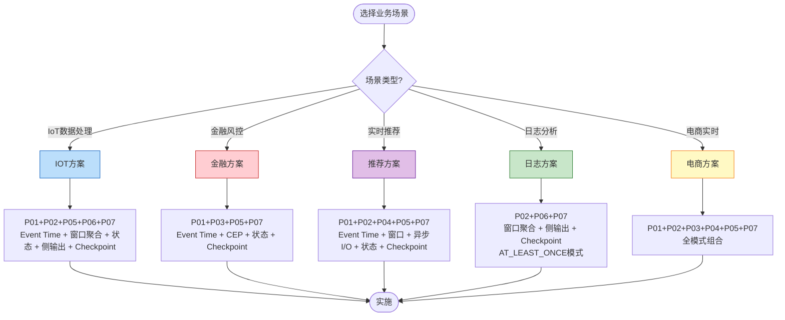
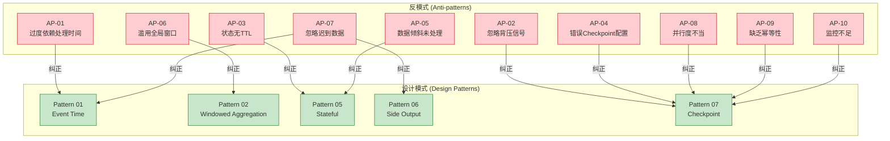
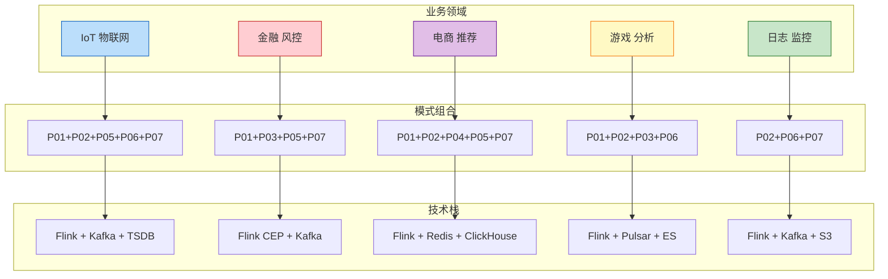

# 设计模式适用矩阵 (Design Pattern Applicability Matrix)

> **所属阶段**: Knowledge/Visuals | **前置依赖**: [02-design-patterns](../Knowledge/02-design-patterns/) | **形式化等级**: L4
>
> 本文档提供流处理7大核心设计模式的适用性矩阵、组合兼容性分析和选型决策流程，帮助架构师根据业务需求选择恰当的模式组合。

---

## 目录

- [设计模式适用矩阵 (Design Pattern Applicability Matrix)](#设计模式适用矩阵-design-pattern-applicability-matrix)
  - [目录](#目录)
  - [1. 模式总览 (Pattern Overview)](#1-模式总览-pattern-overview)
  - [2. 适用性矩阵 (Applicability Matrix)](#2-适用性矩阵-applicability-matrix)
    - [2.1 核心业务需求 × 设计模式矩阵](#21-核心业务需求-)
    - [2.2 矩阵图例说明](#22-矩阵图例说明)
    - [2.3 详细解读](#23-详细解读)
      - [乱序数据处理 (P01 Event Time)](#乱序数据处理-p01-event-time)
      - [窗口聚合计算 (P02 Windowed Aggregation)](#窗口聚合计算-p02-windowed-aggregation)
      - [复杂事件匹配 (P03 CEP)](#复杂事件匹配-p03-cep)
      - [外部数据关联 (P04 Async I/O)](#外部数据关联-p04-async-io)
      - [有状态计算 (P05 Stateful Computation)](#有状态计算-p05-stateful-computation)
      - [Exactly-Once (P07 Checkpoint)](#exactly-once-p07-checkpoint)
  - [3. 模式组合兼容性矩阵 (Pattern Combination Compatibility)](#3-模式组合兼容性矩阵-pattern-combination-compatibility)
    - [3.1 组合可行性矩阵](#31-组合可行性矩阵)
    - [3.2 推荐模式组合](#32-推荐模式组合)
      - [黄金组合 (Golden Patterns)](#黄金组合-golden-patterns)
      - [高阶组合 (Advanced Patterns)](#高阶组合-advanced-patterns)
  - [4. 模式依赖关系图 (Pattern Dependency Graph)](#4-模式依赖关系图-pattern-dependency-graph)
  - [5. 模式选型决策流程 (Pattern Selection Decision Flow)](#5-模式选型决策流程-pattern-selection-decision-flow)
    - [5.1 主决策树](#51-主决策树)
    - [5.2 场景化快速选型](#52-场景化快速选型)
      - [场景化选型速查表](#场景化选型速查表)
  - [6. 反模式关联映射 (Anti-pattern Correlation)](#6-反模式关联映射-anti-pattern-correlation)
  - [7. 业务场景映射 (Business Scenario Mapping)](#7-业务场景映射-business-scenario-mapping)
  - [8. 引用参考 (References)](#8-引用参考-references)

---

## 1. 模式总览 (Pattern Overview)

| 编号 | 模式名称 | 核心问题 | 解决方案 | 形式化基础 | 复杂度 |
|------|----------|----------|----------|------------|--------|
| **P01** | [Event Time Processing](../Knowledge/02-design-patterns/pattern-event-time-processing.md) | 乱序数据、迟到数据、结果确定性 | Watermark机制 + 允许延迟 + 侧输出 | `Def-S-04-04` Watermark语义 | ★★★☆☆ |
| **P02** | [Windowed Aggregation](../Knowledge/02-design-patterns/pattern-windowed-aggregation.md) | 无界流的有界计算单元 | 窗口算子 + 触发器 + 驱逐器 | `Def-S-04-05` 窗口算子 | ★★☆☆☆ |
| **P03** | [CEP Complex Event](../Knowledge/02-design-patterns/pattern-cep-complex-event.md) | 时序模式匹配 | NFA状态机 + 时间窗口 | `Thm-S-07-01` 确定性定理 | ★★★★☆ |
| **P04** | [Async I/O Enrichment](../Knowledge/02-design-patterns/pattern-async-io-enrichment.md) | 外部数据查询不阻塞流 | 异步查询 + 结果缓冲 + 超时控制 | `Lemma-S-04-02` 单调性 | ★★★☆☆ |
| **P05** | [Stateful Computation](../Knowledge/02-design-patterns/pattern-stateful-computation.md) | 分布式有状态计算 | Keyed State + Operator State + TTL | `Thm-S-17-01` Checkpoint一致性 | ★★★★☆ |
| **P06** | [Side Output](../Knowledge/02-design-patterns/pattern-side-output.md) | 多路输出、异常数据分离 | 侧输出流 + 标签匹配 | `Def-S-08-01` AM语义 | ★★☆☆☆ |
| **P07** | [Checkpoint & Recovery](../Knowledge/02-design-patterns/pattern-checkpoint-recovery.md) | 故障恢复与一致性 | Barrier对齐 + 状态快照 + 重放 | `Thm-S-18-01` Exactly-Once | ★★★★★ |

---

## 2. 适用性矩阵 (Applicability Matrix)

### 2.1 核心业务需求 × 设计模式矩阵

| 业务需求 ↓ \ 设计模式 → | P01<br/>Event Time | P02<br/>Windowed<br/>Aggregation | P03<br/>CEP | P04<br/>Async I/O | P05<br/>Stateful | P06<br/>Side Output | P07<br/>Checkpoint |
|:------------------------|:------------------:|:--------------------------------:|:-----------:|:-----------------:|:----------------:|:-------------------:|:------------------:|
| **乱序数据处理**        | ⭕ **核心依赖**     | ⚪ 可选增强                      | ⚪ 可选增强 | ⚪ 可选增强       | ❌ 不适用        | ⚪ 可选增强         | ❌ 不适用          |
| **窗口聚合计算**        | ⭕ **核心依赖**     | ⭕ **核心依赖**                   | ❌ 不适用   | ❌ 不适用         | ⭕ **核心依赖**   | ⚪ 可选增强         | ⚪ 可选增强        |
| **复杂事件匹配**        | ⭕ **核心依赖**     | ⭕ **核心依赖**                   | ⭕ **核心依赖** | ⚪ 可选增强   | ⭕ **核心依赖**   | ⚪ 可选增强         | ⚪ 可选增强        |
| **外部数据关联**        | ⚪ 可选增强         | ❌ 不适用                        | ⚪ 可选增强 | ⭕ **核心依赖**   | ⚪ 可选增强       | ⚪ 可选增强         | ❌ 不适用          |
| **有状态计算**          | ⚪ 可选增强         | ⭕ **核心依赖**                   | ⭕ **核心依赖** | ⭕ **核心依赖** | ⭕ **核心依赖**   | ❌ 不适用           | ⭕ **核心依赖**    |
| **故障容错**            | ⚪ 可选增强         | ⚪ 可选增强                       | ⚪ 可选增强 | ⚪ 可选增强       | ⭕ **核心依赖**   | ⚪ 可选增强         | ⭕ **核心依赖**    |
| **Exactly-Once**        | ⚪ 可选增强         | ⚪ 可选增强                       | ⚪ 可选增强 | ⚪ 可选增强       | ⭕ **核心依赖**   | ⚪ 可选增强         | ⭕ **核心依赖**    |
| **数据分流**            | ⚪ 可选增强         | ⚪ 可选增强                       | ⚪ 可选增强 | ❌ 不适用         | ❌ 不适用         | ⭕ **核心依赖**     | ❌ 不适用          |
| **迟到数据处理**        | ⭕ **核心依赖**     | ⚪ 可选增强                       | ⚪ 可选增强 | ❌ 不适用         | ⚪ 可选增强       | ⭕ **核心依赖**     | ❌ 不适用          |
| **监控与审计**          | ❌ 不适用           | ❌ 不适用                         | ⚪ 可选增强 | ❌ 不适用         | ❌ 不适用         | ⭕ **核心依赖**     | ⚪ 可选增强        |

### 2.2 矩阵图例说明

```
┌─────────────────────────────────────────────────────────────┐
│                        图例说明                              │
├─────────────────────────────────────────────────────────────┤
│                                                             │
│   ⭕ 核心依赖 (Core Dependency)                             │
│   ├── 该模式是满足此业务需求的必要组成部分                   │
│   └── 缺失该模式将无法实现对应业务功能                       │
│                                                             │
│   ⚪ 可选增强 (Optional Enhancement)                        │
│   ├── 该模式可增强此业务需求的实现效果                       │
│   └── 非必需，但推荐在复杂场景下使用                         │
│                                                             │
│   ❌ 不适用 (Not Applicable)                                │
│   ├── 该模式与此业务需求无直接关系                          │
│   └── 使用与否不影响该业务需求的实现                         │
│                                                             │
└─────────────────────────────────────────────────────────────┘
```

### 2.3 详细解读

#### 乱序数据处理 (P01 Event Time)

| 需求场景 | 推荐模式 | 配置要点 |
|----------|----------|----------|
| 金融交易时序 | P01 | `forBoundedOutOfOrderness(500ms)` |
| IoT传感器乱序 | P01 + P06 | `forBoundedOutOfOrderness(15s) + sideOutputLateData()` |
| CDC数据同步 | P01 | `forBoundedOutOfOrderness(1s)` |

#### 窗口聚合计算 (P02 Windowed Aggregation)

| 需求场景 | 推荐模式组合 | 配置要点 |
|----------|--------------|----------|
| 实时PV/UV统计 | P01 + P02 + P05 | Tumbling窗口 + Keyed State |
| 移动平均计算 | P01 + P02 | Sliding窗口(δ=5min, s=1min) |
| 用户会话分析 | P01 + P02 + P05 | Session窗口(gap=30min) + 状态TTL |

#### 复杂事件匹配 (P03 CEP)

| 需求场景 | 推荐模式组合 | 配置要点 |
|----------|--------------|----------|
| 金融欺诈检测 | P01 + P03 + P07 | `within(30min)` + 按userId分区 |
| IoT故障预测 | P01 + P03 + P05 | 多传感器协同模式 + 状态存储 |
| 安全入侵检测 | P01 + P03 + P06 | 长窗口模式 + 异常事件侧输出 |

#### 外部数据关联 (P04 Async I/O)

| 需求场景 | 推荐模式组合 | 配置要点 |
|----------|--------------|----------|
| 实时推荐特征富化 | P04 + P05 | Redis异步查询 + 本地缓存状态 |
| 风控用户画像查询 | P04 + P01 | HBase异步 + 超时控制(5s) |
| 地理位置补全 | P04 | 无序模式 + 并发度100 |

#### 有状态计算 (P05 Stateful Computation)

| 需求场景 | 推荐模式组合 | 状态后端选型 |
|----------|--------------|--------------|
| 会话状态维护 | P05 + P07 | HashMapStateBackend (<100MB) |
| 大键值状态 | P05 + P07 | RocksDBStateBackend (TB级) |
| CEP NFA状态 | P03 + P05 + P07 | RocksDB + 短TTL |

#### Exactly-Once (P07 Checkpoint)

| 需求场景 | 推荐模式组合 | 配置要点 |
|----------|--------------|----------|
| 金融交易处理 | P01 + P05 + P07 | EXACTLY_ONCE + 2PC Sink |
| 订单状态流转 | P05 + P07 | 增量Checkpoint + 事务Sink |
| 日志聚合分析 | P07 | AT_LEAST_ONCE (可容忍重复) |

---

## 3. 模式组合兼容性矩阵 (Pattern Combination Compatibility)

### 3.1 组合可行性矩阵

| 模式组合 | 兼容性 | 复杂度 | 典型应用场景 |
|----------|:------:|:------:|--------------|
| P01 + P02 | ✅ 强兼容 | ★★★☆☆ | 事件时间窗口聚合 |
| P01 + P03 | ✅ 强兼容 | ★★★★☆ | 时序敏感的CEP匹配 |
| P01 + P04 | ✅ 强兼容 | ★★★☆☆ | 乱序流的异步富化 |
| P01 + P05 | ✅ 强兼容 | ★★★★☆ | 基于事件时间的状态计算 |
| P01 + P06 | ✅ 强兼容 | ★★★☆☆ | 迟到数据侧输出 |
| P01 + P07 | ✅ 强兼容 | ★★★★☆ | Checkpoint持久化Watermark |
| P02 + P03 | ⚠️ 需协调 | ★★★★☆ | 窗口内CEP匹配 |
| P02 + P04 | ❌ 不推荐 | ★★★★★ | 窗口聚合+异步富化(高延迟) |
| P02 + P05 | ✅ 强兼容 | ★★★☆☆ | 窗口状态管理 |
| P02 + P06 | ✅ 强兼容 | ★★☆☆☆ | 窗口迟到数据侧输出 |
| P02 + P07 | ✅ 强兼容 | ★★★☆☆ | 窗口状态容错 |
| P03 + P04 | ⚠️ 需协调 | ★★★★☆ | CEP匹配+外部上下文查询 |
| P03 + P05 | ✅ 强兼容 | ★★★★☆ | CEP NFA状态存储 |
| P03 + P06 | ✅ 强兼容 | ★★★☆☆ | CEP超时/未匹配事件侧输出 |
| P03 + P07 | ✅ 强兼容 | ★★★★★ | CEP状态容错 |
| P04 + P05 | ⚠️ 需协调 | ★★★★☆ | 异步富化+状态缓存 |
| P04 + P06 | ✅ 强兼容 | ★★★☆☆ | 异步查询异常侧输出 |
| P04 + P07 | ✅ 强兼容 | ★★★★☆ | 异步算子Checkpoint |
| P05 + P06 | ✅ 强兼容 | ★★★☆☆ | 有状态分流 |
| P05 + P07 | ✅ 强兼容 | ★★★★★ | 状态容错基础 |
| P06 + P07 | ✅ 强兼容 | ★★★☆☆ | 侧输出数据容错 |

**兼容性图例**:

- ✅ **强兼容**: 模式天然协同，无冲突
- ⚠️ **需协调**: 需要额外配置或设计注意
- ❌ **不推荐**: 组合可能引入严重问题

### 3.2 推荐模式组合

#### 黄金组合 (Golden Patterns)



#### 高阶组合 (Advanced Patterns)

| 组合名称 | 包含模式 | 业务场景 | 复杂度 |
|----------|----------|----------|:------:|
| **Super Pattern** | P01+P02+P03+P05+P07 | 金融级复杂风控 | ★★★★★ |
| **IoT Hub** | P01+P02+P04+P05+P06+P07 | 物联网数据处理 | ★★★★☆ |
| **Lambda Lite** | P01+P02+P04+P07 | 轻量级实时数仓 | ★★★☆☆ |

---

## 4. 模式依赖关系图 (Pattern Dependency Graph)



**依赖关系说明**:

| 层级 | 模式 | 依赖模式 | 依赖原因 |
|------|------|----------|----------|
| **基础设施层** | P01, P07 | 无 | 其他模式的基础设施 |
| **状态管理层** | P05 | P07 | Checkpoint保证状态容错 |
| **计算模式层** | P02 | P01, P05 | 事件时间窗口 + 窗口状态 |
| **计算模式层** | P03 | P01, P05 | CEP时间语义 + NFA状态 |
| **计算模式层** | P04 | P01, P05 | 乱序响应处理 + 查询状态 |
| **输出层** | P06 | P01, P02, P03, P04 | 分流各种迟到/异常数据 |

---

## 5. 模式选型决策流程 (Pattern Selection Decision Flow)

### 5.1 主决策树

```mermaid
flowchart TD
    START([开始选型]) --> Q1{数据是否乱序?}

    Q1 -->|是| P01_SEL[采用 P01<br/>Event Time Processing]
    Q1 -->|否| Q2{是否需要容错?}

    P01_SEL --> Q2

    Q2 -->|是| P07_SEL[采用 P07<br/>Checkpoint & Recovery]
    Q2 -->|否| Q3{是否需要状态?}

    P07_SEL --> Q3

    Q3 -->|是| P05_SEL[采用 P05<br/>Stateful Computation]
    Q3 -->|否| Q4{是否需要窗口聚合?}

    P05_SEL --> Q4

    Q4 -->|是| P02_SEL[采用 P02<br/>Windowed Aggregation]
    Q4 -->|否| Q5{是否需要复杂事件匹配?}

    P02_SEL --> Q5

    Q5 -->|是| P03_SEL[采用 P03<br/>CEP]
    Q5 -->|否| Q6{是否需要外部数据?}

    P03_SEL --> Q6

    Q6 -->|是| P04_SEL[采用 P04<br/>Async I/O]
    Q6 -->|否| Q7{是否需要多路输出?}

    P04_SEL --> Q7

    Q7 -->|是| P06_SEL[采用 P06<br/>Side Output]
    Q7 -->|否| END_OK([模式选型完成])

    P06_SEL --> END_OK

    style START fill:#e1bee7,stroke:#6a1b9a
    style P01_SEL fill:#fff9c4,stroke:#f57f17
    style P07_SEL fill:#ffcdd2,stroke:#c62828
    style P05_SEL fill:#c8e6c9,stroke:#2e7d32
    style P02_SEL fill:#bbdefb,stroke:#1565c0
    style P03_SEL fill:#e1bee7,stroke:#6a1b9a
    style P04_SEL fill:#ffccbc,stroke:#e64a19
    style P06_SEL fill:#b2dfdb,stroke:#00695c
    style END_OK fill:#c8e6c9,stroke:#2e7d32,stroke-width:3px
```



### 5.2 场景化快速选型



#### 场景化选型速查表

| 业务场景 | 推荐模式组合 | 核心配置 | 一致性级别 |
|----------|--------------|----------|----------|
| **IoT数据处理** | P01+P02+P05+P06+P07 | Session窗口 + 15s乱序容忍 | AL |
| **金融实时风控** | P01+P03+P05+P07 | 500ms乱序容忍 + CEP 30min窗口 | EO |
| **实时推荐系统** | P01+P02+P04+P05+P07 | 5s乱序容忍 + Redis异步查询 | AL |
| **日志分析** | P02+P06+P07 | 10min滚动窗口 + 异常侧输出 | AM/AL |
| **电商实时数仓** | P01+P02+P04+P05+P07 | 1min窗口 + HBase异步关联 | EO |
| **游戏实时分析** | P01+P02+P03+P06 | 会话窗口 + CEP + 延迟数据侧输出 | AL |
| **支付处理** | P01+P05+P07 | 事务状态 + 2PC Sink | EO |
| **网络监控** | P03+P06+P07 | CEP攻击模式 + 告警侧输出 | AL |

---

## 6. 反模式关联映射 (Anti-pattern Correlation)



**反模式严重程度矩阵**:

| 反模式 | 严重程度 | 关联设计模式 | 检测难度 |
|--------|:--------:|--------------|----------|
| AP-01 过度依赖处理时间 | P2 | P01 | 中 |
| AP-02 忽略背压信号 | **P0** | P07 | 极难 |
| AP-03 状态无TTL | P1 | P05 | 难 |
| AP-04 错误Checkpoint配置 | P1 | P07 | 中 |
| AP-05 数据倾斜未处理 | P1 | P05 | 难 |
| AP-06 滥用全局窗口 | P1 | P02 | 中 |
| AP-07 忽略迟到数据 | P1 | P01, P06 | 难 |
| AP-08 并行度不当 | P2 | P07 | 中 |
| AP-09 缺乏幂等性 | P2 | P07 | 难 |
| AP-10 监控不足 | **P0** | P07 | 易 |

**严重程度定义**:

- **P0 - 灾难性**: 系统级故障，必须立即修复
- **P1 - 高危**: 业务影响严重，需要优先处理
- **P2 - 中等**: 潜在风险，需要关注

---

## 7. 业务场景映射 (Business Scenario Mapping)



**业务场景配置参考**:

| 场景 | 模式组合 | Watermark配置 | Checkpoint配置 | 状态后端 |
|------|----------|---------------|----------------|----------|
| IoT | P01+P02+P05+P06+P07 | `forBoundedOutOfOrderness(15s)` | 2min间隔, AT_LEAST_ONCE | RocksDB |
| 金融 | P01+P03+P05+P07 | `forBoundedOutOfOrderness(500ms)` | 30s间隔, EXACTLY_ONCE | RocksDB |
| 推荐 | P01+P02+P04+P05+P07 | `forBoundedOutOfOrderness(5s)` | 1min间隔, AT_LEAST_ONCE | RocksDB |
| 游戏 | P01+P02+P03+P06 | `forBoundedOutOfOrderness(10s)` | 2min间隔, AT_LEAST_ONCE | HashMap |
| 日志 | P02+P06+P07 | Processing Time | 5min间隔, AT_LEAST_ONCE | HashMap |

---

## 8. 引用参考 (References)


---

*文档版本: v1.0 | 更新日期: 2026-04-03 | 状态: 已完成*
