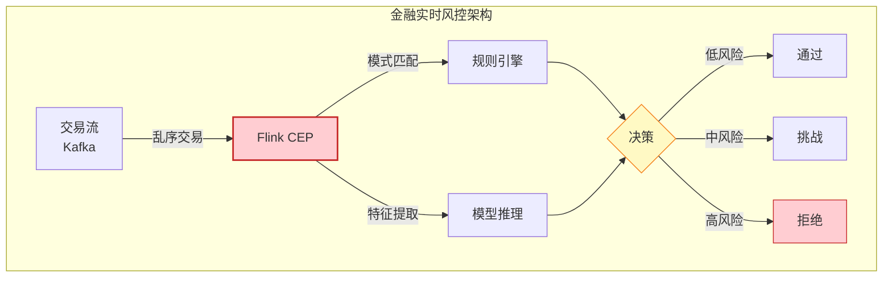
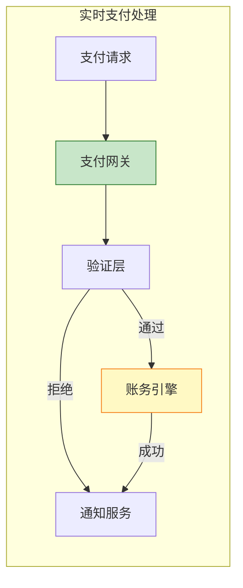
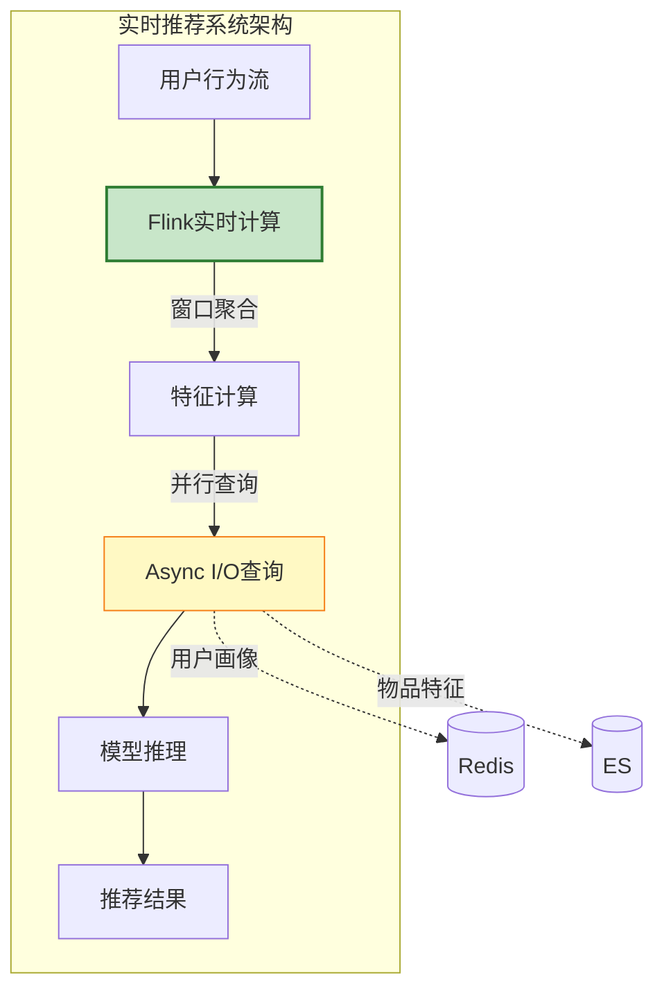
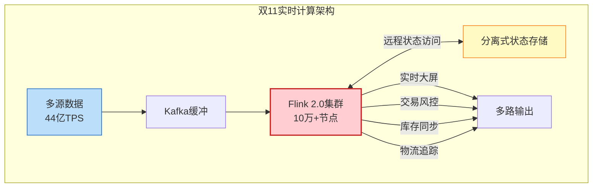
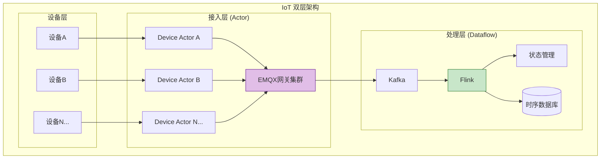
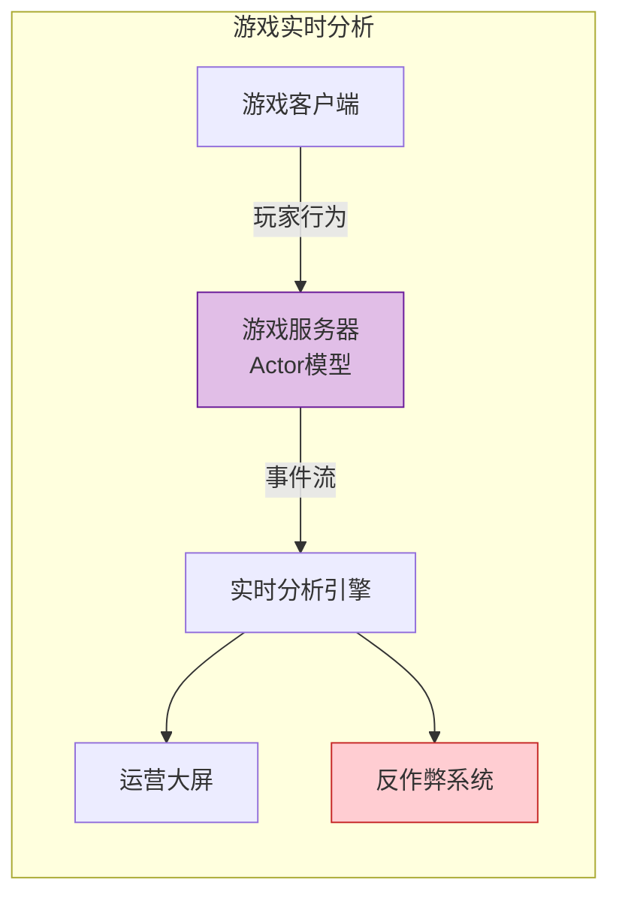
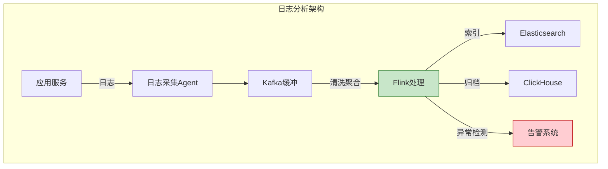
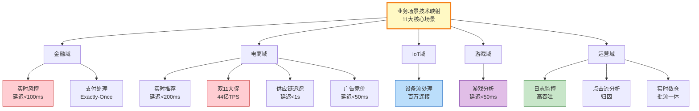
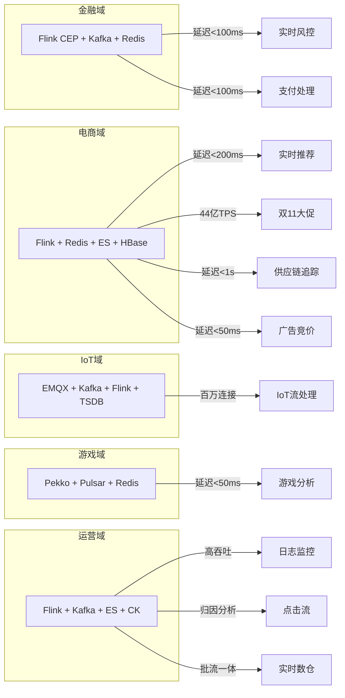
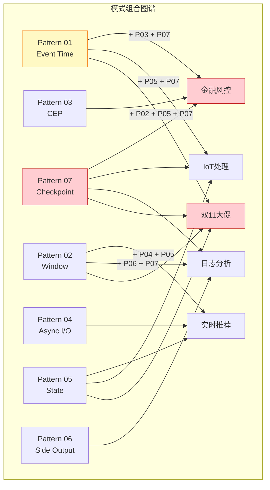

# 业务场景技术映射矩阵 (Business Scenario-Technology Mapping Matrix)

> **所属阶段**: Knowledge/ 知识转化层 | **前置依赖**: [Knowledge/00-INDEX.md](../Knowledge/00-INDEX.md), [Knowledge/03-business-patterns/](../Knowledge/03-business-patterns/) | **形式化等级**: L4-L5
>
> **文档定位**: 提供11个核心业务场景与流计算技术要素的完整映射关系，支持技术选型决策与架构设计

---

## 目录

- [业务场景技术映射矩阵 (Business Scenario-Technology Mapping Matrix)](#业务场景技术映射矩阵-business-scenario-technology-mapping-matrix)
  - [目录](#目录)
  - [1. 概念定义 (Definitions)](#1-概念定义-definitions)
    - [Def-V-01-01: 业务场景技术映射](#def-v-01-01-业务场景技术映射)
    - [Def-V-01-02: 领域分类体系](#def-v-01-02-领域分类体系)
    - [Def-V-01-03: 技术要素维度](#def-v-01-03-技术要素维度)
  - [2. 映射矩阵总览 (Master Matrix)](#2-映射矩阵总览-master-matrix)
    - [完整业务场景 × 技术要素矩阵](#)
  - [3. 按领域分类详述 (Domain Classification)](#3-按领域分类详述-domain-classification)
    - [3.1 金融域 (Finance Domain)](#31-金融域-finance-domain)
      - [场景 1: 金融实时风控](#场景-1-金融实时风控)
      - [场景 7: 支付处理](#场景-7-支付处理)
    - [3.2 电商域 (E-Commerce Domain)](#32-电商域-e-commerce-domain)
      - [场景 2: 实时推荐系统](#场景-2-实时推荐系统)
      - [场景 6: 电商双11大促](#场景-6-电商双11大促)
      - [场景 8: 供应链追踪](#场景-8-供应链追踪)
      - [场景 11: 广告实时竞价 (RTB)](#场景-11-广告实时竞价-rtb)
    - [3.3 IoT域 (IoT Domain)](#33-iot域-iot-domain)
      - [场景 3: IoT流处理](#场景-3-iot流处理)
    - [3.4 游戏域 (Gaming Domain)](#34-游戏域-gaming-domain)
      - [场景 5: 游戏实时分析](#场景-5-游戏实时分析)
    - [3.5 运营域 (Operations Domain)](#35-运营域-operations-domain)
      - [场景 4: 日志分析监控](#场景-4-日志分析监控)
      - [场景 9: 点击流分析](#场景-9-点击流分析)
      - [场景 10: 实时数仓](#场景-10-实时数仓)
  - [4. 场景层次树 (Scenario Hierarchy Tree)](#4-场景层次树-scenario-hierarchy-tree)
    - [领域-场景-技术三维映射](#领域-场景-技术三维映射)
  - [5. 场景-技术选型速查表 (Quick Reference)](#5-场景-技术选型速查表-quick-reference)
    - [5.1 延迟导向选型](#51-延迟导向选型)
    - [5.2 吞吐量导向选型](#52-吞吐量导向选型)
    - [5.3 一致性导向选型](#53-一致性导向选型)
    - [5.4 复杂度导向选型](#54-复杂度导向选型)
  - [6. 模式组合推荐 (Pattern Combinations)](#6-模式组合推荐-pattern-combinations)
    - [高频模式组合](#高频模式组合)
    - [模式组合选型表](#模式组合选型表)
  - [7. 引用参考 (References)](#7-引用参考-references)

---

## 1. 概念定义 (Definitions)

### Def-V-01-01: 业务场景技术映射

**定义 (业务场景技术映射)**: 业务场景技术映射是一个从业务需求空间到技术解决方案空间的二元关系：

$$
\text{Mapping} \subseteq \mathcal{S} \times \mathcal{T}
$$

其中：

- $\mathcal{S}$ = 业务场景集合，$\mathcal{S} = \{s_1, s_2, \ldots, s_{11}\}$
- $\mathcal{T}$ = 技术要素集合，$\mathcal{T} = \{\text{模式}, \text{范式}, \text{一致性}, \text{延迟}, \text{技术栈}, \text{挑战}\}$
- 映射关系 $(s, t) \in \text{Mapping}$ 表示场景 $s$ 采用技术要素 $t$

**映射维度**:

| 维度 | 符号 | 取值空间 | 说明 |
|------|------|----------|------|
| **核心模式** | $P$ | $\{P01, P02, \ldots, P09\}$ | 7大核心设计模式及扩展 |
| **并发范式** | $C$ | $\{Actor, CSP, Dataflow, CEP\}$ | 并发计算模型 |
| **一致性级别** | $K$ | $\{AM, AL, EO\}$ | At-Most/Least/Exactly-Once |
| **延迟要求** | $L$ | $\mathbb{R}^+$ (ms) | 端到端延迟约束 |
| **技术栈** | $S$ | 组件组合 | Flink/Kafka/Redis等 |
| **关键挑战** | $H$ | 文本描述 | 核心技术难点 |

### Def-V-01-02: 领域分类体系

**定义 (领域分类)**: 业务场景按业务领域划分为5大域：

$$
\mathcal{D} = \{Finance, Ecommerce, IoT, Gaming, Operations\}
$$

**领域特征**:

| 领域 | 核心关切 | 典型延迟 | 一致性要求 | 数据特征 |
|------|----------|----------|------------|----------|
| **金融 (Finance)** | 风险控制、资金安全 | < 100ms | Exactly-Once | 高价值、低容错 |
| **电商 (E-Commerce)** | 转化提升、库存准确 | < 500ms | EO/AL混合 | 高并发、多维度 |
| **IoT** | 设备监控、实时告警 | < 2s | At-Least-Once | 海量连接、乱序 |
| **游戏 (Gaming)** | 实时体验、反作弊 | < 50ms | At-Most-Once | 高频交互、状态复杂 |
| **运营 (Operations)** | 系统可见性、故障发现 | < 5s | At-Least-Once | 高吞吐、可容忍丢失 |

### Def-V-01-03: 技术要素维度

**技术要素七维模型**:

```
                    ┌─────────────────────────────────────┐
                    │      技术要素七维模型                 │
                    └─────────────────────────────────────┘
                                      │
           ┌──────────┬──────────────┼──────────────┬──────────┐
           ▼          ▼              ▼              ▼          ▼
    ┌──────────┐ ┌──────────┐  ┌──────────┐  ┌──────────┐ ┌──────────┐
    │ 核心模式  │ │ 并发范式  │  │ 一致性   │  │ 延迟要求  │ │ 技术栈   │
    │ Pattern  │ │ Paradigm│  │ Consistency│  │ Latency │ │ Stack   │
    └──────────┘ └──────────┘  └──────────┘  └──────────┘ └──────────┘
           │                                                │
           ▼                                                ▼
    ┌──────────┐                                      ┌──────────┐
    │ 关键挑战  │                                      │ 案例公司  │
    │ Challenge│                                      │ Company │
    └──────────┘                                      └──────────┘
```

---

## 2. 映射矩阵总览 (Master Matrix)

### 完整业务场景 × 技术要素矩阵

| 场景 | 领域 | 核心模式 | 并发范式 | 一致性 | 延迟要求 | 技术栈 | 关键挑战 | 案例公司 |
|:----:|:----:|:--------:|:--------:|:------:|:--------:|:-------|:---------|:---------|
| **1. 金融实时风控** | 金融 | P01+P03+P07 | Dataflow+CEP | Exactly-Once | < 100ms | Flink CEP + Kafka + Redis | 低延迟+准确性+时序复杂 | Stripe, PayPal |
| **2. 实时推荐系统** | 电商 | P02+P04+P05 | Dataflow | At-Least-Once | < 200ms | Flink + Redis + ES | 特征新鲜度+冷启动 | Alibaba, Netflix |
| **3. IoT流处理** | IoT | P01+P05+P07 | Actor+Dataflow | At-Least-Once | < 2s | Flink + Kafka + EMQX | 百万连接+乱序处理 | AWS IoT, 阿里云IoT |
| **4. 日志分析监控** | 运营 | P02+P06+P07 | Dataflow | At-Least-Once | < 5s | Flink + Kafka + ES | 高吞吐+多租户 | Datadog, Splunk |
| **5. 游戏实时分析** | 游戏 | P01+P02+P06 | Actor | At-Most-Once | < 50ms | Flink + Pulsar + Redis | 超低延迟+反作弊 | Tencent, Epic |
| **6. 电商双11大促** | 电商 | P01+P02+P05+P07 | Dataflow | Exactly-Once | < 500ms | Flink 2.0 + Kafka + HBase | 超大规模+弹性扩缩 | Alibaba |
| **7. 支付处理** | 金融 | P01+P05+P07 | Dataflow | Exactly-Once | < 100ms | RisingWave/Flink + Kafka | 事务一致性+高可用 | Stripe, Adyen |
| **8. 供应链追踪** | 电商 | P01+P02 | Dataflow | At-Least-Once | < 1s | Flink + Kafka + HBase | 多节点追踪+预测 | Amazon, 菜鸟 |
| **9. 点击流分析** | 运营 | P02+P04 | Dataflow | At-Least-Once | < 3s | Flink + Kafka + ClickHouse | 用户行为归因 | Google Analytics |
| **10. 实时数仓** | 运营 | P01+P05+P07 | Dataflow | Exactly-Once | < 1s | Flink + Iceberg/Hudi | 批流一体+Schema演进 | Netflix, Uber |
| **11. 广告实时竞价** | 电商 | P01+P04+P05 | Dataflow | At-Least-Once | < 50ms | Flink + Redis + Kafka | 毫秒级决策+预算控制 | Google Ads, Meta |

---

## 3. 按领域分类详述 (Domain Classification)

### 3.1 金融域 (Finance Domain)

#### 场景 1: 金融实时风控



**技术要素详情**:

| 维度 | 详情 |
|------|------|
| **核心模式** | **P01 Event Time**: 500ms Watermark容忍乱序<br>**P03 CEP**: 复杂欺诈模式匹配 (地理位置异常、速度异常)<br>**P07 Checkpoint**: Exactly-Once保证决策一致性 |
| **并发范式** | **Dataflow** (Flink处理层) + **CEP** (模式匹配层) |
| **一致性** | **Exactly-Once (EO)**: 交易不可丢失、不可重复 |
| **延迟要求** | P99 < 100ms (端到端), P50 < 30ms |
| **技术栈** | Flink CEP + Kafka + Redis (热数据) + HBase (画像) + TF Serving (模型) |
| **关键挑战** | ① 地理位置异常检测 (30分钟内跨城市)<br>② 速度异常识别 (5分钟内多笔大额)<br>③ 规则引擎与ML模型协同<br>④ 监管合规与审计追溯 |
| **案例公司** | **Stripe**: 全球支付风控<br>**PayPal**: 实时欺诈检测<br>**蚂蚁金服**: 双11交易风控 |

---

#### 场景 7: 支付处理



**技术要素详情**:

| 维度 | 详情 |
|------|------|
| **核心模式** | **P01 Event Time**: 确保交易顺序<br>**P05 State Management**: 账户余额状态<br>**P07 Checkpoint**: 账务一致性保证 |
| **并发范式** | **Dataflow** (流处理) |
| **一致性** | **Exactly-Once (EO)**: 资金操作不可丢失或重复 |
| **延迟要求** | P99 < 100ms, 平均 < 50ms |
| **技术栈** | RisingWave/Flink + Kafka + PostgreSQL (账务) + Redis (缓存) |
| **关键挑战** | ① 分布式事务一致性<br>② 热点账户处理<br>③ 多币种实时清算<br>④ 对账与差错处理 |
| **案例公司** | **Stripe**: 统一支付API<br>**Adyen**: 全球收单<br>**Square**: 移动支付 |

---

### 3.2 电商域 (E-Commerce Domain)

#### 场景 2: 实时推荐系统



**技术要素详情**:

| 维度 | 详情 |
|------|------|
| **核心模式** | **P02 Windowed Aggregation**: 会话特征计算 (15min窗口)<br>**P04 Async I/O**: 查询用户画像/物品特征<br>**P05 State Management**: 用户行为序列状态 |
| **并发范式** | **Dataflow** (流处理) |
| **一致性** | **At-Least-Once (AL)**: 推荐可容忍少量重复 |
| **延迟要求** | P99 < 200ms (特征计算+推理) |
| **技术栈** | Flink + Kafka + Redis (热特征) + Elasticsearch (向量检索) + TF Serving |
| **关键挑战** | ① 特征新鲜度 (秒级更新)<br>② 冷启动用户处理<br>③ 召回-粗排-精排分层架构<br>④ A/B测试与效果归因 |
| **案例公司** | **Alibaba**: 淘宝实时推荐<br>**Netflix**: 内容推荐<br>**Amazon**: 商品推荐 |

---

#### 场景 6: 电商双11大促



**技术要素详情**:

| 维度 | 详情 |
|------|------|
| **核心模式** | **P01+P02+P05+P07** 全模式组合<br>Event Time + Window + State + Checkpoint |
| **并发范式** | **Dataflow** (大规模分布式流处理) |
| **一致性** | **Exactly-Once (EO)**: 交易与库存强一致 |
| **延迟要求** | 实时大屏 < 1s, 交易风控 < 100ms |
| **技术栈** | Flink 2.0 (分离式架构) + Kafka + HBase + Hologres |
| **关键挑战** | ① 44亿TPS峰值处理<br>② 秒级扩缩容 (Flink 2.0)<br>③ 异地多活架构<br>④ 热点Key处理 |
| **案例公司** | **Alibaba**: 2024双11峰值44亿TPS<br>**京东**: 618大促实时计算 |

---

#### 场景 8: 供应链追踪

**技术要素详情**:

| 维度 | 详情 |
|------|------|
| **核心模式** | **P01 Event Time**: 物流事件时序<br>**P02 Window**: 运输批次聚合 |
| **并发范式** | **Dataflow** |
| **一致性** | **At-Least-Once (AL)** |
| **延迟要求** | < 1s (轨迹更新) |
| **技术栈** | Flink + Kafka + HBase + Geo服务 |
| **关键挑战** | ① 多节点轨迹串联<br>② ETA预测<br>③ 异常路径检测 |
| **案例公司** | **Amazon**: 物流网络<br>**菜鸟网络**: 全球包裹追踪 |

#### 场景 11: 广告实时竞价 (RTB)

**技术要素详情**:

| 维度 | 详情 |
|------|------|
| **核心模式** | **P01 Event Time**: 竞价请求时序<br>**P04 Async I/O**: 查询用户标签<br>**P05 State**: 预算控制状态 |
| **并发范式** | **Dataflow** |
| **一致性** | **At-Least-Once (AL)** |
| **延迟要求** | < 50ms (DSP响应时间) |
| **技术栈** | Flink + Redis (用户标签) + Kafka |
| **关键挑战** | ① 毫秒级竞价决策<br>② 预算实时控制<br>③ 反作弊检测 |
| **案例公司** | **Google Ads**: RTB系统<br>**Meta**: 广告投放 |

---

### 3.3 IoT域 (IoT Domain)

#### 场景 3: IoT流处理



**技术要素详情**:

| 维度 | 详情 |
|------|------|
| **核心模式** | **P01 Event Time**: 30s Watermark处理乱序<br>**P05 State Management**: 设备状态维护<br>**P07 Checkpoint**: 设备状态持久化 |
| **并发范式** | **Actor** (接入层) + **Dataflow** (处理层) |
| **一致性** | **At-Least-Once (AL)**: 传感器数据可容忍重复 |
| **延迟要求** | 告警 < 2s, 状态更新 < 5s |
| **技术栈** | EMQX/Pekko (Actor网关) + Kafka + Flink + InfluxDB/TDengine |
| **关键挑战** | ① 百万级设备并发接入<br>② 边缘网关批量上报乱序<br>③ 设备状态TTL管理<br>④ 断网离线缓存 |
| **案例公司** | **AWS IoT Core**: 设备连接<br>**阿里云IoT**: 物联网平台<br>**Siemens**: 工业物联网 |

---

### 3.4 游戏域 (Gaming Domain)

#### 场景 5: 游戏实时分析



**技术要素详情**:

| 维度 | 详情 |
|------|------|
| **核心模式** | **P01 Event Time**: 游戏事件时序<br>**P02 Window**: 对局统计窗口<br>**P06 Side Output**: 异常行为分流 |
| **并发范式** | **Actor** (游戏服务器) |
| **一致性** | **At-Most-Once (AM)**: 监控数据可丢失 |
| **延迟要求** | < 50ms (游戏内实时反馈) |
| **技术栈** | Pekko/Akka (Actor) + Flink + Pulsar + Redis |
| **关键挑战** | ① 超低延迟要求<br>② 大规模并发玩家<br>③ 实时反作弊检测<br>④ 游戏状态同步 |
| **案例公司** | **Tencent**: 游戏实时分析<br>**Epic Games**: Fortnite分析 |

---

### 3.5 运营域 (Operations Domain)

#### 场景 4: 日志分析监控



**技术要素详情**:

| 维度 | 详情 |
|------|------|
| **核心模式** | **P02 Window**: 日志聚合窗口<br>**P06 Side Output**: 异常日志分流<br>**P07 Checkpoint**: 数据不丢失 |
| **并发范式** | **Dataflow** |
| **一致性** | **At-Least-Once (AL)**: 监控可容忍少量丢失 |
| **延迟要求** | 告警 < 5s, 查询 < 1s |
| **技术栈** | Filebeat/Fluentd + Kafka + Flink + Elasticsearch + ClickHouse |
| **关键挑战** | ① 海量日志高吞吐<br>② 多租户隔离<br>③ 动态Schema处理<br>④ 成本优化 (冷热分层) |
| **案例公司** | **Datadog**: 云监控<br>**Splunk**: 日志分析<br>**ELK Stack**: 开源方案 |

---

#### 场景 9: 点击流分析

**技术要素详情**:

| 维度 | 详情 |
|------|------|
| **核心模式** | **P02 Window**: 会话窗口<br>**P04 Async I/O**: 用户属性查询 |
| **并发范式** | **Dataflow** |
| **一致性** | **At-Least-Once (AL)** |
| **延迟要求** | < 3s |
| **技术栈** | Flink + Kafka + ClickHouse |
| **关键挑战** | ① 用户行为归因<br>② 漏斗分析<br>③ 留存计算 |
| **案例公司** | **Google Analytics**: 实时报告<br>**神策数据**: 用户行为分析 |

#### 场景 10: 实时数仓

**技术要素详情**:

| 维度 | 详情 |
|------|------|
| **核心模式** | **P01+P05+P07** (全模式) |
| **并发范式** | **Dataflow** |
| **一致性** | **Exactly-Once (EO)** |
| **延迟要求** | < 1s (端到端) |
| **技术栈** | Flink + Iceberg/Hudi + StarRocks |
| **关键挑战** | ① 批流一体架构<br>② Schema演进<br>③ 增量计算 |
| **案例公司** | **Netflix**: 实时数据平台<br>**Uber**: 实时数仓 |

---

## 4. 场景层次树 (Scenario Hierarchy Tree)



### 领域-场景-技术三维映射



---

## 5. 场景-技术选型速查表 (Quick Reference)

### 5.1 延迟导向选型

| 延迟要求 | 推荐场景 | 技术栈 | 关键配置 |
|:--------:|:---------|:-------|:---------|
| **< 10ms** | 高频交易、游戏同步 | FPGA/专用硬件 | 绕过通用流处理框架 |
| **< 50ms** | 游戏分析、广告竞价 | Flink + 内存状态 | Heap State Backend |
| **< 100ms** | 金融风控、支付处理 | Flink + RocksDB | Unaligned Checkpoint |
| **< 500ms** | 实时推荐、双11大促 | Flink 2.0 + 远程状态 | ForSt State Backend |
| **< 2s** | IoT处理、供应链 | Flink + RocksDB | 标准配置 |
| **< 5s** | 日志分析、点击流 | Flink/Spark Streaming | 批流统一 |

### 5.2 吞吐量导向选型

| 吞吐量 | 推荐场景 | 技术栈 | 关键配置 |
|:------:|:---------|:-------|:---------|
| **> 10亿 TPS** | 双11大促 | Flink 2.0 DSA | 分离式架构 |
| **> 1亿 TPS** | IoT接入 | Actor + Kafka | 百万分区 |
| **> 1000万 TPS** | 实时推荐 | Flink + Async I/O | 并发度 200+ |
| **> 100万 TPS** | 日志分析 | Flink + 批量Sink | 批量写入优化 |

### 5.3 一致性导向选型

| 一致性 | 适用场景 | 技术实现 | 性能影响 |
|:------:|:---------|:---------|:---------|
| **Exactly-Once** | 金融交易、支付、库存 | Checkpoint + 2PC Sink | 延迟 +20~50% |
| **At-Least-Once** | 推荐、日志、IoT | Checkpoint + 幂等Sink | 延迟 +10~20% |
| **At-Most-Once** | 监控、游戏埋点 | 无Checkpoint | 最低延迟 |

### 5.4 复杂度导向选型

| 复杂度 | 场景特征 | 推荐模式组合 | 团队要求 |
|:------:|:---------|:-------------|:---------|
| ★★★★★ | 金融风控、双11 | P01+P03+P05+P07 | 流处理专家 |
| ★★★★☆ | 实时推荐、IoT | P01+P04+P05 | 高级开发 |
| ★★★☆☆ | 日志分析、点击流 | P02+P06 | 中级开发 |
| ★★☆☆☆ | 简单ETL、监控 | P02 | 初级开发 |

---

## 6. 模式组合推荐 (Pattern Combinations)

### 高频模式组合



### 模式组合选型表

| 业务场景 | 推荐组合 | 依赖关系 | 复杂度 |
|:---------|:---------|:---------|:------:|
| 金融实时风控 | **P01 → P03 → P07** | Event Time → CEP → Checkpoint | ★★★★★ |
| 实时推荐系统 | **P02 + P04 + P05** | Window ∥ Async I/O → State | ★★★★☆ |
| IoT流处理 | **P01 → P05 → P07** | Event Time → State → Checkpoint | ★★★★☆ |
| 日志分析监控 | **P02 + P06 + P07** | Window → Side Output ∥ Checkpoint | ★★★☆☆ |
| 游戏实时分析 | **P01 + P02 + P06** | Event Time + Window + Side Output | ★★★☆☆ |
| 双11大促 | **P01 + P02 + P05 + P07** | 全模式组合 | ★★★★★ |
| 支付处理 | **P01 + P05 + P07** | Event Time + State + Checkpoint | ★★★★☆ |

---

## 7. 引用参考 (References)


---

*本文档由 AnalysisDataFlow 项目自动生成，基于 Knowledge/ 和 Flink/ 目录下的业务场景文档汇总*

**文档版本**: v1.0 | **最后更新**: 2026-04-03 | **维护者**: AnalysisDataFlow Team
