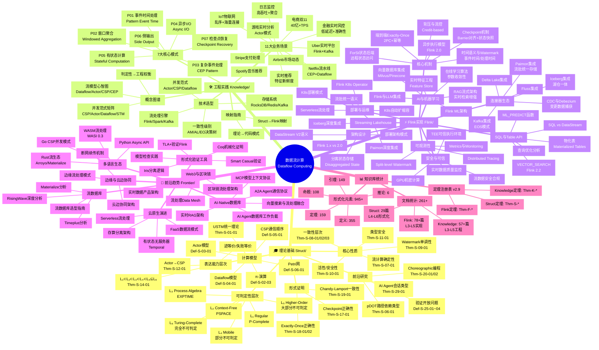
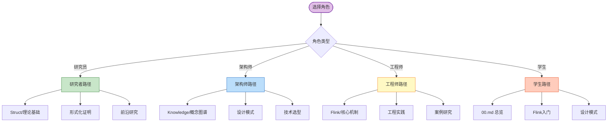
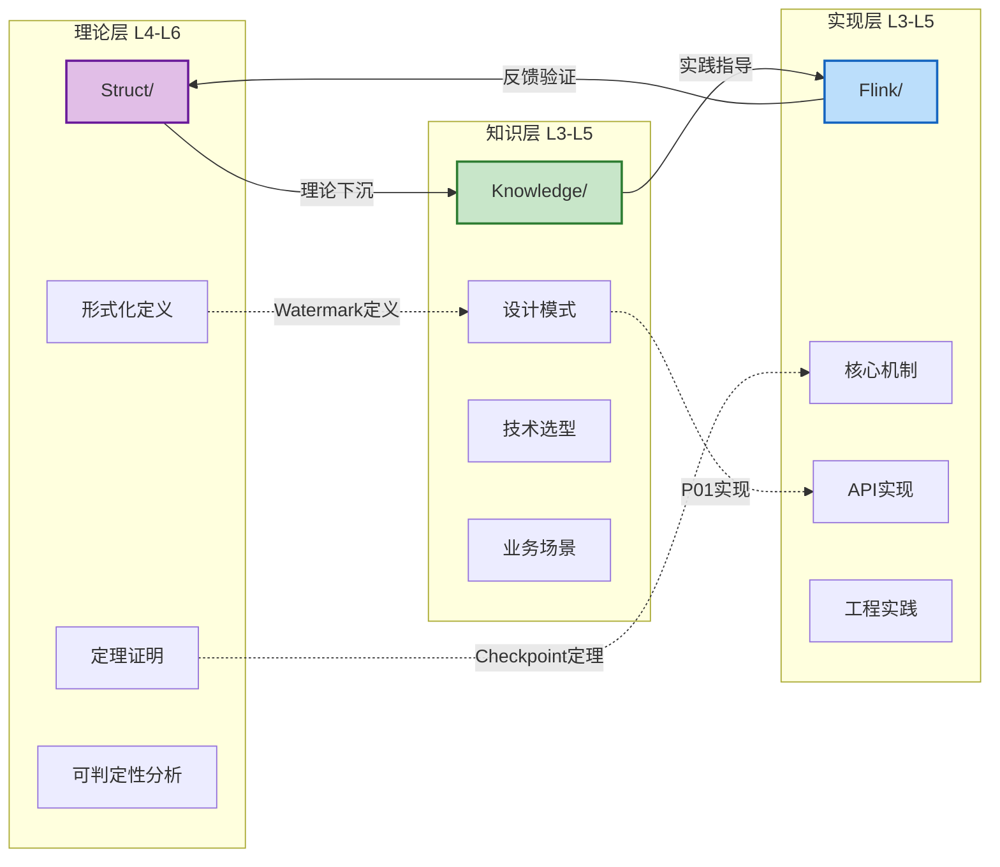

# AnalysisDataFlow完整知识体系思维导图

> **版本**: v2.9 | **最后更新**: 2026-04-03 | **文档统计**: 261篇技术文档 | **形式化元素**: 945+

---

## 项目概览

AnalysisDataFlow是一个**统一流计算理论模型与工程实践知识库**，涵盖流计算的形式化理论、Flink核心技术、工程实践模式与前沿趋势。

### 核心统计数据

| 维度 | 数值 | 说明 |
|------|------|------|
| **总文档数** | 261 | Struct(29) + Knowledge(57+) + Flink(78+) + 其他 |
| **定理 (Thm)** | 159 | 严格形式化证明 |
| **定义 (Def)** | 355 | 形式化定义 |
| **引理 (Lemma)** | 149 | 辅助引理 |
| **命题 (Prop)** | 108 | 性质命题 |
| **推论 (Cor)** | 6 | 形式推论 |
| **设计模式** | 45 | 工程实践模式 |
| **业务场景** | 15 | 行业应用案例 |

---

## 完整知识体系思维导图



---

## 分支详细说明

### 🎓 理论基础 (Struct/)

**定位**: 形式化理论基础，数学定义、定理证明、严格论证

| 子领域 | 核心内容 | 关键定理/定义 | 文档数 |
|--------|----------|---------------|--------|
| **计算模型** | USTM、Actor、CSP、Dataflow、Petri网、π-演算 | Def-S-01-01~06, Thm-S-01~06 | 6 |
| **可判定性** | L1-L6表达能力层次，判定性边界 | Def-S-01-02, Thm-S-14-01 | 3 |
| **核心性质** | 确定性、一致性、Watermark单调性、活性/安全性、类型安全 | Thm-S-07~11 | 5 |
| **形式证明** | Checkpoint、Exactly-Once、Chandy-Lamport正确性 | Thm-S-17~19 | 3 |
| **前沿研究** | Choreographic编程、AI Agent会话类型、pDOT、开放问题 | Thm-S-20, Thm-S-29 | 5 |
| **形式化工具** | Coq、TLA+、Iris、模型检查、Smart Casual | Thm-S-07-tools | 5 |
| **标准规范** | 流式SQL标准 | Thm-S-08-01 | 1 |

**学习路径**:

```
USTM统一理论 → 进程演算基础 → 核心性质 → 形式证明 → 前沿研究
```

---

### 🛠️ 工程实践 (Knowledge/)

**定位**: 知识结构、设计模式、商业应用，连接理论与实现的桥梁

| 子领域 | 核心内容 | 关键模式/场景 | 文档数 |
|--------|----------|---------------|--------|
| **概念图谱** | 并发范式矩阵、流计算模型谱系 | Def-K-01-01~03 | 2 |
| **设计模式** | 7大核心流处理模式 | P01-P07 Pattern | 9 |
| **业务场景** | IoT、金融风控、电商双11、实时推荐等 | 11大行业案例 | 11 |
| **技术选型** | 引擎/范式/存储/一致性决策树 | 多维度选型矩阵 | 4 |
| **映射指南** | Struct→Flink、理论→代码 | 模式实现映射 | 2 |
| **前沿技术** | 流数据库、Rust生态、边缘计算、云边协同 | 21篇前沿文档 | 21 |

**7大核心设计模式**:

1. **P01 Event Time Processing**: 乱序数据处理、Watermark机制
2. **P02 Windowed Aggregation**: 窗口聚合、触发器、驱逐器
3. **P03 CEP**: 复杂事件处理、NFA状态机、模式匹配
4. **P04 Async I/O**: 异步查询、结果缓冲、超时控制
5. **P05 State Management**: Keyed State、Operator State、TTL
6. **P06 Side Output**: 侧输出流、多路输出、异常分流
7. **P07 Checkpoint & Recovery**: Barrier对齐、状态快照、故障恢复

---

### ⚡ Flink实现 (Flink/)

**定位**: Flink专项技术，架构机制、SQL/API、工程实践

| 子领域 | 核心内容 | 关键特性 | 文档数 |
|--------|----------|----------|--------|
| **架构设计** | 1.x vs 2.0、分离状态、部署架构 | Disaggregated State | 4 |
| **核心机制** | Checkpoint、Exactly-Once、Watermark、背压、异步执行 | Barrier对齐、2PC | 12 |
| **SQL/Table API** | SQL优化、向量搜索、物化表、ML预测 | VECTOR_SEARCH、Delta Join | 8 |
| **连接器** | Kafka、CDC、Paimon、Iceberg、Delta Lake | EOS、流批统一 | 8 |
| **AI/ML** | Flink ML、在线学习、RAG、向量数据库、实时特征 | ML_PREDICT | 9 |
| **湖仓集成** | Paimon、Iceberg、流批统一 | Materialized Tables | 2 |
| **安全可信** | GPU机密计算、TEE、数据合规 | 可信执行环境 | 3 |
| **部署运维** | K8s部署、Operator、自动扩缩容、Serverless | Autoscaler | 4 |
| **可观测性** | 指标监控、分布式追踪、数据质量 | OpenTelemetry | 5 |
| **语言基础** | Scala类型、Python API、Rust原生、WASM | TypeInformation | 11 |
| **竞品对比** | Spark Streaming、Kafka Streams、Samza | 对比矩阵 | 3 |
| **案例研究** | IoT、实时分析、智能制造、物流、智能电网 | 生产案例 | 6 |

**Flink 2.x核心演进**:

- **Flink 2.0**: 分离状态存储、异步执行模型、ForSt State Backend
- **Flink 2.1**: Delta Join、ML_PREDICT、物化表
- **Flink 2.2**: VECTOR_SEARCH、Python Async API、Balanced Scheduling

---

### 🔮 前沿趋势 (Frontier/)

**定位**: 探索流计算领域最新技术趋势与前沿方向

| 趋势领域 | 核心技术 | 代表系统/协议 | 状态 |
|----------|----------|---------------|------|
| **AI-Native数据库** | 向量搜索融合、Agent-Native DB、实时RAG、A2A/MCP协议 | RisingWave、Milvus | Active |
| **流数据库** | 物化视图、实时查询、PostgreSQL兼容 | RisingWave、Materialize、Timeplus | Production |
| **云原生演进** | 存算分离、Serverless流处理、有状态无服务器 | Temporal、AWS Lambda | Evolving |
| **边缘计算** | 边缘流处理、云边协同、断网续传 | KubeEdge、Azure IoT Edge | Growing |
| **多语言生态** | Rust流框架、WASM数据流、Go CSP | Arroyo、Wasmtime | Emerging |
| **Web3集成** | 区块链流处理、实时数据产品、Data Mesh | 以太坊、Hyperledger | Experimental |
| **形式化验证** | TLA+、Coq、Iris、模型检查、Smart Casual | TLC、Coq Proof Assistant | Research |

**关键洞察**:

- **2026趋势**: 流处理与AI深度融合，向量搜索成为一等公民
- **协议栈**: A2A(应用层) → MCP(上下文层) → ACP(通信层) → Temporal(执行层)
- **判定性演进**: 从"接受失败"到"故障透明"，Durable Execution成为标准

---

## 知识导航指南

### 按角色导航



### 按场景导航

| 场景需求 | 推荐路径 | 关键文档 |
|----------|----------|----------|
| **理解理论基础** | Struct/01-foundation/ → 02-properties/ | 01.01 USTM, 01.02 进程演算 |
| **掌握设计模式** | Knowledge/02-design-patterns/ | P01-P07 模式全览 |
| **Flink生产实践** | Flink/02-core-mechanisms/ → 06-engineering/ | Checkpoint机制、性能调优 |
| **技术选型决策** | Knowledge/04-technology-selection/ | 引擎/范式/存储选型 |
| **AI集成方案** | Flink/12-ai-ml/ + Knowledge/06-frontier/ | RAG架构、向量数据库 |
| **流数据库选型** | Knowledge/06-frontier/streaming-database-guide.md | RisingWave/Materialize对比 |

### 跨目录引用网络



---

## 版本与更新

### 版本历史

| 版本 | 日期 | 主要更新 |
|------|------|----------|
| v2.9 | 2026-04-03 | A2A协议分析、Smart Casual验证、Flink vs RisingWave对比、反模式 |
| v2.8 | 2026-03-15 | Flink AI Agents (FLIP-531)、实时图流处理TGN、多模态流处理 |
| v2.7 | 2026-02-28 | 流处理反模式、Temporal+Flink分层架构、Serverless成本优化 |
| v2.6 | 2026-02-01 | Flink 2.2特性、VECTOR_SEARCH、物化表、流数据安全合规 |

### 持续更新计划

- **季度更新**: Flink版本跟踪、新特性解析
- **持续补充**: 前沿技术研究、生产案例积累
- **形式化推进**: 新增定理证明、定义完善

---

## 参考索引

### 核心文档入口

| 目录 | 索引文档 | 作用 |
|------|----------|------|
| Struct/ | [Struct/00-INDEX.md](../Struct/00-INDEX.md) | 形式化理论导航 |
| Knowledge/ | [Knowledge/00-INDEX.md](../Knowledge/00-INDEX.md) | 工程实践导航 |
| Flink/ | [Flink/00-INDEX.md](../Flink/00-INDEX.md) | Flink技术导航 |
| 根目录 | [00.md](../00.md) | 项目总览与路线图 |
| 根目录 | [README.md](../README.md) | 项目介绍与快速开始 |

### 定理注册表

完整定理列表见: [THEOREM-REGISTRY.md](../THEOREM-REGISTRY.md)

---

*文档创建时间: 2026-04-03*
*适用项目: AnalysisDataFlow*
*维护建议: 随项目扩展定期更新思维导图分支*
