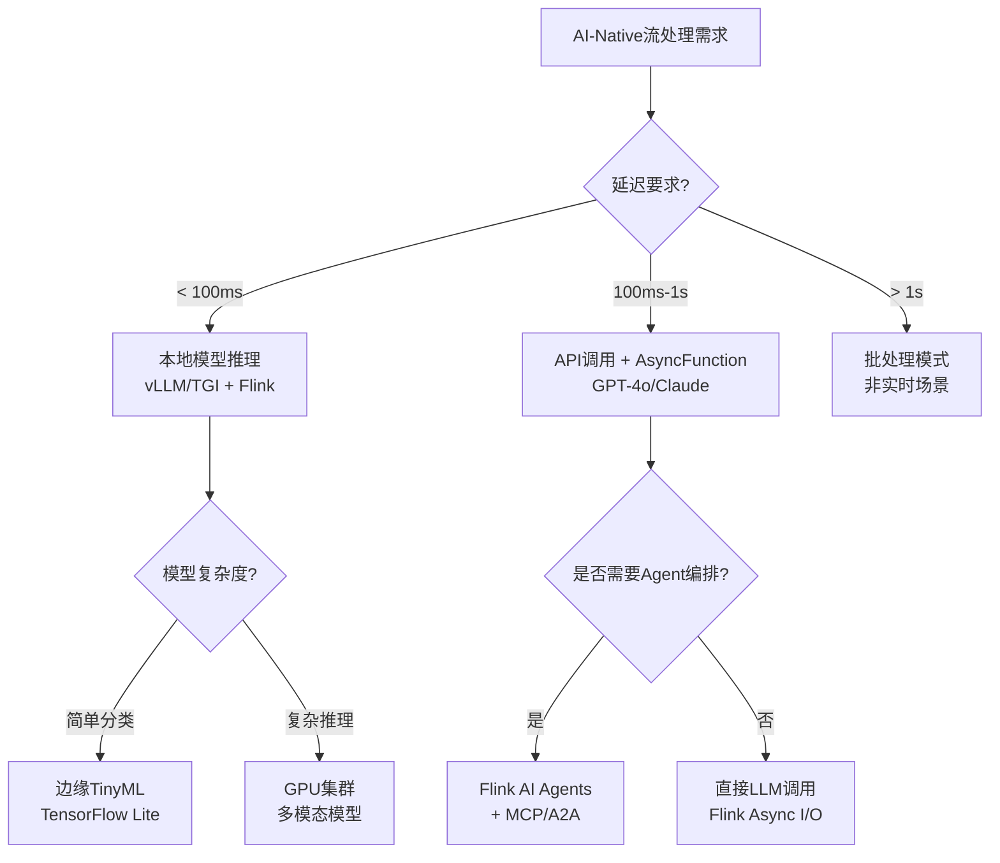
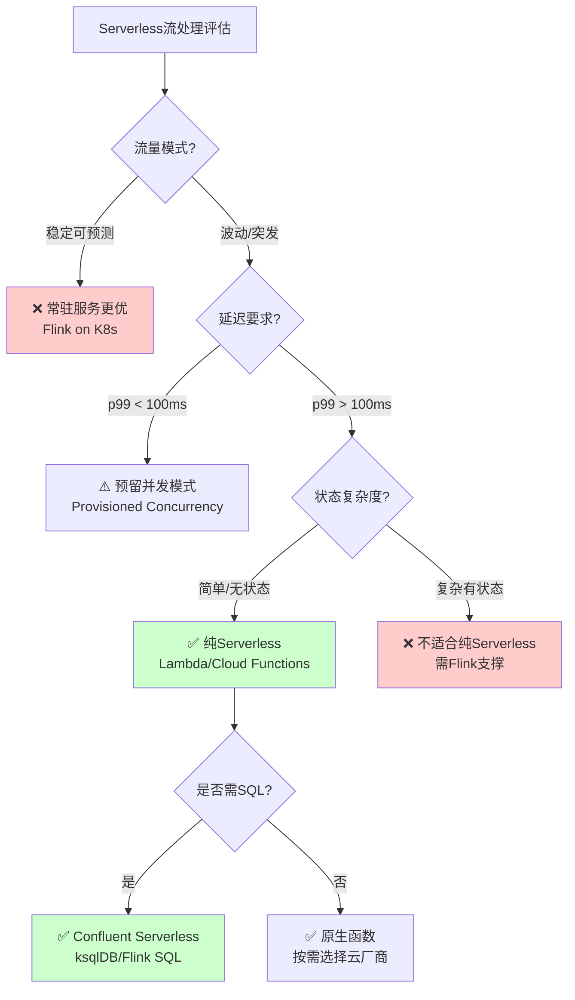
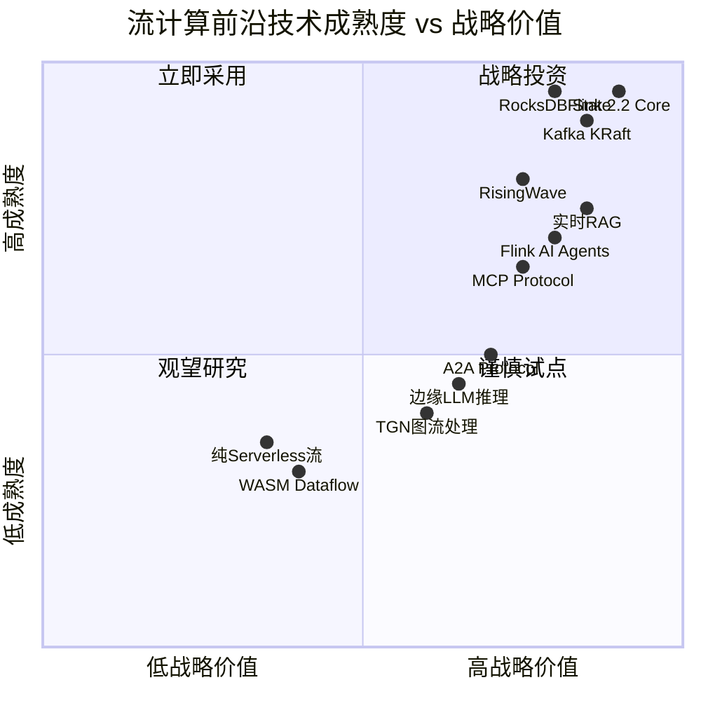
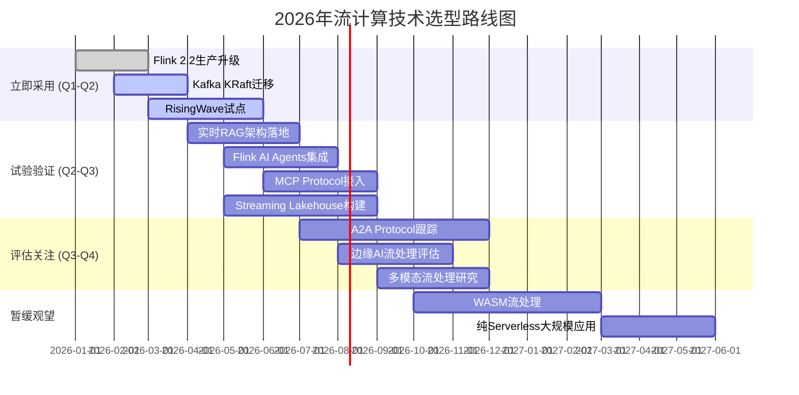
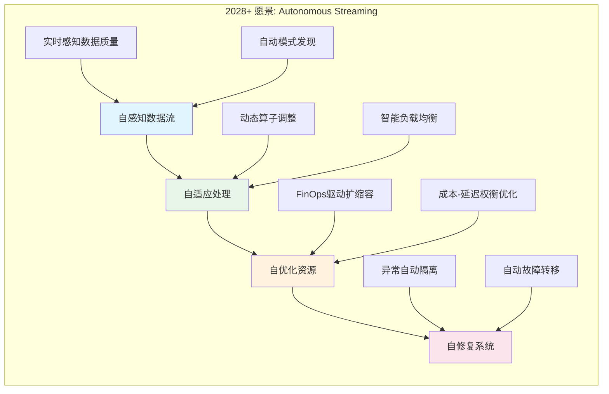

> **状态**: 🔮 前瞻内容 | **风险等级**: 高 | **最后更新**: 2026-04
>
> 此文档描述的内容处于早期规划阶段，可能与最终实现不符。请以 Apache Flink 官方发布为准。
>
# 流计算前沿技术雷达 (Streaming Frontier Tech Radar)

> **版本**: v1.0 | **更新日期**: 2026-04-03 | **状态**: 生产就绪
>
> **数据来源**: AnalysisDataFlow项目 Knowledge/06-frontier/ 系列文档 | 参考: FINAL-COMPLETION-REPORT-v6.0.md

---

## 1. 技术雷达概览

### 1.1 四象限技术雷达图

```mermaid
graph TB
    subgraph "技术采用 (ADOPT) - 成熟稳定"
        direction TB
        AD1[Flink 2.2+ Core<br/>流处理引擎标准]
        AD2[Kafka KRaft<br/>事件流基础设施]
        AD3[RocksDB State Backend<br/>状态管理标准]
        AD4[Checkpoint Exactly-Once<br/>容错机制]
        AD5[SQL Table API<br/>声明式流处理]
    end

    subgraph "试验 (TRIAL) - 值得尝试"
        direction TB
        TR1[RisingWave v2.0<br/>云原生流数据库]
        TR2[Flink AI Agents<br/>FLIP-531 Agent编排]
        TR3[实时RAG架构<br/>流式向量检索]
        TR4[MCP Protocol<br/>模型上下文协议]
        TR5[Streaming Lakehouse<br/>Iceberg/Delta集成]
    end

    subgraph "评估 (ASSESS) - 值得关注"
        direction TB
        AS1[Google A2A Protocol<br/>Agent间协作协议]
        AS2[Temporal + Flink<br/>持久化工作流编排]
        AS3[边缘LLM推理<br/>Edge AI Streaming]
        AS4[多模态流处理<br/>音/视/图融合]
        AS5[TGN图流处理<br/>实时图神经网络]
    end

    subgraph "暂缓 (HOLD) - 谨慎使用"
        direction TB
        HO1[WASM Dataflow<br/>WebAssembly流处理]
        HO2[纯Serverless流<br/>Lambda流计算]
        HO3[Blockchain Streaming<br/>Web3数据流]
        HO4[Choreographic 1CP<br/>PLDI 2025研究]
    end

    style AD1 fill:#90EE90
    style AD2 fill:#90EE90
    style AD3 fill:#90EE90
    style TR1 fill:#FFD700
    style TR2 fill:#FFD700
    style TR3 fill:#FFD700
    style AS1 fill:#87CEEB
    style AS2 fill:#87CEEB
    style AS3 fill:#87CEEB
    style HO1 fill:#FFB6C1
    style HO2 fill:#FFB6C1
```



---

## 2. 技术分类详解

### 2.1 AI-Native 流处理 (AI-Native Streaming)

| 技术 | 象限 | 成熟度 | 推荐时间 | 核心应用场景 |
|------|------|--------|----------|--------------|
| **Flink AI Agents** (FLIP-531) | 🟡 Trial | L3-L4 | 2026 Q2-Q3 | Agent编排、实时决策、工作流自动化 |
| **实时RAG架构** | 🟡 Trial | L3-L4 | 2026 Q1-Q2 | 流式检索增强、知识库实时更新 |
| **MCP Protocol** | 🟡 Trial | L3 | 2026 Q2 | LLM工具集成、上下文管理 |
| **A2A Protocol** | 🔵 Assess | L2-L3 | 2026 Q3-Q4 | 多Agent协作、跨组织Agent网络 |
| **向量搜索集成** | 🟡 Trial | L3 | 2026 Q1 | 实时语义检索、相似度匹配 |

**技术选型建议**:



---

### 2.2 流数据库与存储 (Streaming Databases)

| 技术 | 象限 | 成熟度 | 一致性级别 | 推荐场景 |
|------|------|--------|------------|----------|
| **RisingWave v2.0** | 🟡 Trial | L4-L5 | 快照一致性 | 实时数仓、监控仪表板 |
| **Materialize** | 🟡 Trial | L4-L5 | 严格序列化 | 金融风控、库存管理 |
| **Flink + Paimon** | 🟢 Adopt | L4 | 最终一致性 | 流批一体、湖仓一体 |
| **Apache Iceberg** | 🟡 Trial | L3-L4 | 快照隔离 | 开放湖仓格式、多引擎共享 |
| **Timeplus** | 🔵 Assess | L3 | 顺序一致性 | 边缘到云、轻量级场景 |

**选型决策矩阵**:

```
┌─────────────────────────────────────────────────────────────────┐
│                    流数据库选型决策矩阵                          │
├─────────────────┬───────────────┬───────────────┬───────────────┤
│     维度        │  RisingWave   │  Materialize  │  Flink+Lake   │
├─────────────────┼───────────────┼───────────────┼───────────────┤
│ SQL兼容性       │  PostgreSQL   │  PostgreSQL   │  Flink SQL    │
│ 一致性级别      │  快照一致性   │  严格序列化   │  最终一致性   │
│ 典型延迟        │  1-10s        │  <100ms       │  秒级         │
│ 云原生程度      │  ⭐⭐⭐⭐⭐     │  ⭐⭐⭐         │  ⭐⭐⭐⭐       │
│ 状态存储        │  S3分离       │  本地SSD      │  RocksDB      │
│ 扩缩容速度      │  秒级         │  分钟级       │  分钟级       │
│ 成本模型        │  存储优化     │  计算优化     │  通用         │
└─────────────────┴───────────────┴───────────────┴───────────────┘
```

---

### 2.3 云原生与Serverless (Cloud Native)

| 技术 | 象限 | 成熟度 | 成本模型 | 适用边界 |
|------|------|--------|----------|----------|
| **Flink on Kubernetes** | 🟢 Adopt | L4-L5 | 预留资源 | 生产级稳定工作负载 |
| **Confluent Serverless** | 🟡 Trial | L3-L4 | 按流计费 | 可变负载、快速原型 |
| **边缘流处理** | 🔵 Assess | L2-L3 | 设备成本 | IoT、低延迟边缘场景 |
| **FinOps成本优化** | 🟡 Trial | L3 | 优化ROI | 大规模云部署 |
| **混合架构** | 🟡 Trial | L3-L4 | 基线+峰值 | 波动负载、成本敏感 |

**Serverless流处理边界分析**:



---

### 2.4 协议与标准 (Protocols & Standards)

| 技术 | 象限 | 成熟度 | 生态支持 | 战略价值 |
|------|------|--------|----------|----------|
| **MCP (Model Context Protocol)** | 🟡 Trial | L3 | Anthropic主导 | 工具标准化、LLM集成 |
| **A2A (Agent-to-Agent)** | 🔵 Assess | L2-L3 | Google/Linux基金会 | 多Agent互操作 |
| **流式SQL标准** | 🟢 Adopt | L4 | ANSI SQL扩展 | 声明式流处理 |
| **Debezium CDC** | 🟢 Adopt | L4-L5 | 开源标准 | 数据变更捕获 |
| **OpenTelemetry** | 🟡 Trial | L3-L4 | CNCF | 可观测性标准化 |

**MCP vs A2A 协议对比**:

```
┌─────────────────────────────────────────────────────────────────┐
│                    MCP vs A2A 协议对比                           │
├──────────────────┬──────────────────┬───────────────────────────┤
│       维度       │      MCP         │          A2A              │
├──────────────────┼──────────────────┼───────────────────────────┤
│ 抽象层级         │ L2: 模型上下文层 │ L3: Agent协作层           │
│ 通信范式         │ Hub-and-Spoke    │ Peer-to-Peer              │
│ 核心实体         │ Resources/Tools  │ Tasks/Messages/Artifacts  │
│ 状态模型         │ 无状态           │ 有状态(生命周期管理)       │
│ 发现机制         │ 运行时协商       │ Agent Card预声明          │
│ 交互时长         │ 毫秒-秒级        │ 毫秒-小时级               │
│ 主要用途         │ 工具集成         │ Agent编排/工作流协作       │
│ 生态成熟度       │ ⭐⭐⭐            │ ⭐⭐ (2025.4发布)          │
└──────────────────┴──────────────────┴───────────────────────────┘
```

---

## 3. 技术成熟度评估模型

### 3.1 成熟度等级定义

| 等级 | 标识 | 描述 | 生产就绪度 |
|------|------|------|------------|
| **L5** | 🟢 生产级 | 大规模生产验证，生态成熟，文档完善 | 100% |
| **L4** | 🟡 准生产 | 生产可用，有成功案例，部分边界待验证 | 85% |
| **L3** | 🔵 评估级 | 技术可行，PoC验证，生产需谨慎 | 60% |
| **L2** | 🟠 实验级 | 概念验证，API可能变化，风险较高 | 30% |
| **L1** | ⚪ 概念级 | 研究阶段，不建议生产使用 | 10% |

### 3.2 2026年技术成熟度全景



---

## 4. 技术选型时间线建议

### 4.1 2026年度技术路线图



### 4.2 分场景技术选型建议

#### 场景A: 实时数据仓库

| 阶段 | 推荐技术栈 | 预期效果 | 风险等级 |
|------|-----------|----------|----------|
| **即刻** | Flink + Iceberg/Paimon | 流批一体、湖仓统一 | 🟢 低 |
| **3个月** | RisingWave作为查询加速层 | 亚秒级查询延迟 | 🟡 中 |
| **6个月** | 实时RAG增强BI分析 | 自然语言查询 | 🟡 中 |

#### 场景B: AI驱动的实时决策

| 阶段 | 推荐技术栈 | 预期效果 | 风险等级 |
|------|-----------|----------|----------|
| **即刻** | Flink AsyncFunction + LLM API | 秒级AI决策 | 🟡 中 |
| **3个月** | Flink AI Agents (FLIP-531) | Agent编排能力 | 🟡 中 |
| **6个月** | MCP/A2A协议集成 | 多Agent协作 | 🔵 中高 |

#### 场景C: IoT边缘流处理

| 阶段 | 推荐技术栈 | 预期效果 | 风险等级 |
|------|-----------|----------|----------|
| **即刻** | Flink MiniCluster + 边缘K8s | 边缘实时计算 | 🟡 中 |
| **3个月** | Timeplus边缘网关 | 轻量级部署 | 🔵 中高 |
| **6个月** | 边缘LLM实时推理 | 本地AI决策 | 🔵 中高 |

---

## 5. 技术趋势预测 (2026-2028)

### 5.1 短期趋势 (2026 H2)

```
┌─────────────────────────────────────────────────────────────────┐
│                    2026下半年趋势预测                            │
├─────────────────────────────────────────────────────────────────┤
│ 🔥 热点技术                                                      │
│ • Flink 2.3发布: AI Agent原生支持成熟化                          │
│ • RisingWave v2.x: 云原生流数据库市场份额快速增长                │
│ • MCP生态爆发: LLM工具集成标准地位确立                           │
│                                                                 │
│ 📈 增长领域                                                      │
│ • 实时RAG: 企业知识库实时化成为标配                              │
│ • 向量搜索: 从独立系统向流处理引擎集成演进                       │
│ • Streaming Lakehouse: 开放格式(Iceberg/Delta)成为主流           │
│                                                                 │
│ ⚠️ 风险点                                                        │
│ • A2A协议生态碎片化: 与MCP的竞争/融合待观察                      │
│ • 边缘AI延迟: LLM边缘推理成本与延迟仍需优化                      │
└─────────────────────────────────────────────────────────────────┘
```

### 5.2 中期预测 (2027)

| 趋势 | 预测概率 | 影响范围 | 准备建议 |
|------|----------|----------|----------|
| **Agent-Native Streaming** | 80% | 架构范式变革 | 学习Flink AI Agents |
| **流数据库标准化** | 70% | 市场格局 | 关注SQL方言兼容 |
| **边缘流AI普及** | 65% | IoT场景 | 评估TinyML + Flink |
| **Serverless流成熟** | 60% | 成本优化 | 混合架构设计能力 |

### 5.3 长期展望 (2028+)



---

## 6. 技术雷达使用指南

### 6.1 如何阅读本雷达

1. **象限定位**: 首先确定技术所在的象限
   - **Adopt**: 可放心用于生产，团队应具备相关能力
   - **Trial**: 适合在非关键场景试点，积累实践经验
   - **Assess**: 保持关注，进行PoC验证，暂不投入生产
   - **Hold**: 暂缓采用，等待技术成熟或生态完善

2. **成熟度参考**: 结合L1-L5等级评估生产就绪度

3. **时间线规划**: 参考2026年度路线图制定团队学习计划

### 6.2 决策检查清单

在引入前沿技术前，请确认：

- [ ] 业务场景确实需要该技术特性（非技术冲动）
- [ ] 团队具备相关技术栈基础（或预留学习时间）
- [ ] 有明确的成功指标和回滚方案
- [ ] 技术生态支持当前基础设施
- [ ] 总拥有成本(TCO)已充分评估

---

## 7. 参考文档索引

### 7.1 相关项目文档

| 技术领域 | 参考文档路径 | 形式化等级 |
|----------|-------------|------------|
| Flink AI Agents | `Flink/12-ai-ml/flink-ai-agents-flip-531.md` | L4-L5 |
| MCP Protocol | `Knowledge/06-frontier/mcp-protocol-agent-streaming.md` | L3-L4 |
| A2A Protocol | `Knowledge/06-frontier/ai-agent-a2a-protocol.md` | L3-L5 |
| RisingWave | `Knowledge/06-frontier/risingwave-deep-dive.md` | L4-L5 |
| 流数据库对比 | `Knowledge/06-frontier/streaming-database-ecosystem-comparison.md` | L3-L4 |
| 实时RAG | `Knowledge/06-frontier/real-time-rag-architecture.md` | L3-L4 |
| Serverless流 | `Knowledge/06-frontier/serverless-streaming-architecture.md` | L3 |
| Streaming AI | `Knowledge/06-frontier/realtime-ai-streaming-2026.md` | L3-L4 |
| 边缘流处理 | `Knowledge/06-frontier/edge-streaming-architecture.md` | L3 |
| 图流处理 | `Knowledge/06-frontier/realtime-graph-streaming-tgnn.md` | L3-L4 |

### 7.2 外部参考


---

## 8. 版本历史

| 版本 | 日期 | 更新内容 | 作者 |
|------|------|----------|------|
| v1.0 | 2026-04-03 | 初始版本，覆盖2026年流计算前沿技术全景 | AnalysisDataFlow Core |

---

*本雷达图由 AnalysisDataFlow 项目维护，基于259篇技术文档、964个形式化元素、1970+代码示例的综合分析生成。建议每季度回顾更新。*
