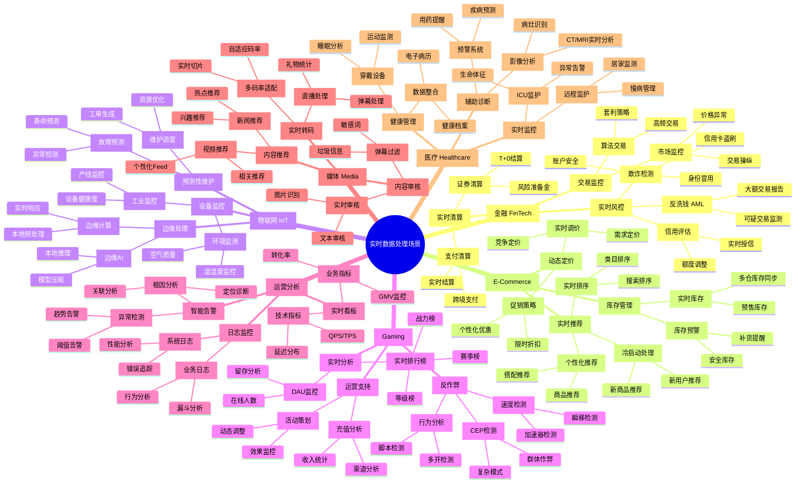
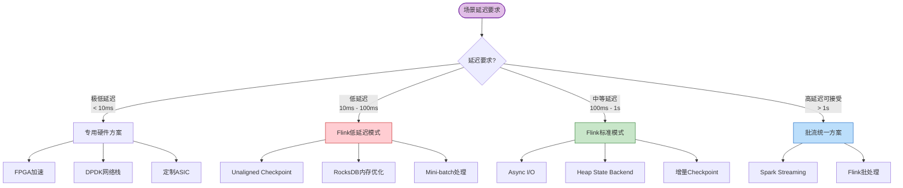
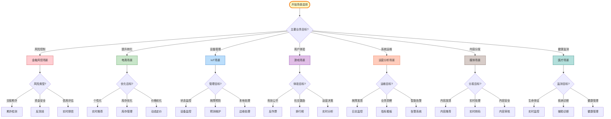

# 业务场景层次树

> **版本**: v1.0 | **更新日期**: 2026-04-03 | **文档定位**: 实时数据处理业务场景全景导航
>
> 本文档提供流计算领域业务场景的层次化可视化，帮助架构师和工程师快速定位适用场景、选择技术方案。

---

## 目录

- [业务场景层次树](#业务场景层次树)
  - [目录](#目录)
  - [1. 业务场景全景 Mindmap](#1-业务场景全景-mindmap)
  - [2. 场景详细说明](#2-场景详细说明)
    - [2.1 金融场景](#21-金融场景)
    - [2.2 电商场景](#22-电商场景)
    - [2.3 IoT 场景](#23-iot-场景)
    - [2.4 游戏场景](#24-游戏场景)
    - [2.5 运营分析场景](#25-运营分析场景)
    - [2.6 媒体场景](#26-媒体场景)
    - [2.7 医疗场景](#27-医疗场景)
  - [3. 技术栈推荐矩阵](#3-技术栈推荐矩阵)
    - [3.1 按延迟要求选型](#31-按延迟要求选型)
    - [3.2 按数据规模选型](#32-按数据规模选型)
    - [3.3 技术栈组件推荐](#33-技术栈组件推荐)
  - [4. 场景选择决策流程](#4-场景选择决策流程)
    - [4.1 主决策树](#41-主决策树)
    - [4.2 技术选型决策检查表](#42-技术选型决策检查表)
    - [4.3 场景复杂度评估](#43-场景复杂度评估)
  - [5. 模式-场景映射表](#5-模式-场景映射表)
    - [5.1 核心设计模式适用场景](#51-核心设计模式适用场景)
    - [5.2 模式组合推荐](#52-模式组合推荐)
  - [6. 引用参考](#6-引用参考)
    - [6.1 Knowledge/ 业务场景文档](#61-knowledge-业务场景文档)
    - [6.2 Flink/ 案例文档](#62-flink-案例文档)
    - [6.3 设计模式文档](#63-设计模式文档)

---

## 1. 业务场景全景 Mindmap



---

## 2. 场景详细说明

### 2.1 金融场景

| 子场景 | 核心需求 | 延迟要求 | 一致性 | 关键技术 |
|--------|----------|----------|--------|----------|
| **欺诈检测** | 实时识别可疑交易 | < 100ms | Exactly-Once | CEP + ML |
| **反洗钱** | 监测可疑资金流动 | < 1s | Exactly-Once | 图分析 + CEP |
| **信用评估** | 实时授信决策 | < 200ms | Exactly-Once | 特征工程 + 模型推理 |
| **市场监控** | 检测市场操纵行为 | < 500ms | At-Least-Once | 窗口聚合 + 规则引擎 |
| **算法交易** | 高频交易策略执行 | < 10ms | Exactly-Once | 低延迟计算 + FPGA |
| **支付清算** | 实时资金结算 | < 1s | Exactly-Once | 分布式事务 + 状态管理 |

**推荐模式组合**: P01(Event Time) + P03(CEP) + P05(State) + P07(Checkpoint)

**技术栈**:

- 流引擎: Flink (低延迟模式)
- 消息队列: Kafka
- 状态存储: RocksDB
- 特征存储: Redis + HBase
- 模型服务: TensorFlow Serving
- 规则引擎: Drools / EasyRules

**参考文档**: [金融实时风控](../Knowledge/03-business-patterns/fintech-realtime-risk-control.md) | [Flink金融案例](../Flink/09-practices/09.01-case-studies/case-financial-realtime-risk-control.md)

---

### 2.2 电商场景

| 子场景 | 核心需求 | 延迟要求 | 一致性 | 关键技术 |
|--------|----------|----------|--------|----------|
| **个性化推荐** | 基于实时行为的商品推荐 | < 200ms | At-Least-Once | Async I/O + 窗口聚合 |
| **实时排序** | 搜索结果实时重排 | < 100ms | At-Least-Once | 特征拼接 + 轻量模型 |
| **冷启动处理** | 新用户/新商品推荐 | < 300ms | At-Least-Once | 上下文特征 + 热门兜底 |
| **实时库存** | 多仓库存同步 | < 1s | Exactly-Once | Keyed State + 分布式锁 |
| **库存预警** | 自动补货提醒 | < 5s | At-Least-Once | 窗口聚合 + 阈值判断 |
| **动态定价** | 基于供需实时调价 | < 10s | At-Least-Once | 规则引擎 + ML模型 |
| **促销策略** | 个性化优惠发放 | < 500ms | At-Least-Once | 用户画像 + 规则匹配 |

**推荐模式组合**: P02(Window) + P04(Async I/O) + P05(State) + P06(Side Output)

**技术栈**:

- 流引擎: Flink
- 消息队列: Kafka / Pulsar
- 特征存储: Redis / Feature Store
- 向量检索: Elasticsearch / Milvus
- 模型服务: 自研/TensorFlow Serving
- 缓存: Redis Cluster

**参考文档**: [实时推荐系统](../Knowledge/03-business-patterns/real-time-recommendation.md) | [电商推荐案例](../Flink/09-practices/09.01-case-studies/case-ecommerce-realtime-recommendation.md) | [阿里双11](../Knowledge/03-business-patterns/alibaba-double11-flink.md)

---

### 2.3 IoT 场景

| 子场景 | 核心需求 | 延迟要求 | 一致性 | 关键技术 |
|--------|----------|----------|--------|----------|
| **工业监控** | 设备运行状态实时监控 | < 1s | At-Least-Once | 时序聚合 + 阈值告警 |
| **环境监测** | 温湿度等环境指标监控 | < 10s | At-Least-Once | 窗口聚合 + 趋势分析 |
| **故障预测** | 基于数据模式的故障预警 | < 5s | At-Least-Once | CEP + ML推理 |
| **维护调度** | 智能工单生成与调度 | < 1min | At-Least-Once | 规则引擎 + 优化算法 |
| **边缘计算** | 本地预处理和实时响应 | < 100ms | At-Least-Once | 边缘Flink/自研运行时 |
| **边缘AI** | 本地模型推理 | < 50ms | At-Least-Once | 模型压缩 + 边缘部署 |

**推荐模式组合**: P01(Event Time) + P02(Window) + P05(State) + P07(Checkpoint)

**技术栈**:

- 接入层: MQTT Broker (EMQX/Mosquitto)
- 流引擎: Flink / 边缘轻量级运行时
- 消息队列: Kafka
- 时序数据库: TDengine / InfluxDB / IoTDB
- 边缘网关: 自研/开源边缘框架
- 协议: MQTT / CoAP / HTTP

**参考文档**: [IoT流处理](../Knowledge/03-business-patterns/iot-stream-processing.md) | [IoT案例](../Flink/09-practices/09.01-case-studies/case-iot-stream-processing.md) | [智能制造](../Flink/09-practices/09.01-case-studies/case-smart-manufacturing-iot.md)

---

### 2.4 游戏场景

| 子场景 | 核心需求 | 延迟要求 | 一致性 | 关键技术 |
|--------|----------|----------|--------|----------|
| **实时排行榜** | 全服/分区战力排名 | < 5s | At-Least-Once | 窗口聚合 + Redis Sorted Set |
| **DAU监控** | 实时在线人数统计 | < 1min | At-Least-Once | 去重聚合 + 时序存储 |
| **速度检测** | 检测加速外挂 | < 5s | At-Least-Once | CEP + 速度计算 |
| **行为分析** | 脚本/多开检测 | < 30s | At-Least-Once | 模式匹配 + 统计分析 |
| **充值分析** | 实时收入统计 | < 1min | Exactly-Once | 窗口聚合 + 精确去重 |
| **活动策划** | 活动效果实时监控 | < 1min | At-Least-Once | 漏斗分析 + 对比分析 |

**推荐模式组合**: P01(Event Time) + P02(Window) + P03(CEP) + P06(Side Output)

**技术栈**:

- 接入层: Actor模型 (Akka/Pekko)
- 流引擎: Flink
- 消息队列: Kafka / Pulsar
- 排行榜: Redis Sorted Set
- 时序存储: ClickHouse / TDengine
- 实时推送: WebSocket

**参考文档**: [游戏实时分析](../Knowledge/03-business-patterns/gaming-analytics.md) | [游戏案例](../Flink/09-practices/09.01-case-studies/case-gaming-realtime-analytics.md)

---

### 2.5 运营分析场景

| 子场景 | 核心需求 | 延迟要求 | 一致性 | 关键技术 |
|--------|----------|----------|--------|----------|
| **系统日志监控** | 错误追踪与性能分析 | < 1min | At-Least-Once | 日志解析 + 聚合分析 |
| **业务日志分析** | 用户行为漏斗分析 | < 5min | At-Least-Once | 会话窗口 + 路径分析 |
| **业务指标看板** | GMV/转化率实时监控 | < 1min | At-Least-Once | 窗口聚合 + 指标计算 |
| **技术指标看板** | QPS/延迟实时监控 | < 10s | At-Least-Once | 滑动窗口 + 分位数计算 |
| **异常检测** | 智能阈值告警 | < 1min | At-Least-Once | 统计模型 + 规则引擎 |
| **根因分析** | 故障关联定位 | < 5min | At-Least-Once | 图分析 + 关联规则 |

**推荐模式组合**: P02(Window) + P06(Side Output) + P07(Checkpoint)

**技术栈**:

- 流引擎: Flink / Kafka Streams
- 消息队列: Kafka
- 日志收集: Filebeat / Fluentd / Logstash
- 存储: Elasticsearch / ClickHouse
- 可视化: Grafana / Kibana

**参考文档**: [日志监控](../Knowledge/03-business-patterns/log-monitoring.md) | [Netflix流水线](../Knowledge/03-business-patterns/netflix-streaming-pipeline.md)

---

### 2.6 媒体场景

| 子场景 | 核心需求 | 延迟要求 | 一致性 | 关键技术 |
|--------|----------|----------|--------|----------|
| **视频推荐** | 个性化Feed流 | < 200ms | At-Least-Once | 实时特征 + 向量检索 |
| **新闻推荐** | 兴趣/热点内容推荐 | < 100ms | At-Least-Once | 内容理解 + 用户画像 |
| **多码率适配** | 自适应码率切换 | < 5s | At-Least-Once | 带宽估计 + 质量决策 |
| **直播处理** | 弹幕/礼物实时统计 | < 1s | At-Least-Once | 窗口聚合 + 去重 |
| **内容审核** | 图片/视频实时审核 | < 500ms | At-Least-Once | 异步AI推理 |
| **弹幕过滤** | 敏感内容实时过滤 | < 100ms | At-Least-Once | 规则匹配 + ML模型 |

**推荐模式组合**: P02(Window) + P04(Async I/O) + P05(State)

**技术栈**:

- 流引擎: Flink
- 消息队列: Kafka / RocketMQ
- 内容理解: 自研AI服务 / 云服务
- 向量检索: Milvus / Elasticsearch
- 缓存: Redis

**参考文档**: [Spotify音乐推荐](../Knowledge/03-business-patterns/spotify-music-recommendation.md) | [Uber实时平台](../Knowledge/03-business-patterns/uber-realtime-platform.md)

---

### 2.7 医疗场景

| 子场景 | 核心需求 | 延迟要求 | 一致性 | 关键技术 |
|--------|----------|----------|--------|----------|
| **ICU监护** | 生命体征实时监测 | < 1s | At-Least-Once | 时序聚合 + 阈值告警 |
| **远程监护** | 慢病患者居家监测 | < 10s | At-Least-Once | 趋势分析 + 异常检测 |
| **影像分析** | CT/MRI实时辅助诊断 | < 5s | At-Least-Once | 异步AI推理 |
| **疾病预警** | 基于数据的疾病预测 | < 1min | At-Least-Once | ML模型 + 规则引擎 |
| **穿戴设备** | 运动/睡眠数据采集 | < 1min | At-Least-Once | 设备接入 + 数据清洗 |
| **数据整合** | 多源医疗数据融合 | < 5min | At-Least-Once | 数据对齐 + 实体关联 |

**推荐模式组合**: P01(Event Time) + P02(Window) + P04(Async I/O) + P05(State)

**技术栈**:

- 流引擎: Flink
- 消息队列: Kafka
- 时序数据库: InfluxDB / TDengine
- AI推理: TensorFlow Serving / TorchServe
- 数据标准: HL7 FHIR

---

## 3. 技术栈推荐矩阵

### 3.1 按延迟要求选型



### 3.2 按数据规模选型

| 数据规模 | 日数据量 | 推荐架构 | 关键配置 |
|----------|----------|----------|----------|
| **小型** | < 1TB | 单集群Flink | 并行度 10-50，Heap State |
| **中型** | 1TB - 100TB | 多集群Flink | 并行度 50-200，RocksDB State |
| **大型** | 100TB - 1PB | 分层架构 | 边缘+中心，RocksDB增量Checkpoint |
| **超大型** | > 1PB | 云原生架构 | K8s自动扩缩容，分层存储 |

### 3.3 技术栈组件推荐

| 组件类型 | 小型场景 | 中型场景 | 大型场景 |
|----------|----------|----------|----------|
| **流引擎** | Flink (单机) | Flink (集群) | Flink (多集群) |
| **消息队列** | 单节点Kafka | Kafka集群 | Kafka + Pulsar |
| **状态存储** | Heap | RocksDB本地 | RocksDB + 远程存储 |
| **特征存储** | Redis单机 | Redis Cluster | Redis + HBase |
| **时序存储** | InfluxDB单节点 | TDengine集群 | TDengine + 冷存储 |
| **OLAP** | ClickHouse单节点 | ClickHouse集群 | ClickHouse + StarRocks |

---

## 4. 场景选择决策流程

### 4.1 主决策树



### 4.2 技术选型决策检查表

```markdown
□ 延迟要求评估
  □ 极低延迟 (< 10ms): 考虑专用硬件或边缘计算
  □ 低延迟 (10-100ms): Flink低延迟优化配置
  □ 中等延迟 (100ms-1s): Flink标准配置
  □ 高延迟可接受 (> 1s): 批流统一方案

□ 数据规模评估
  □ 小数据量 (< 1TB/天): 简化架构，Heap State
  □ 中数据量 (1-100TB/天): 标准集群架构
  □ 大数据量 (> 100TB/天): 分层架构，RocksDB State

□ 一致性要求评估
  □ Exactly-Once必需: 启用Checkpoint，2PC Sink
  □ At-Least-Once可接受: 简化容错配置
  □ 最终一致性可接受: 异步处理，批量写入

□ 状态复杂度评估
  □ 无状态/简单状态: Heap State Backend
  □ 中等状态 (< 100GB): RocksDB本地存储
  □ 大状态 (> 100GB): RocksDB + 增量Checkpoint

□ 外部依赖评估
  □ 需要外部特征查询: 配置Async I/O
  □ 需要模型推理: 集成Model Serving
  □ 需要规则引擎: 集成Drools/EasyRules
```

### 4.3 场景复杂度评估

| 场景 | 技术复杂度 | 业务复杂度 | 数据规模 | 整体评估 |
|------|------------|------------|----------|----------|
| 金融风控 | ★★★★★ | ★★★★★ | ★★★☆☆ | 极高 |
| 实时推荐 | ★★★★☆ | ★★★★☆ | ★★★★★ | 高 |
| IoT监控 | ★★★★☆ | ★★★☆☆ | ★★★★★ | 高 |
| 游戏反作弊 | ★★★★★ | ★★★★☆ | ★★★★☆ | 高 |
| 日志监控 | ★★★☆☆ | ★★☆☆☆ | ★★★★★ | 中 |
| 实时排行榜 | ★★★☆☆ | ★★★☆☆ | ★★★★☆ | 中 |
| 内容推荐 | ★★★★☆ | ★★★☆☆ | ★★★★☆ | 中 |
| 医疗监护 | ★★★☆☆ | ★★★★★ | ★★☆☆☆ | 中高 |

---

## 5. 模式-场景映射表

### 5.1 核心设计模式适用场景

| 模式 | 金融 | 电商 | IoT | 游戏 | 运营 | 媒体 | 医疗 |
|------|:----:|:----:|:---:|:----:|:----:|:----:|:----:|
| **P01 Event Time** | ✅ | ✅ | ✅ | ✅ | ⚪ | ✅ | ✅ |
| **P02 Windowed Aggregation** | ✅ | ✅ | ✅ | ✅ | ✅ | ✅ | ✅ |
| **P03 CEP** | ✅ | ⚪ | ✅ | ✅ | ⚪ | ⚪ | ⚪ |
| **P04 Async I/O** | ✅ | ✅ | ⚪ | ⚪ | ⚪ | ✅ | ✅ |
| **P05 State Management** | ✅ | ✅ | ✅ | ✅ | ⚪ | ✅ | ✅ |
| **P06 Side Output** | ✅ | ⚪ | ✅ | ✅ | ✅ | ⚪ | ⚪ |
| **P07 Checkpoint** | ✅ | ⚪ | ✅ | ⚪ | ⚪ | ⚪ | ⚪ |

*图例: ✅ 核心依赖 | ⚪ 可选增强*

### 5.2 模式组合推荐

| 场景 | 核心模式组合 | 形式化基础 |
|------|-------------|------------|
| 金融风控 | P01 + P03 + P05 + P07 | `Thm-S-07-01` CEP确定性 |
| 实时推荐 | P02 + P04 + P05 | `Lemma-S-04-02` 单调性 |
| IoT监控 | P01 + P02 + P05 + P07 | `Def-S-04-04` Watermark语义 |
| 游戏反作弊 | P01 + P03 + P06 | `Thm-S-03-01` Actor容错 |
| 日志监控 | P02 + P06 + P07 | `Def-S-17-02` 状态定义 |
| 实时排行榜 | P02 + P05 | `Lemma-S-04-01` 窗口完整性 |
| 内容推荐 | P02 + P04 + P05 | `Prop-S-04-01` 乱序处理 |
| 医疗监护 | P01 + P02 + P05 | `Def-S-04-05` 窗口算子 |

---

## 6. 引用参考

### 6.1 Knowledge/ 业务场景文档

- [金融实时风控](../Knowledge/03-business-patterns/fintech-realtime-risk-control.md) - 金融风控完整方案
- [IoT流处理](../Knowledge/03-business-patterns/iot-stream-processing.md) - 物联网场景模式
- [实时推荐系统](../Knowledge/03-business-patterns/real-time-recommendation.md) - 推荐系统架构
- [游戏实时分析](../Knowledge/03-business-patterns/gaming-analytics.md) - 游戏场景方案
- [日志监控](../Knowledge/03-business-patterns/log-monitoring.md) - 运营分析场景
- [阿里双11](../Knowledge/03-business-patterns/alibaba-double11-flink.md) - 超大规模案例
- [Netflix流水线](../Knowledge/03-business-patterns/netflix-streaming-pipeline.md) - 媒体场景
- [Uber实时平台](../Knowledge/03-business-patterns/uber-realtime-platform.md) - 出行场景
- [Spotify音乐推荐](../Knowledge/03-business-patterns/spotify-music-recommendation.md) - 内容推荐
- [Airbnb市场动态](../Knowledge/03-business-patterns/airbnb-marketplace-dynamics.md) - 双边市场

### 6.2 Flink/ 案例文档

- [金融风控案例](../Flink/09-practices/09.01-case-studies/case-financial-realtime-risk-control.md)
- [电商推荐案例](../Flink/09-practices/09.01-case-studies/case-ecommerce-realtime-recommendation.md)
- [IoT案例](../Flink/09-practices/09.01-case-studies/case-iot-stream-processing.md)
- [游戏案例](../Flink/09-practices/09.01-case-studies/case-gaming-realtime-analytics.md)
- [智能电网](../Flink/09-practices/09.01-case-studies/case-smart-grid-energy-management.md)
- [智能制造](../Flink/09-practices/09.01-case-studies/case-smart-manufacturing-iot.md)
- [物流追踪](../Flink/09-practices/09.01-case-studies/case-logistics-realtime-tracking.md)
- [点击流分析](../Flink/09-practices/09.01-case-studies/case-clickstream-user-behavior-analytics.md)

### 6.3 设计模式文档

- [Pattern 01: Event Time Processing](../Knowledge/02-design-patterns/pattern-event-time-processing.md)
- [Pattern 02: Windowed Aggregation](../Knowledge/02-design-patterns/pattern-windowed-aggregation.md)
- [Pattern 03: CEP](../Knowledge/02-design-patterns/pattern-cep-complex-event.md)
- [Pattern 04: Async I/O](../Knowledge/02-design-patterns/pattern-async-io-enrichment.md)
- [Pattern 05: State Management](../Knowledge/02-design-patterns/pattern-stateful-computation.md)
- [Pattern 06: Side Output](../Knowledge/02-design-patterns/pattern-side-output.md)
- [Pattern 07: Checkpoint](../Knowledge/02-design-patterns/pattern-checkpoint-recovery.md)

---

*本文档作为AnalysisDataFlow项目业务场景的入口导航，建议结合具体场景文档深入阅读。*
