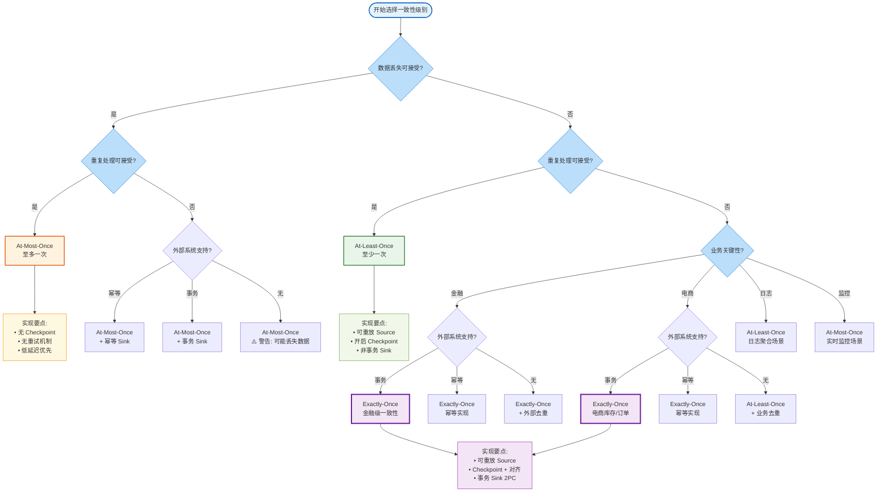
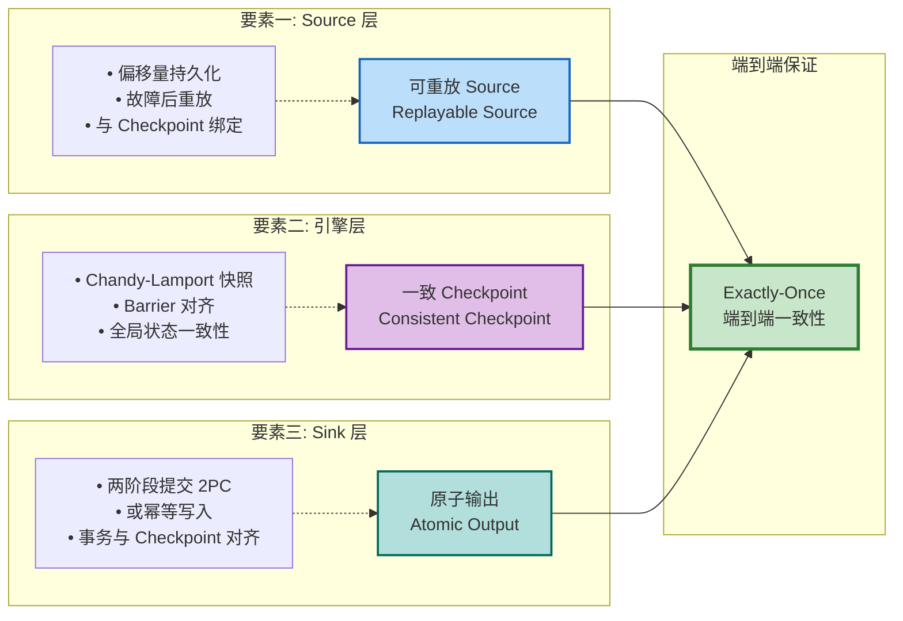

# 一致性级别选择决策树

> 所属阶段: Knowledge/Visuals | 前置依赖: [一致性层次](../Struct/02-properties/02.02-consistency-hierarchy.md), [端到端Exactly-Once](../Flink/02-core-mechanisms/exactly-once-end-to-end.md) | 形式化等级: L3

---

## 目录

- [一致性级别选择决策树](#一致性级别选择决策树)
  - [目录](#目录)
  - [1. 决策树概览](#1-决策树概览)
  - [2. 一致性级别选择决策树 (Mermaid)](#2-一致性级别选择决策树-mermaid)
  - [3. 决策节点详解](#3-决策节点详解)
    - [3.1 数据丢失可接受?](#31-数据丢失可接受)
    - [3.2 重复处理可接受?](#32-重复处理可接受)
    - [3.3 业务关键性评估](#33-业务关键性评估)
    - [3.4 外部系统支持能力](#34-外部系统支持能力)
  - [4. 一致性级别详解](#4-一致性级别详解)
    - [4.1 At-Most-Once (至多一次)](#41-at-most-once-至多一次)
    - [4.2 At-Least-Once (至少一次)](#42-at-least-once-至少一次)
    - [4.3 Exactly-Once (恰好一次)](#43-exactly-once-恰好一次)
  - [5. 端到端 Exactly-Once 实现三要素](#5-端到端-exactly-once-实现三要素)
    - [三要素详细说明](#三要素详细说明)
    - [形式化表达](#形式化表达)
  - [6. 业务场景映射表](#6-业务场景映射表)
  - [7. 配置示例](#7-配置示例)
    - [7.1 Flink 配置模板](#71-flink-配置模板)
      - [At-Most-Once 配置](#at-most-once-配置)
      - [At-Least-Once 配置](#at-least-once-配置)
      - [Exactly-Once 配置](#exactly-once-配置)
    - [7.2 Source/Sink 组合推荐](#72-sourcesink-组合推荐)
      - [At-Most-Once 代码示例](#at-most-once-代码示例)
      - [At-Least-Once 代码示例](#at-least-once-代码示例)
      - [Exactly-Once 代码示例](#exactly-once-代码示例)
  - [8. 验证检查清单](#8-验证检查清单)
    - [At-Most-Once 验证](#at-most-once-验证)
    - [At-Least-Once 验证](#at-least-once-验证)
    - [Exactly-Once 验证](#exactly-once-验证)
    - [端到端验证命令](#端到端验证命令)
  - [9. 引用参考](#9-引用参考)

---

## 1. 决策树概览

本决策树帮助流处理架构师根据业务需求、容错要求和外部系统能力，选择合适的一致性级别。决策过程遵循**损失优先**原则：首先评估数据丢失的可接受性，然后评估重复处理的可接受性，再结合业务场景和外部系统能力做出最终决策。

---

## 2. 一致性级别选择决策树 (Mermaid)



---

## 3. 决策节点详解

### 3.1 数据丢失可接受?

| 选项 | 说明 | 典型场景 |
|------|------|----------|
| **是** | 允许部分数据在故障时丢失 | 日志采样、实时监控、指标采集 |
| **否** | 要求所有数据必须被处理 | 金融交易、订单处理、库存管理 |

**形式化定义** (Def-S-08-02):
$$
\text{At-Most-Once} \iff \forall r \in I. \; c(r, \mathcal{T}) \leq 1
$$

### 3.2 重复处理可接受?

| 选项 | 说明 | 典型场景 |
|------|------|----------|
| **是** | 允许同一记录被处理多次，可能产生重复输出 | 日志聚合、近似统计、网页点击流 |
| **否** | 要求每条记录仅产生一次有效输出 | 资金转账、计费系统、库存扣减 |

**形式化定义** (Def-S-08-03):
$$
\text{At-Least-Once} \iff \forall r \in I. \; c(r, \mathcal{T}) \geq 1
$$

### 3.3 业务关键性评估

| 业务类型 | 数据丢失容忍度 | 重复处理容忍度 | 推荐一致性级别 |
|----------|---------------|---------------|---------------|
| **金融** | 零容忍 | 零容忍 | Exactly-Once |
| **电商** | 低容忍 | 低容忍 | Exactly-Once / At-Least-Once+去重 |
| **日志** | 中容忍 | 高容忍 | At-Least-Once |
| **监控** | 高容忍 | 高容忍 | At-Most-Once |

### 3.4 外部系统支持能力

| 支持类型 | 说明 | 适用 Sink | Exactly-Once 实现方式 |
|----------|------|-----------|---------------------|
| **事务 (2PC)** | 支持两阶段提交协议 | Kafka、JDBC (XA)、RocketMQ | 原生 Exactly-Once |
| **幂等** | 支持 UPSERT 或主键去重 | HBase、Cassandra、文件系统 | 幂等写入实现 EO |
| **无** | 无事务/幂等支持 | HTTP API、普通数据库 | 需外部去重层 |

---

## 4. 一致性级别详解

### 4.1 At-Most-Once (至多一次)

**定义** (Def-S-08-02): 每条输入数据对最终外部世界的影响**最多只有一次**，允许数据丢失但禁止重复。

```
┌─────────────────────────────────────────────────────────────────┐
│                     At-Most-Once 实现架构                        │
├─────────────────────────────────────────────────────────────────┤
│                                                                 │
│   ┌──────────┐      ┌──────────┐      ┌──────────┐            │
│   │  Source  │─────▶│  Flink   │─────▶│   Sink   │            │
│   │  (任意)  │      │ (无状态) │      │ (直接写) │            │
│   └──────────┘      └──────────┘      └──────────┘            │
│                                                                 │
│   特点:                                                         │
│   • 不启用 Checkpoint                                           │
│   • Source 偏移量立即提交                                       │
│   • Sink 直接写入，无重试                                       │
│   • 故障时可能丢失未处理数据                                    │
│                                                                 │
└─────────────────────────────────────────────────────────────────┘
```

**适用场景**:

- 实时监控告警（少量丢失可接受）
- 日志采样分析
- 指标聚合（近似值足够）

**实现要点**:

```java
// Flink 配置
env.disableCheckpointing();  // 禁用 Checkpoint

// Source 配置
source.setCommitOffsetsOnCheckpoints(false);  // 立即提交偏移量
```

---

### 4.2 At-Least-Once (至少一次)

**定义** (Def-S-08-03): 每条输入数据对最终外部世界的影响**至少有一次**，禁止数据丢失但允许重复。

```
┌─────────────────────────────────────────────────────────────────┐
│                     At-Least-Once 实现架构                       │
├─────────────────────────────────────────────────────────────────┤
│                                                                 │
│   ┌──────────────┐  ┌──────────────┐  ┌──────────────┐        │
│   │   Source     │  │    Flink     │  │     Sink     │        │
│   │  (可重放)    │  │ (Checkpoint) │  │  (非事务)    │        │
│   └──────┬───────┘  └──────┬───────┘  └──────┬───────┘        │
│          │                 │                 │                │
│          ▼                 ▼                 ▼                │
│   ┌──────────────┐  ┌──────────────┐  ┌──────────────┐        │
│   │ Offset 持久化│  │  Barrier 对齐│  │ 直接写入     │        │
│   │ (Checkpoint) │  │  (可选)      │  │              │        │
│   └──────────────┘  └──────────────┘  └──────────────┘        │
│                                                                 │
│   特点:                                                         │
│   • 启用 Checkpoint（可选对齐）                                 │
│   • Source 偏移量随 Checkpoint 提交                            │
│   • Sink 直接写入，故障后可能重复                               │
│                                                                 │
└─────────────────────────────────────────────────────────────────┘
```

**适用场景**:

- 日志聚合系统
- 事件驱动微服务
- 数据同步管道

**实现要点**:

```java
// Flink 配置
env.enableCheckpointing(60000);
env.getCheckpointConfig().setCheckpointingMode(CheckpointingMode.AT_LEAST_ONCE);

// Source 配置
source.setCommitOffsetsOnCheckpoints(true);

// Sink 配置（非事务）
FlinkKafkaProducer<String> sink = new FlinkKafkaProducer<>(
    "output-topic", serializer, properties,
    FlinkKafkaProducer.Semantic.AT_LEAST_ONCE
);
```

---

### 4.3 Exactly-Once (恰好一次)

**定义** (Def-S-08-04): 每条输入数据对最终外部世界的影响**有且仅有一次**，既不丢失也不重复。

$$
\text{Exactly-Once} \iff \forall r \in I. \; c(r, \mathcal{T}) = 1
$$

```
┌──────────────────────────────────────────────────────────────────────┐
│                     Exactly-Once 实现架构                             │
├──────────────────────────────────────────────────────────────────────┤
│                                                                      │
│  ┌─────────────────┐  ┌─────────────────┐  ┌─────────────────┐     │
│  │     Source      │  │     Flink       │  │      Sink       │     │
│  │   (可重放)      │  │  (Checkpoint)   │  │  (事务/幂等)    │     │
│  └────────┬────────┘  └────────┬────────┘  └────────┬────────┘     │
│           │                    │                    │              │
│           ▼                    ▼                    ▼              │
│  ┌─────────────────┐  ┌─────────────────┐  ┌─────────────────┐     │
│  │ • Offset 与     │  │ • Barrier 对齐  │  │ • 2PC 事务      │     │
│  │   Checkpoint    │  │ • 分布式快照    │  │   preCommit/    │     │
│  │   绑定          │  │ • 状态一致性    │  │   commit        │     │
│  │ • 故障后重放    │  │   保证          │  │ • 或幂等写入    │     │
│  └─────────────────┘  └─────────────────┘  └─────────────────┘     │
│                                                                      │
│  端到端 Exactly-Once = Replayable(Source) ∧ ConsistentCheckpoint    │
│                      ∧ AtomicOutput(Sink)                           │
│                                                                      │
└──────────────────────────────────────────────────────────────────────┘
```

**适用场景**:

- 金融交易处理
- 实时计费系统
- 库存扣减操作
- 订单状态流转

**实现要点**:

```java
// Flink 配置
env.enableCheckpointing(60000);
env.getCheckpointConfig().setCheckpointingMode(CheckpointingMode.EXACTLY_ONCE);

// Source 配置
source.setCommitOffsetsOnCheckpoints(true);

// Sink 配置（事务性 2PC）
FlinkKafkaProducer<String> sink = new FlinkKafkaProducer<>(
    "output-topic", serializer, properties,
    FlinkKafkaProducer.Semantic.EXACTLY_ONCE  // 启用 2PC
);
```

---

## 5. 端到端 Exactly-Once 实现三要素

端到端 Exactly-Once 不是 Flink 内部孤立的机制，而是 **Source、引擎、Sink 三方协同**的结果 (Prop-S-08-01)[^1][^2]：



### 三要素详细说明

| 要素 | 作用 | 实现机制 | 故障恢复行为 |
|------|------|----------|-------------|
| **可重放 Source** | 防止数据丢失 | 偏移量持久化到 Checkpoint | 从上次 Checkpoint 偏移量重新读取 |
| **一致 Checkpoint** | 保证状态一致 | Chandy-Lamport 分布式快照[^3] | 恢复到全局一致的状态 |
| **原子输出 Sink** | 防止重复输出 | 2PC / 幂等写入 | 未提交事务回滚，已提交事务幂等 |

### 形式化表达

$$
\text{End-to-End-EO}(J) \iff \text{Replayable}(Src) \land \text{ConsistentCheckpoint}(Ops) \land \text{AtomicOutput}(Snk)
$$

---

## 6. 业务场景映射表

| 业务场景 | 数据敏感度 | 推荐级别 | Source | Sink | 特殊考虑 |
|----------|-----------|---------|--------|------|----------|
| **银行转账** | 极高 | Exactly-Once | Kafka | JDBC (XA) | 事务超时配置 |
| **股票交易** | 极高 | Exactly-Once | Kafka | Kafka (事务) | 事务围栏 |
| **电商订单** | 高 | Exactly-Once | Kafka | MySQL (XA) | 幂等订单ID |
| **库存扣减** | 高 | Exactly-Once | Kafka | Redis+Lua | 原子扣减 |
| **支付回调** | 高 | Exactly-Once | RabbitMQ | HTTP+幂等 | 幂等键设计 |
| **日志聚合** | 中 | At-Least-Once | File/Kafka | HDFS/ES | 允许少量重复 |
| **用户行为** | 中 | At-Least-Once | Kafka | ClickHouse | 去重可在查询层 |
| **实时监控** | 低 | At-Most-Once | Socket | InfluxDB | 低延迟优先 |
| **系统指标** | 低 | At-Most-Once | StatsD | Prometheus | 采样率可配 |

---

## 7. 配置示例

### 7.1 Flink 配置模板

#### At-Most-Once 配置

```yaml
# flink-conf.yaml - At-Most-Once 模式
# 适用于: 监控、实时告警、指标采集

execution.checkpointing.mode: AT_LEAST_ONCE
execution.checkpointing.interval: 0  # 禁用 Checkpoint
```

#### At-Least-Once 配置

```yaml
# flink-conf.yaml - At-Least-Once 模式
# 适用于: 日志聚合、事件驱动微服务

execution.checkpointing.mode: AT_LEAST_ONCE
execution.checkpointing.interval: 60s
execution.checkpointing.timeout: 5m
state.backend: rocksdb
state.backend.incremental: true
```

#### Exactly-Once 配置

```yaml
# flink-conf.yaml - Exactly-Once 模式
# 适用于: 金融交易、计费系统、库存管理

execution.checkpointing.mode: EXACTLY_ONCE
execution.checkpointing.interval: 60s
execution.checkpointing.timeout: 10m
execution.checkpointing.min-pause-between-checkpoints: 30s
execution.checkpointing.max-concurrent-checkpoints: 1
execution.checkpointing.externalized-checkpoint-retention: RETAIN_ON_CANCELLATION

# 状态后端配置
state.backend: rocksdb
state.backend.incremental: true
state.backend.rocksdb.memory.managed: true
state.checkpoints.dir: s3://my-bucket/flink-checkpoints

# 重启策略
restart-strategy: fixed-delay
restart-strategy.fixed-delay.attempts: 10
restart-strategy.fixed-delay.delay: 10s
```

### 7.2 Source/Sink 组合推荐

| 一致性级别 | Source 配置 | Sink 配置 | 代码示例 |
|-----------|------------|----------|---------|
| **At-Most-Once** | 立即提交偏移量 | 直接写入 | [示例](#41-at-most-once-至多一次) |
| **At-Least-Once** | Checkpoint 提交偏移量 | 非事务写入 | [示例](#42-at-least-once-至少一次) |
| **Exactly-Once** | Checkpoint 提交偏移量 | 2PC 事务 | [示例](#43-exactly-once-恰好一次) |

#### At-Most-Once 代码示例

```java
StreamExecutionEnvironment env =
    StreamExecutionEnvironment.getExecutionEnvironment();
env.disableCheckpointing();  // 禁用 Checkpoint

// Kafka Source - 自动提交偏移量
Properties props = new Properties();
props.setProperty("enable.auto.commit", "true");
FlinkKafkaConsumer<String> source = new FlinkKafkaConsumer<>(
    "input-topic", new SimpleStringSchema(), props);

// 普通 Sink - 直接写入
stream.addSink(new SimpleHttpSink());
```

#### At-Least-Once 代码示例

```java
StreamExecutionEnvironment env =
    StreamExecutionEnvironment.getExecutionEnvironment();

env.enableCheckpointing(60000);
env.getCheckpointConfig().setCheckpointingMode(
    CheckpointingMode.AT_LEAST_ONCE);

// Kafka Source - Checkpoint 时提交偏移量
FlinkKafkaConsumer<String> source = new FlinkKafkaConsumer<>(
    "input-topic", new SimpleStringSchema(), props);
source.setCommitOffsetsOnCheckpoints(true);

// Kafka Sink - AT_LEAST_ONCE 模式
FlinkKafkaProducer<String> sink = new FlinkKafkaProducer<>(
    "output-topic", new SimpleStringSchema(), props,
    FlinkKafkaProducer.Semantic.AT_LEAST_ONCE);
```

#### Exactly-Once 代码示例

```java
StreamExecutionEnvironment env =
    StreamExecutionEnvironment.getExecutionEnvironment();

env.enableCheckpointing(60000);
env.getCheckpointConfig().setCheckpointingMode(
    CheckpointingMode.EXACTLY_ONCE);

// Kafka Source - Checkpoint 时提交偏移量
FlinkKafkaConsumer<String> source = new FlinkKafkaConsumer<>(
    "input-topic", new SimpleStringSchema(), props);
source.setCommitOffsetsOnCheckpoints(true);

// Kafka Sink - EXACTLY_ONCE 模式 (2PC)
Properties sinkProps = new Properties();
sinkProps.put("transactional.id", "flink-job-" + subtaskIndex);
sinkProps.put("enable.idempotence", "true");
sinkProps.put("acks", "all");

FlinkKafkaProducer<String> sink = new FlinkKafkaProducer<>(
    "output-topic", new SimpleStringSchema(), sinkProps,
    FlinkKafkaProducer.Semantic.EXACTLY_ONCE);
```

---

## 8. 验证检查清单

在部署生产环境前，请完成以下检查：

### At-Most-Once 验证

- [ ] Checkpoint 已禁用
- [ ] Source 偏移量自动提交
- [ ] Sink 无重试机制或重试次数为 0
- [ ] 业务方可接受数据丢失

### At-Least-Once 验证

- [ ] Checkpoint 已启用
- [ ] Source 可重放且偏移量与 Checkpoint 绑定
- [ ] Checkpoint 间隔合理（建议 30s-10min）
- [ ] 业务方可接受少量重复

### Exactly-Once 验证

- [ ] Checkpoint 模式设置为 EXACTLY_ONCE
- [ ] Source 可重放且偏移量与 Checkpoint 绑定
- [ ] Sink 支持事务（2PC）或幂等写入
- [ ] 事务超时时间 > Checkpoint 间隔
- [ ] 重启策略已配置
- [ ] 外部系统事务配置正确（如 Kafka `transactional.id`）

### 端到端验证命令

```bash
#!/bin/bash
echo "=== 一致性级别预部署验证 ==="

# 检查 Checkpoint 模式
grep -q "execution.checkpointing.mode: EXACTLY_ONCE" flink-conf.yaml && \
    echo "✓ Checkpoint 模式: EXACTLY_ONCE" || \
    echo "⚠ Checkpoint 模式非 EXACTLY_ONCE"

# 检查 Kafka 隔离级别
grep -q "isolation.level=read_committed" kafka.properties && \
    echo "✓ Kafka 隔离级别正确" || \
    echo "⚠ Kafka 隔离级别未设置"

# 检查事务 ID
grep -q "transactional.id" kafka.properties && \
    echo "✓ Kafka transactional.id 已配置" || \
    echo "✗ Kafka transactional.id 未配置"

echo "=== 验证完成 ==="
```

---

## 9. 引用参考

[^1]: Apache Flink Documentation, "Exactly-once Semantics", 2025. <https://nightlies.apache.org/flink/flink-docs-stable/docs/learn-flink/fault_tolerance/>

[^2]: P. Carbone et al., "State Management in Apache Flink: Consistent Stateful Distributed Stream Processing", *PVLDB*, 10(12), 2017.

[^3]: K. M. Chandy and L. Lamport, "Distributed Snapshots: Determining Global States of Distributed Systems", *ACM Trans. Comput. Syst.*, 3(1), 1985.


---

*文档版本: v1.0 | 创建日期: 2026-04-03 | 状态: 已完成 | 形式化元素: 3定义引用, 1命题引用*
