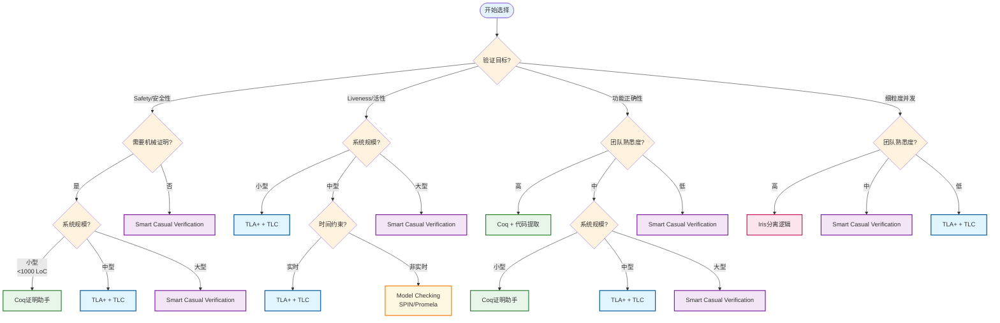
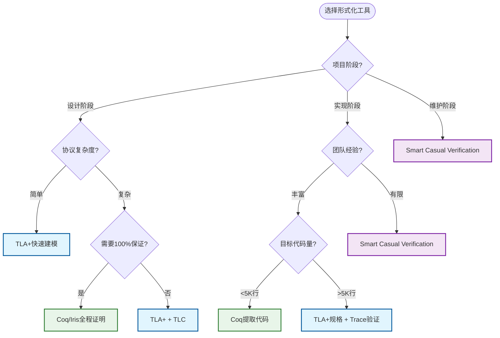
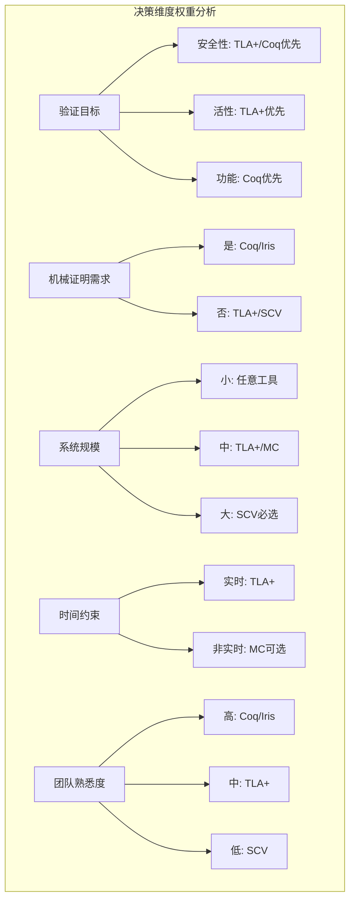
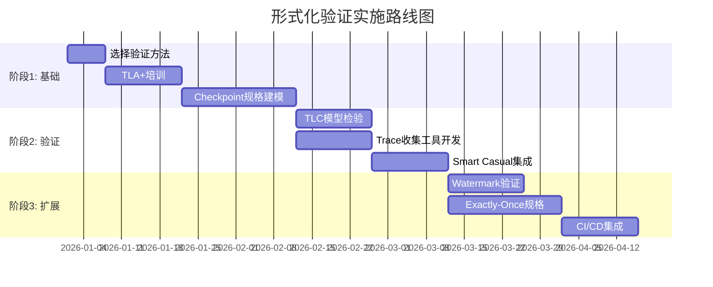
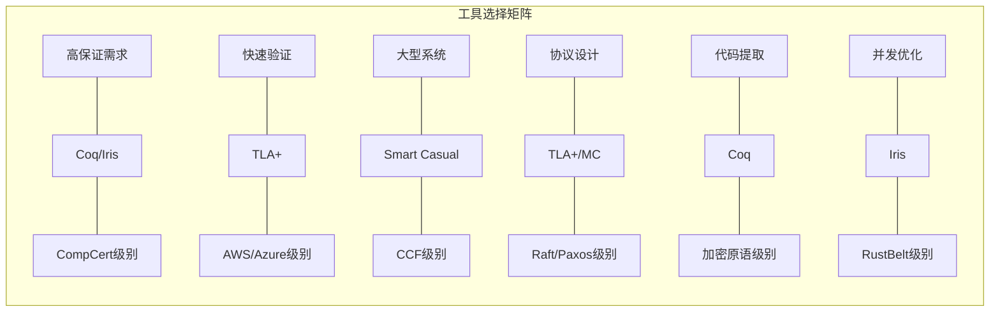

# 形式化验证工具选择决策树

> 所属阶段: visuals/ | 前置依赖: [Struct/07-tools/tla-for-flink.md](../Struct/07-tools/tla-for-flink.md), [Struct/07-tools/coq-mechanization.md](../Struct/07-tools/coq-mechanization.md), [Struct/07-tools/iris-separation-logic.md](../Struct/07-tools/iris-separation-logic.md), [Struct/07-tools/smart-casual-verification.md](../Struct/07-tools/smart-casual-verification.md) | 形式化等级: L4-L6

---

## 1. 概念定义 (Definitions)

### Def-V-01-01: 形式化验证方法谱系

**定义 (Formal Verification Spectrum)**:

形式化验证方法按其严格程度和工程成本形成连续谱系：

$$
\text{VerificationMethod} ::= \underbrace{\text{Testing}}_{\text{轻量}} \mid \underbrace{\text{Smart Casual}}_{\text{混合}} \mid \underbrace{\text{Model Checking}}_{\text{自动}} \mid \underbrace{\text{Theorem Proving}}_{\text{严格}}
$$

各方法的核心特征：

| 方法类型 | 自动化程度 | 数学保证 | 适用规模 | 学习曲线 |
|----------|-----------|----------|----------|----------|
| 传统测试 | ★★★★★ | ★☆☆☆☆ | 任意 | 平缓 |
| Smart Casual Verification | ★★★★☆ | ★★★☆☆ | 大型 | 中等 |
| 模型检验 (TLA+/SPIN) | ★★★☆☆ | ★★★★☆ | 中型 | 中等 |
| 定理证明 (Coq/Iris) | ★★☆☆☆ | ★★★★★ | 小型核心 | 陡峭 |

---

### Def-V-01-02: 验证目标分类

**定义 (Verification Objectives)**:

形式化验证关注的三类核心性质：

$$
\begin{aligned}
\text{安全性(Safety)} &\triangleq \Box \neg \text{BadThing} \quad \text{"永远不应发生"} \\
\text{活性(Liveness)} &\triangleq \Box \Diamond \text{GoodThing} \quad \text{"最终必须发生"} \\
\text{功能正确性} &\triangleq \forall \text{input}.\ \text{Spec}(\text{input}, \text{output})
\end{aligned}
$$

**流计算典型性质映射**：

| 性质类别 | Flink示例 | 形式化表达 |
|----------|-----------|------------|
| 安全性 | Checkpoint一致性 | $\Box(\text{completed}(c) \Rightarrow \forall t: \text{acked}(t,c))$ |
| 活性 | 水印最终推进 | $\Diamond(\text{watermark} = T_{\max})$ |
| 功能正确性 | Exactly-Once语义 | $\forall r: \text{processed}(r) = 1$ |

---

## 2. 决策树可视化

### 2.1 形式化验证工具选择决策树 (完整版)

以下决策树帮助根据项目特征选择最合适的形式化验证工具：



---

### 2.2 简化快速决策树



---

## 3. 工具详细对比

### 3.1 工具特性矩阵

| 特性维度 | TLA+ | Coq | Iris | Smart Casual | SPIN |
|----------|------|-----|------|--------------|------|
| **逻辑基础** | ZFC + 时序逻辑 | CIC (依赖类型) | 高阶并发分离逻辑 | TLA+ + Trace检查 | LTL + 自动机 |
| **证明方式** | 模型检验(TLC) | 交互式策略 | 交互式+自动化 | 自动化 | 模型检验 |
| **并发支持** | ★★★★☆ | ★★★☆☆ | ★★★★★ | ★★★★☆ | ★★★★☆ |
| **活性验证** | 原生支持 | 需嵌入 | 支持 | 支持 | 原生支持 |
| **代码提取** | 无 | OCaml/Haskell | 无 | 无 | 无 |
| **学习周期** | 2-4周 | 3-6月 | 4-8月 | 1-2周 | 1-2周 |
| **工业案例** | AWS/Azure | CompCert/VST | RustBelt | Microsoft CCF | 协议验证 |

---

### 3.2 各工具详细说明

#### TLA+ / PlusCal

**学习曲线**: ★★★☆☆ (中等)

**适用场景**:

- 分布式协议设计验证 (Raft/Paxos/Checkpoint)
- 安全性与活性属性验证
- 大规模状态空间探索

**代表案例**:

| 项目 | 验证内容 | 成果 |
|------|----------|------|
| AWS DynamoDB | 分布式事务协议 | 发现3个关键设计缺陷[^1] |
| Microsoft CCF | 共识协议 | 发现6个bug (4设计+2实现)[^2] |
| Flink Checkpoint | Barrier对齐协议 | 精化验证实现正确性 |

**工具链**:

- TLC: 模型检验器
- TLAPS: 证明辅助系统
- PlusCal: 伪代码风格算法语言

**核心优势**: 时序逻辑原生支持、状态空间可视化、工业界广泛采用

---

#### Coq 证明助手

**学习曲线**: ★★★★★ (陡峭)

**适用场景**:

- 核心算法函数式实现与验证
- 需要代码提取到生产环境
- 数学级严格正确性保证

**代表案例**:

| 项目 | 规模 | 成果 |
|------|------|------|
| CompCert C编译器 | 10万+行Coq | 生成二进制与C语义等价保证[^3] |
| VST (Verified Software Toolchain) | 大规模 | C程序分离逻辑验证 |
| Fiat-Crypto | 密码学原语 | 生成经验证的加密代码 |

**核心优势**: 依赖类型精确表达、可提取可执行代码、逻辑一致性保证

**限制**: 学习曲线陡峭、不适合大规模系统全验证

---

#### Iris 分离逻辑

**学习曲线**: ★★★★★ (陡峭)

**适用场景**:

- 细粒度并发数据结构验证
- 高阶并发程序 (Rust/Go)
- 资源管理与所有权推理

**代表案例**:

| 项目 | 验证内容 | 成果 |
|------|----------|------|
| RustBelt | Rust标准库 | 验证内存安全原语[^4] |
| IronFleet | 分布式系统 | 端到端活性证明 |
| 并发行波器 | 算子组合 | 分离合取组合规范 |

**核心概念**:

- 分离合取 ($*$): 资源不相交组合
- 不变式 (Inv): 共享资源协议
- 幽灵状态: 验证时辅助推理状态

**核心优势**: 模块化并发推理、支持逻辑原子性、与类型系统结合

---

#### Smart Casual Verification

**学习曲线**: ★★★☆☆ (中等偏低)

**适用场景**:

- 大型分布式系统持续验证
- 团队形式化经验有限
- 需要快速ROI的项目

**核心组成**:

$$
\text{SCV} = \underbrace{\text{TLA+规格}}_{\text{真理源}} + \underbrace{\text{TLC模型检验}}_{\text{设计验证}} + \underbrace{\text{Trace验证}}_{\text{实现一致性}}
$$

**代表案例 - Microsoft CCF**:

- 2工程师 × 3周 = 约240人时投入
- 发现6个关键bug（含2个生产级严重缺陷）
- ROI ≈ 317%

**核心优势**:

- 工程成本与收益平衡
- 可集成CI/CD持续验证
- 分布式团队可掌握

**局限性**: 不完备保证、依赖测试覆盖率

---

## 4. 工具选择决策框架

### 4.1 决策维度详解



### 4.2 推荐决策路径

| 场景描述 | 推荐工具 | 预期投入 | 预期产出 |
|----------|----------|----------|----------|
| 初创团队，验证关键协议设计 | TLA+ | 2-4周 | 设计缺陷早期发现 |
| 成熟团队，验证核心算法 | Coq | 2-4月 | 经证明的参考实现 |
| 细粒度并发优化 | Iris | 2-3月 | 无数据竞争保证 |
| 大型系统持续验证 | SCV | 1-2周启动 | CI集成验证流水线 |
| 快速原型验证 | Smart Casual | 1周内 | 轻量级规格约束 |

---

## 5. 流计算系统验证建议

### 5.1 Flink组件映射

| Flink组件 | 验证目标 | 推荐工具 | 关键性质 |
|-----------|----------|----------|----------|
| Checkpoint协议 | 安全性 | TLA+/SCV | 所有任务最终确认 |
| Barrier对齐 | 安全性+活性 | TLA+ | 无数据丢失 |
| Watermark传播 | 活性 | TLA+ | 单调推进 |
| Exactly-Once | 功能正确性 | Coq/SCV | 原子提交 |
| State Backend | 安全性 | Iris/SCV | 快照一致性 |
| 动态扩缩容 | 安全性 | TLA+ | 状态不丢失 |

### 5.2 实施路线图建议



---

## 6. 可视化总结

### 6.1 工具-场景匹配矩阵



### 6.2 投资回报对比

```mermaid
xychart-beta
    title "形式化验证方法: 投入vs回报"
    x-axis [投入成本]
    y-axis [验证保证] 0 --> 100

    line "传统测试" [[0], [20], [100]]
    line "SCV" [[10], [40], [60]]
    line "模型检验" [[30], [50], [80]]
    line "定理证明" [[60], [80], [100]]

    annotation "最佳ROI点" 30, 60
```

---

## 7. 引用参考 (References)

[^1]: C. Newcombe et al., "How Amazon Web Services Uses Formal Methods," *Communications of the ACM*, 58(4), 2015. <https://doi.org/10.1145/2699417>

[^2]: H. Howard et al., "Smart Casual Verification of the Confidential Consortium Framework," *NSDI 2025*, 2025. <https://www.usenix.org/conference/nsdi25/presentation/howard>

[^3]: X. Leroy, "Formal Verification of a Realistic Compiler," *Communications of the ACM*, 52(7), 2009. <https://doi.org/10.1145/1538788.1538814>

[^4]: R. Jung et al., "RustBelt: Securing the Foundations of the Rust Programming Language," *POPL 2018*, 2018. <https://doi.org/10.1145/3158154>


---

*文档版本: 1.0 | 创建日期: 2026-04-03 | 状态: Complete*
