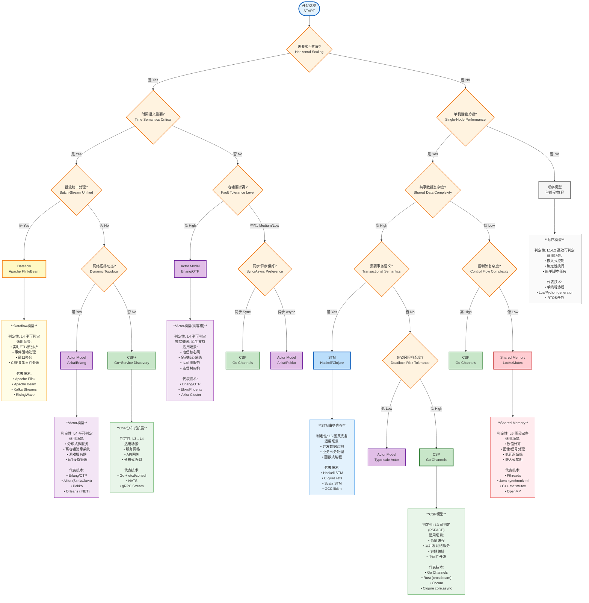
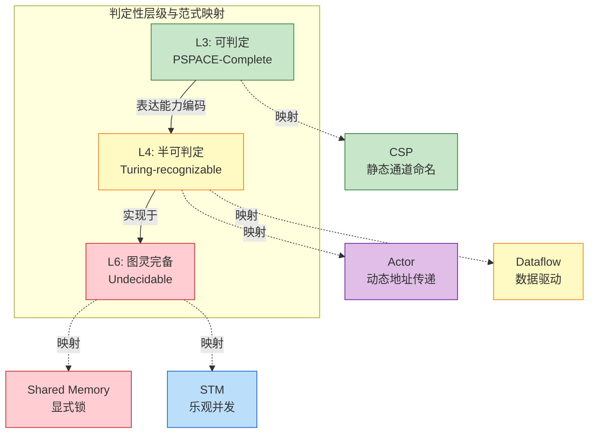
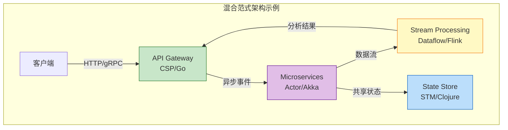

# 并发范式选型决策树

> **所属阶段**: Visuals | **前置依赖**: [../Knowledge/01-concept-atlas/concurrency-paradigms-matrix.md](../Knowledge/01-concept-atlas/concurrency-paradigms-matrix.md), [../Struct/01-foundation/](../Struct/01-foundation/) | **形式化等级**: L3-L6

---

## 1. 决策树概述

本文档提供交互式并发范式选型决策树，帮助架构师根据系统需求特征选择合适的并发计算范式。决策树基于五大关键维度：水平扩展需求、时间语义重要性、容错要求、状态复杂度和网络拓扑动态性。

### 1.1 判定性层级与范式映射

| 判定性层级 | 对应范式 | 形式化特征 |
|-----------|---------|-----------|
| L3 可判定 | CSP (有限状态) | PSPACE-完全，静态通道命名 |
| L4 半可判定 | Actor, Dataflow | 动态拓扑，移动性，消息可达性 |
| L6 图灵完备 | Shared Memory, STM | 不可判定，表达能力最强 |

---

## 2. 交互式决策树



---

## 3. 决策维度详解

### 3.1 维度一：水平扩展需求

| 需求 | 描述 | 推荐范式 |
|------|------|---------|
| **需要水平扩展** | 数据量/负载需要跨多台机器分布 | Actor, Dataflow |
| **单机多核** | 任务可在单台高性能服务器完成 | CSP, Shared Memory, STM |

**判定性影响**：水平扩展引入网络分区，将问题从可判定域(L3)推向半可判定域(L4)或不可判定域(FLP不可能性)。

### 3.2 维度二：时间语义重要性

| 重要性 | 描述 | 推荐范式 |
|--------|------|---------|
| **时间语义关键** | 依赖事件时间顺序、窗口计算、乱序处理 | Dataflow |
| **时间语义次要** | 处理时间足够，或顺序无关 | Actor, CSP |

**判定性影响**：时间语义要求引入Watermark机制，将无限流的半可判定问题转化为有限窗口的准可判定问题。

### 3.3 维度三：容错要求

| 容错等级 | 描述 | 推荐范式 |
|---------|------|---------|
| **高** | 电信级(99.999%)、故障自动恢复 | Actor (监督树原生支持) |
| **中** | 商业级(99.9%)、Checkpoint恢复 | Dataflow, STM |
| **低** | 开发级、允许服务重启 | Shared Memory, CSP |

**判定性影响**：容错机制通过状态隔离（Actor）或快照（Checkpoint）在半可判定环境中构造确定性恢复点。

### 3.4 维度四：状态复杂度

| 复杂度 | 描述 | 推荐范式 |
|--------|------|---------|
| **简单** | 无状态或简单局部状态 | Shared Memory, CSP |
| **中等** | 需要键控分区状态 | Dataflow |
| **复杂** | 分布式事务、嵌套状态机 | Actor, STM |

### 3.5 维度五：网络拓扑动态性

| 动态性 | 描述 | 推荐范式 |
|--------|------|---------|
| **静态** | 拓扑预定义，运行时不变 | CSP (静态通道) |
| **动态** | 运行时创建/销毁连接 | Actor (动态地址传递) |

**判定性影响**：动态拓扑表达能力等价于π-演算，从L3可判定进入L4半可判定。

---

## 4. 范式详细对比

### 4.1 核心特征矩阵

| 特征 | Dataflow | Actor | CSP | Shared Memory | STM |
|------|----------|-------|-----|---------------|-----|
| **通信风格** | 数据驱动 | 异步消息 | 同步通道 | 直接内存访问 | 事务边界 |
| **状态隔离** | 按键分区 | 完全隔离 | 完全隔离 | 完全共享 | 事务边界共享 |
| **判定性层级** | L4 半可判定 | L4 半可判定 | L3 可判定 | L6 图灵完备 | L6 图灵完备 |
| **容错机制** | Checkpoint | 监督树 | 需应用层实现 | 需应用层实现 | 事务回滚 |
| **水平扩展** | 原生支持 | 原生支持 | 需框架扩展 | 需DSM系统 | 分布式STM不成熟 |
| **代表技术** | Flink, Beam | Erlang, Akka | Go Channels | Pthreads, Java锁 | Haskell STM |

### 4.2 适用场景矩阵

| 场景特征 | 首选范式 | 次选方案 | 避免使用 |
|---------|---------|---------|---------|
| 大规模流处理 | **Dataflow** | Actor | Shared Memory |
| 高容错分布式系统 | **Actor** | Dataflow | Shared Memory |
| 高性能网络服务 | **CSP** | Shared Memory | Actor |
| 并发数据结构 | **STM** | Shared Memory + Locks | Actor |
| 实时控制系统 | **CSP** | Shared Memory | Actor |
| 复杂事务处理 | **STM** | Actor + Saga | Shared Memory |
| 嵌入式实时系统 | **Shared Memory** | CSP | Actor |

---

## 5. 判定性谱系与选型



### 5.1 判定性与工程权衡

| 判定性层级 | 理论限制 | 工程策略 | 适用范式 |
|-----------|---------|---------|---------|
| **高效可判定(P)** | 表达能力受限 | 追求最优算法 | 顺序计算 |
| **可判定但难处理** | NP/PSPACE复杂度 | 近似算法、启发式 | CSP有限状态验证 |
| **半可判定** | 不可判定终止性 | 水印/窗口/超时 | Actor, Dataflow |
| **图灵完备** | 停机问题不可解 | 测试、监控、熔断 | Shared Memory, STM |

---

## 6. 使用说明

### 6.1 快速选型指南

**场景1：实时数据分析平台**

```
水平扩展: 是 → 时间语义: 是 → 批流统一: 是 → Dataflow (Flink)
```

**场景2：微服务订单系统**

```
水平扩展: 是 → 时间语义: 否 → 容错要求高: 是 → Actor (Akka/Erlang)
```

**场景3：API网关**

```
水平扩展: 是 → 时间语义: 否 → 容错要求中 → 同步偏好 → CSP (Go)
```

**场景4：金融风控核心**

```
水平扩展: 否 → 单机性能: 是 → 共享数据复杂: 高 → 事务语义: 是 → STM
```

**场景5：图像处理服务**

```
水平扩展: 否 → 单机性能: 是 → 共享数据复杂: 低 → 控制流简单 → Shared Memory
```

### 6.2 混合范式策略

现代复杂系统通常采用分层混合范式：



### 6.3 选型检查清单

- [ ] **规模评估**：数据量是TB级(PB级)还是GB级?
- [ ] **延迟要求**：需要毫秒级还是秒级响应?
- [ ] **容错需求**：能否接受服务重启，还是需要热故障转移?
- [ ] **团队技能**：团队熟悉函数式编程还是命令式编程?
- [ ] **生态成熟度**：目标语言/平台的库支持是否完善?
- [ ] **部署环境**：云原生(K8s)还是嵌入式/边缘设备?

---

## 7. 反模式警示

### 7.1 常见选型错误

| 反模式 | 错误描述 | 后果 | 正确选择 |
|--------|---------|------|---------|
| **Actor误用于流处理** | 用Akka实现实时窗口聚合 | 缺乏时间语义、Watermark机制 | Dataflow (Flink) |
| **Shared Memory误用于分布式** | 用Java锁实现跨服务协调 | 死锁、性能瓶颈、无法水平扩展 | Actor (Akka) |
| **CSP误用于长事务** | 用Go Channel实现Saga | 缺乏故障恢复、状态管理复杂 | Actor + Saga 或 Temporal |
| **Dataflow误用于RPC** | 用Flink实现请求-响应 | 高延迟、资源浪费 | CSP (gRPC) 或 Actor |

---

## 8. 关联文档

### 8.1 上游依赖

- [../Knowledge/01-concept-atlas/concurrency-paradigms-matrix.md](../Knowledge/01-concept-atlas/concurrency-paradigms-matrix.md) — 并发范式完整对比矩阵
- [../Struct/01-foundation/01.01-unified-streaming-theory.md](../Struct/01-foundation/01.01-unified-streaming-theory.md) — 统一流计算理论与六层表达能力层次
- [../Struct/01-foundation/01.03-actor-model-formalization.md](../Struct/01-foundation/01.03-actor-model-formalization.md) — Actor模型严格形式化
- [../Struct/01-foundation/01.04-dataflow-model-formalization.md](../Struct/01-foundation/01.04-dataflow-model-formalization.md) — Dataflow模型严格形式化
- [../Struct/01-foundation/01.05-csp-formalization.md](../Struct/01-foundation/01.05-csp-formalization.md) — CSP严格形式化

### 8.2 下游应用

- [../Flink/](../Flink/) — Flink专项知识库
- [../Knowledge/](../Knowledge/) — 工程实践与设计模式

---

## 9. 引用参考


---

*文档版本: 2026.04 | 形式化等级: L3-L6 | 状态: 可视化文档*
*关联矩阵: 5个决策维度 | 判定性层级: 3层 | 推荐范式: 5种*
