# 流计算技术选型决策树 (Streaming Technology Selection Decision Tree)

> **所属阶段**: Knowledge/04-technology-selection | **前置依赖**: [../Knowledge/04-technology-selection/engine-selection-guide.md](../Knowledge/04-technology-selection/engine-selection-guide.md), [../Knowledge/04-technology-selection/streaming-database-guide.md](../Knowledge/04-technology-selection/streaming-database-guide.md) | **形式化等级**: L3-L4
> **版本**: 2026.04 | **文档规模**: ~15KB

---

## 目录

- [流计算技术选型决策树 (Streaming Technology Selection Decision Tree)](#流计算技术选型决策树-streaming-technology-selection-decision-tree)
  - [目录](#目录)
  - [1. 概述](#1-概述)
  - [2. 决策维度说明](#2-决策维度说明)
    - [2.1 延迟要求 (Latency Requirement)](#21-延迟要求-latency-requirement)
    - [2.2 状态规模 (State Scale)](#22-状态规模-state-scale)
    - [2.3 一致性要求 (Consistency Requirement)](#23-一致性要求-consistency-requirement)
    - [2.4 SQL偏好 (SQL Preference)](#24-sql偏好-sql-preference)
    - [2.5 AI/ML集成需求 (AI/ML Integration)](#25-aiml集成需求-aiml-integration)
    - [2.6 工作流编排需求 (Workflow Orchestration)](#26-工作流编排需求-workflow-orchestration)
  - [3. 决策树可视化](#3-决策树可视化)
  - [4. 叶子节点技术选型详解](#4-叶子节点技术选型详解)
    - [4.1 Apache Flink](#41-apache-flink)
    - [4.2 RisingWave](#42-risingwave)
    - [4.3 Materialize](#43-materialize)
    - [4.4 ksqlDB](#44-ksqldb)
    - [4.5 Apache Spark Streaming](#45-apache-spark-streaming)
    - [4.6 Apache Storm](#46-apache-storm)
    - [4.7 Timeplus](#47-timeplus)
  - [5. 使用指南](#5-使用指南)
    - [5.1 决策路径速查表](#51-决策路径速查表)
    - [5.2 决策流程步骤](#52-决策流程步骤)
  - [6. 示例场景](#6-示例场景)
    - [6.1 金融实时风控系统](#61-金融实时风控系统)
    - [6.2 电商实时推荐平台](#62-电商实时推荐平台)
    - [6.3 大规模IoT数据分析](#63-大规模iot数据分析)
    - [6.4 实时数仓即席分析](#64-实时数仓即席分析)
  - [7. 引用参考 (References)](#7-引用参考-references)

---

## 1. 概述

本文档提供流计算技术选型的**交互式决策树**，通过回答一系列关键问题，帮助技术团队选择最适合其业务场景的流处理技术栈。

**决策树覆盖的技术范围**:

- 流处理引擎: Flink, Spark Streaming, Storm, Kafka Streams
- 流数据库: RisingWave, Materialize, ksqlDB, Timeplus
- 混合架构: Flink + 外部存储, RisingWave + Flink 分层

**使用场景**:

- 技术架构设计阶段的选型决策
- 现有系统技术栈评估与迁移规划
- 团队技术能力评估与学习路径规划

---

## 2. 决策维度说明

### 2.1 延迟要求 (Latency Requirement)

**定义**: 从数据产生到处理结果可用的时间间隔要求。

| 级别 | 延迟范围 | 典型场景 |
|------|----------|----------|
| **极低延迟** | < 100ms | 高频交易、实时监控告警、欺诈检测 |
| **低延迟** | 100ms - 1s | 实时推荐、会话分析、指标聚合 |
| **高延迟容忍** | > 1s | 离线分析、报表生成、批量ETL |

**选型影响**:

- < 100ms: 需要原生流处理引擎（Flink/Storm），避免微批模型
- > 1s: 可考虑微批模型（Spark Streaming）或批流统一架构

---

### 2.2 状态规模 (State Scale)

**定义**: 流处理作业需要维护的持久化状态数据总量。

| 级别 | 状态规模 | 典型场景 |
|------|----------|----------|
| **小状态** | < 100GB | 简单聚合、过滤转换、会话窗口 |
| **中等状态** | 100GB - 1TB | 用户画像、实时特征、中等规模Join |
| **大状态** | > 1TB | 全量用户行为、大规模图计算、复杂CEP |

**选型影响**:

- < 100GB: Kafka Streams, ksqlDB 等嵌入式方案可行
- > 1TB: 需要 Flink 等支持分布式状态后端（RocksDB + 增量Checkpoint）

---

### 2.3 一致性要求 (Consistency Requirement)

**定义**: 数据处理结果的准确性保证级别。

| 级别 | 语义 | 定义 | 适用场景 |
|------|------|------|----------|
| **AM** | At-Most-Once | 可能丢失，不重复 | 监控指标、日志采样 |
| **AL** | At-Least-Once | 不丢失，可能重复 | 非关键统计、近似分析 |
| **EO** | Exactly-Once | 精确一次，无丢失无重复 | 金融交易、订单处理、计费系统 |

**选型影响**:

- EO 要求: 必须选择支持分布式快照的引擎（Flink, Materialize）
- AL 可接受: 可考虑更轻量方案（ksqlDB, Storm）

---

### 2.4 SQL偏好 (SQL Preference)

**定义**: 团队对声明式SQL接口 vs 编程式API的偏好程度。

| 偏好 | 特征 | 代表系统 |
|------|------|----------|
| **SQL优先** | 声明式、优化器自动、DBA友好 | RisingWave, Materialize, ksqlDB |
| **代码优先** | 灵活可控、复杂逻辑、开发者友好 | Flink DataStream, Spark Streaming |

**选型影响**:

- SQL优先: 选择流数据库，运维简化40-60%
- 代码优先: 选择流处理引擎，表达能力更强

---

### 2.5 AI/ML集成需求 (AI/ML Integration)

**定义**: 是否需要集成机器学习模型推理或在线学习功能。

| 需求 | 特征 | 代表系统 |
|------|------|----------|
| **有** | 实时特征工程、模型推理、在线学习 | Flink ML, RisingWave + Python UDF |
| **无** | 纯数据转换、聚合分析 | 所有系统均可 |

**选型影响**:

- 有AI/ML需求: 优先选择 Flink（Flink ML生态成熟）或支持Python UDF的系统

---

### 2.6 工作流编排需求 (Workflow Orchestration)

**定义**: 是否需要复杂的多阶段工作流编排和依赖管理。

| 需求 | 特征 | 代表方案 |
|------|------|----------|
| **有** | 多任务DAG、依赖调度、条件分支 | Apache Airflow + Flink, Temporal |
| **无** | 单一管道、简单线性处理 | 原生系统即可 |

**选型影响**:

- 有编排需求: 考虑与Flink集成的编排工具（Airflow, Argo Workflows）

---

## 3. 决策树可视化

以下决策树使用 Mermaid flowchart TD 语法构建，从左到右按优先级排列决策节点。

```mermaid
flowchart TD
    START([开始选型]) --> LATENCY{延迟要求?}

    %% 延迟分支
    LATENCY -->|< 100ms<br/>极低延迟| STATE1{状态规模?}
    LATENCY -->|100ms-1s<br/>低延迟| STATE2{状态规模?}
    LATENCY -->|> 1s<br/>高延迟容忍| CONS3{一致性要求?}

    %% 极低延迟 + 状态分支
    STATE1 -->|< 100GB| CONS1{一致性要求?}
    STATE1 -->|100GB-1TB| CONS1A{一致性要求?}
    STATE1 -->|> 1TB| FLINK_LOW[Apache Flink<br/>低延迟优化配置]

    CONS1 -->|AM/AL| STORM[Apache Storm<br/>原生流处理]
    CONS1 -->|EO| TIMEPLUS[Timeplus<br/>边缘/实时优先]

    CONS1A -->|AM/AL| FLINK_EO[Apache Flink<br/>Exactly-Once]
    CONS1A -->|EO| FLINK_EO

    %% 低延迟 + 状态分支
    STATE2 -->|< 100GB| SQL1{SQL偏好?}
    STATE2 -->|100GB-1TB| SQL2{SQL偏好?}
    STATE2 -->|> 1TB| SQL3{SQL偏好?}

    SQL1 -->|SQL优先| KSQL[ksqlDB<br/>轻量级流SQL]
    SQL1 -->|代码优先| KAFKA[Kafka Streams<br/>嵌入式处理]

    SQL2 -->|SQL优先| RW1[RisingWave<br/>云原生流数据库]
    SQL2 -->|代码优先| FLINK1[Apache Flink<br/>复杂状态处理]

    SQL3 -->|SQL优先| RW2[RisingWave<br/>分层存储]
    SQL3 -->|代码优先| FLINK2[Apache Flink<br/>RocksDB状态后端]

    %% 高延迟容忍 + 一致性分支
    CONS3 -->|AM/AL| SQL4{SQL偏好?}
    CONS3 -->|EO| SQL5{SQL偏好?}

    SQL4 -->|SQL优先| SPARK_SQL[Spark SQL<br/>批流统一]
    SQL4 -->|代码优先| SPARK[Spark Streaming<br/>微批处理]

    SQL5 -->|SQL优先| RW3[RisingWave<br/>强一致物化视图]
    SQL5 -->|代码优先| FLINK3[Apache Flink<br/>批流统一]

    %% AI/ML分支（从Flink/RisingWave延伸）
    FLINK_EO --> AIML1{AI/ML需求?}
    FLINK1 --> AIML2{AI/ML需求?}
    FLINK2 --> AIML3{AI/ML需求?}
    FLINK3 --> AIML4{AI/ML需求?}
    RW1 --> AIML5{AI/ML需求?}
    RW2 --> AIML6{AI/ML需求?}

    AIML1 -->|有| FLINK_ML1[Apache Flink<br/>+ Flink ML]
    AIML1 -->|无| FLINK_EO_FINAL[Apache Flink]

    AIML2 -->|有| FLINK_ML2[Apache Flink<br/>+ Flink ML]
    AIML2 -->|无| FLINK1_FINAL[Apache Flink]

    AIML3 -->|有| FLINK_ML3[Apache Flink<br/>+ Flink ML + 大状态]
    AIML3 -->|无| FLINK2_FINAL[Apache Flink]

    AIML4 -->|有| FLINK_ML4[Apache Flink<br/>+ Flink ML + 批流统一]
    AIML4 -->|无| FLINK3_FINAL[Apache Flink]

    AIML5 -->|有| RW_ML1[RisingWave<br/>+ Python UDF]
    AIML5 -->|无| RW1_FINAL[RisingWave]

    AIML6 -->|有| RW_ML2[RisingWave<br/>+ Python UDF + 大状态]
    AIML6 -->|无| RW2_FINAL[RisingWave]

    %% 工作流编排分支
    FLINK_ML1 --> WF1{工作流编排?}
    FLINK_ML2 --> WF2{工作流编排?}
    FLINK_ML3 --> WF3{工作流编排?}
    FLINK_ML4 --> WF4{工作流编排?}

    WF1 -->|有| FLINK_AIR1[Apache Flink<br/>+ Apache Airflow]
    WF1 -->|无| FLINK_EO_ML[Apache Flink ML]

    WF2 -->|有| FLINK_AIR2[Apache Flink<br/>+ Apache Airflow]
    WF2 -->|无| FLINK1_ML[Apache Flink ML]

    WF3 -->|有| FLINK_AIR3[Apache Flink<br/>+ Apache Airflow + 大状态]
    WF3 -->|无| FLINK2_ML[Apache Flink ML + 大状态]

    WF4 -->|有| FLINK_AIR4[Apache Flink<br/>+ Apache Airflow + 批流统一]
    WF4 -->|无| FLINK3_ML[Apache Flink ML + 批流统一]

    %% Materialize特殊路径（强一致性+复杂查询）
    SQL2 -->|强一致+<br/>复杂递归| MATERIALIZE[Materialize<br/>强一致流数据库]
    SQL3 -->|强一致+<br/>复杂递归| MATERIALIZE

    %% 样式定义
    style START fill:#e3f2fd,stroke:#1976d2,stroke-width:2px
    style LATENCY fill:#fff3e0,stroke:#ef6c00
    style STATE1 fill:#fff3e0,stroke:#ef6c00
    style STATE2 fill:#fff3e0,stroke:#ef6c00
    style STATE3 fill:#fff3e0,stroke:#ef6c00
    style CONS1 fill:#e8f5e9,stroke:#388e3c
    style CONS1A fill:#e8f5e9,stroke:#388e3c
    style CONS3 fill:#e8f5e9,stroke:#388e3c
    style SQL1 fill:#fce4ec,stroke:#c2185b
    style SQL2 fill:#fce4ec,stroke:#c2185b
    style SQL3 fill:#fce4ec,stroke:#c2185b
    style SQL4 fill:#fce4ec,stroke:#c2185b
    style SQL5 fill:#fce4ec,stroke:#c2185b
    style AIML1 fill:#f3e5f5,stroke:#7b1fa2
    style AIML2 fill:#f3e5f5,stroke:#7b1fa2
    style AIML3 fill:#f3e5f5,stroke:#7b1fa2
    style AIML4 fill:#f3e5f5,stroke:#7b1fa2
    style AIML5 fill:#f3e5f5,stroke:#7b1fa2
    style AIML6 fill:#f3e5f5,stroke:#7b1fa2
    style WF1 fill:#e0f7fa,stroke:#00838f
    style WF2 fill:#e0f7fa,stroke:#00838f
    style WF3 fill:#e0f7fa,stroke:#00838f
    style WF4 fill:#e0f7fa,stroke:#00838f

    %% 叶子节点样式
    style FLINK_LOW fill:#fff9c4,stroke:#f57f17,stroke-width:2px
    style FLINK_EO fill:#fff9c4,stroke:#f57f17,stroke-width:2px
    style FLINK1 fill:#fff9c4,stroke:#f57f17,stroke-width:2px
    style FLINK2 fill:#fff9c4,stroke:#f57f17,stroke-width:2px
    style FLINK3 fill:#fff9c4,stroke:#f57f17,stroke-width:2px
    style FLINK_ML1 fill:#fff9c4,stroke:#f57f17,stroke-width:2px
    style FLINK_ML2 fill:#fff9c4,stroke:#f57f17,stroke-width:2px
    style FLINK_ML3 fill:#fff9c4,stroke:#f57f17,stroke-width:2px
    style FLINK_ML4 fill:#fff9c4,stroke:#f57f17,stroke-width:2px
    style FLINK_AIR1 fill:#fff9c4,stroke:#f57f17,stroke-width:2px
    style FLINK_AIR2 fill:#fff9c4,stroke:#f57f17,stroke-width:2px
    style FLINK_AIR3 fill:#fff9c4,stroke:#f57f17,stroke-width:2px
    style FLINK_AIR4 fill:#fff9c4,stroke:#f57f17,stroke-width:2px

    style RW1 fill:#e1bee7,stroke:#6a1b9a,stroke-width:2px
    style RW2 fill:#e1bee7,stroke:#6a1b9a,stroke-width:2px
    style RW3 fill:#e1bee7,stroke:#6a1b9a,stroke-width:2px
    style RW_ML1 fill:#e1bee7,stroke:#6a1b9a,stroke-width:2px
    style RW_ML2 fill:#e1bee7,stroke:#6a1b9a,stroke-width:2px

    style MATERIALIZE fill:#bbdefb,stroke:#1565c0,stroke-width:2px
    style STORM fill:#ffcdd2,stroke:#c62828,stroke-width:2px
    style TIMEPLUS fill:#c8e6c9,stroke:#2e7d32,stroke-width:2px
    style KSQL fill:#ffe0b2,stroke:#ef6c00,stroke-width:2px
    style KAFKA fill:#c8e6c9,stroke:#2e7d32,stroke-width:2px
    style SPARK fill:#bbdefb,stroke:#1565c0,stroke-width:2px
    style SPARK_SQL fill:#bbdefb,stroke:#1565c0,stroke-width:2px
```



**决策节点颜色说明**:

- 🟠 橙色: 延迟要求节点
- 🟢 绿色: 一致性要求节点
- 🔴 粉色: SQL偏好节点
- 🟣 紫色: AI/ML需求节点
- 🔵 青色: 工作流编排节点
- 🟡 黄色: Flink 系列选型结果
- 🟣 紫色: RisingWave 系列选型结果

---

## 4. 叶子节点技术选型详解

### 4.1 Apache Flink

**适用条件**:

- 延迟要求: < 1s（最优 < 100ms）
- 状态规模: 任意（从小状态到TB级大状态）
- 一致性: EO/AL/AM 均可配置
- 部署模式: 独立集群/K8s/YARN

**核心优势**:

- 原生流处理，毫秒级延迟
- RocksDB状态后端支持TB级大状态
- 分布式快照实现Exactly-Once
- 丰富的连接器生态
- Flink ML支持AI/ML集成

**典型配置**:

```yaml
# 低延迟优化配置
execution.checkpointing.interval: 5s
state.backend: rocksdb
state.backend.incremental: true
execution.buffer-timeout: 5ms
```

**参考文档**: [Flink/00-INDEX.md](../Flink/00-INDEX.md)

---

### 4.2 RisingWave

**适用条件**:

- 延迟要求: 100ms-1s（P99 < 100ms点查）
- 状态规模: < 1TB（分层存储优化）
- 一致性: EO（快照隔离）
- SQL偏好: SQL优先团队

**核心优势**:

- 云原生架构，存算分离
- 原生物化视图，自动增量维护
- PostgreSQL协议兼容
- 分层存储（内存+SSD+S3）

**典型场景**:

- 实时数仓即席分析
- 实时特征服务平台
- 流批统一分析

**参考文档**: [Knowledge/04-technology-selection/streaming-database-guide.md](../Knowledge/04-technology-selection/streaming-database-guide.md)

---

### 4.3 Materialize

**适用条件**:

- 延迟要求: 100ms-1s
- 状态规模: < 100GB（内存为主）
- 一致性: 严格串行化（Serializable）
- 特殊需求: 递归查询、强一致性

**核心优势**:

- 严格串行化一致性
- Differential Dataflow支持递归CTE
- PostgreSQL协议完全兼容
- 强一致物化视图

**典型场景**:

- 金融风控（合规审计）
- 资金链路追踪（递归查询）
- 图数据分析

---

### 4.4 ksqlDB

**适用条件**:

- 延迟要求: 100ms-1s
- 状态规模: < 100GB（本地存储）
- 一致性: AL/EO（基于Kafka事务）
- 部署环境: Kafka生态内

**核心优势**:

- 轻量级，嵌入式部署
- 与Kafka深度集成
- 运维简单
- 适合已有Kafka基础设施的团队

**典型场景**:

- Kafka生态内的流处理
- 日志聚合与转换
- 实时指标监控

---

### 4.5 Apache Spark Streaming

**适用条件**:

- 延迟要求: > 1s（微批模型）
- 状态规模: 任意（RDD持久化）
- 一致性: EO
- 已有生态: Spark生态

**核心优势**:

- 批流统一，复用Spark生态
- 高吞吐批处理优化
- 成熟的SQL支持（Spark SQL）
- 机器学习集成（Spark MLlib）

**典型场景**:

- 批流统一处理
- 已有Spark基础设施的迁移
- 延迟容忍的分析型应用

---

### 4.6 Apache Storm

**适用条件**:

- 延迟要求: < 10ms（极低延迟）
- 状态规模: 无状态或外部存储
- 一致性: AL（At-Least-Once）
- 容错要求: 可接受重复处理

**核心优势**:

- 亚毫秒级延迟
- 记录级处理，无批处理延迟
- 高可用设计

**典型场景**:

- 高频交易系统
- 实时控制指令
- 对延迟极度敏感的场景

---

### 4.7 Timeplus

**适用条件**:

- 延迟要求: < 100ms（亚毫秒级边缘）
- 状态规模: < 100GB（边缘优先）
- 一致性: 可调（最终一致→快照隔离）
- 部署环境: 边缘计算/云边协同

**核心优势**:

- 边缘原生设计，支持离线运行
- Proton引擎流批统一
- ClickHouse SQL兼容
- 云边自动同步

**典型场景**:

- 边缘网关实时分析
- IoT设备本地处理
- 高频交易边缘节点

---

## 5. 使用指南

### 5.1 决策路径速查表

| 场景 | 决策路径 | 推荐技术 |
|------|----------|----------|
| **高频交易** | <100ms → 任意状态 → EO → 代码优先 | Flink 低延迟优化 |
| **实时推荐** | 100ms-1s → 100GB-1TB → EO → SQL优先 | RisingWave |
| **金融风控** | 100ms-1s → 任意 → EO+强一致 → SQL优先 | Materialize |
| **日志处理** | >1s → <100GB → AL → SQL优先 | ksqlDB |
| **批流统一** | >1s → 任意 → EO → 代码优先 | Spark Streaming |
| **边缘计算** | <100ms → <100GB → AL → SQL优先 | Timeplus |
| **复杂CEP** | <100ms → >1TB → EO → 代码优先 | Flink + CEP库 |
| **实时数仓** | 100ms-1s → >1TB → EO → SQL优先 | RisingWave |

### 5.2 决策流程步骤

**Step 1: 明确延迟SLA**

- 测量当前业务端到端延迟要求
- 区分平均延迟 vs P99延迟要求
- 考虑延迟抖动容忍度

**Step 2: 评估状态规模**

- 估算单键状态大小 × 键数量
- 考虑状态增长趋势（数据保留期）
- 评估状态访问模式（读多写少/读写均衡）

**Step 3: 确定一致性要求**

- 评估数据丢失/重复的业务影响
- 区分金融级合规要求 vs 分析级容忍度
- 考虑Exactly-Once的性能开销

**Step 4: 评估团队能力**

- SQL技能 vs 编程语言技能（Java/Scala/Python）
- 运维能力（自托管 vs 托管服务）
- 已有技术栈和投资保护

**Step 5: 考虑扩展需求**

- AI/ML集成需求
- 工作流编排复杂度
- 多云/混合云部署需求

---

## 6. 示例场景

### 6.1 金融实时风控系统

**需求画像**:

- 延迟: < 50ms（交易决策）
- 状态: 用户画像 ~500GB，规则库 ~10GB
- 一致性: Exactly-Once（资金准确性）
- SQL偏好: SQL优先（风控规则声明式）
- 特殊需求: 递归查询（资金链路）

**决策路径**:

```
<100ms → 100GB-1TB → EO → SQL优先 → 递归查询 → Materialize
```

**最终选型**: **Materialize**

**理由**:

- 严格串行化满足金融合规
- 递归CTE支持资金链路追踪
- PostgreSQL协议兼容现有工具链

---

### 6.2 电商实时推荐平台

**需求画像**:

- 延迟: < 200ms（推荐接口）
- 状态: 用户特征 ~2TB，商品特征 ~500GB
- 一致性: Exactly-Once（点击计费）
- SQL偏好: SQL优先（特征SQL化）
- AI/ML: 有（实时特征工程）

**决策路径**:

```
100ms-1s → >1TB → EO → SQL优先 → AI/ML有 → RisingWave + Python UDF
```

**最终选型**: **RisingWave + Python UDF**

**理由**:

- 物化视图直接服务推荐API
- 分层存储支持2TB大状态
- Python UDF支持特征工程逻辑

---

### 6.3 大规模IoT数据分析

**需求画像**:

- 延迟: 边缘<10ms，云端<1s
- 状态: 边缘<10GB，云端~500GB
- 一致性: AL（传感器数据可容忍重复）
- SQL偏好: SQL优先
- 部署: 边缘+云混合

**决策路径**:

```
边缘: <100ms → <100GB → AL → SQL优先 → Timeplus
云端: 100ms-1s → 100GB-1TB → AL → SQL优先 → RisingWave
```

**最终选型**: **Timeplus（边缘）+ RisingWave（云端）**

**理由**:

- Timeplus边缘原生支持离线运行
- 云边协同架构自动同步
- 统一SQL接口降低开发成本

---

### 6.4 实时数仓即席分析

**需求画像**:

- 延迟: < 1s（即席查询）
- 状态: ~5TB（历史+实时）
- 一致性: EO（报表准确性）
- SQL偏好: SQL优先
- 集成: BI工具（Tableau/Superset）

**决策路径**:

```
>1s → >1TB → EO → SQL优先 → RisingWave
```

**最终选型**: **RisingWave**

**理由**:

- PostgreSQL协议直接对接BI工具
- 分层存储优化5TB大数据成本
- 物化视图加速即席查询

---

## 7. 引用参考 (References)


---

*文档版本: 2026.04-v1.0 | 形式化等级: L3-L4 | 状态: 完整*
*决策树节点数: 20+ | 覆盖技术栈: 7个主流系统 | 示例场景: 4个*
