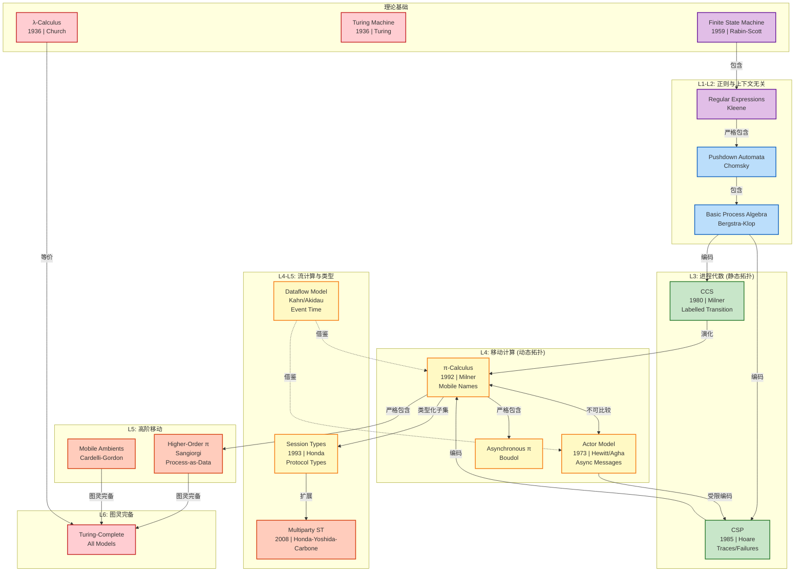
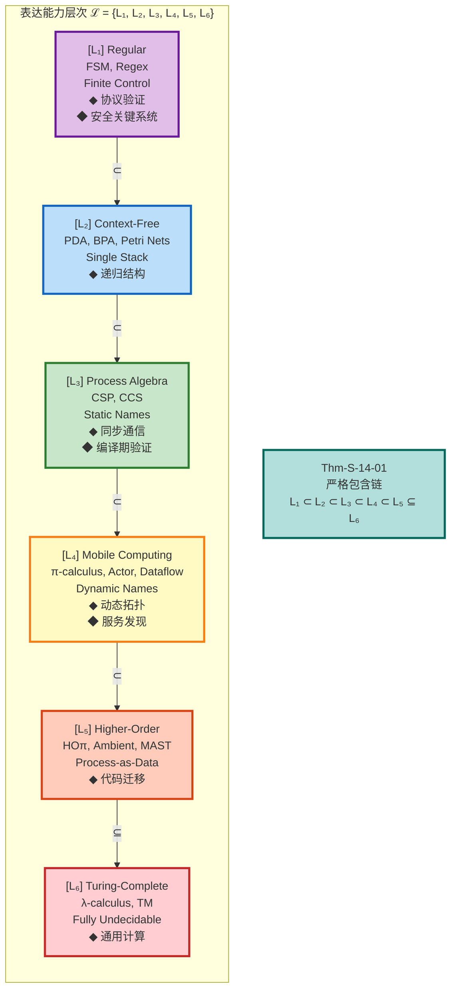
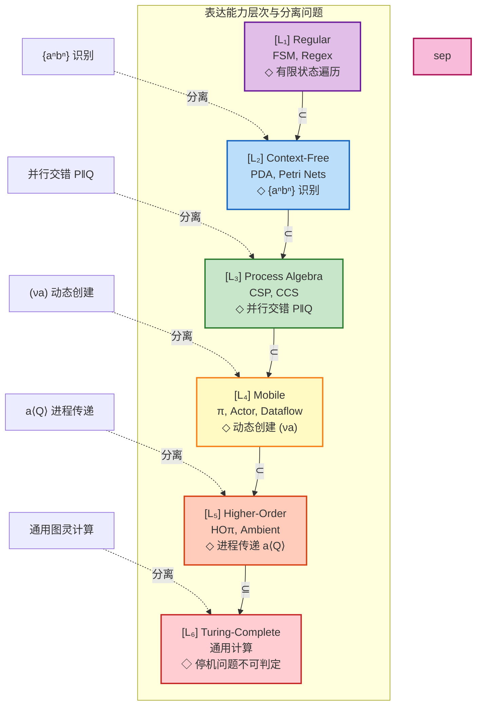
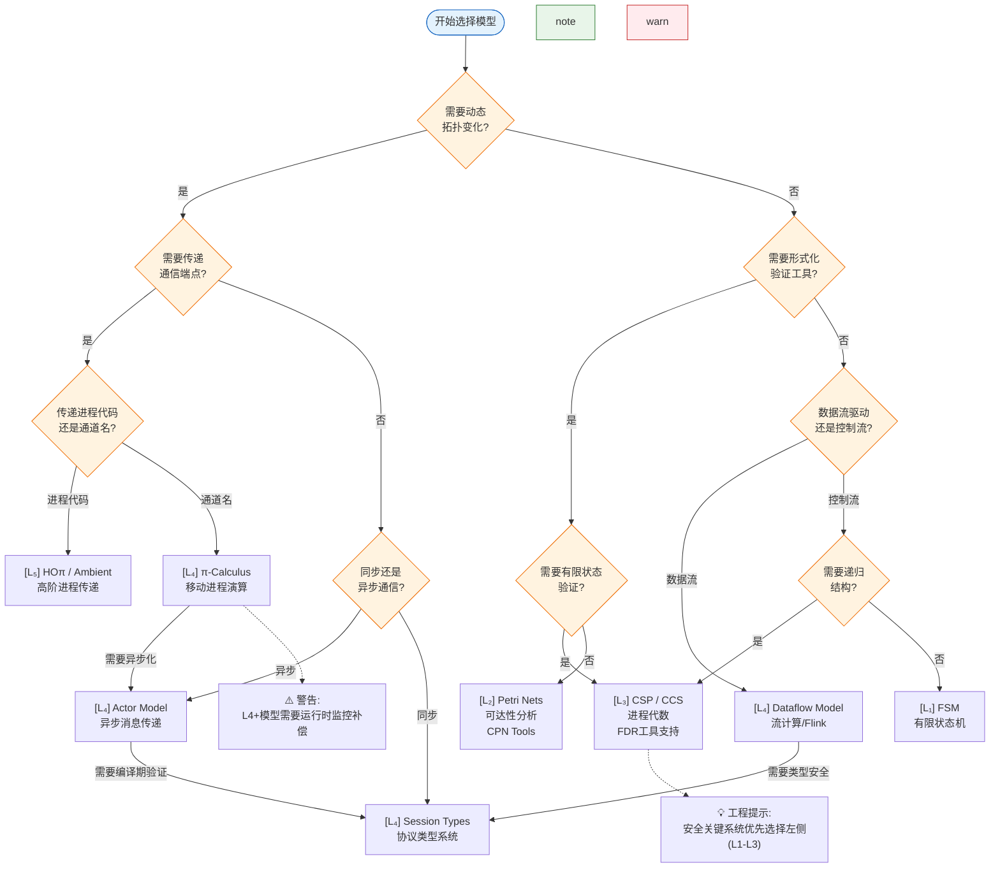
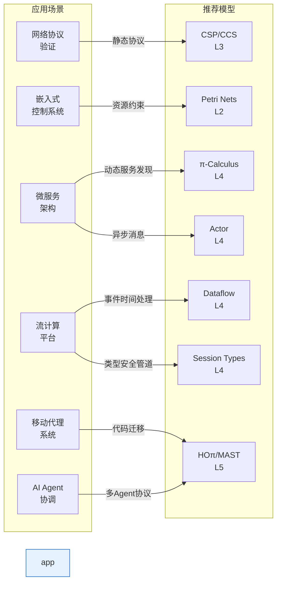
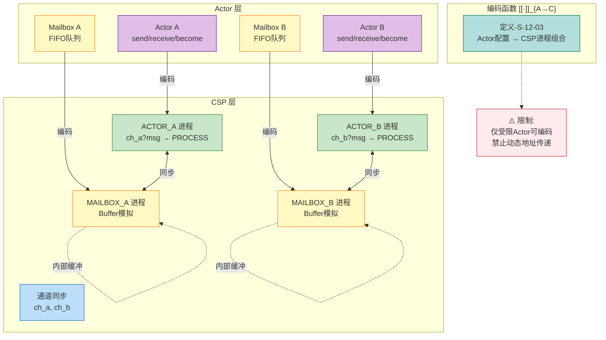
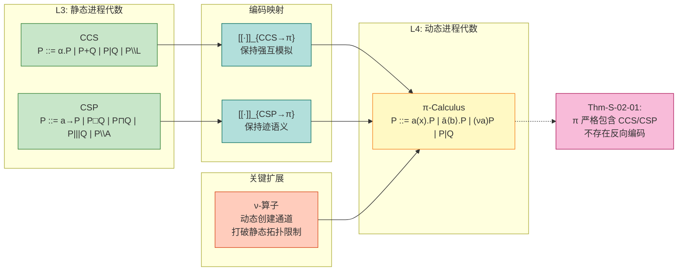
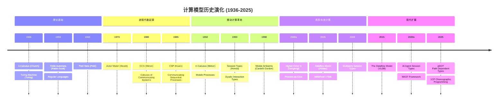

> **状态**: 🔮 前瞻内容 | **风险等级**: 高 | **最后更新**: 2026-04
>
> 此文档描述的内容处于早期规划阶段，可能与最终实现不符。请以 Apache Flink 官方发布为准。
>
# Struct形式化模型关系图谱

> **所属阶段**: Struct/Visualizations | **前置依赖**: [Struct/00-INDEX.md](../Struct/00-INDEX.md) | **形式化等级**: L1-L6
> **版本**: 2026.04 | **范围**: AnalysisDataFlow 项目核心计算模型关系可视化

---

## 目录

- [Struct形式化模型关系图谱](#struct形式化模型关系图谱)
  - [目录](#目录)
  - [1. 模型总览 (Model Overview)](#1-模型总览-model-overview)
  - [2. 核心模型关系图 (Core Model Relations)](#2-核心模型关系图-core-model-relations)
    - [图 2.1: 模型演化与编码关系全景图](#图-21-模型演化与编码关系全景图)
    - [图 2.2: 表达能力层次塔](#图-22-表达能力层次塔)
  - [3. 模型特性标签矩阵 (Model Characteristics)](#3-模型特性标签矩阵-model-characteristics)
  - [4. 表达能力层次与模型对应 (L1-L6 Hierarchy)](#4-表达能力层次与模型对应-l1-l6-hierarchy)
    - [图 4.1: 六层表达能力层次详细图](#图-41-六层表达能力层次详细图)
    - [图 4.2: 层次包含与分离问题](#图-42-层次包含与分离问题)
  - [5. 模型选择决策流程图 (Model Selection Decision Tree)](#5-模型选择决策流程图-model-selection-decision-tree)
    - [图 5.1: 模型选择决策树](#图-51-模型选择决策树)
    - [图 5.2: 应用场景-模型匹配矩阵](#图-52-应用场景-模型匹配矩阵)
  - [6. 编码关系详解 (Encoding Relations)](#6-编码关系详解-encoding-relations)
    - [表 6.1: 模型间编码关系汇总](#表-61-模型间编码关系汇总)
    - [图 6.1: Actor→CSP编码示意图](#图-61-actorcsp编码示意图)
    - [图 6.2: CCS/CSP→π演算编码路径](#图-62-ccscspπ演算编码路径)
  - [7. 演化路径与历史脉络 (Evolution Pathways)](#7-演化路径与历史脉络-evolution-pathways)
    - [图 7.1: 计算模型历史演化时间线](#图-71-计算模型历史演化时间线)
  - [8. 参考与引用 (References)](#8-参考与引用-references)
    - [关键定理索引](#关键定理索引)
    - [关联文档](#关联文档)
    - [参考文献](#参考文献)

---

## 1. 模型总览 (Model Overview)

AnalysisDataFlow 项目 Struct/ 模块涵盖以下核心形式化计算模型：

| 模型 | 符号 | 代表系统 | 形式化等级 | 核心特征 |
|------|------|----------|-----------|----------|
| **USTM** | U | 统一流计算理论 | L4-L6 | 元模型框架 |
| **CCS** | C | Milner CCS | L3 | 标签同步 |
| **CSP** | S | Hoare CSP | L3 | 同步通信 |
| **π-calculus** | π | 移动进程演算 | L4 | 动态通道 |
| **Actor** | A | Actor模型 | L4 | 异步消息 |
| **Dataflow** | D | 流计算模型 | L4-L5 | 数据驱动 |
| **Petri网** | P | P/T网/CPN | L2-L4 | 状态转移 |
| **Session Types** | ST | 会话类型 | L4-L5 | 协议类型 |

**模型分类维度**:

- **通信模式**: 同步 (CSP/CCS) vs 异步 (Actor/Dataflow)
- **拓扑特性**: 静态 (CSP/CCS/L1-L3) vs 动态 (π/Actor/L4-L6)
- **表达能力**: 正则(L1) → 上下文无关(L2) → 进程代数(L3) → 移动计算(L4) → 高阶(L5) → 图灵完备(L6)

---

## 2. 核心模型关系图 (Core Model Relations)

### 图 2.1: 模型演化与编码关系全景图



**图说明**:

- **实线箭头** (`→`) 表示演化或编码关系，目标模型表达能力更强
- **虚线箭头** (`-.->`) 表示借鉴或影响关系
- **双向箭头** (`<-->`) 表示不可比较关系 (⊥)
- **颜色编码**: 紫色(L1) → 蓝色(L2) → 绿色(L3) → 黄色(L4) → 橙色(L5) → 红色(L6)

---

### 图 2.2: 表达能力层次塔



**层次特征对照**:

| 层次 | 核心资源 | 可判定性 | 验证工具 | 典型应用 |
|------|----------|----------|----------|----------|
| L₁ | 有限控制 | P-完全 | SPIN, FDR有限状态 | 网络协议验证 |
| L₂ | 单栈/令牌 | PSPACE-完全 | Petri网工具 | 工作流分析 |
| L₃ | 静态命名 | EXPTIME | FDR, PAT | 并发系统验证 |
| L₄ | 动态命名 | 部分不可判定 | 运行时监控 | 微服务/流计算 |
| L₅ | 进程传递 | 大部分不可判定 | 类型检查 | 移动代理/AI Agent |
| L₆ | 无限制 | 完全不可判定 | 测试/模拟 | 通用编程 |

---

## 3. 模型特性标签矩阵 (Model Characteristics)

| 模型 | 同步 | 异步 | 移动性 | 动态拓扑 | 静态验证 | 类型系统 |
|:----:|:----:|:----:|:------:|:--------:|:--------:|:--------:|
| **CCS** | ✅ | ❌ | ❌ | ❌ | ✅ | 行为等价 |
| **CSP** | ✅ | ❌ | ❌ | ❌ | ✅ | 迹/失败语义 |
| **π-calculus** | ✅ | ⚠️ | ✅ | ✅ | 部分 | 名称类型 |
| **Actor** | ❌ | ✅ | ✅ | ✅ | 受限 | 行为类型 |
| **Dataflow** | ⚠️ | ✅ | ❌ | ⚠️ | 部分 | 数据流类型 |
| **Petri网** | ✅ | ✅ | ❌ | ❌ | ✅ | 令牌类型 |
| **Session Types** | ✅ | ⚠️ | ⚠️ | ⚠️ | ✅ | 会话协议 |

**图例说明**:

- ✅ 原生支持
- ⚠️ 通过扩展/模拟支持
- ❌ 不支持

**特性定义**:

- **同步**: 发送方等待接收方就绪才能通信
- **异步**: 发送方发送后可立即继续，无需等待
- **移动性**: 通信端点(通道/地址)可作为数据传递
- **动态拓扑**: 运行时创建/销毁通信连接
- **静态验证**: 编译期可验证性质
- **类型系统**: 静态类型检查能力

---

## 4. 表达能力层次与模型对应 (L1-L6 Hierarchy)

### 图 4.1: 六层表达能力层次详细图

```mermaid
quadrantChart
    title 表达能力 vs 可判定性权衡矩阵
    x-axis 高可判定性 (L1-L2) --> 低可判定性 (L5-L6)
    y-axis 低表达能力 --> 高表达能力

    "L₁ FSM": [0.95, 0.15]
    "L₂ PDA/Petri": [0.75, 0.30]
    "L₃ CSP/CCS": [0.55, 0.45]
    "L₄ π/Actor/Dataflow": [0.30, 0.65]
    "L₅ HOπ/MAST": [0.10, 0.85]
    "L₆ λ/TM": [0.00, 1.00]
```

---

### 图 4.2: 层次包含与分离问题



**分离问题详解**:

| 层次跃迁 | 分离问题 | 证明方法 | 工程意义 |
|----------|----------|----------|----------|
| L₁→L₂ | {aⁿbⁿ} 语言 | 泵引理 | 需要栈/递归结构 |
| L₂→L₃ | 并行交错 | 交错语义 | 并发vs顺序的本质区别 |
| L₃→L₄ | (νa) 动态通道 | 编码不可能性 | 静态→动态拓扑 |
| L₄→L₅ | a⟨Q⟩ 进程传递 | Sangiorgi定理 | 代码迁移能力 |
| L₅→L₆ | 通用计算 | Church-Turing | 计算完备性 |

---

## 5. 模型选择决策流程图 (Model Selection Decision Tree)

### 图 5.1: 模型选择决策树



**决策路径说明**:

1. **安全关键系统路径**: START → Q1(否) → Q3(是) → Q6(是) → **CSP/CCS (L3)**
   - 优先可判定性，使用FDR等工具穷尽验证

2. **微服务/动态拓扑路径**: START → Q1(是) → Q2(是) → Q4(通道名) → **π-Calculus (L4)**
   - 支持服务发现、动态连接建立

3. **流计算路径**: START → Q1(否) → Q3(否) → Q7(数据流) → **Dataflow (L4)**
   - 适合实时数据处理、事件驱动系统

4. **高阶移动路径**: START → Q1(是) → Q2(是) → Q4(进程代码) → **HOπ (L5)**
   - 移动代理、代码迁移场景

---

### 图 5.2: 应用场景-模型匹配矩阵



**场景-模型映射表**:

| 应用场景 | 首选模型 | 备选模型 | 关键考量 |
|----------|----------|----------|----------|
| 网络协议验证 | CSP (L3) | FSM (L1) | 穷尽验证、死锁检测 |
| 嵌入式实时系统 | Petri网 (L2) | CSP (L3) | 资源约束、时序分析 |
| 微服务架构 | Actor (L4) | π (L4) | 动态拓扑、容错 |
| 流计算平台 | Dataflow (L4) | Actor (L4) | 事件时间、确定性 |
| 移动代理系统 | HOπ (L5) | Ambient (L5) | 代码迁移、位置透明 |
| AI Agent协调 | MAST (L5) | Session Types (L4) | 协议合规、认知状态 |
| 安全关键系统 | CSP (L3) | Petri网 (L2) | 可判定性、形式化保证 |

---

## 6. 编码关系详解 (Encoding Relations)

### 表 6.1: 模型间编码关系汇总

| 源模型 | 目标模型 | 编码存在 | 关系 | 位置 | 备注 |
|--------|----------|----------|------|------|------|
| CCS | π-calculus | ✅ | CCS ⊂ π | 01.02 | 静态→动态严格包含 |
| CSP | π-calculus | ✅ | CSP ⊂ π | 01.02 | Thm-S-02-01 |
| 受限Actor | CSP | ✅ | Actor\|ᵣ ⊂ CSP | 03.01 | Thm-S-12-01 |
| 完整Actor | CSP | ❌ | ⊥ | 03.01 | 动态地址传递不可编码 |
| Flink | π-calculus | ✅ | 带Checkpoint扩展 | 03.02 | Thm-S-13-01 |
| Go-CSP-sync | CSP | ✅ | 迹等价 | 01.05 | Thm-S-05-01 |
| Scala-Actor | π-calculus | ✅ | Actor ⊂ π | 03.03 | 表达能力层次 |
| π-calculus | HOπ | ✅ | π ⊂ HOπ | 03.03 | L₄→L₅严格包含 |
| CSP | Actor | ❌ | ⊥ | 03.03 | 同步/异步语义差异 |
| Session Types | π-calculus | ✅ | ST ⊂ π | 01.07 | 类型化子集 |
| Petri网 | CSP | ⚠️ | 有限状态等价 | 01.06 | 有界网可编码 |

**符号说明**:

- `⊂` : 严格包含（表达能力弱于）
- `⊆` : 包含（相等或弱于）
- `⊥` : 不可比较
- `✅` : 存在忠实编码
- `❌` : 不存在忠实编码
- `⚠️` : 受限条件下可编码

---

### 图 6.1: Actor→CSP编码示意图



**编码要点**:

- 每个 Actor 编码为两个 CSP 进程: ACTOR(行为) + MAILBOX(缓冲)
- 异步消息传递编码为对 Buffer 进程的非阻塞写
- 状态隔离通过 CSP 进程参数局部性保持
- **限制**: 完整 Actor 的动态地址传递无法编码到静态 CSP

---

### 图 6.2: CCS/CSP→π演算编码路径



**编码核心**:

- CCS → π: 将静态通道 $a$ 映射为同名 π 通道，禁止名字传递
- CSP → π: 同步通信通过 π 握手模拟，隐藏 $P\setminus A$ 对应 $(ν\vec{a})P$
- 关键差异: π 的 $(νa)$ 允许运行时创建新通道，突破静态拓扑限制

---

## 7. 演化路径与历史脉络 (Evolution Pathways)

### 图 7.1: 计算模型历史演化时间线



**演化主线**:

1. **静态→动态**: CCS/CSP (1980s) → π-Calculus (1990s) 引入移动性
2. **一阶→高阶**: π → HOπ 引入进程传递
3. **无类型→类型化**: 纯π → Session Types 引入协议类型
4. **二元→多元**: Binary ST → Multiparty ST 支持多方会话
5. **理论→工程**: 进程演算 → Flink/Dataflow 工业系统

---

## 8. 参考与引用 (References)

### 关键定理索引

| 定理编号 | 名称 | 位置 | 核心结论 |
|----------|------|------|----------|
| Thm-S-02-01 | 动态通道严格包含静态通道 | 01.02 | π ⊃ CSP/CCS |
| Thm-S-12-01 | Actor→CSP编码保持迹语义 | 03.01 | 受限Actor ⊂ CSP |
| Thm-S-13-01 | Flink→π演算编码 | 03.02 | Dataflow可编码到π |
| Thm-S-14-01 | 表达能力严格层次定理 | 03.03 | L₁⊂L₂⊂L₃⊂L₄⊂L₅⊆L₆ |
| Thm-S-01-03 | 会话类型安全性 | 01.07 | 良类型程序无通信错误 |
| Thm-S-06-01 | Petri网活性有界性 | 01.06 | 可达图判定 |

### 关联文档

- [Struct/00-INDEX.md](../Struct/00-INDEX.md) — Struct模块完整索引
- [Struct/01-foundation/01.02-process-calculus-primer.md](../Struct/01-foundation/01.02-process-calculus-primer.md) — 进程演算基础
- [Struct/03-relationships/03.01-actor-to-csp-encoding.md](../Struct/03-relationships/03.01-actor-to-csp-encoding.md) — Actor→CSP编码
- [Struct/03-relationships/03.03-expressiveness-hierarchy.md](../Struct/03-relationships/03.03-expressiveness-hierarchy.md) — 表达能力层次
- [Struct/01-foundation/01.07-session-types.md](../Struct/01-foundation/01.07-session-types.md) — 会话类型

### 参考文献


---

*文档创建时间: 2026-04-03*
*用于 AnalysisDataFlow 项目 Struct/ 模块可视化参考*
*维护建议: 新增模型或编码关系时更新对应图表*
