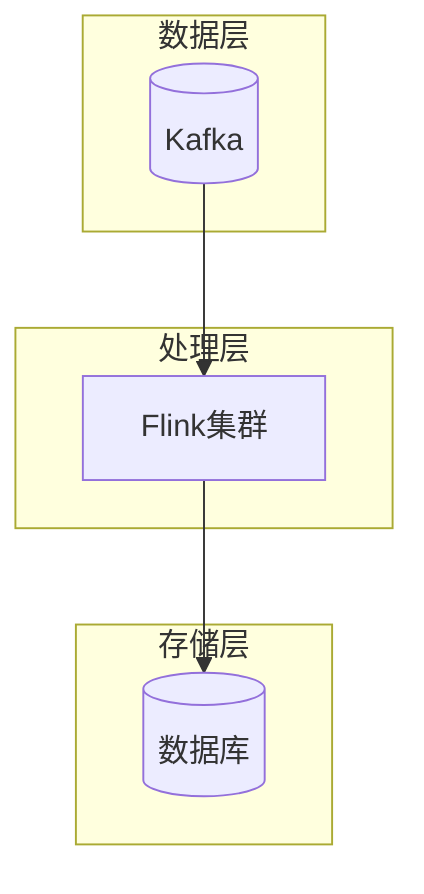
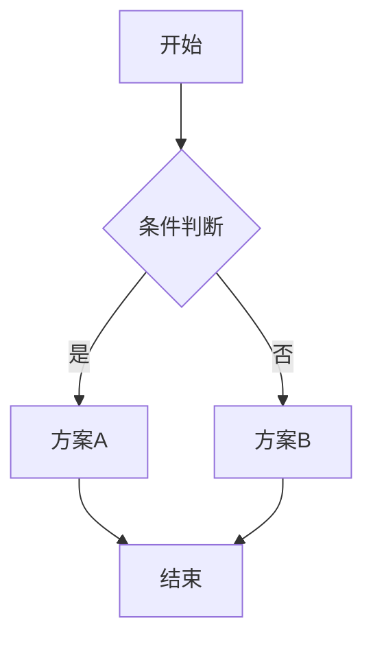

# 可视化模板库

> AnalysisDataFlow 项目 Mermaid 图表模板集合

## 模板清单

| 模板 | 类型 | 适用场景 | 复杂度 |
|------|------|----------|--------|
| [architecture-template.mmd](./architecture-template.mmd) | flowchart | 系统架构、组件关系 | ⭐⭐⭐ |
| [flowchart-template.mmd](./flowchart-template.mmd) | flowchart | 业务流程、算法流程 | ⭐⭐ |
| [comparison-template.mmd](./comparison-template.mmd) | quadrantChart | 技术选型、方案评估 | ⭐⭐ |
| [decision-tree-template.mmd](./decision-tree-template.mmd) | flowchart | 选型决策、故障排查 | ⭐⭐ |
| [timeline-template.mmd](./timeline-template.mmd) | gantt | 项目规划、路线图 | ⭐⭐ |
| [mindmap-template.mmd](./mindmap-template.mmd) | mindmap | 概念梳理、知识结构 | ⭐ |
| [sequence-template.mmd](./sequence-template.mmd) | sequenceDiagram | 接口调用、交互流程 | ⭐⭐ |
| [state-machine-template.mmd](./state-machine-template.mmd) | stateDiagram | 状态流转、生命周期 | ⭐⭐ |

## 快速使用

### 1. 复制模板内容

```bash
# 复制模板到目标文件
cp visuals/templates/flowchart-template.mmd docs/my-flow.mmd
```

### 2. 修改节点和连接

根据实际需求修改：
- 节点名称和ID
- 连接关系
- 样式类定义

### 3. 嵌入Markdown文档

将修改后的Mermaid代码嵌入到Markdown文件中：

```markdown
## 可视化

```mermaid
[粘贴模板内容并修改]
```
```

## 配色参考

| 用途 | 填充色 | 边框色 | 文字色 |
|------|--------|--------|--------|
| 开始/结束 | `#dcfce7` | `#16a34a` | `#14532d` |
| 处理/操作 | `#dbeafe` | `#2563eb` | `#1e3a8a` |
| 判断/决策 | `#fef3c7` | `#d97706` | `#92400e` |
| 数据/输入 | `#f3e8ff` | `#7c3aed` | `#5b21b6` |
| 外部系统 | `#ccfbf1` | `#0891b2` | `#115e59` |
| 错误/异常 | `#fee2e2` | `#dc2626` | `#991b1b` |

## 完整风格指南

详见：[docs/mermaid-style-guide.md](../../docs/mermaid-style-guide.md)

## 示例展示

### 架构图示例



### 决策树示例



---

*模板版本: v1.0 | 最后更新: 2026-04-12*
