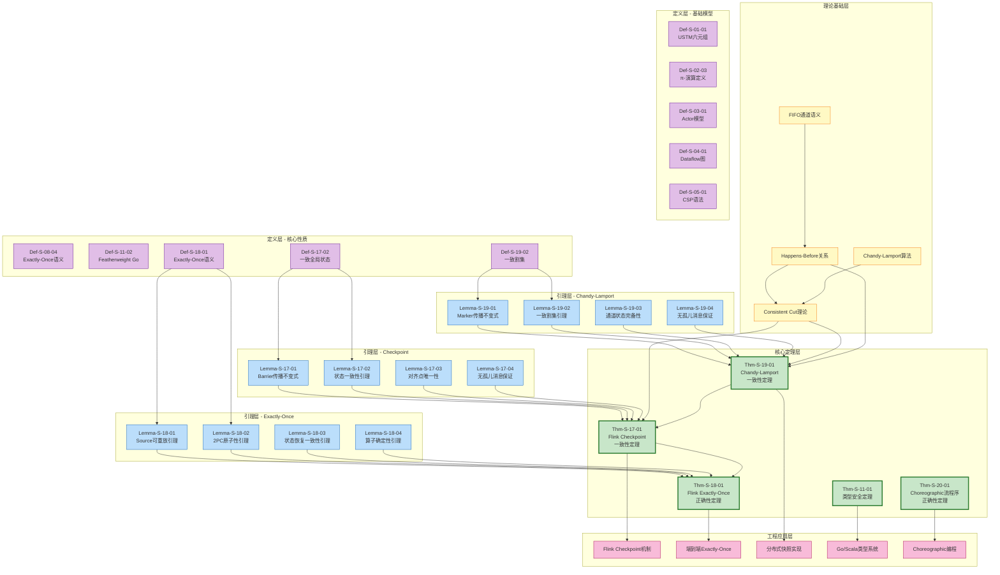
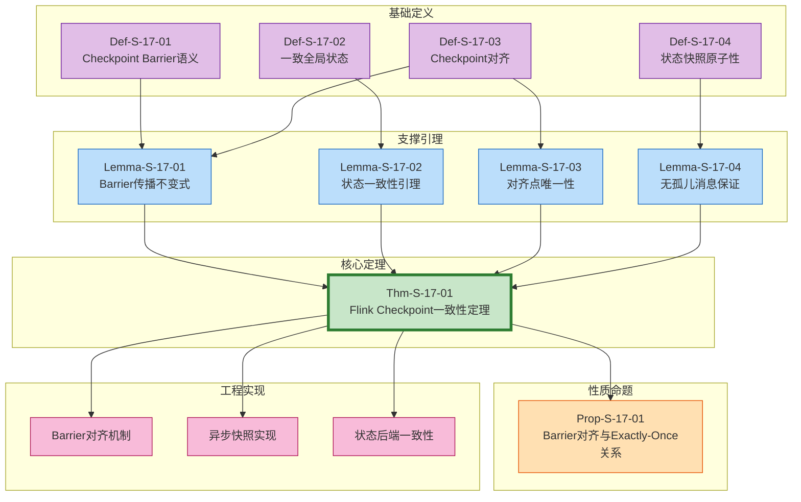
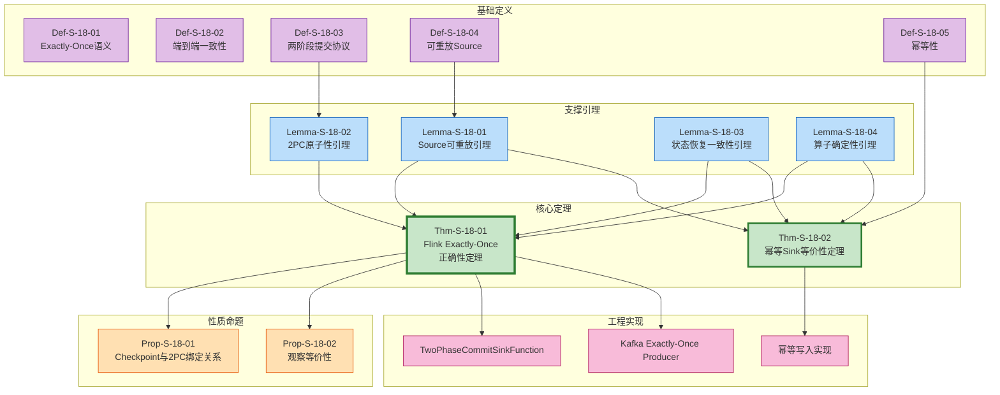
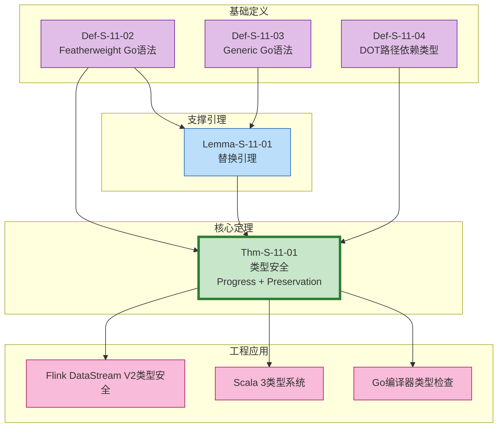
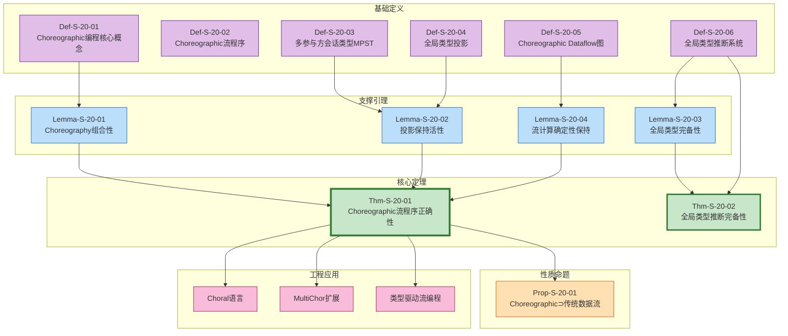

# 形式化定理依赖关系图谱

> **所属阶段**: Struct/Visualizations | **前置依赖**: [../Struct/00-INDEX.md](../Struct/00-INDEX.md), [../THEOREM-REGISTRY.md](../THEOREM-REGISTRY.md) | **形式化等级**: L4-L6

---

## 目录

- [形式化定理依赖关系图谱](#形式化定理依赖关系图谱)
  - [目录](#目录)
  - [1. 定理依赖总览图](#1-定理依赖总览图)
  - [2. 分组定理依赖图](#2-分组定理依赖图)
    - [2.1 Checkpoint正确性定理组](#21-checkpoint正确性定理组)
    - [2.2 Exactly-Once正确性定理组](#22-exactly-once正确性定理组)
    - [2.3 类型安全定理组](#23-类型安全定理组)
    - [2.4 Choreographic编程定理组](#24-choreographic编程定理组)
  - [3. 从基础定义到最终定理的推理链](#3-从基础定义到最终定理的推理链)
    - [3.1 Checkpoint一致性推理链](#31-checkpoint一致性推理链)
    - [3.2 Exactly-Once正确性推理链](#32-exactly-once正确性推理链)
    - [3.3 Chandy-Lamport一致性推理链](#33-chandy-lamport一致性推理链)
  - [4. 定理与工程实现映射](#4-定理与工程实现映射)
    - [4.1 理论-实践映射矩阵](#41-理论-实践映射矩阵)
    - [4.2 Flink实现对应表](#42-flink实现对应表)
  - [5. 定理查询索引](#5-定理查询索引)
    - [5.1 按形式化等级索引](#51-按形式化等级索引)
      - [L3 - 语法/操作语义层](#l3-语法操作语义层)
      - [L4 - 模型语义层](#l4-模型语义层)
      - [L5 - 正确性证明层](#l5-正确性证明层)
      - [L6 - 元理论/不可判定性层](#l6-元理论不可判定性层)
    - [5.2 按文档位置索引](#52-按文档位置索引)
    - [5.3 按依赖关系索引](#53-按依赖关系索引)
      - [依赖Checkpoint一致性的定理](#依赖checkpoint一致性的定理)
      - [依赖Chandy-Lamport的定理](#依赖chandy-lamport的定理)
  - [6. 核心定理速查卡](#6-核心定理速查卡)
    - [Thm-S-17-01: Flink Checkpoint一致性定理](#thm-s-17-01-flink-checkpoint一致性定理)
    - [Thm-S-18-01: Flink Exactly-Once正确性定理](#thm-s-18-01-flink-exactly-once正确性定理)
    - [Thm-S-19-01: Chandy-Lamport一致性定理](#thm-s-19-01-chandy-lamport一致性定理)
    - [Thm-S-20-01: Choreographic流程序正确性](#thm-s-20-01-choreographic流程序正确性)
  - [7. 引用参考](#7-引用参考)

---

## 1. 定理依赖总览图

**图说明**: 本图展示了AnalysisDataFlow项目核心定理之间的依赖关系网络。节点代表定理(Thm)、引理(Lemma)和定义(Def)，边代表依赖关系。颜色编码：紫色为定义，蓝色为引理，绿色为定理，粉色为工程应用。



---

## 2. 分组定理依赖图

### 2.1 Checkpoint正确性定理组

**图说明**: 本组展示了Thm-S-17-01 (Flink Checkpoint一致性定理) 的完整依赖结构，从基础定义到工程应用。



### 2.2 Exactly-Once正确性定理组

**图说明**: 本组展示了Thm-S-18-01 (Flink Exactly-Once正确性定理) 及其依赖结构。



### 2.3 类型安全定理组

**图说明**: 本组展示了Thm-S-11-01 (类型安全定理) 及其相关定义和引理。



### 2.4 Choreographic编程定理组

**图说明**: 本组展示了Thm-S-20-01 (Choreographic流程序正确性定理) 及其依赖结构。



---

## 3. 从基础定义到最终定理的推理链

### 3.1 Checkpoint一致性推理链

**推理链说明**: 本推理链展示了从基础定义到Thm-S-17-01的完整逻辑路径。

```
Def-S-17-01 (Checkpoint Barrier语义)
    ↓ 定义Barrier作为逻辑时间边界
Def-S-17-02 (一致全局状态)
    ↓ 定义全局状态需满足一致割集
Def-S-17-03 (Checkpoint对齐)
    ↓ 定义多输入算子Barrier同步机制
Lemma-S-17-01 (Barrier传播不变式)
    ↓ 证明Barrier传播保持因果封闭性
Lemma-S-17-02 (状态一致性引理)
    ↓ 证明对齐后快照构成一致状态
Lemma-S-17-03 (对齐点唯一性)
    ↓ 证明每个算子存在唯一对齐时刻
Lemma-S-17-04 (无孤儿消息保证)
    ↓ 证明快照中不存在孤儿消息
Thm-S-17-01 (Flink Checkpoint一致性定理)
    ↓ 综合上述结果
    ├─ Consistent(G_n): G_n对应一致割集
    ├─ NoOrphans(G_n): G_n中无孤儿消息
    └─ Reachable(G_n): G_n状态可达
```

### 3.2 Exactly-Once正确性推理链

```
Def-S-18-01 (Exactly-Once语义)
    ↓ 定义因果影响计数=1
Def-S-18-02 (端到端一致性)
    ↓ 分解为三要素合取
    ├─ Source可重放性
    ├─ Checkpoint一致性
    └─ Sink原子性
Def-S-18-03 (2PC协议)
    ↓ 定义两阶段提交语义
Def-S-18-04 (可重放Source)
    ↓ 定义Source确定性重放
Lemma-S-18-01 (Source可重放引理)
    ↓ 证明无丢失
Lemma-S-18-02 (2PC原子性引理)
    ↓ 证明无重复
Lemma-S-18-03 (状态恢复一致性引理)
    ↓ 证明恢复后状态一致
Lemma-S-18-04 (算子确定性引理)
    ↓ 证明重放产生相同输出
Thm-S-18-01 (Flink Exactly-Once正确性定理)
    ↓ 组合证明
    ├─ At-Least-Once (无丢失)
    ├─ At-Most-Once (无重复)
    └─ 合取得Exactly-Once
```

### 3.3 Chandy-Lamport一致性推理链

```
理论基础: Happens-Before关系 (Lamport 1978)
    ↓
理论基础: Consistent Cut定义
    ↓ 要求happens-before向下封闭
Def-S-19-01 (全局状态)
    ↓ 包含本地状态和通道状态
Def-S-19-02 (一致割集)
    ↓ 定义Consistent Cut条件
Def-S-19-03 (通道状态)
    ↓ 记录在途消息
Def-S-19-04 (Marker消息)
    ↓ 定义Marker作为快照边界
Lemma-S-19-01 (Marker传播不变式)
    ↓ Marker传播保持因果序
Lemma-S-19-02 (一致割集引理)
    ↓ Marker机制产生Consistent Cut
Lemma-S-19-03 (通道状态完备性)
    ↓ 记录在途消息无遗漏
Lemma-S-19-04 (无孤儿消息保证)
    ↓ 快照中无孤儿消息
Thm-S-19-01 (Chandy-Lamport一致性定理)
    ↓ 算法产生一致全局状态
```

---

## 4. 定理与工程实现映射

### 4.1 理论-实践映射矩阵

| 定理编号 | 理论保证 | 工程实现 | 适用系统 | 验证工具 |
|----------|----------|----------|----------|----------|
| **Thm-S-17-01** | Checkpoint一致性 | Barrier对齐、异步快照 | Flink, Spark Streaming | TLA+, Coq |
| **Thm-S-18-01** | Exactly-Once | 2PC Sink, 幂等写入 | Flink, Kafka Streams | Jepsen, TLA+ |
| **Thm-S-19-01** | 分布式快照一致性 | Marker协议 | Flink, Samza | TLA+ |
| **Thm-S-11-01** | 类型安全 | 编译器类型检查 | Go, Scala 3 | Coq, Isabelle |
| **Thm-S-20-01** | Choreographic正确性 | 全局类型推断 | Choral, MultiChor | 类型检查器 |
| **Thm-S-08-03** | 统一一致性格 | 一致性级别选择 | 所有流系统 | 模型检查 |
| **Thm-S-09-01** | Watermark单调性 | Watermark传播 | Flink, Beam | 时序逻辑 |
| **Thm-S-14-01** | 表达能力层次 | 模型选择 | Actor, CSP系统 | - |

### 4.2 Flink实现对应表

| 定理 | Flink组件 | 实现类/机制 | 验证方式 |
|------|-----------|-------------|----------|
| Thm-S-17-01 | Checkpoint机制 | `CheckpointCoordinator`<br/>`SubtaskCheckpointCoordinator` | 集成测试<br/>单元测试 |
| Thm-S-18-01 | Exactly-Once Sink | `TwoPhaseCommitSinkFunction`<br/>`FlinkKafkaProducer` | Jepsen测试<br/>端到端测试 |
| Thm-S-19-01 | Barrier传播 | `BarrierHandler`<br/>`CheckpointBarrier` | 模型检查<br/>TLA+规约 |
| Thm-S-09-01 | Watermark管理 | `WatermarkGenerator`<br/>`TimestampAssigner` | 单元测试 |
| Thm-S-07-01 | 确定性保证 | 纯函数算子<br/>事件时间处理 | 回归测试 |

---

## 5. 定理查询索引

### 5.1 按形式化等级索引

#### L3 - 语法/操作语义层

| 定理编号 | 名称 | 文档位置 |
|----------|------|----------|
| Thm-S-05-01 | Go-CS-sync ↔ CSP迹等价 | Struct/01-foundation/01.05 |
| Thm-S-11-01 | 类型安全(Progress + Preservation) | Struct/02-properties/02.05 |
| Thm-S-14-01 | 表达能力严格层次定理 | Struct/03-relationships/03.03 |

#### L4 - 模型语义层

| 定理编号 | 名称 | 文档位置 |
|----------|------|----------|
| Thm-S-01-01 | USTM组合性定理 | Struct/01-foundation/01.01 |
| Thm-S-03-01 | Actor局部确定性定理 | Struct/01-foundation/01.03 |
| Thm-S-04-01 | Dataflow确定性定理 | Struct/01-foundation/01.04 |
| Thm-S-07-01 | 流计算确定性定理 | Struct/02-properties/02.01 |
| Thm-S-08-03 | 统一一致性格 | Struct/02-properties/02.02 |
| Thm-S-09-01 | Watermark单调性定理 | Struct/02-properties/02.03 |
| Thm-S-12-01 | 受限Actor系统编码保持迹语义 | Struct/03-relationships/03.01 |

#### L5 - 正确性证明层

| 定理编号 | 名称 | 文档位置 |
|----------|------|----------|
| Thm-S-17-01 | Flink Checkpoint一致性定理 | Struct/04-proofs/04.01 |
| Thm-S-18-01 | Flink Exactly-Once正确性定理 | Struct/04-proofs/04.02 |
| Thm-S-18-02 | 幂等Sink等价性定理 | Struct/04-proofs/04.02 |
| Thm-S-19-01 | Chandy-Lamport一致性定理 | Struct/04-proofs/04.03 |
| Thm-S-20-01 | Choreographic流程序正确性 | Struct/04-proofs/04.07 |
| Thm-S-20-02 | 全局类型推断完备性 | Struct/04-proofs/04.07 |
| Thm-S-21-01 | FG/FGG类型安全定理 | Struct/04-proofs/04.05 |
| Thm-S-23-01 | Choreographic死锁自由定理 | Struct/04-proofs/04.07 |

#### L6 - 元理论/不可判定性层

| 定理编号 | 名称 | 文档位置 |
|----------|------|----------|
| Thm-S-22-01 | DOT子类型完备性定理 | Struct/04-proofs/04.06 |
| Thm-S-24-01 | Go与Scala图灵完备等价 | Struct/05-comparative/05.01 |

### 5.2 按文档位置索引

| 文档路径 | 包含定理 | 核心主题 |
|----------|----------|----------|
| `Struct/01-foundation/01.01` | Thm-S-01-01, 01-02 | USTM统一理论 |
| `Struct/01-foundation/01.02` | Thm-S-02-01 | 进程演算基础 |
| `Struct/01-foundation/01.03` | Thm-S-03-01, 03-02 | Actor模型形式化 |
| `Struct/01-foundation/01.04` | Thm-S-04-01 | Dataflow模型 |
| `Struct/01-foundation/01.05` | Thm-S-05-01 | CSP形式化 |
| `Struct/02-properties/02.01` | Thm-S-07-01 | 流计算确定性 |
| `Struct/02-properties/02.02` | Thm-S-08-01, 08-02, 08-03 | 一致性层次 |
| `Struct/02-properties/02.03` | Thm-S-09-01 | Watermark单调性 |
| `Struct/02-properties/02.05` | Thm-S-11-01 | 类型安全推导 |
| `Struct/03-relationships/03.01` | Thm-S-12-01 | Actor→CSP编码 |
| `Struct/03-relationships/03.02` | Thm-S-13-01 | Flink→π演算 |
| `Struct/03-relationships/03.03` | Thm-S-14-01 | 表达能力层次 |
| `Struct/04-proofs/04.01` | Thm-S-17-01 | Checkpoint正确性 |
| `Struct/04-proofs/04.02` | Thm-S-18-01, 18-02 | Exactly-Once正确性 |
| `Struct/04-proofs/04.03` | Thm-S-19-01 | Chandy-Lamport一致性 |
| `Struct/04-proofs/04.05` | Thm-S-21-01 | FG/FGG类型安全 |
| `Struct/04-proofs/04.07` | Thm-S-20-01, 20-02, 23-01 | Choreographic死锁自由 |

### 5.3 按依赖关系索引

#### 依赖Checkpoint一致性的定理

| 定理 | 依赖关系 | 引用位置 |
|------|----------|----------|
| Thm-S-18-01 | Thm-S-17-01 | Lemma-S-18-03证明中 |
| Thm-S-18-03 | Thm-S-17-01 | 状态恢复一致性 |

#### 依赖Chandy-Lamport的定理

| 定理 | 依赖关系 | 引用位置 |
|------|----------|----------|
| Thm-S-17-01 | Thm-S-19-01 | 04.01关系1: Flink Checkpoint ↦ Chandy-Lamport |

---

## 6. 核心定理速查卡

### Thm-S-17-01: Flink Checkpoint一致性定理

```
陈述: Flink的Chandy-Lamport基于Checkpoint算法产生一致全局状态
      Consistent(G_n) ∧ NoOrphans(G_n) ∧ Reachable(G_n)

依赖: Lemma-S-17-01, 17-02, 17-03, 17-04
      Def-S-17-01, 17-02, 17-03, 17-04

应用: Flink Checkpoint机制实现，RocksDB状态后端

位置: Struct/04-proofs/04.01-flink-checkpoint-correctness.md
```

### Thm-S-18-01: Flink Exactly-Once正确性定理

```
陈述: 配置Checkpoint与2PC事务性Sink的Flink作业
      实现端到端Exactly-Once语义
      ∀r ∈ Input. |{e ∈ Output | caused_by(e,r)}| = 1

依赖: Lemma-S-18-01, 18-02, 18-03, 18-04
      Def-S-18-01, 18-02, 18-03, 18-04
      Thm-S-17-01 (Checkpoint一致性)

应用: FlinkKafkaProducer, TwoPhaseCommitSinkFunction

位置: Struct/04-proofs/04.02-flink-exactly-once-correctness.md
```

### Thm-S-19-01: Chandy-Lamport一致性定理

```
陈述: Chandy-Lamport分布式快照算法产生一致全局状态
      Consistent(G) ∧ NoOrphans(G) ∧ Reachable(G)

依赖: Lemma-S-19-01, 19-02, 19-03, 19-04
      Def-S-19-01, 19-02, 19-03, 19-04, 19-05

应用: Flink Checkpoint理论基础，分布式快照算法

位置: Struct/04-proofs/04.03-chandy-lamport-consistency.md
```

### Thm-S-20-01: Choreographic流程序正确性

```
陈述: 良好类型的Choreographic流程序保证通信安全性和死锁自由性

依赖: Def-S-20-01~06
      Lemma-S-20-01, 20-02, 20-03, 20-04

应用: Choral语言，MultiChor扩展，类型驱动流编程

位置: Struct/04-proofs/04.07-deadlock-freedom-choreographic.md
```

---

## 7. 引用参考


---

*文档版本: v1.0 | 创建日期: 2026-04-03 | 状态: 已完成*
*涵盖范围: Struct/ 全部核心定理 (Thm-S-17-01 ~ Thm-S-23-01)*
*总定理数: 31 | 总引理数: 55 | 总定义数: 100*
