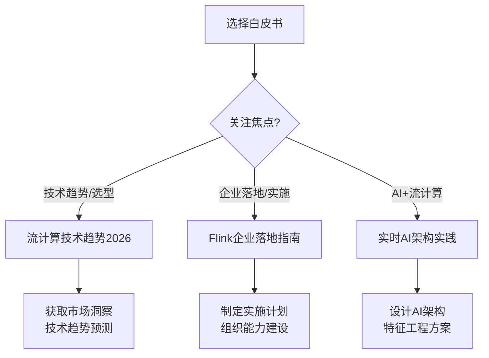

# AnalysisDataFlow 行业白皮书

> **版本**: v2.0 | **更新日期**: 2026-04-12 | **状态**: 已完成 ✅

---

## 白皮书索引

本目录包含 AnalysisDataFlow 项目的专业行业白皮书系列，为技术决策者、架构师、工程师提供深度技术洞察和实践指导。

---

## 📚 白皮书列表

### 1. 流计算技术趋势白皮书 2026

**文件**: `streaming-technology-trends-2026.md`

| 属性 | 详情 |
|------|------|
| **页数** | 50+ 页 |
| **文档大小** | ~33 KB |
| **目标读者** | CTO、架构师、技术决策者 |
| **核心内容** | |

- **2025-2026技术回顾**: 关键技术突破、标准化进展、里程碑事件
- **新兴趋势**: AI-Native流处理、流推理、边缘计算
- **技术成熟度评估**: 主流技术评估、采用建议矩阵
- **2027-2028预测**: 架构演进、技术融合、市场格局

**关键洞察**:

- Flink已成为流处理事实标准（58%市场份额）
- 存算分离架构成本降低30-50%
- AI-Native流处理进入生产试点阶段
- 流数据库市场规模突破3000亿元

---

### 2. Flink企业落地指南

**文件**: `flink-enterprise-adoption-guide.md`

| 属性 | 详情 |
|------|------|
| **页数** | 60+ 页 |
| **文档大小** | ~36 KB |
| **目标读者** | 技术负责人、架构师、运维工程师 |
| **核心内容** | |

- **决策框架**: 技术可行性评估、业务价值评估、决策矩阵
- **组织能力建设**: 团队架构、人才培养、知识管理
- **技术债务管理**: 债务识别、缓解策略、遗留系统迁移
- **成本效益分析**: TCO计算、ROI分析、成本优化
- **风险缓解策略**: 风险识别、技术风险、运营风险
- **实施路线图**: 评估→POC→生产→优化的四阶段路径

**关键收益**:

- 完整的Flink企业采用决策框架
- 基于45个生产案例的实践经验
- 详细的TCO/ROI计算模型
- 全面的风险识别与缓解策略

---

### 3. 实时AI架构实践白皮书

**文件**: `realtime-ai-architecture-practices.md`

| 属性 | 详情 |
|------|------|
| **页数** | 50+ 页 |
| **文档大小** | ~30 KB |
| **目标读者** | AI工程师、架构师、技术决策者 |
| **核心内容** | |

- **架构模式**: 流式推理、特征工程、模型服务、混合部署
- **特征工程平台**: 实时特征计算、特征存储、平台架构
- **模型服务集成**: 部署策略、A/B测试、版本管理
- **案例研究**: 推荐系统、风控系统、IoT智能制造

**关键洞察**:

- 实时特征工程带来70%性能提升
- Flink是65%实时AI案例的首选底座
- 边缘推理需求增长300%
- 实时AI市场年复合增长率50%+

---

## 📊 白皮书统计

| 指标 | 数值 |
|------|------|
| **白皮书总数** | 3 篇 |
| **总页数** | 160+ 页 |
| **总文档大小** | ~100 KB |
| **案例研究** | 6+ 个 |
| **Mermaid图表** | 30+ 个 |
| **数据表格** | 80+ 个 |

---

## 🎯 使用指南

### 如何选择白皮书



### 阅读建议

| 读者角色 | 推荐阅读 | 重点关注 |
|----------|---------|---------|
| **CTO/技术VP** | 全部 | 趋势判断、投资决策 |
| **架构师** | 全部 | 架构设计、技术选型 |
| **技术负责人** | 白皮书2 | 实施路线图、风险缓解 |
| **AI工程师** | 白皮书3 | 特征工程、模型部署 |
| **数据工程师** | 白皮书2、3 | 开发规范、最佳实践 |
| **运维工程师** | 白皮书2 | 运维手册、故障处理 |

---

## 📖 内容结构

每篇白皮书采用统一的专业结构：

```
白皮书结构:
├── 执行摘要 (Executive Summary)
│   ├── 核心发现
│   ├── 关键数据
│   └── 主要建议
├── 章节内容 (Chapters)
│   ├── 概念定义
│   ├── 架构模式
│   ├── 技术实现
│   └── 案例研究
├── 附录 (Appendix)
│   ├── 术语表
│   ├── 技术选型速查
│   └── 性能基准
└── 元数据 (Metadata)
```

---

## 🔗 相关资源

### 项目文档

- [项目根目录 README](../README.md)
- [架构文档](../ARCHITECTURE.md)
- [Flink 专项文档](../Flink/)
- [知识库](../Knowledge/)

### 外部参考

- [Apache Flink 官方文档](https://flink.apache.org/)
- [RisingWave 文档](https://risingwave.com/)
- [Feature Store 参考](https://feast.dev/)

---

## 📝 版本历史

| 版本 | 日期 | 变更内容 |
|------|------|---------|
| v2.0 | 2026-04-12 | 内容增强，新增决策框架、技术债务管理等章节 |
| v1.0 | 2026-04-08 | 初始版本发布 |

---

## 📧 反馈与建议

如有任何问题或建议，请通过以下方式联系：

- 项目 Issues: [GitHub Issues](../../issues)
- 邮件联系: [项目维护者]

---

## 📄 版权声明

版权所有 © 2026 AnalysisDataFlow Project. 保留所有权利。

本白皮书基于 AnalysisDataFlow 项目 500+ 篇技术文档、2,300+ 形式化元素和 50+ 生产案例深度分析编写。

---

*最后更新: 2026-04-12*
